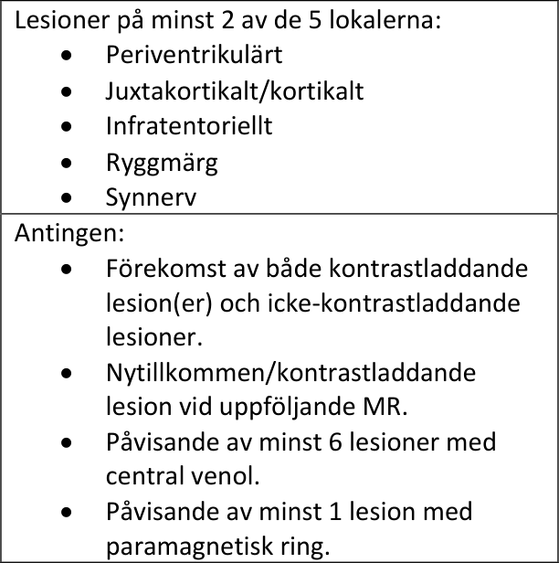

# Konsensusdokument_MR_3.1_2025-10-10

# **Nationella rekommendationer för MR** **vid neuroinflammatoriska tillstånd**

### Version 3.1, 2025-10-10

## Innehåll

Innehåll ................................................................................................................................................... 1

Allmänt om dokumentet ........................................................................................................................ 2

Förändringar jämfört med tidigare versioner ......................................................................................... 2

Kontaktperson ........................................................................................................................................ 2

Rekommenderad MR-användning vid neuroinflammation .................................................................... 3

I vilka situationer bör MR göras? ........................................................................................................ 3

Vilka delar av centrala nervsystemet bör undersökas? ...................................................................... 4

Rekommenderade protokoll för MR hjärna ........................................................................................ 4

Rekommenderade protokoll för MR rygg ........................................................................................... 5

Kontrastmedelsanvändning ................................................................................................................ 6

7 Tesla MR hjärna ............................................................................................................................... 6

Hur ofta bör MR göras vid MS? ........................................................................................................... 7

När kan undersökningarna begränsas eller MR-uppföljningen avslutas vid MS? ............................... 8

Vad bör remisstext och remissvar innehålla? ..................................................................................... 9

Svarsmallar ....................................................................................................................................... 10

Remissmall ........................................................................................................................................ 11

Referenser ............................................................................................................................................ 12

Konsensuspanel .................................................................................................................................... 12

Revisionshistorik ................................................................................................................................... 12

Appendix 1: Diagnostiska kriterier vid MS ............................................................................................ 13

## Allmänt om dokumentet

  - Detta utgör ett rådgivande dokument som stöd i användningen av magnetkamera (MR) för
personer med multipel skleros (MS) och annan neuroinflammation. Rekommendationerna är
allmänt hållna och individuella faktorer kan motivera avsteg från dessa rekommendationer.

  - Dokumentet är framtaget genom konsensusförfarande med representanter från både
Svenska MS-sällskapet och Svensk Förening för Neuroradiologi.

## Förändringar jämfört med tidigare versioner

  - Rekommendationerna har nu en bredare ansats för neuroinflammatoriska tillstånd.

  - Rekommendationerna har anpassats till 2024 års revision av McDonald-kriterierna.

  - Protokollet _MR hjärna MS-diagnostik_ byter namn till _MR hjärna Neuroinflammation_ .

  - Vid _MR hjärna Neuroinflammation_ ingår avbildning av synnerven som standard.

  - Vid _MR hjärna Neuroinflammation_ har sekvensordningen uppdaterats för att optimera
bildtagningen.

  - Vid _MR hjärna MS-rutinkontroll_ behöver axiala T2-viktade bilder inte utföras.

  - Nu finns även rekommendationer för _MR rygg neuroinflammation_ .

  - Svarsmallar för MR hjärna har uppdaterats och en svarsmall för MR rygg har skapats.

  - Remissmall har skapats.

  - Rekommendationer för användning av 7 Tesla har tillkommit.

  - Äldre appendix som ej bedöms relevanta har tagits bort.

För mer utförligt resonemang kring förändringarna i MR-protokollen, var god se nedan.

## Kontaktperson

Vid frågor kring innehållet i dokumentet kan kontakt tas med Ordförande i Svenska MS-sällskapets MR[utskott, Tobias Granberg (tobias.granberg@ki.se).](mailto:tobias.granberg@ki.se)

## Rekommenderad MR-användning vid neuroinflammation
#### I vilka situationer bör MR göras?

Det finns ett flertal situationer vid vilka en person med misstänkt eller känd neuroinflammation bör
genomgå MR-undersökning. De dominerande skälen är nydiagnostik och monitorering av
sjukdomsaktivitet. Exempel på typsituationer och rekommenderat MR-protokoll framgår av Tabell 1.

_**Tabell 1.**_ _Typsituationer när MR bör utföras och val av lämpligt MR-protokoll._

|Situation|Syftet med MR|Protokoll|
|---|---|---|
|Utredning vid misstänkt neuroinflammation|• Bedöma om MR-fynden är typiska för MS, i sådana fall bedömning av spridning i rum och  tid  • Bedöma om MR-fynden är typiska för annat neuroinflammatoriskt tillstånd • Erhålla en uppfattning om grad av sjukdomsaktivitet (antal lesioner, antal kontrastladdande lesioner) och ev.atrofi  (förekomst redan vid diagnos, vilka områden?) • Påvisa/utesluta differentialdiagnoser|MR hjärna Neuroinflammation   Ev. MR rygg Neuroinflammation|
|Rutinkontroll vid MS| • Påvisasjukdomsaktivitet (nya/förstorade/kontrastladdande lesioner) för ställningstagande till förändring av behandling • Påvisa tecken till biverkningar(t.ex. PML) • Bedöma om atrofi tillkommit|MR hjärna MS- rutinkontroll   (överväg att begära _med_ kontrastmedel)|
| Kontroll inför/efter insättande/förändring av terapi| Kontroll inför/efter insättande/förändring av terapi| Kontroll inför/efter insättande/förändring av terapi|
|Uppföljning av RIS/CIS eller annat neuro- inflammatoriskt tillstånd (t.ex. NMOSD, MOGAD, eller dylikt)| • Påvisasjukdomsaktivitet (nya/förstorade/kontrastladdande lesioner) för ställningstagande till förändring av behandling. • Påvisa tecken till biverkningar(PML) Bedöma om atrofi tillkommit|MR hjärna Neuroinflammation   Ev. MR rygg Neuroinflammation|
|Skov eller oförutsedd försämring*| • Påvisasjukdomsaktivitet (nya/förstorade/kontrastladdande lesioner) för ställningstagande till förändring av behandling • Påvisa/utesluta differentialdiagnoser • Påvisa tecken till biverkningar (t.ex. PML)|MR hjärna Neuroinflammation   Ev. MR rygg Neuroinflammation|

*Särskilt när differentialdiagnostiken gentemot pseudoskov (nya/förvärrade symtom av annan orsak
än sjukdomsaktivitet såsom samtidig infektion) är svår. Skovbehandling _bör ej fördröjas av väntan på_
_MR_ . _CIS = kliniskt isolerat syndrom (clinically isolated syndrome), RIS = radiologiskt isolerat syndrom_
_(radiologically isolated syndrome)._

#### Vilka delar av centrala nervsystemet bör undersökas?

Vid utredning och rutinuppföljning av MS och annan neuroinflammation bör alltid hjärnan undersökas.
MR av ryggmärgen kan ge ytterligare information men har begränsad nytta vid MS-rutinkontroller för
att detektera subklinisk sjukdomsaktivitet eftersom ryggmärgslesioner i större utsträckning ger
symtom/skov än lesioner i hjärnan. Vid några situationer föreligger särskild indikation för MR av
ryggmärgen (se Tabell 2 nedan). Tabellen är en fri översättning från MAGNIMS rekommendationer. [1]

#### Rekommenderade protokoll för MR hjärna

Rekommenderade MR-protokoll av hjärnan för specificeras i Bild 1. De rekommenderade protokollen
utgör en föreslagen minimi-nivå för att erhålla adekvat information i typfallet och kan kompletteras
med ytterligare sekvenser. Vid undersökning av individ med MS där det finns misstanke om icke-MSrelaterad patologi bör protokollen justeras utifrån aktuell frågeställning.

_**Bild 1.**_ _Rekommenderade protokoll för MR hjärna._

## MR hjärna Neuroinflammation

_Ett bredare protokoll som syftar till att påvisa_
_fynd talande för neuroinflammation samt_
_utesluta differential-diagnoser. Används även_
_vid oväntad försämring hos patient med känd_
_neuroinflammation._

1. 3D T2-FLAIR
2. 3D T1WI
3. STIR synnerver

_Kontrastmedelsadministration_

4. SWI
5. DWI
6. T2WI
7. 3D T1WI

## MR hjärna MS-rutinkontroll

_Ett smalare protokoll som syftar till att påvisa_
_sjukdomsaktivitet och atrofiprogress och är_
_huvudsakligen avsett för planerade kontroller._

_(Kontrastmedelsadministration, endast på_
_begäran)_

1. 3D FLAIR
2. 3D T1WI

_DWI = diffusionsviktad bild, FLAIR = fluid-attenuated inversion recovery, STIR = Short Tau Inversion_
_Recovery, SWI = susceptibilitetsviktad bild, WI = viktad bild._

**Kommentarer**

 - _**Nytt:**_ Protokollet ” _MR hjärna MS-diagnostik_ ” byter namn till ” _MR hjärna Neuroinflammation_ ”.

 - _**Nytt:**_ Protokollet ” _MR hjärna Neuroinflammation_ ” innehåller rutinmässigt undersökning av
synnerven.

 - _**Nytt:**_ Vid ”MS-rutinkontroll” tas kravet på T2-viktade bilder bort då det bedöms ha begränsat
diagnostiskt mervärde. Det rekommenderas att behålla den 3D T1-viktade sekvensen oavsett
om kontrastmedel begärs eller inte för att:

1. Underlätta planeringen av körning/bokning när samma sekvenser används. Det är särskilt

viktigt för att undvika att 3D T1-viktad sekvens missas efter given kontrastdos (om man
annars normalt inte använder sekvensen vid rutinuppföljning).

2. 3D T1-viktad sekvens är särskilt lämplig för att bedöma/bekräfta lesioner i bakre

skallgropen och i/vid kortex samt områden där T2-viktade bilder är behäftade med
artefakter.
3. 3D T1-viktad sekvens används för volumetri och forskning i Fas 5-studier som de flesta

patienter med nya läkemedel medverkar i.

 - _**Nytt:**_ Vid ”Neuroinflammation” bör Susceptibility-Weighted Imaging (SWI) användas och
fasbilden sparas för att underlätta detektionen av centrala venoler i vitsubstansförändringarna
samt förekomst av ev. paramagnetisk ”rim”.

 - _**Nytt:**_ Vid ”Neuroinflammation” bör SWI utföras direkt efter kontrast då det ökar sensitivitet för
centrala venoler i MS-lesioner (särskilt vid 1,5 Tesla). Det är bra att ha i åtanke att SWI innehåller
en T1-viktning, varför kontrastuppladdning ibland kan ses även på SWI. SWI kan utföras på olika
sätt (gradienteko eller echo planar imaging) och har olika namn på olika tillverkare (SWAN på
GE, SWIp på Philips och SWI på Siemens). Vilken SWI-sekvens som är lämpligast beror på
tillgänglighet och inställningar. Mer specifika tekniska rekommendationer kan erhållas av
kontaktpersonen vid behov. SWI-sekvensen kräver en licens på kameran som är en förutsättning
för att kameran ska vara lämplig för att utföra detta protokoll.

 - Undersökning vid uppföljning bör genomföras så tekniskt jämförbart med föregående
undersökning som möjligt för att underlätta jämförelse mellan undersökningar. Strävan bör vara
att så långt det är möjligt använda samma kamera och samma vinkling av snitten (främre-bakre
kommissuren rekommenderas).

 - Eftersom individer med MS genomgår upprepade kontrastmedelsförstärkta undersökningar ska
endast makrocykliskt kontrastmedel väljas.

 - Vid uppföljningsundersökning måste alltid den aktuella undersökningen jämföras med
föregående undersökning(ar) för att se ev. tillkomst av nya lesioner. Då diskreta sjukdomsförändringar ibland kan vara svåra att detektera mellan två konsekutiva undersökningar kan det
vara en fördel att jämföra aktuell undersökning även med undersökning längre tillbaka i tiden
än den direkt föregående. Subtraktionsteknik kan övervägas för ökad sensitivitet för
nya/förstorade lesioner.

#### Rekommenderade protokoll för MR rygg

_**Tabell 2.**_ _Indikationer för MR rygg._

**Situation** **Syfte med MR-undersökningen**

|Nydiagnostik|• Detektera både symtomatiska och kliniskt tysta lesioner. • Öka sensitivitet och specificitet för MS-diagnos. • Påvisa alternativa diagnoser. • Etablera baslinje för framtida undersökningar|
|---|---|
|Försämring|•  Detektera nya lesioner. •  Påvisa alternativa diagnoser. •  Påvisa ev. atrofiutveckling.|

_**Bild 2.**_ _Rekommenderat MR-protokoll för ryggmärg._

## MR rygg Neuroinflammation

_Används vid nydiagnostik eller försämring._

1. Sag STIR

_Kontrastmedelsadministration_

2. Ax T2WI
3. Sag T1WI

_STIR = Short Tau Inversion Recovery._

**Kommentarer**

 - Sagitella bilder ska utföras som två överlappande bildfält (cervikalt och thorakalt) med en
snittjocklek om maximalt 3 mm.

 - Axiella T2-viktade bilder ska utföras med en snittjocklek om maximalt 4 mm.

 - Sagitella T1-viktade bilder kan med fördel köras som fett-undertryckt sekvens.

 - Bildtagningen ska inkludera conus.

#### Kontrastmedelsanvändning

Information om huruvida någon lesion uppvisar kontrastladdning är central vid diagnos av MS och
kontrastmedel ingår därför som rutin i ”MR hjärna Neuroinflammation” och ”MR rygg
Neuroinflammation”. Vid MS-rutinkontroll är dock betydelsen av denna information lägre än vid
diagnostisk undersökning, varför kontrastmedel vid MS-rutinkontroller enbart utförs med
kontrastmedel på begäran. Kontrastmedel vid rutinkontroll kan begäras exempelvis efter hos en
individ som uppvisat klinisk/radiologisk aktivitet vid föregående kontroller.

#### 7 Tesla MR hjärna

  - Remiss kan skrivas för 7 Tesla MR vid hög MS-misstanke men icke-uppfyllda kriterier.

  - Patienten ska ha genomgått adekvat klinisk och paraklinisk utredning.

  - Syftet är att detektera kortikala lesioner, centrala venoler och lesioner med ”paramagnetisk
rim” i enlighet med de reviderade kriterierna.

  - Remiss för klinisk 7 Tesla MR emottages från hela landet vid Karolinska Universitetssjukhuset
i Huddinge. Undersökning görs enbart av hjärnan, ej rygg.

#### Hur ofta bör MR göras vid MS?

Det saknas evidens för att definiera exakta uppföljningsintervall för MR vid MS/neuroinflammation.
Nedanstående bild är ett praktiskt exempel på undersökningsintervall som kan användas både den
första tiden samt långsiktigt. Frekvensen av MR är initialt angiven som intervall, där det kortare
tidsintervallet bör väljas vid tecken till hög sjukdomsaktivitet medan det längre intervallet kan
användas om förväntad sjukdomsaktivitet är låg.

Rekommenderade intervall kan behöva anpassas utifrån individuell sjukdomsaktivitet. Detta
diskuteras vidare i avsnittet ”När kan undersökningarna begränsas eller MR-monitoreringen
avslutas?”.

_**Bild 2.**_ _Exempel på MR-uppföljningsintervall._

Utredning av misstänkt neuroinflammation

MR baseline

Första MR-kontroll

MR 3-6 månader efter diagnos

Andra MR-kontroll

MR 6-12 månader efter föregående

Långsiktig MR-uppföljning

MR var 12:e månad, kan på sikt glesas ut till var 18-24:e månad om stabilt förlopp

**Kommentarer**

  - Vid byte av terapi rekommenderas MR inför bytet samt 3-12 månader efter, beroende av hur
inflammatoriskt aktiv sjukdomen bedömts vara innan terapibytet. Ett specialfall är byte från
natalizumab till annan terapi hos JCV-positiv patient, där utveckling av PML kan uppkomma
även efter att natalizumab-behandling avslutats, varvid undersökning med vigilans för PML
rekommenderas 3 och 6 månader efter terapibytet.

  - Under pågående behandling med natalizumab hos JCV-positiv individ bör undersökning göras
mer frekvent för att eftersöka tidiga tecken till PML. Evidens för hur frekvent MR bör göras
saknas, men ett praktiskt förslag är att göra MR var 3:e till 6:e månad, utifrån individuell
riskvärdering. Inklusion även av DWI vid MR-kontroll kan öka sensitiviteten ytterligare för PML.

#### När kan undersökningarna begränsas eller MR-uppföljningen avslutas vid MS?

Den med MR detekterbara fokala inflammatoriska aktiviteten vid MS är som högst mellan cirka 20 och
40 års ålder, vilket också är det åldersintervall inom vilket de flesta debuterar med första kliniska
symtom. Den inflammatoriska aktiviteten som kan detekteras med MR går sedan generellt ned med
stigande ålder men kan ibland förekomma även i högre ålder. Det saknas tyvärr vetenskapliga studier
som kan slå fast när MR-uppföljning kan trappas ut eller avslutas. Nedanstående förslag och exempel
är baserade på klinisk erfarenhet.

Som regel bör patienter med inflammatoriskt aktiv MS och/eller pågående sjukdomsmodulerande
behandling följas med upprepade MR. Individuell riskfaktorvärdering kan motivera såväl högre som
lägre frekvens av undersökningar och förnyad riskfaktorvärdering bör göras om förutsättningar ändras,
t.ex. vid tillkomst av sjukdomsaktivitet. Faktorer som bör vägas in är förloppstyp, ålder, samt tidigare
och aktuell klinisk och radiologisk inflammatorisk sjukdomsaktivitet.

Exempel på situationer som kan motivera lägre frekvens av MR inkluderar:

  - MS som varit skovfri och radiologiskt stabil under uppföljning utan någon terapiändring och
där prognosen bedöms vara gynnsam.

  - RIS eller CIS som varit kliniskt och radiologiskt stabil under en uppföljning om 3-5 år utan
immunomodulerande behandling.

Exempel på situationer där avslut av MR-uppföljningen kan övervägas inkluderar situationerna nedan.
Innan MR-monitorering avslutas bör ett noggrant individuellt riskavvägande göras.

  - MS i högre ålder (>55-60 år) som varit skovfri och radiologiskt stabil utan immunomodulerande
behandling under en längre tids uppföljning och där den individuella kliniska riskbedömningen
är gynnsam.

  - RIS eller CIS som varit skovfri och radiologiskt stabil under en längre tids uppföljning utan
immunomodulerande behandling.

#### Vad bör remisstext och remissvar innehålla?

Remisstext och remissvar är centrala kommunikationsverktyg i samarbetet mellan neurolog, radiolog
och övrig MR-personal. Nedan framgår exempel på information som är av vikt i kommunikationen vid
diagnostisk utredning samt kontroll av patient med känd neuroinflammation. Delar av informationen
i remisstexten kan med fördel inhämtas via andra sätt utifrån lokala rutiner, t.ex. genom frågeformulär

|Col1|som patienten tar med till undersökning eller skickar in överförs mellan journalsystem.|i förväg eller genom att uppgifter automatiskt|
|---|---|---|
||Utredningsundersökning|Kontrollundersökning|
|Remisstext| Syftet med texten är att förmedla den information som radiolog och omhändertagande personal behöver för att kunna prioritera och planera undersökningen samt att ge korrekt sammanhang för radiologen att tolka undersökningen inom.     Viktig information i remisstexten inkluderar: •  Kliniska symtom och under vilken tidsrymd de utvecklats •  Kliniska differentialdiagnoser •  Önskad tidpunkt för undersökningen •  Vilka delar av CNS som är aktuella att undersöka •  Komorbiditet •  Särskilda behov: svårt rörelsehandikapp, klaustrofobi, tolkbehov, lång resväg •  Aktuellt kreatininvärde •  Ev. känd kontrastmedelsallergi|Syftet med texten är att förmedla aktuellt läge avseende sjukdomen samt beskriva ev. ny klinisk information. Vid kliniskt stabil sjukdom utan komplicerande faktorer hos patient som är känd sedan tidigare kan remisstexten vara mycket kortfattad.   Viktig information i remisstexten inkluderar: •  Diagnos: MS/CIS/RIS/NMOSD/MOGAD, etc. •  Kliniska tecken till sjukdomsaktivitet •  Pågående behandling •  Önskad tidpunkt för undersökningen •  Vilka delar av CNS som är aktuella att undersöka •  Om tecken till PML särskilt bör eftersökas •  Särskilda behov: svårt rörelsehandikapp, klaustrofobi, tolkbehov. •  Aktuellt kreatininvärde •  Ev. känd kontrastmedelsallergi|
|Remissvar| Syftet med texten är att förmedla den radiologiska information som neurologen behöver för att planera den fortsatta handläggningen samt ställa eller avstå från att ställa MS-diagnos.   Viktig information i remissvaret* inkluderar: •  Vilka delar av CNS som undersökts och huruvida kontrastmedel getts •  Ev. tekniska problem med undersökningen som påverkar tolkningen •  Beskrivning av undersökningsfynd och vilka differentialdiagnoser som är aktuella utifrån radiologisk bild •  Om det finns lesioner av demyeliniserande utseende bör antal, lokal och ungefärlig storleksfördelning av dessa anges. •  Föreligger kontrastladdande lesioner? Antal? •  Uppfylls radiologiskt McDonaldkriterierna avseende spridning i tid och rum?|Syftet med texten är att förmedla den radiologiska information som neurologen behöver för att planera den fortsatta handläggningen.     Viktig information i remissvaret* inkluderar: •  Vilka delar av CNS som undersökts och huruvida kontrastmedel getts •  Ev. tekniska problem med undersökningen som påverkar tolkningen •  Om något i bilden förändrats jämfört tidigare undersökningar, ange datum för den eller de tidigare undersökning(ar) som använts för jämförelse •  Beskrivning av antal, lokal och ungefärlig storleksfördelning av ev. nytillkomna lesioner Föreligger kontrastladdande lesioner? Antal?|

_Tabell 3. Rekommenderat innehåll i remisstext och remissvar_

#### Svarsmallar

**MR HJÄRNA NEUROINFLAMMATION**

MR hjärna [utan|utan och med] i.v. kontrastmedel på [1,5 Tesla|3 Tesla|7 Tesla]

Föregående MR-undersökning: [Ingen tidigare undersökning för jämförelse|datum, utförare, utförd på X Tesla]

Antal lesioner i hjärnan: [0|1-9|10-20|>20]

Lokalisation:

- Periventrikulärt: [Ja|Nej]

- Infratentoriellt: [Ja|Nej] (kommentera särskilt ev. engagemang av area postrema och periakveduktal grå substans)

- Juxtakortikalt/kortikalt: [Ja|Nej]

- Synnerv: [Ja|Nej] (kommentera lokalisation, om mer än halva synervens längd och/eller chiasma är engagerad)

- Ryggmärg (om undersökt): [-|Ja|Nej] (kommentera särskilt ev. långsträckta förändringar, 3+ kotkroppssegment)

Antal nytillkomna/tydligt förstorade lesioner i hjärna: [Ingen tidigare undersökning|antal, lokalisation]
Antal kontrastladdande lesioner i hjärna: [Kontrast ej given|antal, lokalisation]
Antal lesioner med central venol: [0|1-5|≥6] (minst 6 lesioner krävs)
Antal lesioner med paramagnetisk ring: [0|≥1] (minst 1 lesion krävs)

Uppfyllelse av de radiologiska McDonald-kriterierna:

- Spridning i rum: [Ja|Nej]

- Spridning i tid: [Ja|Nej]

BEDÖMNING:
(Är bilden förenlig med MS eller finns det skäl att överväga exempelvis ADEM, NMOSD eller MOG-antikroppsmedierad
sjukdom med tanke på kommentarer enligt ovan?). OBS: Denna mall ska enbart användas när fynden talar för
neuroinflammation.

**MR HJÄRNA MS RUTINKONTROLL**

MR hjärna [utan|med] i.v. kontrastmedel på [1,5 Tesla|3 Tesla|7 Tesla]

Föregående MR-undersökning: [datum, utförare, utförd på X Tesla]

Antal nytillkomna/tydligt förstorade lesioner i hjärna: [Ingen tidigare undersökning|antal, lokalisation]
Antal kontrastladdande lesioner i hjärna: [Kontrast ej given|antal, lokalisation]

Brain Parenhymal Fraction: [Ej tillgänglig|mätvärde i %] (om tillgängligt)

BEDÖMNING:

[Inga nytillkomna lesioner.|Nya lesioner enligt ovan.]

**MR RYGG NEUROINFLAMMATION**

MR ryggmärg [utan|utan och med] i.v. kontrastmedel.

Föregående MR-undersökning: [Ingen tidigare undersökning för jämförelse|datum, utförare, utförd på X Tesla]

Antal lesioner i ryggmärgen: [antal, lokalisation]

Antal nytillkomna lesioner i ryggmärg: [Ingen tidigare undersökning för jämförelse|antal, lokalisation]
Antal kontrastladdande lesioner i ryggmärg: [Ingen tidigare undersökning för jämförelse|antal, lokalisation]

BEDÖMNING:

[Inga nytillkomna lesioner.|Nya lesioner enligt ovan.] (Kommentera särskilt ev. långsträckta förändringar, 3+
kotkroppssegment)

#### Remissmall

Diagnos:
Aktuell behandling:
Önskad tid för undersökning:
Särskilda behov: (t.ex. tolk, patientlyft, sedering)

## Referenser

1. Barkhof F, Reich DS, Oh J, et al. 2024 MAGNIMS–CMSC–NAIMS consensus recommendations on

the use of MRI for the diagnosis of multiple sclerosis. The Lancet Neurology. Elsevier;
2025;24:866–879.

2. Montalban X, Lebrun-Frénay C, Oh J, et al. Diagnosis of multiple sclerosis: 2024 revisions of the

McDonald criteria. The Lancet Neurology. Elsevier; 2025;24:850–865.

## Konsensuspanel

**Deltagare vid ursprunglig panel**

Mattias Vågberg (ordförande), Richard Birgander, Joachim Burman, Carmen Cananau, Yngve Forslin,
Tobias Granberg, Lars Jönsson, Virginija Karrenbauer, Thomas Lindqvist, Jan Lycke, Lucas Lönn,
Eleni Mentesidou, Fredrik Piehl, Anders Svenningsson, Anders von Heijne.

**Deltagare vid revision 2019**

Tobias Granberg (ordförande), Katharina Fink, Sara Haghighi, Johan Mellergård, Yumin Link, Anders
von Heijne.

**Deltagare vid revision 2024**

Tobias Granberg (ordförande, neuroradiolog Karolinska), Sara Haghighi (vice ordförande, neurolog
Motala), Katharina Fink (neurolog, Karolinska), Johan Mellergård (neurolog, Linköping), Yumin Link
(neurolog, Linköping), Anders von Heijne (neuroradiolog, Danderyd); adjungerade Charalampos
Georgiopoulos (neuroradiolog, Lund) och Maria Correia de Verdier (Neuroradiolog, Uppsala).

## Revisionshistorik

**v. 3.1 (2025-10-02)** - Mindre revision, se _Förändringar_, sidan 2.

**v. 3.0 (2024-11-17)** - Omfattande revision, se _Förändringar_, sidan 2.

**v. 2.0 (2019-11-21)** - Omfattande revision.

**v. 1.1 (2016-05-22)** - Korrigerat felskrivning i svarsmallen för uppföljningsundersökning i Appendix 2.

**v. 1.0 (2016-02-14)** - Ursprunglig version.

## Appendix 1: Diagnostiska kriterier vid MS

De senast reviderade diagnostiska kriterierna för MS, senaste versionen av de s.k. McDonaldkriterierna, presenterades vid ECTRIMS 2024 och publicerades 2025. [2] Liksom tidigare bygger
diagnostiken på påvisande av inflammatorisk sjukdomsaktivitet på olika lokaler i CNS (spridning i rum)
samt vid olika tidpunkter (spridning i tid). Kriterierna sammanfattas här nedan i Tabell 4.

Nytt i denna revision är att MS ej kan ställas enbart på klinisk grund, således krävs paraklinisk diagnostik
för att erhålla en MS-diagnos, företrädesvis med MR. I vissa fall utgör RIS numera MS, således är det
möjligt att erhålla MS-diagnos utan typiska MS-symtom.

_**Tabell 4.**_ _McDonaldkriterierna för spridning i tid och rum vid MR._

Liksom tidigare kan även oligoklonala band ersätta klinisk/radiologisk spridning i tid. I tillägg kan nu
kFLC (Kappa Free Light Chain) alternativt användas istället för oligoklonala band.

Förutom radiologisk avbildning av synnerven kan även OCT (Optical Coherence Tomography) eller VEP
(Visual Evoked Potential) användas.

