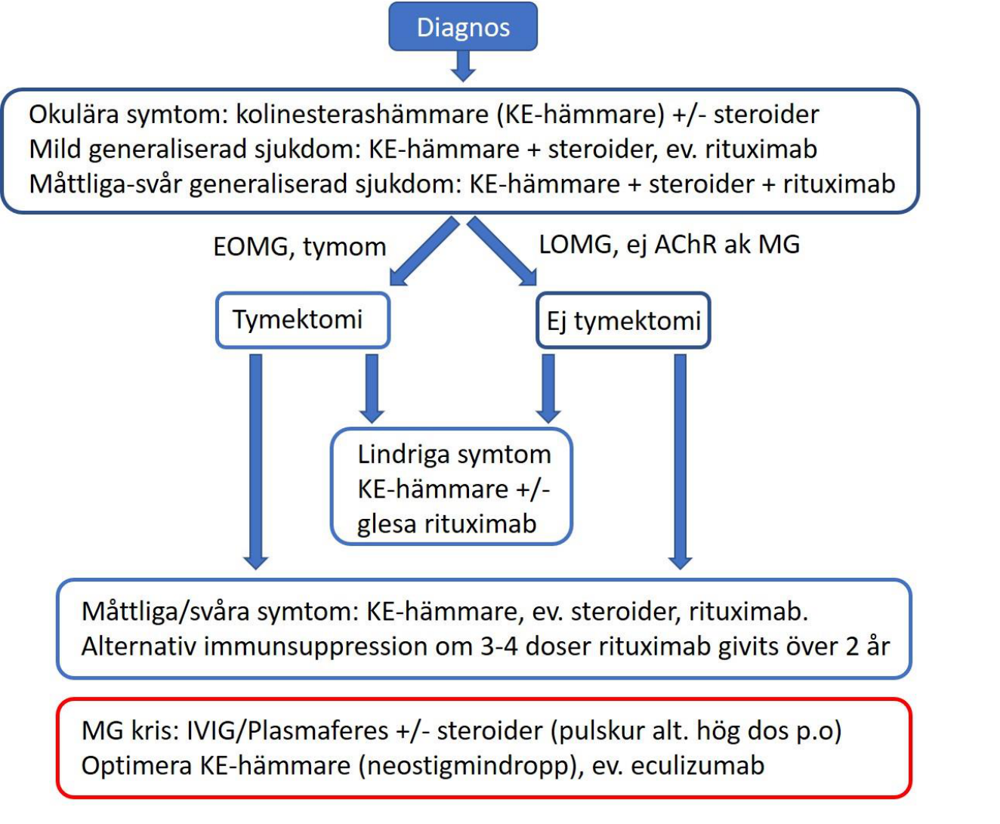
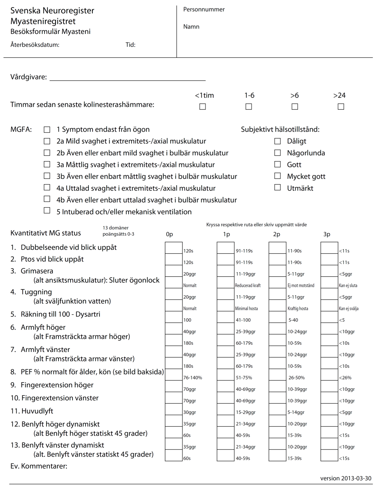
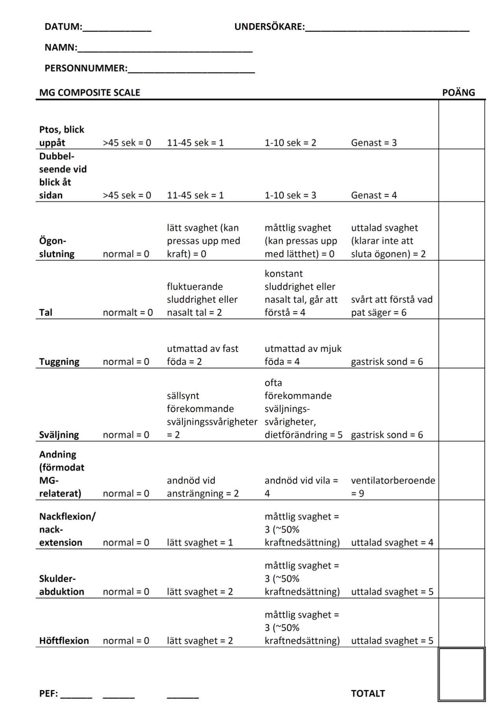
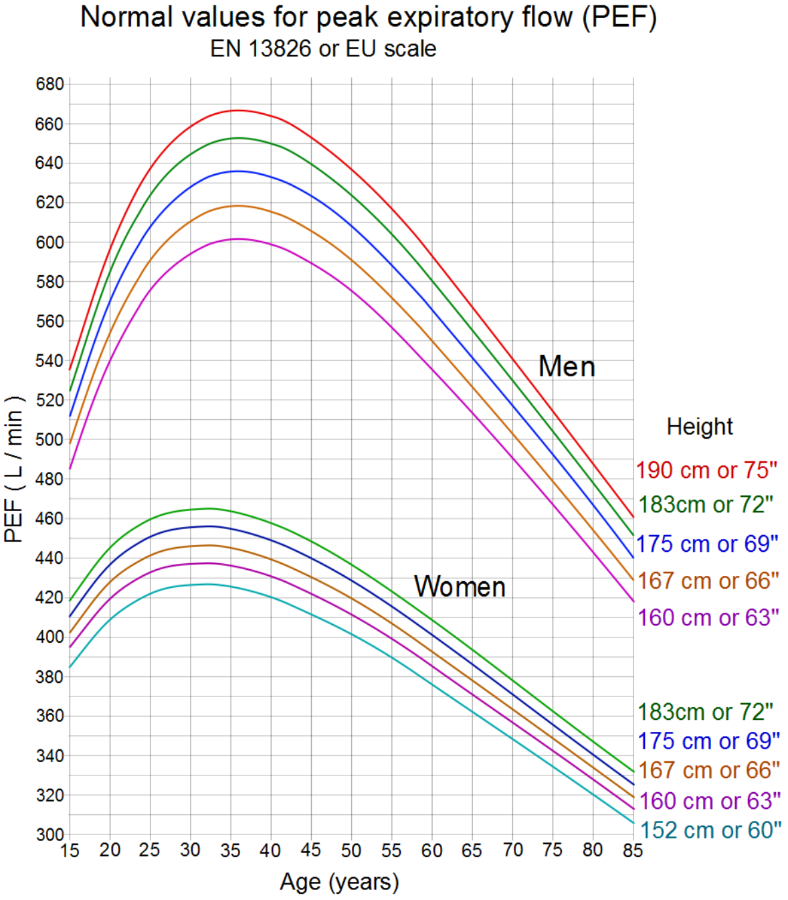

## **Riktlinjer för utredning och behandling av Myastenia Gravis (MG)**

MG är en kronisk autoimmun neurologisk sjukdom, som karaktäriseras av abnorm

muskeluttröttbarhet, eller ibland övergående pares, i tvärstrimmig muskulatur och som lindras

av vila och kolinesterashämmare. Tillståndet kräver i olika faser av sjukdomen varierande

insatser från sjukvården. Stora framsteg har gjorts i den medicinska behandlingen under de

senaste decennierna och det finns idag ett flertal interventioner som på kort eller lång sikt kan

mildra det fortsatta sjukdomsförloppet. Behandling och omhändertagande av MG kräver

neurologisk expertis med relevant erfarenhet och det är därför väsentligt att personer med MG

snabbt och regelbundet har tillgång till specialiserad vård, framförallt tidigt i förloppet då

risken för allvarliga skov är som störst.

-För nyinsjuknade patienter rekommenderas klinisk kontroll med kvantitativ testning av

uttröttbarhetssymptom med antingen QMG eller MGC skalorna (och självskattningsskalorna

MG-ADL, MG-QoL och EQ-5D) två gånger per år under de första 2 till 5 åren, och därefter

[anpassat efter sjukdomsförloppet (för skalorna, se: www.snema.se/dokument.html alt](http://www.snema.se/dokument.html%20alt%20neuroreg.se)

[neuroreg.se).](http://www.snema.se/dokument.html%20alt%20neuroreg.se)

-För patienter som står på immunosuppressiv behandling minst årliga kontroller enligt ovan.

-Hos patienter med lindriga symptom utan sådan behandling kan kontrollerna glesas ut.

Personer med MG bör erbjudas registrering i det nationella MG registret

(https://www.neuroreg.se) för att skapa förutsättningar för långtidsuppföljning och kvalitativ

utvärdering av behandlingsutfall på både individuell och gruppnivå (för regionala

[kontaktansvariga, se hemsidan, alternativt delregisteransvarig, fredrik.piehl@ki.se).](mailto:fredrik.piehl@ki.se) De

främsta målgrupperna för MGreg är nyinsjuknade samt de som har behov av

immunomodulerande behandling, med registrering av pågående immunoterapi,

uttröttbarhetstest samt självskattningsskalor på årlig bas.

Prevalensen av MG i Sverige är omkring 25 per 100 000. Sjukdomen förekommer i flera olika

former, där det är vedertaget att stratifiera på ålder vid sjukdomsdebut; tidigt debuterande MG

(före 50 års ålder; early-onset MG; EOMG) med stark kvinnlig dominans, och sent

debuterande sjukdom (efter 50 års ålder; late-onset MG; LOMG) med viss manlig dominans.

Ytterligare ett åldersstratum har introducerats på senare år; väldigt sent debuterande sjukdom

(efter 65 års ålder; very late onset MG; VLOMG). MG förekommer också i en

paraneoplastisk form associerad med tymom. Dessa är antingen benigna eller maligna,

vanligen då med ett lokalt invasivt växtsätt. Antikroppar mot acetylkolinreceptor (AChR ak)

förekommer i samtliga tre former. Därutöver kan MG vara associerat med antikroppar mot

andra proteiner i den neuromuskulära ändplattan; MuSK respektive LRP4. Saknas samtliga

tre antikroppar, kallas tillståndet (trippel) seronegativ MG.

Ögonsymptom är vanligt vid sjukdomsdebuten och hos ca 20% förblir sjukdomen begränsad

till ögonen, okulär MG, medan sjukdomen är generaliserad hos ca 80%. Risken för

generalisering vid rent okulär MG är störst under de första två åren och är tydligt förhöjd vid

förekomst av AChR ak jämfört med de som saknar antikroppar. Vid generaliserad MG är

bulbära symptom i form av tal- och sväljsvårigheter, samt nacksvaghet vanligt

förekommande, särskilt vid MuSK-positiv MG. Symtomen behöver inte vara symmetriska

och kan vara begränsade till en viss muskelgrupp. Ett vanligt men inte alltid förekommande

fenomen vid MG är påtaglig symtomfluktuation över tid och att symtomen försämras under

dagen. Det är också vanligt att symtomen drastiskt kan försämras vid infektioner, särskilt hos

nyinsjuknade personer och de med kvarstående symtom trots behandling. Det är viktigt att

informera patienterna om detta för att de på ett tidigt stadium ska kunna söka vård.

Symtomen är initialt oftast smygande och progredierar med fluktuerande intensitet under

veckor till månader. Utöver infektion, kan emotionell stress, operation, graviditet samt vissa

mediciner snabbt försämra tillståndet. Sammantaget är prognosen svårbedömd under de första

åren, varefter tillståndet brukar stabiliseras, även om försämringar i senare faser kan

förekomma.

## **Utredning vid misstänkt MG**

**[1] Kliniska uttröttningstester (se bilaga 1):** Kvantitativ testning av uttröttbarhetssymptom

med antingen QMG eller MGC skalorna är viktigt för att kunna värdera grad av

sjukdomspåverkan och för att på kort och lång sikt följa sjukdomsförloppet och utvärdera

effekt av behandlingar.

### [2] Reversibilitetstester

**-Edrofoniumtest** (”Tensilontest”; sensitivitet ca 60%) kan göras om patienten har tydliga och

objektivt verifierbara uttröttbarhetssymtom (t ex ptos). Först ges Atropin 0,5 mg eller Robinul

0,2 mg för att minska risken kolinerg vagal reaktion med bradykardi. Efter 5 till 10 minuter

ges 2 mg edrofonium (kolinesterashämmare) i.v som testdos varefter man avvaktar några

minuter till innan ytterligare 8 mg administreras. Atropin och HLR utrustning ska finnas till

hands vid testet. Då edrofonium numera är ett licenspreparat kan detta bytas ut mot 0,5 mg

neostigmin i.v. Skillnaden mellan de båda är att effekten av edrofonium kommer snabbare och

avtar redan efter 5–10 minuter, medan effekten av neostigmin varar 1–2 timmar.

Ett alternativ till i.v kolinesterashämmare är att administrera 60 mg pyridostigmin (Mestinon)

peroralt, där effekten utvärderas efter en timme.

Vid tydlig ptos är istest ytterligare ett alternativ. Man placerar då krossad is i en

engångshandske som läggs över ögonlocket i 2 minuter varvid ptosen ska minska med ≥2 mm

för att testet skall betraktas som positivt. Hypotesen är att man hämmar endogen

kolinesterasaktivitet genom temperatursänkningen och att man på så sätt efterliknar

farmakologisk hämning. Notera att specificitet och sensitivitet är begränsad och därför kan

falla ut både som falskt positivt och negativt.

### [3] Serum för analys av antikroppar

- **Acetylcholinreceptorantikroppar (AChR-ak)** detekteras hos ca 80% med generaliserad

MG och omkring hälften vid okulär MG. Nivåerna är normalt högst vid EOMG (50 till >200

nmol/L). Analys av AChR-ak görs på enheter för klinisk immunologi vid landets

[universitetssjukhus samt på Wieslab (www.wieslab.se).](http://www.wieslab.se/)

- **Antikroppar mot muskelspecifikt tyrosinkinas (MuSK-ak)** kan detekteras hos ca 40-70%

av AChR-seronegativa patienter i internationella studier. Förekomst av MuSK-ak är dock

betydligt lägre i nordisk befolkning än de med ursprung från Medelhavsområdet och

Mellanöstern. Analysen bör utföras hos alla AChR-seronegativa med generaliserade

symptom, särskilt vid mer uttalade okulobulbära symptom, då informationen påverkar den

vidare behandlingen. MuSK-ak analys görs bla av Karolinska Universitetssjukhuset och

Wieslab.

- **Antikroppar mot Low density lipoprotein receptor–related protein 4 (LRP4-ak)** har

beskrivits hos 2-50 % av dubbel seronegativ MG (saknar både AChR- och MuSK-ak), varav

de flesta har okulär eller lindrig generaliserad MG. LRP4-ak analys görs vid Wieslab.

- **Antikroppar mot titin** används ibland som komplement för att värdera sannolikheten av

tymom före en eventuell tymektomi. Det prediktiva värdet gäller dock enbart vid EOMG,

eftersom titin-antikroppar är relativt vanligt förekommande vid LOMG (Wieslab).

### [4] Neurofysiologiska undersökningar

Dessa görs för att objektivt verifiera utbredning och grad av påverkad neuromuskulär

transmission och för att utesluta andra avvikelser som kan bidra till muskulära symtom, så

som myopati (EMG) eller störd nervkonduktion (ENG). Om patienten står på

kolinesterashämmare, t.ex pyridostigmin (Mestinon), ska medicineringen seponeras minst 12

timmar före undersökningen för att inte maskera undersökningsfynd.

**-Repetitiv nervstimulering (RNS)** : Ytelektroder placeras över muskeln och det motoriska

svaret avläses vid 3 Hz aktivering i vila, liksom omedelbart och 1, 3 och 5 min efter 20 sek

maximal volontär muskelkontraktion. Reduktion (dvs dekrement) i amplitud av muskelsvaret

mellan 1:a och 4:e stimulering på ≥ 10% i vila indikerar transmissionstörning så som vid MG.

Direkt efter maximal volontär muskelkontraktion minskar dekrement till följd av så kallad

post-aktiverings facilitering. RNS har omkring 75% sensitiviteten vid generaliserad MG. Vid

okulär MG har omkring 50% avvikande fynd, vanligtvis i kranialnervsinnerverad muskulatur.

Vid misstanke om Lambert-Eatons Myastena Syndrom (LEMS) görs även högfrekvent RNS

(20 Hz; Obs, undersökningen kan upplevas som obehaglig), där man förväntas se ett

inkrement, dvs ökad amplitud. LEMS orsakas av antikroppar mot spännningsberoende

kalciumkanaler (VGCC; görs bla av Karolinska Universitetssjukhuset och Wieslab).

**-Singel-Fiber elektromyografi (SFEMG)** : Analys av potentialer från två muskelfibrer

innerverade av samma motoriska enhet för att detektera temporal variabilitet, s.k “jitter”.

Undersökningen görs ofta i en ansiktsmuskel (t ex m. orbicularis oculi eller m. frontalis).

Sensitiviteten brukar anges till ca 95% vid både generaliserad och okulär MG, men är också

undersökarberoende och ska inte användas för screening eftersom specificiteten endast är ca

70%. Eventuella avvikelser är också inte helt specifika för MG, utan kan också ses vid t ex

ALS, polymyosit, LEMS och efter behandling med botulinumtoxin. Specificiteten förutsätter

också att det saknas avvikelser i rutin-EMG.

**[5] DT-thorax** med frågeställningen tymom eller tymusförstoring ska alltid göras vid

diagnostiserad MG, särskilt vid förekomst av AChR-ak. Specificiteten för att skilja mellan

hyperplasi och atrofisk tymus är dock låg, även vid MR, och det är ibland svårt att skilja

hyperplasi från tymom. Vanligen går det dock att identifiera ett tymom även på en

undersökning utan kontrast, vilket är att föredra hos personer med instabil generaliserad

symtombild pga. risk för akut försämring inducerad av kontrastmedel (se nedan).

**[6] Övriga blodprover** : Blodstatus, med blod diff, leverstatus, kreatinin, Na, K, fT4, TSH

som basprover, med tillägg av serum IgA, IgM och IgG nivåer samt FACS lymfocytprofil vid

misstanke om tymom (Good´s syndrom; kombinerad hypogammaglobulinemi associerat med

tymom) och inför insättning av all typ av immunosuppressiv behandling.

## **Behandling:**

### [1] Symtomatisk terapi

**Kolinesterashämmare:** Good practice point, evidensgrad 4.

Lätta till måttliga symtom: Symtomatisk behandling med pyridostigmin (Mestinon). Snabb

halveringstid gör att flerdos, vanligen 3 till 6 ggr dagligen, krävs. Ofta är det klokt att starta

med 20 mg x 3, och sedan, beroende på tolerabilitet och effekt, snabbt trappa upp till 60 mg

1x3, eller högre. Doser överstigande ca 500 mg/dygn ökar risken för s.k. kolinerg kris och

indikerar behov av immunomodulerande behandling. Tabletterna tas under vaken tid. GI

biverkningar är vanliga och minskas om tabletterna tas i samband med måltid och/eller med

tillägg av anti-kolinergika, t ex ex tempore APL kapslar hyoscinhydrobromid 0.3mg 1x1-3; se

[för övrigt rekommendationer om ersättningsmedel för Egazil på www.janusinfo.se.](http://www.janusinfo.se/)

Muskelfascikulationer och svettningar förekommer och är dosberoende.

Ambenon (Mytelase 10 mg, licenspreparat; 7,5 mg motsvarar ca 60 mg pyridostigmin) har en

något längre duration (5-8 timmar) än pyridostigmin (3-6 timmar). På individnivå

förekommer skillnader i hur man upplever balansen mellan positiv behandlingseffekt och

biverkningar mellan pyridostigmin och ambenon, varför preparatet kan prövas vid dålig

tolerabilitet för pyridostigmin. Muskarinerga biverkningar är mindre uttalade för ambenon,

varför överdoseringssymtom med fascikulationer och muskelsvaghet kan uppträda tidigare.

Neostigmin (2,5mg/ml) 0,5 mg iv eller 1,5 mg subkutant (motsvarar ca 60 mg pyridostigmin)

kan användas vid behov av parenteral dosering. GI biverkningar kan minskas med atropin

0,25-0,5 mg subkutant (en halv timme före) eller glykopyrronium (Robinul) 0,2 – 0,4 mg iv (i

direkt samband).

Notera att de med MuSK-ak vanligen svarar sämre på kolinesterashämning och även kan

uppleva muskulära överdoseringssymtom (muskelsvaghet och muskelkramper) vid lägre

doser än vad som angivits ovan.

### [2] Immunoterapi

**-Kortikosteroider:** Good practice point, evidensgrad 2b

Tillägg av steroider bör övervägas vid måttliga till svåra myastena symtom och kan

administreras som pulskur eller som kontinuerlig per oral behandling.

Pulskurer: Metylprednisolon (Solu-Medrol) i doser upp till 30 mg/kg kroppsvikt per dag

alternativt prednison (Medrol 100 mg, licenspreparat) oralt i doser om 500 till 1000 mg per

dag under två på varandra följande dagar, beroende på svårighetsgrad av symptom.

Erfarenheten av per oralt betametason är begränsad och en ekvipotent dos (10 mg prednisolon

motsvarar 1,2 mg betametason) ger ett orimligt högt antal tabletter. Pulskurer ger snabbare

insättande effekt jämfört med kontinuerlig oral kortisonbehandling, men medför risk för en

initial försämringsfas under dag 2 till 3, varför behandlingen åtminstone första gången bör

utföras i slutenvård med regelbunden kontroll av kliniskt status inkl PEF. Vid PEF värde

<30% av förväntat värde bör fortsatt övervakning ske på intensivvårdsavdelning, där

respiratorvård snabbt kan initieras. Allvarlig försämring vid MG kan komma snabbt och

blodgasanalyser har begränsat värde för att bedöma hotande andningssvikt vid MG. Vid

svårare symtom bör man därför avstå från pulskurer och i stället starta med upptrappande

doser prednisolon (se nedan). Undantaget är om personen redan har respiratorvård.

Kontinuerlig oral prednisolon-behandling: Startdos 30 mg för att undvika risk för initial

försämring. Vid svårare symtom kan dosen sedan trappas upp till 60 mg/d över en vecka.

Denna dos behålls tills man ser en tydlig förbättring, varefter dosen successivt trappas ner

över flera månader. Vid måttliga symtom behåller man dosen 30 mg per dag och trappar på

liknande sätt ned i takt med symtomförbättring.

Vid okulär MG, där kolinesterashämmare är otillräckligt eller av andra skäl bör undvikas, kan

Prednisolon (initialt 20-30 mg/d med nedtrappning under några veckor/månader) alternativt

Medrol (t ex 500 mg/d i två dagar) prövas. Pga. biverkningsrisken med steroider bör

målsättningen vara att trappa ned dosen till 10 mg/d eller lägre inom 6 månader. Om tydliga

myastena symtom saknas och steroidsparande immunosupression har initierats, bör försök att

helt seponera steroider göras inom 1 till 2 år, eller helst tidigare.

Steroidbehandling bör kombineras med kalcium/D-vitamin, t ex Calcichew- D3 1x2, och

magskyddande läkemedel, t ex omeprazol. Hos personer med ökad risk för osteoporos (hög

ålder, kvinnor, låg kroppsvikt, rökare, ärftlighet) bör tillägg av bifosfonat från start övervägas.

Bentäthetsmätning bör göras på alla som påbörjar oral behandling med steroider.

**-Immunosuppressiva läkemedel:** Rituximab: evidensgrad: 1b; Azatioprin, ciklosporin,

takrolimus, cyklofosfamid: evidensgrad 2b; Mycofenolatmofetil, methotrexat: evidensgrad 3b

Per orala immunosuppressiva läkemedel i kombination med kortikosteroider har traditionellt

varit förstahandspreparat vid generaliserad MG, men ersätts av rituximab i denna version av

terapirekommendationer.

**Rituximab** : Det immunosuppressiva alternativ för MG som på senare år har blivit det

vanligaste i Sverige är rituximab (evidensgrad 1b). Internationellt har man framförallt använt

ett hematologiskt doseringsprotokoll (375 mg/kvm kroppsyta en gång per vecka i fyra

veckor), eller i vissa fall det reumatologiska doseringsprotokollet (1000 mg upprepat efter två

veckor). I en svensk placebo-kontrollerad randomiserad studie i nydebuterad generaliserad

MG med minst måttliga symtom (LOMG dominerade i studiepopulationen), var rituximab

jämfört med placebo associerat med betydligt högre chans till milda symtom vid 4 och 6

månader utan behov av skovbehandling. Behandlingen gavs då som en engångsinfusion med

500 mg rituximab som tillägg till per oral kortisonbehandling. En tidigare retrospektiv

observationell studie har också indikerat bättre och snabbare effekt av lågdos rituximab (500

mg var 6:e månad) vid nydebuterad MG än vid behandlingsrefraktär sjukdom (ca 3 månader

mot 6-12 månader till minimala symtom). Vid behandling av nydebuterad MG var rituximab

också klart bättre än konventionell behandling med orala immunosuppressiva både sett till

effekt och tolerabilitet.

Den rekommenderade dosen rituximab vid måttlig- uttalad generaliserad myasteni är 500mg

utifrån ovan underlag. I klinisk praxis kan rituximab upprepas med 6 till 12-månaders

intervall utifrån kliniskt behov och effekt. Kontroll av CD19 [+] B celler bör göras inför varje

infusion, med kortare dosintervall vid tidig re-population. Serum IgG nivåer ska också

kontrolleras inför varje infusion för tidig upptäckt av tendens till hypogammaglobulinemi.

Över längre tid bör försök att glesa ut infusionsintervallen göras för att minska risken för

infektions-komplikationer. Vid otillräcklig effekt av rituximab trots eliminerade B celler över

1 till 2 år bör byte till annan behandling övervägas (se nedan).

Studier indikerar inte på förhöjd fostermissbildningsfrekvens vid behandling med rituximab,

men läkemedlet passerar över placenta ffa under sista trimestern, vilket kan leda till

elimination av B celler, ökad infektionsrisk och försämrat vaccinationssvar hos barnet. Man

bör därför avvakta minst tre månader efter given dos innan graviditet planeras. Hos

fullgångna barn som ammas förefaller inte rituximab leda till påverkade B celler.

#### Övriga immunosuppressiva

**Azatioprin** har fram tills nyligen varit förstahandspreparat (nu ersatt av rituximab) för

steroidsparande immunosuppression (rekommendationsgrad A), där behandlingen startas så

snart som möjligt efter att steroidbehandling inletts. Om tymektomi planeras bör man om

möjligt avvakta med immunosuppressiva läkemedel tills efter operationen. Dosen är 2 till 2.5

mg/kg kroppsvikt uppdelat på en eller två doser per dag (normalt 150 mg/d) och kräver

regelbunden övervakning av blodbild och leverfunktion (veckovis första månaden, månadsvis

första kvartalet, sedan 4 ggr per år så länge behandlingen fortgår). Effekt kan förväntas allra

tidigast efter 3 månader, men kan ibland dröja betydligt längre, upp till 1-1,5 år. En indikator

på farmakologisk effekt av given dos är en lätt ökning av MCV till övre eller strax över

referensvärdet. Biverkningar är relativt vanligt förekommande. Individer med genetisk

TPMT-brist utvecklar snabbt toxiska symtom med allmän sjukdomskänsla och förhöjning av

bl. a leverprover. På lite längre sikt är benmärgsdepression en allvarlig biverkan som

motiverar kontroll av blodbilden var tredje månad vid långtidsbehandling. Liksom all annan

oral immunosuppression ökar risken för infektioner, t ex bältros. På lång sikt kan risken för

hudcancer, ffa skivepitel, öka.

Om azatioprin inte tolereras eller har otillräcklig effekt kan man överväga behandling med

**mykofenolatmofetil** (CellCept; vanligen 1gx2), **ciklosporin** (Sandimmun; initialt 2 till 3

mg/kg/dag fördelat på två doser), **takrolimus** (Prograf; 0,05 till 0,1 mg/kg/dag) eller

**metotrexat** (7,5 till 20 mg/vecka) (rekommendationsgrad B). Effektlatensen för

mykofenolatmofetil och metotrexat är ungefär lika stor som för azatioprin, medan effekten av

ciklosporin och takrolimus brukar komma något tidigare, inom omkring 3 månader. För full

effekt kan det dröja ytterligare flera månader. De provtagningar som skall göras innan och

under behandlingarna anges i bilaga 2. Ciklosporinkoncentrationen i serum bör vara ca 70 till

150 ng/ml och takrolimuskoncentrationen 2 till 9 ng/ml (dalvärden före morgondosen).

Pulsativ **cyklofosfamid** (Sendoxan, 10 till 15mg/kg per kur vid 1 till 3 tillfällen;

rekommendationsgrad B), kan vara ett alternativ i svårare fall av generaliserad MG som inte

svarat på orala immunosuppressiva.

Observera att orala immunsuppressiva är teratogena, där risken för spontanabort och

missbildning förefaller vara högst för mykofenolatmofetil. Kvinnor i fertil ålder ska erhålla

adekvat information och råd om lämplig(a) preventivmetod(er).

**Immunglobulin i.v (IVIG) och plasmaferes:** Rekommendationsgrad A, evidensgrad 1b

Om steroidbehandling är olämplig eller otillräcklig och symptomen är så uttalade att man inte

kan invänta effekten av immunosuppressiva bör plasmaferes övervägas. Normalt genomförs 4

till 5 utbyten över 5 till 10 dagar. IVIG 1-2 g/kg kroppsvikt totalt administrerat över två till tre

dagar är ett alternativ till plasmaferes och upplevs normalt mindre belastande för patienten.

Det är oklart om dessa behandlingar är likvärdiga, men IVIG har fördelen att vara tillgänglig

inom allmän neurologisk verksamhet och normalt tolereras bättre än plasmaferes. Omkring

två tredjedelar förbättras markant inom en vecka, men effekten är kortvarig, varför

behandlingen bör kombineras med kortison och annan immunosuppressiv behandling. I

utvalda fall, t ex när steroider inte tolereras och adekvat sjukdomskontroll med

immunosuppressiv behandling ännu inte uppnåtts, kan övergående underhållsbehandling med

IVIG övervägas. Detta kan också vara aktuellt vid ökad infektionskänslighet, där MG

patienter ofta upplever påtaglig symtomförsämring. Behandling ges då som enstaka infusioner

(20 till 40g) med 4 till 12 veckors intervall.

#### Behandlingsalternativ vid terapisvikt på rituximab, steroider och andra immunosuppressiva, dvs terapirefraktär myasteni

Om ovanstående behandlingar inte ger tillfredställande effekt eller ger oacceptabla

biverkningar kan man överväga behandling med **eculizumab** (Soliris; rekommendationsgrad

A), **ravulizumab** (Ultomiris; rekommendationsgrad A) eller **efgartigimod** (Vygart;

rekommendationsgrad A). Dessa behandlingar bör centraliseras på specialiserade enheter

regionalt.

**Eculizumab** är det första immunsuppressiva läkemedelt som erhållit formellt godkännande

för MG (terapirefraktär, ej tymomassocierad AChR-ak positiv MG). Eculizumab blockerar

komplementprotein C5a och inhiberar därmed komplementkaskaden. Godkännandet

baserades på en internationell fas III studie. Det primära utfallsmåttet var effekt på MG-ADL

skalan, där den aktiva behandlingsarmen uppvisade en gränssignifikant effekt. Effekten på

flera sekundära effektmått, bl. a kvantitativ MG skala, var dock signifikanta. Behandlingen är

förknippad med risker för allvarligare infektioner, där ffa risken för meningokockmeningit ska

uppmärksammas. Vaccinationsskyddet bör ses över innan behandling. Behandlingskostnaden

är också mycket hög, >1 miljon kr per patient och år. Mer nyligen har det relaterade preparatet

**ravulizumab** (Ultomiris) godkänts för generaliserad AChR-ak positiv MG. Medlet blockerar

också C5a men kan administreras mer sällan än eculizumab (varannan månad jämfört med

varannan vecka).

**Efgartigimod** är det andra läkemedlet som godkänts specifikt för AChR-ak positiv

generaliserad MG. Läkemedlet blockerar neonatal Fc-receptor, vilket leder till ökad endogen

selektiv destruktion av IgG, inkluderande AChR-ak. En fas III studie påvisade en signifikant

effekt på både MG-ADL och kvantitativ MG skala jämfört med placebo.

**Nyare och experimentella behandlingar** : Flera behandlingsstudier pågår med läkemedel

som delvis har nya verkningsmekanismer vid behandling av MG. Till dessa hör hämning av

interleukin-6 (satralizumab/Enspryng och tocilizumab/Roactemra), elimination av CD19 [+]

celler (inebilizumab/Uplizna) och elimination av både B och T-celler (kladribin/Mavenclad).

För vissa av dessa finns begränsad klinisk emiprisk erfarenhet, t ex tocilizumab och kladribin,

vilket gör att de i vissa selekterade fall kan övervägas. Särskilt tocilizumab har en acceptabel

säkerhetsprofil och kan övervägas vid kvarstående symtom trots adekvata doser av rituximab

över 1 till 2 år. Vid mycket terapirefraktära symptom, men med tecken till reversibilitet vid

plasmaferes, kan även hematogen stamcellsbehandling (HSCT) komma ifråga. Beslut om

HSCT ska fattas inom ramen för nationell högspecialiserad vård (NHV), där terapirefraktär

MG rent allmänt även ingår i uppdraget.

**[3] Tymektomi:** Rekommendationsgrad A, evidensgrad 1b.

Tymektomi bör utföras tidigt vid generaliserad EOMG (rekommendationsgrad A) och

tymom-associerad MG (rekommendationsgrad A). Operationen kan vanligen genomföras

endoskopiskt (video-assisted thoracic surgery, VATS), vilket medför ett mindre trauma och

kortare konvalescens än öppen kirurgi med sternotomi. Faktorer associerade med god effekt

av tymektomi är kort sjukdomsduration, kvinnligt kön, förekomst av tymushyperplasi och

AChR-ak seropositivitet. Andelen som uppvisar tymushyperplasi på PAD sjunker successivt i

åldersintervallet 40-65 år, varför indikationen för operation vid sjukdomsdebut över 50 till 60

års ålder är svag, särskilt hos män. Tymektomi rekommenderas ej vid MuSK- eller LRP4-ak

seropositivitet, eller seronegativitet. Patientens MG symtom bör optimeras och vara stabila

inför operationen, vilket kan göras med titrering av kolinesterashämmare, steroider och/eller

IVIG. Om möjligt bör man avvakta med insättning av immunosuppressiva tills efter

operationen, men administration av en första dos rituximab kan övervägas för tidig

stabilisering av MG-symptom. Effekten av tymektomi är vanligen fördröjd och blir tydlig

först efter 1 till 2 år efter operationen.

### Myasten kris

Respiratorisk svikt orsakas av myasten svaghet i andningsmuskulaturen och kan vara

livshotande. Patienter som bedöms vara i riskzonen ska vårdas på intermediär- eller

intensivvårdsavdelning med möjlighet till kontinuerlig övervakning och behandling med icke

invasiv ventilation (NIV) eller invasiv ventilatorbehandling. OBS! blodgaserna kan vara

normala fram tills dess att patienten slutar andas.

Immunomodulerande behandling: Plasmaferes eller IVIG ska sättas in tidigt för att vända

förloppet. Behandling med i.v neostigmin (se bilaga 5) rekommenderas då upptaget av

Mestinon är variabelt och kan påverkas av kolinerga bieffekter av behandlingen. Man startar

behandlingen med den Mestinon-ekvivalenta dos som patienten stod på och justerar utifrån

effekt. Enstaka doser om 0,5 mg neostigmin i.v (motsvarar 60 mg Mestinon) kan ges för att

testa om vidare doshöjning är meningsfull. Robinul (glykopyrron, ett antikolinergikum) bör

ges regelbundet för att motverka muskarinerga biverkningar, t ex 0,2 mg 3 till 4 ggr per dygn.

Alternativt kan färdig blandning Robinul/Neostigmin användas med dosering utifrån

neostigminschema. Steroider bör också övervägas om krisen inte är orsakad av akut infektion.

Vid insättning av högdossteroider ska risken för försämring dag 2 till 3 beaktas (se avsnitt

Kortikosteroider ovan). Hos äldre eller på annat vis sköra patienter kan dosen Prednisolon

ökas med 10 mg dagligen från en startdos av 20 mg för att minimera risken för andningssvikt

och respiratorbehov. Det är en stor vinst om respiratorbehandling kan undvikas, eftersom

särskilt äldre patienter riskerar andningsrelaterade komplikationer redan efter ett par dagars

respiratorbehandling. Om respiratorbehandling ändå inleds kan man pausa

kolinesterashämning och även utan risk administrera högdos kortikosteroider. Vid tecken till

snabbt försämrade MG symtom med risk för IVA-behov kan kortvarig insättning av

komplementhämning övervägas baserat på nyliga fallrapporter. Sannolikt kommer hämmare

av neonatal Fc-receptor på sikt att kunna bli ett alternativ till plasmaferes/IVIG.

### Kolinerg kris

Överdosering av kolinesterashämmare kan medföra depolariserande blockering i den

neuromuskulära synapsen med muskelsvaghet liknande den vid MG. Det som skiljer från den

myastena krisen är framträdande kolinerga symtom; fascikulationer, muskelkramper, mios,

ökat tårflöde, salivering, bronksekretion, buksmärtor, illamånde, kräkningar, diarré, svettning

och bradykardi.

Det enklaste sättet att skilja tillstånden åt är att tillfälligt sätta ut kolinesterashämmar

behandlingen. Kolinerg kris är nästan alltid ett resultat av otillräcklig immunosuppression,

vilket gör att patienten tvingats höja dosen av kolinesterashämmare. Överväg därför

behandling så som för myasten kris/försämring. Patienter bör också informeras om att inte

själva höja dosen av pyridostigmin 60 mg över 6 till 8 tabletter per dag.

### Överväganden gällande användning av röntgenkontrastmedel

Nuvarande nationella och internationella radiologiska riktlinjer anger att

kontrastmedelsundersökning endast ska göras efter särskilt övervägande och under adekvat

övervakning pga risk för försämring av MG symtom. Detta ställningstagande är baserat på ett

antal fallrapporter, men där systematiska sammanställningar indikerar en låg absolut risk,

särskilt för akut försämring i direkt anslutning till undersökningen. I befintliga

sammanställningar är det också svårt att med god säkerhet skilja ut vad som är orsakat av MG

från symtom relaterade till annan sjuklighet. Överdriven försiktighet kan också leda till

fördröjning eller underdiagnostik av behandlingsbar samsjuklighet. Av dessa skäl anser

SNEMA att;

-Inga restriktioner bör gälla för MR kontrastmedel (gadolinium).

-Undersökning med jodkontrast kan och ska göras om det är diagnostiskt relevant, men

undersökningen bör göras på sjukhus snarare än röntgenavdelning i öppenvård.

-Patienter med _myasteni-associerade_ bulbära/respiratoriska symptom bör observeras

inneliggande ett dygn efter undersökning.

-Att informera patienten om att i tidigt skede ta kontakt med vården vid tecken till försämring.

-Vid frågor bör neurologbakjour kontaktas för second opinion.

## **Referenser:**

Punga AR, et al. Epidemiology, diagnostics, and biomarkers of autoimmune
neuromuscular junction disorders. Lancet Neurol 2022;21:176–188.

Verschuuren J.J.G.M, et al. Advances and ongoing research in the treatment of
autoimmune neuromuscular junction disorders. Lancet Neurol 2022;21:189–202.

Skeie G.O, et al. Guidelines for treatment of autoimmune neuromuscular transmission
disorders. European Journal of Neurology 2010;17:893-902.

Sanders D.B, et al. International consensus guidance for management of myasthenia
gravis. Neurology 2016;87:419-425.

Piehl F, et al. Efficacy and Safety of Rituximab for New-Onset Generalized Myasthenia
Gravis: The RINOMAX Randomized Clinical Trial. JAMA Neurol. 2022;79(11):1105-1112.

Brauner S, et al. Comparison Between Rituximab Treatment for New-Onset Generalized
Myasthenia Gravis and Refractory Generalized Myasthenia Gravis. JAMA Neurol.
2020;77(8):974-981.

Mehrizi M, et al. Complications of radiologic contrast in patients with myasthenia gravis.
Muscle Nerve 2014;50:443–444.

Somashekar DK, et al. Effect of intravenous low-osmolality iodinated contrast media on
patients with myasthenia gravis. Radiology. 2013;267(3):727-34.

## **MG- behandlingsalgoritm**

Alternativ immunsuppression till rituximab: per orala immunosuppressiva, cyklofosfamid, eculizumab,
efgartigimod, tocilizumab, kladribin, hematogen stamcellsbehandling.

Notera att bulbära symtom utöver påverkan på ögonmotorik räknas som generaliserad sjukdom.

EOMG = Early-onset Myasthenia gravis
LOMG = Late-onset Myasthenia gravis

## **Bilaga 1: Instruktioner för utförande av uttröttningstest**

1. **Tal** : Be patienten säga sitt namn och sedan att räkna högt till hundra. Uppmärksamma
tecken till dysartri eller nasalt ljud. Be patienten säga sitt namn igen när han/hon räknat klart.

2. **Ansiktsmotorik:** Be patienten vissla alternativt truta med munnen och sedan göra 20
grimaser (omväxlande le stort och truta med munnen). Be sedan patienten blåsa upp kinderna
och testa med tryck om han/hon har svårt att inte läcka luft.

3. **Käkstyrka:** Be patienten bita ihop och se om det går att pressa ner underkäken. Be
patienten sen att gapa stort 20 gånger. Direkt därefter testas åter om underkäken går att pressa
ner.

4. **Ögonmotorik och ptos:** Be patienten titta på ditt finger i 2 minuter. Fingret hålls cirka 30
cm framför och ovanför patienten, så att han/hon tittar uppåt minst 45 grader. Be patienten att
inte blinka. Notera eventuell ptos uppträder och ögonlocket når pupillen, varefter testet kan
avbrytas. Patienten ska också ange eventuell dubbelseende (från det att fingret får en skugga).
Försök också notera objektiva fynd som att ögonaxlarna devierar. När 2 minuter har gått
kontrolleras ögonmotoriken i alla riktningar.Vid habituell ptos kan testet utföras genom blick i
lateralt ändläge under 2 minuter.

5. **Nackstyrka:** Patientenen ligger plant på en brits utan kudde. Be patienten lyfta upp
huvudet och titta ned mot fötterna. Applicera ett lätt tryck mot pannan och pressa patientens
huvud lätt ned mot britsen för att testa styrkan. Låt sedan patienten göra 30 huvudlyft. Notera
om amplituden på lyften minskar. Be sedan patienten lyfta upp huvudet och titta ned mot
fötterna och testa styrkan som tidigare. Observera, avbryt testet om patienten måste börja
använda ryggmusklerna för att få upp huvudet tillräckligt högt.

6. **Armstyrka:** Be patienten abducera båda armarna till 90 grader i axelleden. Kontrollera
kraften i armarna. Be patienten göra 40 armlyft, så att händerna möts ovanför huvudet.
Notera om amplituden sjunker. Kontrollera kraften efteråt. Alternativt kan statisk styrka testas
genom att be patienten abducera armarna till horisontell position i axelleden som ovan och
kontrollera kraften, be därefter patienten hålla kvar armarna i positionen i 180 sekunder och
kontrollera kraften efteråt. Testet avbryts om armarna börjar sjunka nedåt.

7. **Fingerstyrka:** Kontrollera kraften i ett korsvis handslag. Be därefter patienten i snabb takt
öppna och knyta handen 70 gånger. Notera om förmågan att sträcka ut fingrarna minskar.

8. **Benstyrka** : Patientenen liggande plant på en brits med/utan kudde. Ett ben i taget lyfts till
45-60 grader, där kraften att hålla emot kontrolleras. Be därefter patienten att lyfta benet 35
gånger 45-60 grader. Notera om amplituden sjunker. Vid rörelserelaterad smärta kan statisk
benstyrka testas istället. Då testas förmåga att hålla benet lyft till 45-60 grader under upp till
60 sekunder. Kontrollera kraften i benet efteråt.

9. **Andning:** Patienten får blåsa i en PEF-mätare 3 gånger. Tekniken är viktig; maximal
blåshastighet snarare än att tömma lungorna helt!

## Bilaga 2 : Kvantitativt MG status (QMG)

Det maximala antalet repetitioner räknas som det antal patienten kan utföra ett korrekt sätt, det vill säga behålla

amplitud och med normalt rörelsemönster (t ex att enbart räkna huvudlyft som bara inbegriper nackmuskler men

inte om även ryggmusklerna måste användas). Vid statiska tester räknas tid till att den korrekta rörelsen inte kan

hållas längre

## **Bilaga 2 (forts): MG Kompositskala (MGC)**

## **Bilaga 2 (forts): PEF**

## **Bilaga 3** **Neostigmin test**

Ge först **Atropin 0,5 mg i.v** (Atropin , 0,5 mg/ml, 1 ml) och vänta 5 till 10 minuter.

Informera om att muntorrhet eller lätt pulsstegring kan uppkomma.

Förklara att två olika substanser ska testas, men inte i vilken ordning.

Ge ” **kontrollsubstans” NaCl** i.v i samma volym som Neostigmin-lösningen. Utvärdera

effekten efter ca 5 minuter med lämpligt valt uttröttningsprov i den muskelgrupp som ska

utvärderas, t ex ögonlocksmuskler eller nacke. Fråga också om eventuella biverkningar.

Ge sedan **Neostigmin** 0,5 mg i långsam i.v injektion och spola med NaCl. Utvärdera effekt

efter som ovan och efterfråga biverkningar (ffa tarmobehag, yrsel).

Effekten förväntas sitta i 1 till 2 timmar efter att Neostigminet administrerats för att sedan

gradvis klinga av.

## **Istest**

Om patienten har ptos kan istest utföras som ett alternativ/komplement till

edrofonium/neostigmin test.

Lägg krossad is i en engångshandske och applicera denna mot ögonlocket under 2 minuter.

Vid ett positivt test ska ptosen minska med ≥2 mm jämfört med hur det såg ut före testet.

Använd gärna patientens mobilkamera för att dokumentera effekten.

## **Bilaga 4** **Provtagningsrutiner**

**Rituximab**

Före behandlingsstart: Blodstatus med diff, CRP, ALAT, Krea, U- sticka, LPK, neutrofiler, S

IgG, S-IgM, Lymfocytprofil (T, B celler och NK celler), IGRA test på särskild indikation,

hepatitprover (HBs-Ag, anti-HBs AK, anti-HB AK). Överväg även relevant

virus/vaccinationsserologi (morbilli, varicella).

Före varje infusion: CRP, LPK, neutrofiler, S-IgG, Lymfocytprofil (T, B celler och NK

celler).

**Azatioprin** (Imurel)

Före behandlingsstart: Blodstatus med diff, CRP, Krea, ALAT, amylas och hepatitprover.

Behandlingsmonitorering: Blodstatus med diff, ALAT och amylas 1gång/vecka i 4 veckor,

därefter 1 gång/månad första kvartalet, därefter kvartalsvis.

**Mykofenolatmofetil** (CellCept)

Före behandlingsstart: Blodstatus med diff, ALAT, Krea och hepatitprover.

Behandlingsmonitorering: Blodstatus med diff. 2 ggr/mån första kvartalet, 1 gg/mån andra

kvartalet, därefter kvartalsvis.

**Cyklofosfamid** (Sendoxan)

Före behandlingsstart: Blodstatus med diff, krea, urinsticka, CRP ALAT, och hepatitprover.

Efter 10 dagar: Blodstatus med diff, krea, urinsticka, SR, CRP ALAT.

**Ciklosporin** (Sandimmun Neoral)

Före behandlingsstart: Blodstatus med diff, krea, urea, urat, elektrolyter, ASAT, amylas, CK,

myoglobin, blodfetter, hepatitprover, urinsticka. Blodtryck.

Behandlingsmonitorering: Blodstatus med diff, krea, urea, urat, elektrolyter, ASAT, amylas,

CK, myoglobin 1gång/vecka i 4 veckor, därefter 1 gång/månad första kvartalet, därefter

kvartalsvis. Blodtryck kvartalsvis. Blodfetter och urinsticka minst en gång per år.

**Bilaga 5**

## **Tabell för i.v/s.c Neostigminbehandling vid myasten kris**

Neostigmin i.v 0,5 mg eller s.c 1.5 mg motsvarar 60 mg pyridostigmin (Mestinon) respektive

7,5 mg ambenon (Mytelase).

Förbehandla alltid med antikolinergikum före kolinesterashämmare för att motverka kolinerga

biverkningar!

Atropin eller Robinul bör ges regelbundet för att motverka muskarinerga biverkningar, t ex

0,5 mg Atropin s.c eller i.v alternativt 0,2 mg Robinul i.m eller i.v 3 till 4 ggr per dygn.

Alternativt kan Robinul/ Neostigminlösning användas.

Neostigmin för 12 timmars infusion löses i 500 mL Nacl och ges med infusionspump.

Lämplig startdos vid myasten kris är att först ge 0,5 mg iv som injektion och därefter starta

dropp med hastighet 1 mg/12 tim.

|Dosekvivalenter (60 mg Mestinon tabletter/dygn)|Neostigmin/dygn (mg)|Neostigmin/tim (mg)|
|---|---|---|
|3|1,5|0,06|
|4|2,0|0,08|
|5|2,5|0,10|
|6|3,0|0,13|
|7|3,5|0,15|
|8|4,0|0,17|
|9|4,5|0,19|
|10|5,0|0,21|
