### I. Nyheter och Ändringar

**Nyheter och Ändringar 2025**
Tillägg av text kring subkutan L-dopa behandling.
Uppdatering av text kring Interaktioner mellan MAO hämmare och antidepressiva.
Uppdatering av text kring Depressionsbehandling.
Uppdatering av text kring Flexilev [®] .
Uppdatering av text kring högfrekvent MRgFUS.
Uppdatering av text kring LEDD.
Uppdatering av text kring Opikapon.
Tillägg av text kring inhalerat L-dopa
Tillägg av text kring SAA.
Tillägg av text kring Diagnostiska och prodromala kriterier.
Uppdatering av text kring RBD och RLS.
Uppdatering av text kring monitorering med accelometermätningar.
Smärre språkliga och layoutmässiga justeringar har genomförts.

**Nyheter och Ändringar 2022**
Handlingsplan för genetisk testning vid Parkinsons sjukdom/Parkinsonism.
Tillägg av text kring Opikapon.
Tillägg av text kring Lecigon. Uppdatering kring Amantadin.
Tillägg av text kring MR-guidat Fokuserad Ultraljudsterapi.
Tillägg av text kring Apati.
Tillägg av text kring smärta.
Bilaga med text kring genetisk vägledning.
Äldre kriterier för Parkinsons sjukdom (Brain Bank och NINDS) har utgått
Smärre språkliga och layoutmässiga justeringar har genomförts.

**Nyheter 2019**
Samtliga avsnitt har gåtts igenom och harmoniserats med Socialstyrelsens Nationella riktlinjer för vård vid
multipel skleros och Parkinsons sjukdom (2016) där det bedömts nödvändigt.
Den tiogradiga prioriteringsskalan som används i nationella riktlinjer markerar att frågan har behandlats och
prioriterats inom de nationella riktlinjerna.
En bilaga med råd avseende användning av Parkinson Kinetigraph (PKG) och tolkning av sådana
accelerometrimätningar har tillkommit.
Smärre språkliga och layoutmässiga justeringar har genomförts.

**Nyheter 2014**
Uppdatering impulskontroll störningar och Dopamine Agonist Withdrawal Syndrome
Ortostatism
Domperidon inom subventionering (för PD), med dosrestriktion Handlingsplan vid
Parkinson hyperpyrexisyndrom

**Nyheter och ändringar 2013**
Uppdatering kring diagnostiska metoder, med kommentarer kring liquor (CSF) analyser, ultraljud (sonografi) och
SPECT undersökningar.
Ny tabell för tydligare jämförelse av CSF, SPECT och MR, neuro psykologi fynd vid olika differentialdiagnoser.
Uppdatering av läkemedelsformer och styrkor, bl.a Stalevos olika styrkor.
Uppdatering kring Domperidon.
Förkortat avsnitt kring risk för fibros av ergotbaserade dopaminagonister.
Det saknas EBM underlag för att fördröja behandling även tidigt i sjukdomsförloppet och tidig behandling
förordas.
Tydlig uppmaning att läkare regelbundet aktivt frågar om symtom på dopaminreceptor- dysregleringssyndrom och
beteendestörningar.
Tillägg om behandling av mycket svår ortostatism med Droxidopa.

**Nyheter och ändringar 2011**
Uppdatering av personer som deltagit i arbetet med riktlinjer. ICD

10 koder justerade.
Förtydligande om MR kriterier för diagnos.
Poängtering av att yngre kommer tidigt till specialist inom MD.
Stalevo i olika styrkor av L-dopa finns tillgängliga.
Lesionell neurokirurgi har tagits bort då metoden inte används mycket.
Förtydliganden om DBS och pacemakers.
Tillägg i råd om hypotension och nykturi.
Förtydligande av dyston tremor som viktig differentialdiagnos till essentiell tremor. Referens
uppdateringar vad gäller diagnoskriterier.
Ett stort antal språkliga justeringar.
Kompletterande råd för medicinering vid elektiva operationer med rotigotin.
Uppmärksamhet på samband mellan total L-dopa dos och polyneuropati. Råd kring
Duodopa® och risk för polyneuropatiutveckling.
Uppdatering av nyheter kring körkort och sjukdom.

**Nyheter och ändringar 2010**
Mindre textförändringar vad gäller preparatnamn och enklare klargöranden.
Tillägg av referens till ScandModis konsensus dekument om DBS.
Uppdatering av Körkortsförordningar från Trafikverket.

**Nyheter och ändringar 2009**
Revision av ”UK Parkinson’s Disease Society Brain Bank diagnos-kriterier”.
Revision av MSA-diagnoskriterier.

**Ändringar 2008**
[Tillägg av länkar till www.swemodis.se, och detaljerade rekommendationer kring Duodopa®](http://www.swemodis.se/) [®], och Apo- Go
PEN [®], samt apomorfinpump.
Uppdatering av de nya rekommendationerna vad avser kabergolin och övriga ergotalkaloider Uppdatering av
bakgrundsinformationen för MAO-B-I.
Uppdatering av bakgrundsinforamation för NMDA-I. Understrykande av tidigt insatt behandling har ytterligare
förstärkts. Demenskriterierna för Parkinsons sjukdom införda i demensavsnittet. Justerade detaljer vad avser
indikation för DBS.
Utökning av texten kring dopaminerga dysregleringssyndromet och beteendestörningar.
Utdrag av de för Parkinsons sjukdom relevanta texterna från Vägverkets förordning rörande körkort. Utdrag
av de för Parkinsons sjukdom relevanta texterna från Socialstyrelsens försäkringsmedicinska beslutsstöd.
Bilaga med en icke validerad översättning av diagnoskriterer för demens vid Parkinsons sjukdom.

### II. Förkortningar

ADL Activities of Daily Living

CBD Corticobasal; Kortikobasal degeneration

CBS Corticobasalt; Kortikobasalt syndrom

Beta-CIT Beta-CIT (2-beta-karbometoxy-3-beta-4-jodofenyl-tropan)

CNS Centrala nervsystemet

COMT-I Katekol-O-metyltransferas-inhibitor; (hämmare)

CSF Cerebrospinal fluid/vätska

DaTSCAN Produktnamn för FP-CIT SPECT, jodoflupan

DBS Deep brain stimulation; (djup) elektrodstimulering i hjärnan

DLB Demens med Lewy-inklusionskroppar

EBM Evidence-based Medicine; evidensbaserad medicin

ECT Electroconvulsive therapy; elektrokonvulsiv terapi

ET Essentiell tremor

FDG-PET Fluorodeoxyglukos PET

FOG Freezing of Gait

FTD Frontotemporal demens

FUS Fiberendoskopisk undersökning

GBA Glucocerebrosidas gen

GPi Globus Pallidus interna

IPG Implantable Pulse Generator; Impulsgivare

LECIG, LCIG Levodopa, karbidopa (entakapon) intestinal gel

MAO-B-I Monoaminoxidas-B-inhibitor; MAO-B hämmare

MDS-UPDRS Unified Parkinson’s Disease Rating Scale, uppdaterad vers.

MR, MRT Magnetresonans, Magnetresonanstomografi

MRgFUS MR guidat Fokuserat Ultraljud

MSA, MSA-c, MSA-p Multipel systematrofi; -cerebellär typ, -parkinsonistisk typ

NFL Neurofilament Light protein

NMDA N-metyl D-aspartat

NPH Normal pressure hydrocephalus; normaltryckshydrocephalus

NR Nationella Riktlinjer

PD1-43 Tillstånd/åtgärdsradbeteckning i Nationella Riktlinjer

PDD Parkinson’s Disease Dementia

PEG Perkutan Endoskopisk Gastrostomi

PET Positronemissionstomografi

PS Parkinsons sjukdom

PSP Progressiv supranukleär pares

RLS Restless Legs Syndrome, rastlösa ben

RBD REM-sleep behaviour disorder; REM-sömnbeteendestörning

SAA Synuclein Amplification Assay

SIP Samordnad individuell planering

SNCA Synuclein Alpha Gene

SPECT Single Photon Emission Computerized Tomography

STN Nucleus Subthalamicus

UPDRS Unified Parkinson’s Disease Rating Scale, äldre version

VIM Ventro-intermediala thalamuskärnan

VUS Variant of Unknown Significance // av oklar signifikans

### III. Inledning
#### Bakgrund, SWEMODIS
###### **Syfte**

Swemodis riktlinjer för utredning och behandling vid Parkinsons sjukdom (PS) är rekommendationer som avser
att underlätta handläggning vid utredning, remittering, behandling och uppföljning av individer med PS.

Råden är framtagna av en expertgrupp inom Swedish Movement Disorder Society, SWEMODIS (se
www.swemodis.se), en medicinsk förening med målsättningen att förbättra behandling av rörelsesjukdomar,
[bl.a. genom utbildning av läkare och vårdpersonal. SWEMODIS är affilierat med the International Parkinson and](https://www.movementdisorders.org/)
[Movement Disorder Society (MDS), den internationella yrkesorganisationen för basalgangliesjukdomar. SWEMODIS](https://www.movementdisorders.org/)
samarbetar med nationella ”movement disorder” sällskap som ingår i SCANDMODIS (se www.scandmodis.org).

Innehållet i SWEMODIS riktlinjer för utredning och behandling av PS utgjorde bakgrundsdokumentation för
Läkemedelsverkets behandlings-rekommendationer 2008: Läkemedelsbehandling vid Parkinsons sjukdom, som
[finns på www.lakemedelsverket.se och www.swemodis.se, samt är publicerade i Information från](http://www.lakemedelsverket.se/)
Läkemedelsverket 2: 2008 (april).

De Nationella riktlinjerna (NR) ”Vård vid multipel skleros och Parkinsons sjukdom - stöd för styrning och ledning”
som utfärdats av Socialstyrelsen 2016 och uppdaterades 2022 är ett fristående dokument som främst är avsett
för hälso- och sjukvårdens styrning och organisation. De innehåller rekommendationer och prioritering av ett
antal viktiga åtgärder inom utredning och vård av personer med PS baserat på evidensbaserade
ämnesgenomgångar och hälsoekonomiska beräkningar.

De Nationella Riktlinjerna är inte avsedda för att ge praktiska råd för behandling av enskilda individer, vilket
däremot är ett syfte med SWEMODIS riktlinjer. SWEMODIS riktlinjer omfattar utöver råd baserade på
vetenskaplig evidens också åtgärder som är baserade på medicinsk erfarenhet. När Swemodis riktlinjer berör
frågeställningar som prioriterats i de nationella riktlinjerna hänvisas till NR prioriteringarnas tiogradiga skala (110), där 1 har högst angelägenhetsgrad och 10 lägst.

Anvisningarna utgår från aktuell forskning, internationella systematiska översikter och behandlingsriktlinjer och
skall ses som ett samlat dokument för den samstämmighet som råder inom landet kring vården av patienter med
PS. Expertgruppen har bl a haft tillgång till de senaste systematiska genomgångarna som är publicerade (även de
som inte har inkluderats i de Nationella Riktlinjerna); Cochrane-översikter, Movement Disorder Society EBMgenomgångar (2002 och 2004, med uppdateringar 2011, 2012, 2015, 2018, 2019), samt motsvarande
genomgångar från American Academy of Neurology (2006 och 2010, 2021)och NICE (nationella riktlinjer för
England och Wales) (2006, 2017), Skotska Guidelines, SIGN (2010), de gemensamma europeiska
neurologföreningarnas guidleines EFNS/MDS-ES/ENS (2013, 2022), samt Svenska rekommendationer
(Läkemedelsverket 2007/4) och Läkemedelsboken (2014, 2024). Tillgängliga riktlinjer från KompetenznetzParkinson i Tyskland, Tyska Neurologföreningen (Deutsche Gesellschaft fur Neurologie, DGN, 2023; se även
Höglinger et al. 2024), från DANMODIS i Danmark och material från Intressegruppen för Parkinson i Norge, se XIV,
har också varit källmaterial. Swemodis riktlinjer hänvisar till Socialstyrelsens nationella riktlinjer (2016, 2022)
där det är tillämpbart.

Strävan är att förbättra omhändertagandet i hela vårdkedjan varför också vårdnivåer och vårdformer redovisas.
Regionala eller lokala förutsättningar avgör ytterst hur de mest adekvata och effektiva vårdinsatserna utformas.
###### **Målgrupp**

Riktlinjerna vänder sig till vårdpersonal, på alla nivåer, som kommer i kontakt med individer med PS; från
diagnostiska överväganden, under etablerad sjukdom till omhändertagande i sjukdomens komplikations- och
palliationsfaser.

Primärvården ser ofta patienten initialt och sedan sker främst fortsatt kontakt inom specialistområdena
Neurologi och Geriatrik. Tyngdpunkten i denna text är lagd på specialistvården. Mer högspecialiserad vård
beskrivs översiktligt.

###### **Ansvariga för riktlinjerna**

Riktlinjerna är utarbetade av en arbetsgrupp inom SWEMODIS nuvarande och tidigare styrelser:

Filip Bergquist, Professor, Universitetssjukhusöverläkare, Neurosjukvården, Sahlgrenska Universitetssjukhuset,
Göteborg.
Radu Constantinescu, Docent, Överläkare, Neurosjukvården, Sahlgrenska Universitetssjukhuset, Göteborg.
Nil Dizdar Segrell, Bitr. professor, överläkare, Neurologiska kliniken, Universitetssjukhuset, Linköping.
Linda Eriksson, Överläkare, Neurocentrum, Norrlands Universitetssjukhus, Umeå.
Karin Gunnarsson, Överläkare, Neuro- och rehabmedicinska kliniken, Universitetssjukhuset Örebro.
Anders Johansson, Överläkare, Neurologiska kliniken, Karolinska Universitetssjukhuset.
Göran Lind, Överläkare, Neurokirurgiska kliniken, Karolinska Universitetssjukhuset.
Johan Lökk, Professor, Överläkare, Geriatriska kliniken, Karolinska Universitetssjukhuset.
Caroline Marktorp, Överläkare, Neurologisektionen, Centralsjukhuset Kristianstad.
Dag Nyholm, Professor, Överläkare, Akademiska Sjukhuset, Uppsala.
Per Odin, Professor, Överläkare, Neurologiska kliniken, Skånes universitetssjukhus.
Gesine Paul-Visse, Professor, Överläkare, Neurologiska Kliniken, Skånes Universitetssjukhus.
Andreas Puschmann, Professor, Överläkare, Neurologiska Kliniken, Skånes Universitetssjukhus.
Sven Pålhagen, Docent, Överläkare, Neurologiska kliniken, Karolinska Universitetssjukhuset.
Per Svenningsson, Professor, Överläkare, Neurologiska kliniken, Karolinska Universitetssjukhuset.
Håkan Widner, Docent, Överläkare, Neurologiska kliniken, Skånes universitetssjukhus.

Riktlinjerna är fastställda av SWEMODIS styrelse och revideras och uppdateras regelbundet.
###### **Restriktioner och begränsningar**

Dessa riktlinjer är rekommendationer och är inte juridiskt bindande.

Behandlingsansvaret ligger hos patientens läkare.

Trots upprepade kontroller och granskningar kan felaktigheter förekomma. Vid alla tveksamheter gäller de
rekommendationer som finns i respektive läkemedels FASS-text, respektive SPC-text.

I texten skrivs preparatnamn med generiskt substansnamn (gemener) och när få försäljningsnamn finns anges
även dessa med versal och ®-markering. Preparat- och försäljningsnamn anges i bokstavsordning.

Dosering och rekommendationer görs med reservation för att hänsyn alltid måste tas till den individuella
patientens omständigheter.

Deklaration av jävs- och bindningsförhållanden – samtliga författare har lämnat jävsunderlag på samma blankett
som för uppdrag till myndigheterna Socialstyrelsen, Läkemedelsverket, Läkemedelsförmånsnämnden och SBU.

Flera författare har haft flera arvorderade uppdrag med någon av de på den svenska marknaden verksamma
läkemedels- och medicinsktekniska företagen. Ingen av dessa uppdrag har bedömts utgöra ett jäv för att
medverka i expertgruppen.

[Riktlinjerna finns tillgängliga på hemsidan www.swemodis.se i nedladdningsbart format (pdf). Denna version](http://www.swemodis.se/)
kan användas för personligt bruk, men kommersiellt användande eller annan spridning förutsätter avtal med
SWEMODIS styrelse.

### IV. Definitioner, diagnostik och utredningsgång vid Parkinsons sjukdom
#### Definitioner
###### **Parkinsonism**

Skador och sjukdomar som påverkar dopaminnervcellernas funktion i de basala ganglierna ger upphov till
karakteristiska symtom som bradykinesi (långsamma rörelser, avtagade amplitud och/eller frekvens vid
upprepade rörelser), muskulär rigiditet (stelhet, otillräcklig relaxation), och tremor (skakningar). Varje lesion på
dopaminsystemet, oavsett orsak eller mekanism, kan ge upphov till dessa och andra symtom – vilka med ett
samlingsnamn ofta kallas parkinsonism (något som liknar PS). Ett 50-tal olika sjukdomar kan i någon fas av
sjukdomen ge upphov till parkinsonism. Feldiagnostik är vanligt tidigt i förloppet, mellan 5 och 20 % (för
respektive specialist och allmänläkare).
###### **Parkinsons sjukdom (G 20.9)**

Är en benämning på en progressiv neurodegenerativ sjukdomsprocess som ger upphov till en relativt typisk
sjukdomsbild. Patienter bör meddelas att det är på sannolika grunder som diagnosen ställs initialt och att det är
ett förlopp som måste följas innan klar diagnos kan fastställas. Diagnosen kan senare komma att behöva
revideras.
###### **Sekundär parkinsonism (G 21)**

Är benämning på parkinsonism med känd annan mekanism än idiopatisk PS eller Parkinsonism med känd genetisk
mekanism. Typexempel är:

  - neuroleptikaframkallad parkinsonism (G 21.1),

  - post-global ischemisk parkinsonism, kolmonoxid- eller cyanidframkallad parkinsonism (G 21.2),

  - vaskulär parkinsonism (G 21.4),

  - cerebral infarkt orsakad av icke specificerad stenos eller ocklusion i cerebrala artärer (lakun) (I 63.5),

  - progressiv vaskulär leukoencefalopati (I 67.3),

  - boxningsframkallad parkinsonism (G 21.8).

###### **Atypisk parkinsonism (tidigare benämning Parkinson plus)**

Är en beteckning på andra sjukdomar som ger parkinsonism plus andra neurologiska symtom och fynd där dessa
inte är förenliga med diagnosen PS – därav beteckningen atypisk parkinsonism. Begreppet innefattar flera
distinkta sjukdomar i basala ganglierna:

  - progressiv supranukleär pares (ICD10 oftalmoplegi),PSP (G 23.1),

  - multipel systematrofi – parkinsonistisk form, MSA-P (G23.2, tidigare benämnd striatonigral
degeneration),

  - multipel systematrofi – cerebellär form MSA-C (G 23.3, med tidigare beteckning olivopontinocerebellär
degeneration),

  - annan specificerad sjukdom i basala ganglierna, till exempel kortikobasal degeneration (CBD) (G 23.8)
eller MSA-A (tidigare Shy-Drager, G23.8),

  - demens med Lewyinklusionskroppar, DLB (G 31.8),

  - annan ospecificerad sjukdom i basala ganglierna (G 23.9).

Att notera är att Multipel System Degeneration (G 90.3) avser multipla dysautonomier utan andra neurologiska
symtom, s.k. Primary (Pure) Autonomic Failure (tidigare Bradbury-Egglestons syndrom).

#### Diagnostik och utredning
###### **Diagnoskriterier**

För de större sjukdomsgrupperna med parkinsonism finns det definierade diagnoskriterier med inklusions- och
exklusionskriterier och de senaste upplagorna finns under rubriken Bilaga I: Diagnoskriterier.

Movement Disorder Society publicerade 2015 kliniska diagnoskriterier som i mycket bygger på de äldre
varianterna för användning i kliniska studier (Postuma et al. 2015). Dessa kan också användas som klinisk
praktisk vägledning till diagnos och tar till skillnad från tidigare kriterier även hänsyn till förekomst av
ickemotoriska symtom efter en tids sjukdom.

I diagnoskriterierna för PS finns det aspekter på ”progress” och ”stegvis utvecklande”, ”symtomduration”,
”avsaknad av symtom under viss tidsperiod” och ”bestående dopaminverkande medicineringseffekt”. Detta
innebär att diagnosen PS blir säkrare med kunskap om förlopp, utveckling över tid och efter observation av
behandling. Det är en vanlig missuppfattning att symtom som lindras av ett behandlingsförsök med
dopaminverkande medicinering är liktydigt med att symtomen orsakas av PS. Patienter med atypiska
parkinsonistiska tillstånd får ibland betydande symtomlindring av medicinering men effekterna avtar vanligen
mer eller mindre snabbt.

Sjukdomsprocesserna som orsakar PS är okända, men det är mycket sannolikt att de pågår flera år före debut av
för patienter uppenbara symtom. Denna fas kan föreligga under flera år, och benämns prodromal fas, där
enstaka symtom kan föreligga utan att det är möjligt att fastställa en diagnos. Kriterier för denna fas har tagits
fram och används i forskningssammanhang för att beräkna risker för sjukdomsmanifestation, men dessa skall inte
förväxlas med diagnoskriterier då de endast kan indikera sjukdomsutveckling.

Omvärdering av diagnosen bör ske regelbundet och diagnosen kan komma att behöva revideras. Tidigt i
förloppet är symtomen ofta intermittenta och kan aggraveras tillfälligt vid uttröttning, annan sjukdom eller
infektion och därför kopplas ofta symtomdebuten till denna händelse eller episod. Emellertid finns det goda
grunder att tro att sjukdomen redan pågått flera år innan klinisk motorisk symtomdebut.

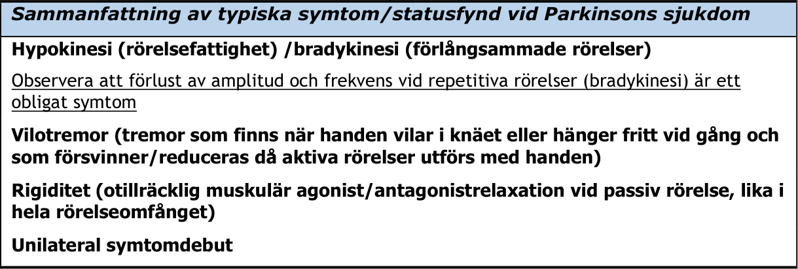

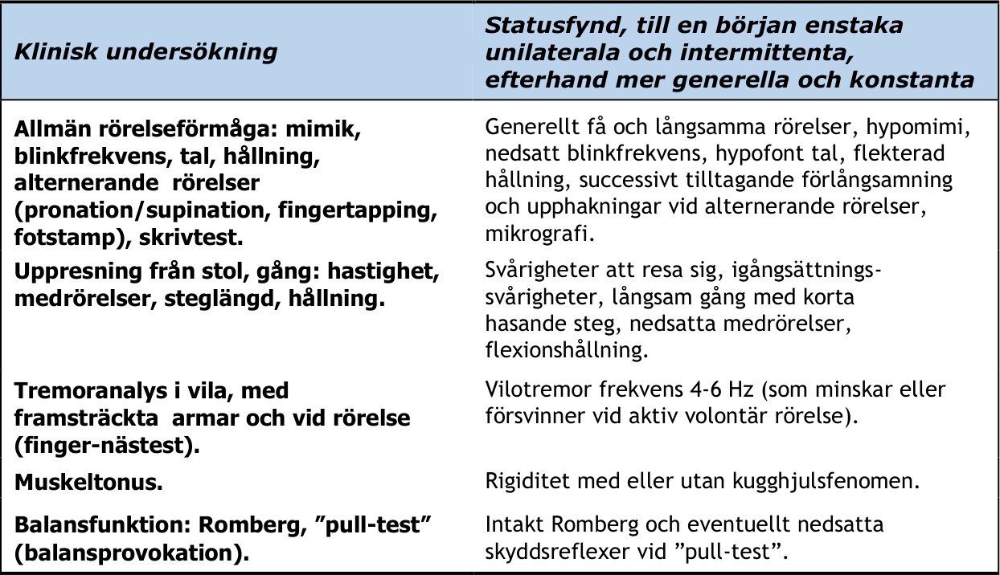

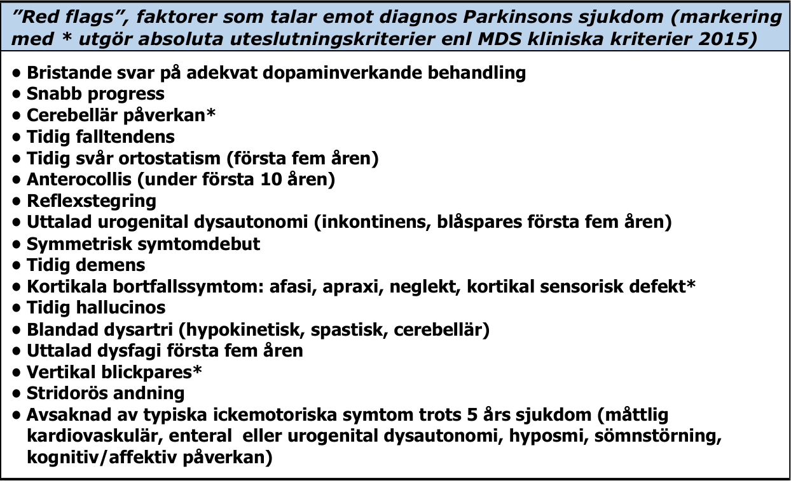

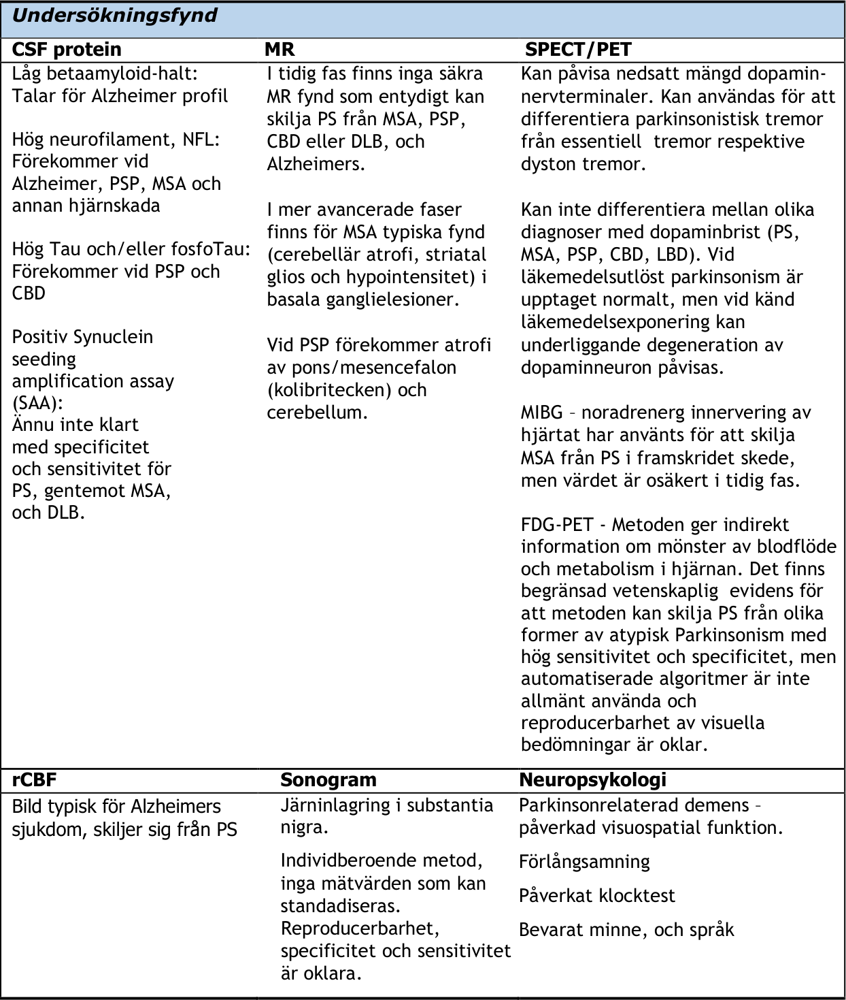

###### **Utredningsgång/diagnostik/tidpunkt/var/vem?**

Diagnostiken av basalgangliesjukdomar är till stor del klinisk – igenkännande och påvisande av symtom– brady/hypokinesi, rigiditet eller vilotremor och bör leda till vidare undersökning med avseende på ytterligare symtom
och orsaksfaktorer. Patienterna bör undersökas upprepade gånger, dels med avseende på progress (om
progressen inte är uppenbart typisk från anamnes), dels efter behandlingsförsök, med uppföljning av
effekter.När parkinsonism konstateras eller misstänks bör patienten bedömas av läkare med erfarenhet av PS.
Fullständigt neurologiskt status skall göras och anamnes inhämtas för att identifiera parkinsonism och
exklusionskriteriefynd, samt stödjande och motsägande faktorer, för PS.

Inga enskilda undersökningar eller laboratorieprover kan entydigt fastställa PS. Flera undersökningar görs främst
för att utesluta andra tillstånd.

_MR bör enligt nationella riktlinjer användas för att utesluta strukturell sekundär parkinsonism (prioritet 4,_
_PD4)_

Ett flertal MR-protokoll har föreslagits ge diagnostisk information avseende andra parkinsonistiska tillstånd men
inget möter idag upp till EBM-krav på att i tidigt förlopp kunna identifiera PS i relation till andra tillstånd.

Ultraljudsbestämning av ekogenicitet i mellanhjärnan är en teknik under utveckling men som inte har validerats
fullt ut. Enligt en nyligen genomförd EBM litteraturgenomgång finns det fortsatt inte underlag för att inkludera
metoden i rutinklinik och metoden räcker ännu inte för att ställa diagnos. Då metoden är enkel, billig och med
potentiellt stort användningsområde pågår studier vad gäller sensitivitet och specificitet.

SPECT-undersökning kan göras för att avgöra om störning av det presynaptiska dopaminsystemet och/eller det
postsynaptiska systemet föreligger. Pre-synaptisk SPECT (exv DaTSCAN) undersökning kan differentiera PS mot
ET. Vid frågeställning DLB mot Alzheimers sjukdom är SPECT-analysen också diskriminativ. Hos en symtomatisk
patient talar en normal presynaptisk SPECT undersökning emot PS och annan degenerativ parkinsonism. I dessa
fall kan symtomen förklaras till exempel av läkemedelsframkallade tillstånd, vaskulär parkinsonism eller
normaltryckshydrocefalus. Analys av lateralitet och selektiv degeneration i putamen kan ge viss indikation på PS
i kontrast till atypiska parkinsonism-tillstånd men sensitiviteten är relativt låg och i praktiken bidrar
presynaptisk dopaminerg avbildning inte nämnvärt till diagnostik vid misstanke om atypisk parkinsonism utan bör
förbehållas situationer där det är svårt att kliniskt värdera om det finns parkinsonism med degenerativ orsak.
Det prediktiva värdet av postsynaptisk undersökning med SPECT är lågt efter någon form av dopaminverkande
behandling.

De nationella riktlinjerna betonar att värdet av presynaptisk SPECT framför allt finns vid kliniskt svårvärderade
symtom (NR PD6): _Hälso- och sjukvården bör erbjuda FP-CIT-SPECT-undersökning för att mäta aktiva_
_dopaminnervceller till personer med kliniskt svårvärderat parkinsonsyndrom._

PET kan kvantitativt mäta enzymaktivetet (18F-fluorodopa) och dopamintransportörer (DAT, 18F-/11C-PE- 21).

Regional glukosanvändning (18F-FGD-PET) kan vara av värde för att diagnostisera atypisk parkinsonism. MSA-p/-c
har typiskt med FDG-PET påvisbar sänkning av signal i cerebellum, striatum, och mellanhjärnan (tidigare än MR
förändringar). Vid MSA ses ofta sänkt upptag i putamen, där det vid PS ofta istället är normalt eller ökat, och för
CBD/Kortikobasalt syndrom (CBS) är unilateral kortikal minskning kring centralfåran en viktig relativt tidig
signaländring.

_Undersökning med FDG-PET vid misstanke om atypisk parkinsonism bedöms vara av så stort värde att den har_
_fått prioritet 3 i de nationella riktlinjerna (NR PD5)._ Tillgången till undersökningen har varit begränsad men
ökar.

Utveckling av PET undersökningar för 18F/11C--Tau, 18F/11C-Amyloid pågår med syfte att diagnosticera andra
neurodegenerativa sjukdomar med inlagring av felveckat protein. PET för alfa-synuklein är inte tillgängligt ännu.

MIBG-SPECT kan användas för att mäta grad av innervering av noradrenerga fibrer i hjärtat och kan skilja MSA
från PS, vanligen dock först vid mer avancerad sjukdom. Värdet av undersökningen för tidig diagnostik är inte
klarlagt.

Likvordiagnostik för nervskademarkörer (tau, fosfo-tau, neurofilament, beta-amyloid) kan bidra till diagnostik av
atypiska former av parkinsonism, eftersom patologiska nivåer av nervskademarkörerna talar för annan diagnos
än PS. Falskt negativa fynd kan dock förekomma tidigt i sjukdomarna, och för PS har inga markörer varit
påvisbara. Analys av alfa-synuklein i CSF har de senaste åren genomgått en snabb utveckling. alfa-Synuklein
seeding amplification assay (SAA) uppvisar en hög sensitivitet och specifitet för att skilja PS ifrån friska
kontrollpersoner. SAA ingår i förslag för biomarkör baserad diagnostik av PS, men används inte i klinisk rutin.
Kinetiken för SAA skiljer mellan PS och MSA, men ytterligare validering för denna differentialdiagnostik krävs.

_För diagnostik av atypisk Parkinsonism anses neurofilament i likvor ge värdefull information för_
_differentialdiagnostik mot PS och undersökningen har prioritet 4 i NR (NR PD7)._

Ett akut levodopa-, eller apomorfintest har använts för att påvisa medicineringseffekt. Ett flertal
parkinsonliknande sjukdomsstillstånd förbättras i akuta farmakologiska test och testet är i sig inte
diagnostiskt. _Ett test kan vara falskt negativt tidigt i förloppet och akut levodopa-, eller apomorfintest i_
_diagnostiskt syfte är därför ”icke-göra” enligt de Nationella Riktlinjerna (NR PD2)._

Däremot kan ett levodopatest med cirka 200 mg levodopa (dosen anpassad efter individ) senare i sjukdomsfasen
tillföra kliniskt värdefull information om profilen av svar och dess omfattning, och kan också vara prediktivt för
effekten av subtalamisk deep brain stimulation.

Två-tre månaders behandling med dopaminverkande medel har högre prediktivt värde jämfört med ett akut
endos-test tidigt i förloppet.

Defekt luktsinne är överrepresenterat, 25-97%, vid basalgangliesjukdomar men för närvarande är det inte
prediktivt för specifik sjukdom inom gruppen.

Påvisande av REM Sleep Behaviour Disorder, RBD, anamnestiskt eller via riktad undersökning styrker misstankar
om basalgangliesjukdom. Prevalens av RBD är upp till 50% vid PS och mer än 90% vid MSA och CBD, men det är
inte prediktivt för någon specifik sjukdom inom gruppen.
###### **Genetisk testning vid Parkinsons sjukdom/Parkinsonism**

PS har en betydande genetisk komponent och ett större antal genetiska risk- och även skyddsfaktorer har
identifierats som i kombination med varandra och med miljöfaktorer antas förklara varför en person utvecklar
sjukdomen. Omkring 10-20 % av alla personer med PS har minst en första- eller andragradssläkting som också har
PS. Förekomst av PS är ökad hos tvillingar till personer med PS.

Inom sjukvården kan det – dock enbart för särskilda patientgrupper – vara indicerat att genomföra gentestning.
Sådan gentestning avser inte ovan nämnda genetiska riskfaktorer utan monogenetiska former av PS. Det finns ett
fåtal etablerade monogenetiska former av PS, med recessivt och dominant nedärvningsmönster. Överlag är alla
dessa sällsynta eller mycket sällsynta. Frågeställningarna nedan redovisar vid vilken klinisk bild gentestning kan
vara indicerad. Mer detaljer finns i bilaga IV, bland annat om vilka test som rekommenderas, och huruvida
testresultatet kan påverka den kliniska handläggningen.

Allmän genetisk screening av alla Parkinsonpatienter rekommenderas däremot inte idag. Inte heller
rekommenderas idag gentest som stöd för val av avancerad terapi.

**När gentesta?**

Symtombild och förlopp skiljer sig mellan de enskilda monogenetiska formerna av PS. Om sådan form
identifieras kan bättre information om långsiktiga prognosen kan ges och utredning och uppföljning bli mer
målinriktad. Läkemedelsbehandlingen kan anpassas, och för en specifik form vanliga delsymtom kan adresseras
tidigare. Även ärftlighetsgången skiljer sig; patient och familj kan få information om sjukdomen riskera
överföras till nästa generation eller inte. Kliniska behandlingsstudier pågår i olika stadier även i syfte att
påverka LRRK2 funktion eller ackumulering av alfa-synuklein proteinet.

I bilaga IV finns råd om genetisk provtagning och rådgivning av vikt att ta ställning till innan utredning påbörjas.

### V. Läkemedelsöversikt
#### Levodopa

Levodopa ges alltid i fast kombination med en perifert verkande dekarboxylashämmare och är den mest
effektiva medicinen mot PS. Detta bekräftas av omfattande klinisk erfarenhet och ett antal jämförande
studier med levodopa och andra preparatgrupper.

_Behandling med levodopa har mycket stor effekt på viktiga effektmått såsom motorisk funktion och aktiviteter_

_i dagliga livet och har prioritet 1 vid behandling av Parkinsons sjukdom från och med tidig fas (NR, PD11)_ .

**Farmakologiska egenskaper**

Levodopa är en prekursor till dopamin och kan till skillnad från dopamin passera blod-hjärnbarriären. Av en
peroral dos är det ca 10% som passerar blod-hjärnbarriären när levodopa ges med dekarboxylashämmare.
Halveringstiden i plasma är kort, ca 1,5-2h. Tiden till tillslag varierar beroende på beredningsform. Inhalerat
levodopa (Inbrija®) kan ge effekt inom 5-10 min. Dispergerat levodopa (Madopark Quick® och Flexilev®) kan ge
effekt inom 20 minuter och nå maximal effekt inom en timme efter intag, medan effektstart kan dröja upp till
en timme med vanliga tabletter. Upptaget av levodopa sker huvudsakligen i tunntarmen och kan fördröjas vid
sen ventrikeltömning. Eftersom upptaget sker genom aktiv transport med aminosyratransportörer kan samtidig
proteinrik måltid hämma upptaget med ca 30% vilket är signifikant för vissa patienter. Det har dock inte
betydelse för alla patienter, och generella råd om tid mellan levodopa-intag och mat kan därför vara en onödig
inskränkning i vardagslivet. Utöver dekarboxylering till dopamin kan levodopa brytas ned av enzymet COMT.
Levodopa (och dopaminagonister) har utöver direkt-effekt också en långtidseffekt (long duration response), som
uppstår efter veckors behandling, och avtar inom veckor efter att man slutar tillföra preparatet.

**Beredningsformer/preparatöversikt**

Det finns konventionella tabletter, dispergerbara tabletter, depot-tabletter, och depotkapslar. Europeiskt
godkännade finns också för en inhalationsberedning (Inbrija®). Levodopa/karbidopa kan också ges kontinuerligt
som enteral gel direkt i tunntarm via en perkutan gastro-jejunal sond (Duodopa [®] eller Lecigon [®] ), eller som
levodopa/karbidopa prodrug foslevodopa/foskarbidopa (ProDuodopa [®] ) subkutant, till patienter med besvärliga
symtomfluktuationer. För patienter med lågt dygnsbehov av levodopa och samtidigt förekomst av besvärande
fluktuationer finns även möjlighet till individualiserad oral dosering med mikrotabletter levodopa/karbidopa
(Flexilev®) som administreras från en dosautomat upp till 16 ggr per dygn.

**Praktiska råd angående farmakologisk behandling med levodopa**

Behandling med levodopa ökar den förväntade livslängden hos patienter genom att följdtillstånd till PS kan
undvikas, men behandlingen bidrar också till utveckling av terapikomplikationer, särskilt dyskinesier.

Förutom tabletter med levodopa/dekarboxylashämmare finns det två depotvarianter med benserazid respektive
karbidopa (Madopark Depot®, Levocar®). Dessa används huvudsakligen för att åstadkomma längre effekt
nattetid eftersom biotillgängligheten av dessa preparat är för variabel för att fungera tillförlitligt dagtid.

Därutöver finns det dispergerbar levodopa (Madopark Quick® och Flexilev®). De lösliga tabletterna har, när de
intas upplösta i vätska, en kortare anslagstid, men trots det en snarlik verkningstid. De kan användas som vidbehovs-terapi och för att åstadkomma en snabb effekt på morgonen eller under natten. Snabbt upptag av
levodopa kan gynnas av kolsyrad vätska.Inhalationsbehandling med levodopa (Inbrija®) är avsedd som
tilläggsbehandling för tillfälliga OFF-episoder och förutsätter behandling med dekarboxylashämmare. En
inhalator medföljer i varje förpackning av Inbrija®. Dosen per OFF-episod är 84 mg, som administreras via två
kapslar som vardera innehåller 42 mg levodopa. Vid varje OFF-episod ska båda kapslarna inhaleras direkt efter
varandra, vilket resulterar i en total inhalerad dos på 66 mg levodopa (2×33 mg). Den maximala
plasmakoncentrationen är snabbare än med levodopa/karbidopa i konventionell peroral beredning.Den perorala
levodopabehandlingen påbörjas vanligen med 50 mg per dos och den dagliga dosen höjs sedan långsamt (50-100
mg/v) till lägsta effektiva dos. Undvik dispergerbar beredning som startbehandling eller regelbunden
behandling.

I tidiga sjukdomsstadier ligger den lägsta effektiva dosen [1] vanligen mellan 150 och 600 mg per dag och fördelas
på 3-4 dagsdoser. Innan man konstaterar avsaknad av levodopa-svar bör ett behandlingsförsök med upp till 800
mg per dag under minst tre månader genomföras. Ytterligare diagnostiska tester kan behövas för att exv
konstatera MSA eller annan basalgangliesjukdom. I senare sjukdomsstadier kan det bli nödvändigt att ge över
1000 mg.

1 _Levodopa doseras vanligen inte i relation till kroppsvikt, men vid mycket låg eller hög vikt kan dos behöva anpassas. 300 mg motsvarar för_
_en 70 kg man drygt 4 mg/kg, men samma dos till en 45 kg kvinna motsvarar ca 6,7 mg/kg/dygn. Tröskelvärden för dyskinesier har_
_uppskattats till 10±4 mg/kg för män, medan kvinnor tycks ha signifikant lägre tröskel 8±4 mg/kg (Sharma et al. 2008)_

Det är viktigt att även yngre patienter får effektiv tidig behandling, men eftersom yngre patienter har större risk
för motoriska fluktuationer bör höga enskilda doser av levodopa undvikas. Uppkomst av motoriska fluktuationer
kan fördröjas men inte förhindras med dopaminagonister, men användande av depot-beredningar eller tillägg av
entacapon har inte visats fördröja motorfluktuationer.

Levodopas vanligaste biverkningar vid nyinsättning är illamående och ortostatisk hypotension. För att undvika
detta kan man långsamt trappa in levodopa med lägsta möjliga dos, och/eller utnyttja den perifert verkande
dopamin-receptorantagonisten domperidon, Domperidon Ebb ® 10mg 3 ggr dagligen. En kort tids behandling (en
vecka) är vanligen tillräckligt för att dessa obehag skall reduceras. Domperidon har kopplats till ökad risk för
allvarliga hjärtrytm-rubbningar. Därför rekommenderas numera max 10 mg 3 gånger dagligen och bara en kort
behandlingstid. EKG bör utföras inför insättning. Domperidon ska ej ges till personer som har risk för, eller redan
har, förlängd hjärtöverledningstid, hjärtsjukom, behandlas med potenta CYP3A4-inhibitorer, eller har allvarlig
leversjukdom. Andra medel som metoklopramid ger vanligen alltför kraftig anti-dopaminverkande effekt varför
det är olämpligt. Förutom dyskinesier, ortostatism och fluktuationer är psykiska biverkningar det största
problemet vid behandling av avancerad sjukdom, framför allt hallucinationer och andra psykotiska reaktioner (se
Bilaga II: Praktiska handlingsplaner vid akuta tillstånd).Vid behandling med inhalerat levodopa är
andningssymtom såsom hosta, färglöst sputum, irritation i halsen och yrsel är de mest frekvent rapporterade
biverkningarna. Träning av patient och anhöriga i rätt inhalationsteknik kan minska risken för andningssymtom
och öka behandlingseffekten

**Levodopabaserad infusionsterapi**

Subkutan administration av levodopa/karbidopa prodrug foslevodopa/foskarbidopa (Produodopa®) eller
intrajejunal administration av levodopa/karbidopa-gel (Duodopa [®] ) alternativt levodopa/karbidopa/entakapongel (Lecigon®) via PEG med bärbar pump kan övervägas hos patienter i fluktuationsfas som har besvärande
symtomfluktuationer trots optimerad peroral terapi. Därigenom uppnås en mer konstant plasmakoncentration av
levodopa jämfört med peroral terapi, vilket kan leda till stabilisering av symtombilden. För mer information om
dessa behandlingar se avsnittet ”VIII. Avancerad behandling ” eller ScandMODIS konsensusdokument för
[användning av Duodopa® på www.swemodis.se.](http://www.swemodis.se/)
#### Dopaminagonister

_Dopaminagonister rekommenderas för behandling av tidig Parkinsons sjukdom (prioritet 3, NR PD10)_

Risken att utveckla dyskinesier är låg under monoterapi med agonister men den symtomatiska effekten är lägre
än med levodopa. Uppkomst av dyskinesier förhindras inte av dopaminagonister och behandlingen har större
biverkningsfrekvens än levodopa. _Tillägg av dopaminagonist när patienter med Parkinsons sjukdom börjar erfara_
_symtomfluktuationer kan reducera off-tid, förbättra Activities of Daily Living (ADL), motorsymtom och_
_reducera behovet av levodopa (prioritet 2, NR PD17)_

**Farmakologiska egenskaper**

Dopaminagonister stimulerar dopaminreceptorer genom en direkt agonistisk effekt. Effekten är inte selektiv för
centrala nervsystemet (CNS) och perifera biverkningar tenderar att vara mer uttalade än med levodopa.
Preparat har inte lika stor antiparkinsoneffekt som levodopa. Effekten av olika preparat är likartad, med
undantag av apomorfin som kan ha bättre effekt än övriga agonister. Dopaminagonisterna har effekt i
monoterapi. I randomiserade kontrollerade studier med olika dopaminagonister har man inte funnit bevis för
neuroprotektiva effekter. Dopaminagonisterna har en relativt likartad antiparkinsoneffekt, men det finns
individuella variationer i kliniska effekter och biverkningar mellan olika preparat.

Viktiga skillnader mellan preparaten är galenisk frisättningsegenskap, biologisk halveringstid och olika effekter
på dopaminreceptorerna, med potentiellt olika kliniska effekter. En annan viktig skillnad gäller kemisk struktur –
tidiga generationer av dopaminagonister med ergotstruktur (bromokriptin, kabergolin) kan orsaka fibrotiska
förändringar i lungvävnad, lungsäckar, hjärtklaffar samt retroperitonealt. Det är sannolikt affinitet av
ergotstrukturen till en serotininreceptorsubtyp som leder till fibroblasttillväxt. Ergot-medlen rekommenderas
inte längre.

Dopaminagonister används både som monoterapi (ofta till yngre patienter) och som kombinationsterapi med
levodopa vid fluktuationer för att reducera tid i ”off”. Förutsatt att levodopadoserna kan reduceras, uppnås en

förbättring avseende fluktuationerna vid tillägg av agonister.

**Beredningsformer/preparatöversikt**

Rotigotin tillförs med plåster perkutant; apomorfin ges som subkutan injektion eller infusion; övriga agonister
ges peroralt. Rotigotin subventioneras endast för patienter med PS som behöver dopaminagonister och som inte
kan ta tabletter.

**Terapi med penna/pump: Apomorfin**

Apomorfin är den dopaminagonist som har en antiparkinsoneffekt som är mest jämförbar med endogent
dopamin. Apomorfinbehandling kan ges som subkutana injektioner med injektionspenna (apomorfin hydroklorid
10 mg/mL Apo-go Pen®, Dacepton®) eller subkutan infusion med infusionspump (apomorfinhydroklorid 5 mg/mL
infusionsvätska Apo-Go Pumpfill ®, Apomorfin PharmSwed ®, Dacepton®). För indikationer och mer information
se avsnitt ”VIII. Avancerad behandling ” samt ScandMODIS detaljerade behandlingsråd för apomorfinanvändning
(www.swemodis.se).

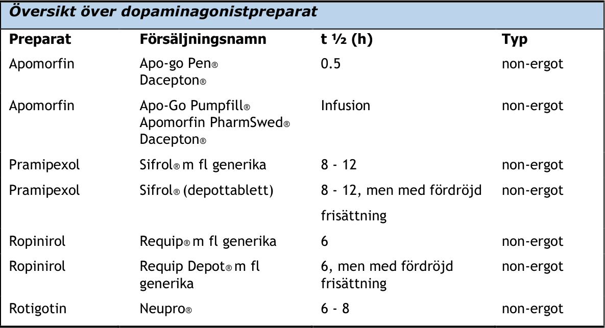

**Biverkningar**

Dopaminagonister har gemensamma perifera biverkningar: illamående, ortostatisk hypotension, yrsel och
perifera ödem. Risken för CNS-biverkningar som hallucinos är större än med levodopa.Särskilda
säkerhetsaspekter vid dopaminagonistterapi som också bör beaktas är impulskontrollstörningar, trötthet, och om
de äldre ergotpreparaten används även fibros, framför allt lungfibros och hjärtklaffsfibros.

_Impulskontrollstörning_

Kan uppstå vid all dopaminverkande behandling, men risken är större vid behandling med dopaminagonister än
med med levodopa. Impulskontrollstörningar kan ta sig uttryck som okontrollerat spelande, shopping,
hetsätning, ökat sexuellt intresse och utagerande, internet-användande och kan även vara förenat med
samlarmani, städmani, hobbyism. Risken för någon form av impulskontrollstörning vid behandling med
dopaminagonister har uppskattats till 10 - 15% vid prevalens- undersökningar. Prospektiva studier har visat att
nära 50 % av patienter som sätts in på dopaminagonister utvecklar impulskontrollstörning någon gång inom 5 år
och att förekomsten av impulskontrollstörning sjunker efter utsättning av dopaminagonist. Det är mycket viktigt
att identifiera impulskontrollproblematik tidigt, eftersom tillståndet obehandlat kan få förödande konsekvenser
för ekonomi och samliv. Man ska därför informera även anhöriga om dessa möjliga biverkningar eftersom de
sällan rapporteras av patienten förrän symtomen fått långtgående konsekvenser. Risken för
impulskontrollstörningar ökar med högre doser dopaminagonister och långvarig behandling. Risken har också
kopplats till yngre ålder, debut av Parkinson i ung ålder, att vara ensamstående, manligt kön, personlig eller
familje-anamnes på spelberonde eller alkoholism, impulsiva personlighetsdrag, pågående eller tidigare rökning
och hos kaffedrickare.

_Trötthet_

Sömnstörningar är ofta förekommande vid PS (se avsnitt Sömnrubbningar). Behandling med antiparkinson
21

mediciner kan förstärka dessa problem.

Om sömnrubbning korrigeras före start av behandling med agonist kan problemen minskas.

Det finns ett samband mellan dopaminagonistterapi och trötthet under dagen. Hos en del patienter kan denna
trötthet bli uttalad. När dopaminagonisterna kombineras med annan parkinsonmedicin förstärks ibland
tröttheten. När man startar dopaminagonistterapi och när doserna höjs ska patienterna därför informeras om
denna risk, inklusive att risken för att ofrivilligt somna under dagen är ökad. Framför allt bör man informera om
risken för plötsliga sömnattacker. Om sådana uppträder ska patienten inte framföra motorfordon. Risken för
trötthet är möjligen något högre med apomorfin, pramipexol och ropinirol, men finns vid behandling med alla
dopaminagonister och även annan dopaminverkande medicinering, inklusive levodopa. Patienter som uppvisar
påtaglig somnolens och/eller plötsliga sömnattacker skall informeras om att de bör avstå från bilkörning och
andra aktiviteter där sänkt uppmärksamhet kan utsätta dem själva eller andra för risker. När denna typ av
trötthet uppträder kan det löna sig att sänka dosen eller att prova en dopaminagonist med annan kemisk
struktur.

Varningstriangelmärkning har tagits bort från alla läkemedel och det är läkarens ansvar att informera, och
patientens ansvar vid framförande av fordon att bedöma om sin lämplighet att framföra fordon vid varje
tillfälle, se avsnitt XII Körkort.

_Dopamine Agonist Withdrawal Syndrome (DAWS)_

Om det finns behov av att reducera eller sätta ut en dopaminagonist på grund av biverkningar finns risk för
DAWS. Det är ett utsättningssyndrom som liknar abstinens och kan yttra sig med psykiska symtom av dysfori,
ångest, depression, suicidtankar, agitation/konfusion och kroppsliga symtom i form av illamående,
blodtrycksfall, generaliserad smärta och RLS. Syndromet är i de flesta fall övergående men kan vara mycket
långdraget och kan då lindras genom återinsättande av en låg dos av den aktuella agonisten. Att istället höja
levodopadosen hjälper inte mot DAWS. Störst risk att drabbas av DAWS anses personer med
impulskontrollstörning ha.

Utsättning av agonister bör ske gradvis. I de fall detta inte är möjligt och DAWS uppstår går det ofta att
återinsätta en låg dos av agonisten, men man måste då vara uppmärksam på risken att biverkan återkommer,
särskilt om det är en impulskontrollproblematik.

**Praktiska råd**

De långverkande formerna av pramipexol, ropinirol och rotigotin har främst fördelar vad avser
läkemedelshantering och sannolikt förbättrad compliance. De har föreslagits medföra mindre tendens till
impulskontrollstörning jämfört med kortverkande agonistberedningar, men det vetenskapliga underlaget är
otillräckligt.

Försiktighet bör iakttas om patienten är äldre och/eller har kardiovaskulär dysautonomi. Likaså om patienten
har en tidigare känd spelproblematik, eller annan impulskontrollstörning.

En vanlig observation är att insättning av agonister har en humörhöjande effekt, och pramipexol var det första
preparatet som i RCT visades ha effekt på depression vid PS.

Insättning av dopaminagonister bör ske långsamt för att reducera biverkningarna. Illamående brukar upphöra
efter en tids behandling, medan blodtrycksfall och perifera ödem ofta kvarstår. Om patienten har svårt att
tolerera insättning av agonist kan domperidon (Domperidon Ebb®) 10-mg x 3 användas en kort period under
beaktande av kardiella risker.

Det är god praxis att lämna skriftlig information om nyinsatta läkemedel och möjliga biverkningar och detta kan
vara särskilt viktigt när biverkningarna kommer smygande och kan misstolkas, vilket är fallet med
impulskontrollstörningar.

**Domperidon**

Domperidon är en perifer dopaminerg antagonist, som inte passerar blod-hjärnbarriären (i doser <100 mg), och
kan användas för att att minska dopaminreceptormedierade biverkningar. Den numera rekommenderade dosen
är 10 mg x 3, medan tidigare rekommenderades upp till 20 mg x 3.

Domperidon behövs vanligen endast under begränsad tid.

Ett antal fall av hjärtarytmier orsakade av domperidon har rapporterats och preparatet har därför belagts med
restriktioner avseende doser och behandlingstid. Domperidon är registrerat i Sverige men subventioneras bara
för patienter med PS.

EKG bör kontrolleras före insättning av domperidon för att utesluta långt QTc-intervall, samt under

behandlingen. Använd inte metoklopramid, som kan försämra parkinsonsymtomen.

#### COMT-hämmare

COMT-hämmare kan användas för att förstärka effekten av levodopamedicinering. Tiläggsbehandling med COMThämmare till patienter som har motoriska fluktuationer trots optimal behandling med levodopa har hög prioritet
(Prioritet 2, NR, PD19).

**Farmakologiska egenskaper**

COMT-hämmare bromsar metabolismen av levodopa och dopamin och förlänger därigenom effekten (L-dopa
ekvivalensdosen räknas vanligen upp upp med 33 % vid tillägg av entakapon och med 50% vid tillägg av tolkapon
eller opikapon till L-dopa terapi) samt ökar levodopakoncentrationen i hjärnan. För entakapon och opikapon är
effekten övervägande perifer, medan tolkapon även passerar blodhjärnbarriären och utövar viss central effekt.
COMT- hämmare minskar antal off-fluktuationer och tid i ”off”, samt ökar tid i ”on”. Avseende behandling av
dyskinesier med COMT-hämmare är evidensen otillräcklig. En direkt jämförelse av entakapon och tolkapon
visade ingen signifikant skillnad i effekt avseende detta. COMT-hämning tidigt i förloppet, hos patienter som
ännu inte har fluktuationer, har inte visats förebygga utvecklingen av dyskinesier eller fluktuationer.

**Beredningsformer/preparatöversikt**

Entakapon, Tolkapon och opikapon är de tre COMT-hämmare som är registrerade i Sverige eller centralt i Europa
via Europeiska läkemedelsmyndigheten (European Medicines Agency, EMA). Fasta kombinationer av levodopa,
karbidopa och entakapon finns på marknaden i form av tabletter (Stalevo®, Sastravi® mfl samt generika) och en
intestinal gel (Lecigon®). Opikapon (Ongentys®) är registrerat men ingår ej i läkemedelsförmånen.

**Praktiska råd**

Vid insättning av COMT-hämmare bör man beakta att max-koncentrationen av levodopa stiger, vilket kan leda
till ökade levodopa-relaterade biverkningar. Justering neråt av den totala dagliga

levodopadosen kan därför behövas. Detta kan uppnås genom sänkning av enskilda levodopadosers storlek
och/eller genom förlängning av doseringsintervallet. Beräkning av levodopa-ekvivalenta doser (LED) kan göras
med hjälp av webkalkylator som finns på SWEMODIS hemsida.

Vanliga biverkningar av COMT-hämmare är diarré (något vanligare med tolkapon än entakapon, och minst vanligt
med opikapon), men även förstoppning förekommer, därtill illamående, trötthet, hallucinationer och ortostatisk
hypotension.

Entakapon 200 mg kan tas tillsammans med varje levodopados, antingen separat eller som fasta
kombinationspreparat levodopa/karbidopa/entakapon. Kombinationspreparaten ger en praktisk fördel genom
färre tabletter och doseras efter levodopainnehållet. Ackumulering av entakapon vid upprepad dosering kan ske.
Den maximala rekommenderade dosen är 2000 mg/dygn. Tillägg till befintliga levodopadoser sker med fördel
successivt. Entakapon färgar urin och svett rödbrun.

Tolkapon doseras 100 mg 3 gånger dagligen. Det har en viss hepatotoxicitet, och är därför ett andrahandsmedel.
En förutsättning för tolkaponanvändning är att patienten inte svarat på eller är intolerant mot entakapon.
Transaminaser måste kontrolleras före start samt varannan vecka under de första 12 månaderna, därefter var
4:e vecka under 6 månader och därefter var 8:e vecka.

Opikapon doseras 50 mg en gång dagligen och kan enklast tas till natten tillsammans med sista levodopadosen. I
produktmonografin avrådes från att ta opikapon tillsammans med levodopa men det saknas någon bra
motivering till detta. Samtidigt matintag försämrar opikaponupptaget. Den totala dagliga levodopadosen kan
behöva sänkas när opikapon sätts in, även vid byte från entakapon.

#### MAO-B-hämmare

MAO-B-hämmare bromsar nedbrytningen av dopamin i CNS och har en viss egen symtomlindrande effekt, i alla
fall så länge man har en endogen produktion av dopamin.

_Vid tidig Parkinsons sjukdom bör vården erbjuda behandling med MAO-B-hämmare som monoterapi (Prioritet 3,_
_NR, PD9)._

_Även användning av MAO-B-hämmare i kombination med levodopa i tidig fas av sjukdomen är rekommenderat_
_(Prioritet 5, NR, PD13)._

Hos patienter med fluktuationer uppnås en stabilisering av symtomatologin med reducerad tid i ”off” med MAOB hämmare. Denna reduktion är jämförbar med effekten hos COMT-hämmare (entakapon och rasagilin
jämförda). Användning av MAO-B-hämmare vid Parkinsons sjukdom med fluktuationer har prioritet 2 (NR, PD16).

**Farmakologiska egenskaper**

MAO-hämmare hämmar enzymet monoamin oxidas som bryter ner aminer. Isoformen MAO-A har större affinitet
för serotonin och noradrenalin, medan dopamin har likartad affinitet till MAO-A och MAO-B. Substanser som
hämmar MAO kan vara irreversibla eller reversibla, och mer eller mer selektiva för respektive isoform av
enzymet. Irreversibla hämmare med betydande effekt på MAO-B har högre risk för biverkningar genom den så
kallade tyramin-effekten och för uppkomst av serotonergt syndrom. För behandling av PS används de irreversibla
MAO-B-hämmarna selegilin och rasagilin, samt sedan en tid även den reversibla MAO-B-hämmaren safinamid.

Safinamid utvecklades ursprungligen för behandling av epilepsi och kan genom affinitet till spänningskänsliga
natriumkanaler även påverka glutamatfrisättning. Man har därför framfört hypotesen att safinamid kan reducera
dyskinesier, men den kliniska betydelsen av detta är inte fastställd.

**Beredningsformer/preparatöversikt**

Selegilin (Eldepryl®) finns sedan tidigt 90-tal på marknaden. Rasagilin är liksom selegilin är registrerat för
monoterapi och tilläggsterapi.. Safinamid (Xadago®) är till skillnad från selegilin och rasagilin en reversibel
MAO-B hämmare och är endast registrerat som tilläggspreparat till levodopa.

**Praktiska råd**

Såväl rasagilin (1 mg/d) som selegilin (5 - 10 mg/d) och safinamid (50 - 100 mg/d) kan ges en gång dagligen. Med
selegilin och rasagilin byggs den MAO-B hämmande effekten upp gradvis under de första 7 - 14 dagarnas
behandling. Detta beror på en successiv irreversibel inbindning till MAO-B. En praktisk konsekvens av detta är att
biverkningar som uppkommer efter en tids behandling oftast inte går över spontant. Omedelbara biverkningar
som erfars timmarna efter dosintag i början av behandlingen kan dock vara övergående genom
toleransutveckling.

Under metabolismen av selegilin uppstår amfetaminprodukter som kan ge upphov till en del av dessa snabba och
tidiga biverkningar, framför allt avseende blodtryck, puls och psykiska biverkningar.

Rasagilin har inte dessa nedbrytningsprodukter och därför inte dessa biverkningar, vilket gör att rasagilin kan
användas till patienter där selegilin inte är möjligt, även hos äldre. Rasagilin har också mindre risk för
blodtrycksfall, men kan hos enstaka patienter ge upphov till angina-liknande symtom som går i regress efter
utsättning. En direkt jämförelse av effekten av selegilin och rasagilin är inte genomförd. Effekten av rasagilin
vid tilläggsbehandling är i paritet med entakapon.

Vanliga biverkningar av MAO-B hämning är illamående, ortostatisk hypotension och konfusion/hallucinos. En
ovanlig biverkan av samtidig användninga av serotonergt verkande läkemedel och MAO-B hämmare är
serotonergt syndrom. Detta är beskrivet för selegilin som därför inte skall kombineras med SSRI, SNRI, tricyklika,
petidin eller tramadol. Risken för serotonergt syndrom vid samtidig behandling med selegilin och antidepressiva
har retrospektivt uppskattats till 0,24%. Det finns mindre data för rasagilin och safinamid men dessa är båda mer
selektiva och risken är troligen mindre. De interaktionsvarningar som finns mellan dessa läkemedel och
fluoxetin, fluvoxamin och petidin bygger på observationer med selegilin. För safinamid saknas helt publicerade
fallrapporter av serotonergt syndrom även om det finns misstänkta fall rapporterade som biverkningar enligt
WHO. Sammantaget är risken för serotonergt syndrom med rasagilin eller safinamid liten om än inte helt

försumbar om de kombineras med antidepressiva. Safinamid är att föredra vid kombination med antidepressiva
eftersom den reversibla hämningen innebär att biverkningar upphör snabbare efter utsättning.

Patienterna bör informeras om att effekten av irreversibla MAO-B hämmare avtar successivt under flera veckor
efter utsättning.

Det finns experimentella data som talar för neuroprotektiva och sjukdomsmodifierande effekter av MAO-Bhämmare. För närvarande är neuroprotektion inte bevisad. Efter 5.5 år har tidigt insatt rasagilin visat bättre
symtomlindring än om behandlingen initierats senare. Långtidsstudier med selegilin som tillägg till L-dopa har
visat långsammare symtom-utveckling, lägre L-dopabehov och mindre dyskinesi- utveckling, jämfört med
placebotillägg.

#### Antidyskinesiläkemedel (NMDA-antagonister)

Amantadin verkar via NMDA antagonism och ev ytterligare mekanismer. Det finns evidens för en mild till måttlig
symtomatisk antiparkinsoneffekt av amantadin, både i monoterapi och i kombination med andra
parkinsonläkemedel. Det finns också evidens för att amantadin reducerar levodopa-associerade dyskinesier, och
amantadin används idag framför allt som antidyskinetikum. Doseringen varierar mellan 100 och 300 mg/d.
Amantadin elimineras till 90 % renalt. Hos patienter med nedsatt njurfunktion finns risk för ackumulering och
biverkningar. Vanliga biverkningar är hypotension, konfusion och psykos hos äldre, bensvullnad och livedo
retikularis (vidgade, ibland ömmande ytliga spindelnätsliknande kapillärer framför allt på benen).

Amantadin är registrerat i Sverige (Dinetrel®) som 100 mg kapslar, och kan erbjudas som tilläggsbehandling vid
motoriska fluktuationer (Prioritet 5, NR PD18). Om en patient har sväljningssvårighter eller får biverkningar av
100 mg doser, så kan amantadin förskrivas på licens som brytbara tabletter och ordineras som 50 mg doser.

På marknaden finns även memantin (Ebixa®), en NMDA-receptor-antagonist, utan antikolinerg effekt, som är
registrerat för mild-måttlig demens av Alzheimertyp. Det finns mycket begränsade data avseende om memantin
reducerar levodopainducerade dyskinesier, och det är i nuläget inte heller registrerat för användning vid
Parkinsondemens. Den kliniska erfarenheten är att läkemedlet kan fungera vid båda indikationerna, men att
utfallet är mer variabelt än med de mer etablerade behandlingarna amantadin, respektive
acetylkolinesterashämmare.

#### Antikolinergika

Centralt verkande antikolinergika (biperiden, Akineton® och orfenadrin, Norflex® samt trihexyfenidul, Artane,
licensmedel) tillhör de äldsta parkinsonläkemedlen.Det saknas moderna kontrollerade studier rörande deras
effekter. Klinisk erfarenhet talar för att de kan ha värdefulla sådana, framför allt hos patienter med
tremordominant symtomatologi eller dystoni. På grund av risken för perifera och centrala biverkningar är
användbarheten emellertid mycket begränsad och antikolinergika bör endast övervägas vid tremordominant
symtomatologi respektive svåra dystona tillstånd där annan terapi inte varit effektiv. På grund av den ökade
risken för psykiska biverkningar (framför allt konfusion), men även muntorrhet, ackomodationsstörning och
urinretention skall man vara försiktig med antikolinergika till äldre patienter. Detta avspeglas i de nationella
riktlinjerna där dessa preparat föreslås användas i undantagsfall (Prioritet 8, NR, PD 15) vid tidig sjukdom med
tremor.

Antikolinerga medel kan försämra gångförmågan med ökad ”freezing of gait” (FOG), och det finns rapporter med
långtidsuppföljningar av patienter som behandlats med antikolinerga medel för PS som visar en ökad risk för att
få en demens-diagnos, och där utsättning av dessa medel inte har lett till en förbättring av det kognitiva
tillståndet.

#### Vanliga interaktioner
###### **Läkemedel med dopaminreceptorhämmande effekt**

**Neuroleptika:** Hela gruppen N05A förutom N05AH02 klozapin och N05AH04 kvetiatipin är kontraindicerade på
grund av extrapyramidal biverkan.

**Övriga medel med dopaminreceptorhämmande effekter:** Metoklopramid, Propavan® (propiomazin).
###### **Medel som ger sämre upptag eller annan minskad levodopa effekt**

Framförallt vid regelbundet bruk. Information till patienten är viktig men det finns inga generella
kontraindikationer.

**Antacida:** Gaviscon®, Novalucol®, Novaluzid®, taget under lång tid.

**Järn** : Peroral järnmedicinering kan försämra det intestinala upptaget av levodopa. Problemet kan till viss del
minskas genom att peroralt järn administreras till natten eller med intag så långt i tid skilt från levodopaintag
som möjligt. Alternativt ges intravenös eller imtramuskulär beredningsform av järn.

Exempelvis: Injektion Venofer® 20 mg/mL, 5 mL intravenöst x 5 - 10, eller Cosmofer 50 mg/mL, 2 mL
intravenöst eller intramuskulärt.
###### **Medel som kan förstärka parkinsonsymtom eller biverkningar av** **antiparkinsonläkemedel**

**Läkemedel mot benign prostathyperplasi:** Alla alfa-1-receptorblockerande medel (alfuzosin, doxazosin,
terazosin) har en blodtryckssänkande effekt som kan bli symtomgivande vid PS med kardiovaskulär dysautonomi.
###### **Läkemedel med oklar/osäker effekt på parkinsonism**

Vid försämring av symtom i samband med insättning av annat läkemedel kan man misstänka läkemedelsorsakad
parkinsonism. Vanligast är då att läkemedlet har dokumenterad dopaminreceptorblockerande effekt eller
hämmar syntes/lagring av dopamin (exv reserpin, tetrabenazin, alfametyldopa).

En del preparat kan utlösa eller förstärka parkinsonism av mer oklara skäl. Hit räknas exempelvis de äldre
kalciumblockerade läkemedlen cinnarizine och flunarizine som inte är registrerade i Sverige. Det finns ett antal
fallrapporter som beskriver läkemedelsutlöst parkinsonism vid behandling med litium, oftast vid intoxikation,
men det har beskrivits även vid terapeutiska nivåer.

Valproat har också rapporterats kunna inducera parkinsonism, liksom fenytoin och det finns enstaka rapporter
även om levetiracetam-utlöst parkinsonism. En viss risk kan också finnas för verapamil.
###### **Speciella interaktioner**

**Ropinirol-warfarin:** Ropinirol kan öka effekten av warfarin (C1-interaktion).

**Ciprofloxacin-Ropinirol:** Ciprofloxacin kan hämma nedbrytning av ropinirol (CYP2A1) och leda till
överdoseringssymtom. (C1-interaktion).

**Östrogen-ropinirol:** Östrogen kan hämma ropinirols metabolism (CYP2A1) och ger eventuellt högre
koncentration av ropinirol. Betydelsen är oklar (B0-interaktion).

**MAO-B-hämmare-serotonerga preparat** : Risk för serotonergt syndrom. Se avsnitt om MAO-B-hämmare ovan.
Kombinationen bör undvikas eller monitoreras noga. Selegilin har högst risk.

**Rökning:** Rökning minskar exponeringen för bland annat rasagilin, propranolol, klozapin, duloxetin. Detta har
troligen störst betydelse vid rökavvänjning.

**Amitriptylin:** Kan potentiera den blodtryckshöjande effekten av sympatikomimetiska preparat som etilefrin,
fenylefrin och noradrenalin, men även av perifert dopamin som bildas av levodopa.
###### **Läkemedel med varningar av liten eller obefintlig betydelse**

**Pyridoxin:** Pyridoxin (vitamin B6) har kategori C4 interaktion med levodopa, men endast om levodopa ges
ensamt utan perifer dekarboxylashämmare (benserazid eller karbidopa) och interaktionen saknar i praktiken
därför betydelse.

**Kolinesterashämmare:** Donepezil (Aricept®), och rivastigmin (Exelon® mfl), kan ge parkinsonism hos patienter

som inte har pågående antiparkinson-medicinering, men med pågående dopaminverkande behandling ses
vanligen ingen försämring och eftersom effekten av dessa läkemedel har klinisk betydelse vid Parkinsondemens
bör man inte avhålla sig från att använda dem av oro för ökad parkinsonism.

#### Levodopa-ekvivalenta dygnsdoser

Vid tillägg av andra dopaminverkande läkemedel än levodopa eller helt eller delvis byte av terapeutisk strategi
kan det vara värdefullt att ha en uppfattning om hur stor den totala dopaminverkande effekten blir.

Ett mått på dopaminverkande behandlingsintensitet är LED, levodopa-ekvivalenta doser och måttet LEDD,
levodopa-ekvivalenta dygnsdoser. Beräkningar av LED och LEDD baserar sig en metaanalys från 2023 (Jost et al.
2023). En sammanställning av beräkningsfaktorer finns tabellen nedan.

Det finns individuella variationer i hur patienter reagerar på dopaminagonister, MAO-B hämmare och COMThämmare varför beräkningarna endast utgör uppskattningar.

**LED-beräkningsfaktorer**

2) För total programmerad/given dos efter avdrag av 60 mg (3 ml) per ny förfylld spruta
3) Avseende mg foslevodopa
4) Multipliceras med LED för varje dos levodopa som ges inom 4h efter 200 mg entakapon (oftast totalt dos levodopa/dygn).
5) Multipliceras med LED för total dos levodopa som ges vaken tid.
6) Multipliceras med LED för total levodopados under dygnet.
7) Reguljär dygnsdos av rasagilin eller selegilin har en egeneffekt motsvarande ca 100 mg och safinamid motsvarande 150 mg

när det ges i tidig sjukdomsfas som monoterapi. I kombination med levodopa kan effekten sannolikt bli mer
proportionerlig till given levodopados eftersom MAO-B I har liknande effektivitet som COMT hämmare vid tilläggsterapi till
levodopa.
8) Vid kontinuerlig infusionsbehandling med apomorfin blir omräkningsfaktor mer osäker.

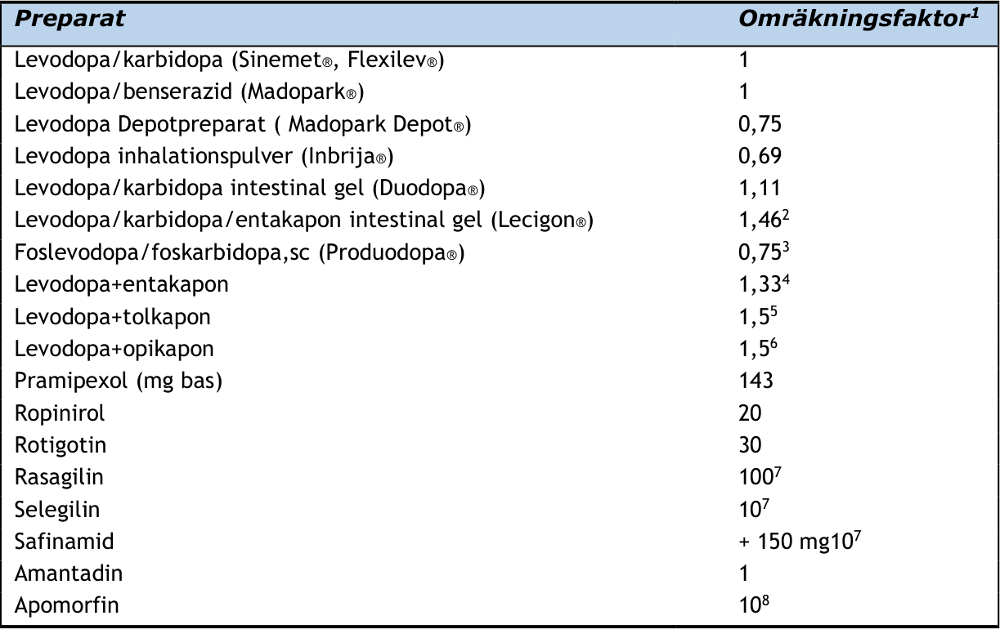
### VI. Behandling av motoriska symtom
#### Terapi tidig fas
###### **Bakgrund**

All behandling vid PS är symtomlindrande. Det finns ännu ingen kausal behandling som övertygande visats
upphäva eller dämpa nervcellsbortfallet. Tidpunkt för initiering av behandling har varit föremål för långvarig
diskussion. Det finns belägg för negativa kompensatoriska mekanismer som utvecklas under den tidiga
sjukdomsfasen, och tidig terapi, som ökar tillgängligheten av dopamin minskar denna negativa kompensation och
är gynnsam. Den nu förhärskande uppfattningen är därför att det inte gynnar patienten att fördröja
behandlingsstart och att behandling därför bör initieras så snart patienten uppvisar behandlingsbara motoriska
symptom med negativ effekt på livskvalitet. Hypokinesi är vanligen det mest handikappande symtomet, medan
vilotremor ofta stör anhöriga mer än patienter.

Flera studier har gjorts för att utvärdera om det har betydelse vilken behandling man startar med. Sammantaget
förefaller det som att start med levodopa har ett totalt sett något mer gynnsamt utfall när patienter
randomiseras mellan olika läkemedel. Man bör i detta sammanhang dock påpeka att de studier som finns har
studiepopulationer i lite högre åldrar och för riktigt unga patienter finns inte god evidens för vilket val som är
bäst. En rimlig generell princip är dock att välja tidig behandling och att vara öppen för att levodopa i allmänhet
har bredast symtomlindrande effekt.

Det är en vanlig missuppfattning bland patienter och vårdpersonal att antiparkinsonmedel endast hjälper under
några år. Detta är inte korrekt. Patienter med idiopatisk PS har även efter många år gynnsam effekt mot
parkinsonismen, om än inte lika god som initialt. Den enskilda dosens effekt blir däremot vanligen kortare och
marginalen till biverkningar minskar med sjukdomens progress. Det terapeutiska fönstret blir smalare med tiden,
men stängs inte vid PS, till skillnad från vad som är fallet vid vissa atypiska parkinsonismtillstånd. Vanligen
börjar symtomfluktuationer uppträda efter 3-7 år av sjukdom och det man först kan notera är off-symtom vid
uppvaknande och dosglapp 5-6 timmar efter intagen levodopa-dos. Inom loppet av några år kan detta utveckla
sig till kortare effektduration (nedåt knappa 2 timmar). Samtidigt med utveckling av dosglapp ökar också risken
för utveckling av hyperkinetiska, koreatiska dyskinesier (”överrörlighet”). Prediktorer för detta är låg
debutålder, låg kroppsvikt, kvinnligt kön, sjukdomsduration >3 år och högre levodopa-doser såsom doser över
450 mg per dag.

I Parkinsonsammanhang är av hävd en patient ung som insjuknar före 50 års ålder, och en äldre >75 år, med en
mellangrupp mellan 51-74 år. Gränserna är arbiträra.
###### **Terapiråd – yngre patient (<50 år)**

Diagnostik och terapistart av mycket unga patienter (<40 år) med misstänkt PS bör ske av läkare med speciell
förtrogenhet med denna grupp av patienter, i första hand neurolog med specialintresse för PS.

Är symtomen lindriga kan förstahandsmedlet vara en dopaminagonist, MAO-B-hämmare eller levodopa i låg dos.
Valet av behandling skall styras av vilka symtom som besvärar patienten mest, och risken för komplikationer på
sikt. Hos unga patienter skall man vara medveten om att risken är relativt hög för att utveckla hyperkinesier vid
levodopa behandling och impulskontrollstörning vid dopaminagonistbehandling. För bästa effekt av
farmakologisk behandling rekommenderas att den kombineras med riktad rehabilitering, särskilt fysioterapi och
fysisk träning, redan tidigt.

En strategi är att starta med ett medel, och relativt tidigt börja med kombinationsbehandling med
dopaminagonist, levodopa med COMT-I och MAO-B-I, med var för sig relativt låga doser, men med farmakologiskt
överlappande halveringstider och behandlingseffekter. Någon EBM-information om att denna strategi är
framgångsrik i att minska riskerna för utvecklandet av komplikationer respektive i att bevara funktionen finns
inte, men i en studie (PD-MED, Lancet 2014) där denna princip tillämpats var frekvensen av hyperkinesier klart
lägre än i tidigare historiska material med mer monoterapi levodopa.

Hypokinesi/bradykinesi är vanligen det mest handikappande symtomet. När symtom som förorsakas av
hypokinesi (till exempel nedsatt finmotorik i handen, bristande medrörelser av armen, korta steg) går i regress,
indikerar detta en lämplig första medicineringsnivå för levodopa. Tremor kan då fortfarande kvarstå i viss mån,
men dessa besvär minskar erfarenhetsmässigt med tiden även om behandlingen inte ändras. Är tremor mycket
besvärande kan tillägg av dopaminagonist göras. DBS bör övervägas vid farmakologiskt terapiresistent tremor.

|Förslag till behandlingsstart för ung patient|Col2|Col3|
|---|---|---|
|**Vid föga funktionshämmande** **symtom**|**Vid funktionshämmande symptom**|**Vid funktionshämmande symptom**|
|Start med MAO-B-I|Start med dopaminagonist|Start med levodopa|
|Selegilin, 5-10 mg/dag, med tillägg av levodopa eller dopaminagonist när så krävs för mer effektiv symtom-lindring. Rasagilin, 1 mg/dag Safinamid  50- 100 mg/dag, Några studier i monoterapi i tidig fas föreligger inte och subventionering utgår f n inte. MAO-B-hämmare har svagare antiparkinson-effekt än övriga alternativ. |pramipexol, 1-2 mg/dag eller ropinirol, 3-12 mg/dag, upptrappning enligt FASS. Har generellt något lägre symtomlindrande effekt och större risk för biverkningar (illamående, trötthet, benödem, psykisk påverkan, impulskontrollproblem) än levodopa. Vid tidig sjukdom kan effekten av dopaminagonister gynnas av  att det även finns endogen dopaminstimulering. Flera preparat kan behöva prövas. Dostitrera försiktigt. Utvärdera effekten – tillräcklig symtomlindring för patienten? Överväg tidigt komplettering MAO- B- I eller levodopa, ev med COMT-I. Patient och anhörig skall återkommande informeras om risk för impulskontrollstörning eftersom risken ökar med längre användning och högre doser.| Starta med 50 mg på morgonen och öka var tredje dag med tillägg av 50 mg tills dosen 50- 100 mg x 3-4 har uppnåtts. (lägre dos vid låg kroppsvikt och till kvinnor.) Utvärdera effekten efter en 1 månad. Var medveten om att effekten kan fortsatta att förbättras över flera månader på samma dos. Fortsatt upptitrering av doserna bör ske med försiktighet med tanke på risk för dyskinesier. Överväg tidigt komplettering med COMT-I, MAO B-I eller dopaminagonist. Undvik ”Quick-beredningar” som regelbunden behandling (utom vid sent anslag av medicin på morgonen).|

###### **Terapiråd – patient i åldersmässigt mellanperioden (50-75 år)**

Redan lindriga symtom bör föranleda farmakologisk behandling eftersom de oftast redan har någon negativ
effekt på livskvalitet. Man bör beakta att icke-motoriska symtom också kan förbättras av behandling och att
dessa ofta har stor effekt på livskvalitet. Förstahandsmedel är ofta levodopa i låg dos (≤400 mg delat på 3-4
doser). Beroende på symtomprofil och förutsatt avsaknad av riskfaktorer för beteende- eller kognitiv påverkan
kan dopaminagonist vara ett likvärdigt alternativ. Även MAO-B- hämmare kan användas som första behandling
vid milda symptom.

|Förslag till behandlingsstart för medelålders patient|Col2|Col3|
|---|---|---|
|**Vid föga** **funktionshämmande** **symtom**|**Vid funktionshämmande symtom**|**Vid funktionshämmande symtom**|
|Start med MAO B-I|Start med levodopa|Start med dopaminagonist|
|Selegilin, 5-10mg/dag, Rasagilin, 1 mg/dag|Fördela dygnsdosen levodopa på 3-4 tillfällen. Titrera upp dosen till klinisk effekt eller till 300 mg och invänta därefter effekt som kan ta flera veckor att utvecklas. I enstaka fall kan doser uppåt 600 mg under ett par månader krävas. Vid intolerans kan takten i upptrappningen sänkas. |Pramipexol, 1-2 mg/dag, Ropinirol 3-12 mg/dag, upptrappning enligt FASS. Vid intolerans (illamående, trötthet, ortostatism), sänk takten i dosupptrappningen eller byt preparat. |
|Safinamid 50-100 mg/dag, Några studier i monoterapi i tidig fas föreligger inte och subventionering utgår f n inte. |Safinamid 50-100 mg/dag, Några studier i monoterapi i tidig fas föreligger inte och subventionering utgår f n inte. |Safinamid 50-100 mg/dag, Några studier i monoterapi i tidig fas föreligger inte och subventionering utgår f n inte. |
|MAO-B-hämmare har svagare antiparkinsoneffekt än övriga alternativ. |Tillägg av dopaminagonist kan prövas om man inte uppnår tillräcklig symtom- reduktion med levodopa enligt ovan. Levodopadosen kan då ofta sänkas något.|Tillägg av levodopa skall erbjudas vid otillräcklig symtomreduktion med dopaminagonist.|

Uppmuntra till fysisk träning och anti-stressteknik. Hänvisa patient till fysio- och arbetsterapi och undersök
eventuellt hjälpmedelsbehov. Om svag eller utebliven effekt - ta ställning till om det finns depressiva besvär
som hindrar effekt och omvärdera även diagnosen.
###### **Terapiråd – äldre patient (> 75 år)**

Diagnostik av PS hos äldre patienter bör enligt rekommendationer i de nationella riktlinjerna främst handläggas
av neurolog eller geriatriker, om man har erfarenhet av sjukdomen. Samsjuklighet tilltar med stigande ålder och
är ett problem som måste beaktas både vid diagnostik och behandling av en äldre patient som misstänks ha PS.
De differentialdiagnostiska problemen beskrivs nedan, men diagnostiska problem kan också uppstå hos en äldre
person med stela leder, ospecifik tremor, avtagande minnesfunktioner mm.

Läkemedel mot PS kan ha god effekt också i högre åldrar under förutsättning att man beaktar de ökade riskerna
för biverkningar och interaktioner.

Hypokinesirelaterade symtom är de mest funktionshindrande hos äldre liksom hos yngre. God rörelseförmåga kan
vara helt avgörande för möjligheten till en oberoende livsföring, särskilt påtagligt för den äldre patienten. Av
alla tillgängliga läkemedel mot PS har levodopa störst möjlighet att reducera hypokinesi och vanligen lägre risk
för biverkningar än övriga farmaka.

Behandlingen i tidig fas hos en äldre parkinsonsjuk patient med funktionsinskränkande hypokinesi bör därför vara
monoterapi med levodopa. För en patient med mild symtomatologi kan även terapistart med MAO-B-hämmare
eller dopaminagonist övervägas med beaktande av att risken för många av biverkningarna är högre hos den äldre
patienten.

Man bör starta med en låg dos levodopa, 50 mg x 1, en dos som sedan successivt ökas till 3-4 doser per dag,
varefter de enskilda doserna ökas till cirka 100 mg. På en dygnsdos av cirka 300 mg efter 1-2 månaders
upptrappning ses ofta en god effekt på parkinsonsymtomen. Vid otillräcklig effekt på hypokinesisymtom, utan
besvärande biverkningar, kan levodopadosen ökas, dock sällan över 600 mg/dygn. I ett senare stadium med
fluktuationer får ställning tas till kombination med andra antiparkinsonmedel.

Den största risken för biverkningar hos äldre är konfusion, även om risken är mindre för levodopa än för andra
antiparkinsonmedel. Hos en vulnerabel patient kan konfusion uppträda redan vid en låg dos.

Risken är framför allt relaterad till patientens kognitiva funktionsnivå – en patient med avtagande
minnesfunktioner är i riskzonen. Hallucinationer kan vara biverkan till levodopa men då måste man också beakta
möjligheten av DLB med spontant uppkomna hallucinationer, som kan svara på behandling med
kolinesterashämmare. Patient och anhöriga bör vara uppmärksamma på uppträdande av nytillkomna psykiska
symtom och informeras om att dessa är reversibla efter dosjusteringar.

Levodopa kan orsaka eller accentuera en befintlig benägenhet för blodtryckssänkning i stående eller sittande.
Risken är dock mindre för levodopa och rasagilin än för dopaminagonister och för MAO-B-hämmare (främst
selegilin). Blodtrycksmätning i liggande och i stående (direkt och efter 2-5 minuter) bör utföras före och
regelbundet under all PS-behandling. En ortostatisk hypotension har störst konsekvenser för en patient med
kardiovaskulär sjukdom, där behandlingarna av hypertoni och PS bör ske med viss försiktighet. Om uttalade
ortostatiska blodtrycksfall förekommer tidigt i förloppet bör diagnosen omprövas.

#### Terapi vid begynnande symtomfluktuation
###### **Bakgrund**

Symtomfluktuationer innebär att parkinsonsymtomen återkommer periodvis under dygnet i form av dosglapp
(engelsk terminologi ”wearing off”). Dosglapp är nästan uteslutande kopplade till behandling med levodopa som
har snabb farmakokinetik. För de flesta patienter börjar symtomfluktuationer uppträda 3-5 år efter PS-diagnos.
Första symtomet är ofta ökad parkinsonism före intag av morgondos, men det gäller inte patienter som har god
sömneffekt (ca 30 % av patienterna). De upplever inte sällan att de istället mår som bäst när de vaknat. Det inte
alltid uppenbart för patienten att symtom under dagen är dosglapp. Inte sällan rapporteras bara att de upplever
mer trötthet under dagen. Ett bra sätt att efterfråga dosglapp är att höra om de upplever att något förbättras
inom en timme efter att de tagit levodopa. Mätning med aktigrafi (PKG, se bilaga) kan i vissa fall detektera
symtomfluktuationer innan de uppmärksammas av patienten. Hyperkinesier är en annan typ av
symtomfluktuation som i allmänhet inte uppkommer förrän patienterna haft diagnosen i mer än 3-5 år och först
när hjärnans lagringskapacitet för dopamin har reducerats så mycket att patienten också börjat få dosglapp.

Uppkomsten av hyperkinesier beror också på med vilken dos levodopabehandling pågått, då denna leder till
postsynaptiska förändringar som ökar känsligheten för läkemedlet. I början är hyperkinesier något som
uppträder när läkemedelseffekten slår till och särskilt om dosen är onödigt hög. Med tiden kan hyperkinesier
också uppkomma när patientens tillstånd övergår till ”off” och man ser då mycket snabba växlingar mellan
hyperkinesier och stelhet/långsamhet/tremor (s.k. on-off).
###### **Behandling av dosglapp**

Om underdoseringssymtom uppkommer sällan och oförutsägbart (högst en eller ett par gånger per dag) kan
tillfälliga extradoser av snabblösligt levodopapreparat (T. Madopark Quick Mite®, 25-50 mg) provas för att
motverka underdoseringssymtomen när dessa uppträder. Även intermittent behandling med
apomorfininjektioner kan övervägas. Patienten bör dock uppmanas att vara restriktiv med extradoser för att
undvika motoriska eller psykiska överdoseringssymtom.

När dosglapp uppträder mer regelbundet bör läkemedelsregimen modifieras enligt någon av strategierna nedan:

|Behandlingsförslag: Dosglapp|Col2|Col3|Col4|
|---|---|---|---|
|**Fraktionering**|**Enzymhämmare**|**Dopaminagonister**|**Nattbehandling**|
|Fördela dygnsdosen levodopa över fler medicineringstillfällen (dosfraktionering). Detta bör göras med beaktande av hur länge den aktuella dosen har effekt, vilket innebär att dygnsdosen kan behöva ökas något. Vid dosering tätare än 4 timmar behöver morgondosen ofta vara högre än övriga doser (t.ex. 125%)|Lägg till enzym- hämmare (COMT-I, MAO-B-I). Risk för ortostatism och psykisk påverkan. Vid  ca 400 mg  levodopa/dygn sällan behov för dosreduktion, men vid 600-800 mg/dygn ofta behov av sänkning för att undvika hyperkinesier/överdoseri ngssymtom. Använd gärna beräknade LED för vägledning, se bilaga.| Tillägg eller dosökning av långverkande dopaminagonist kan prövas, levodopa- dosen kan då samtidigt behöva sänkas för att undvika hyperkinesier och andra överdoseringssymtom. Intermittent apomorfin- injektion vid behov.|Vid återkomst av parkinsonism (underdoserings- symtom) nattetid. Prova tillägg av depot- levodopapreparat till natten, 100-200 mg, eller lägg till COMT-I till natten enbart. En långverkande enskild dos av dopamin- agonist, kan också vara effektivt.|

Insatser av fysioterapi och/eller arbetsterapi bör erbjudas.
###### **Behandling av hyperkinesier**

Första åtgärd vid hyperkinesier som besvärar patienten är att försöka sänka enskilda doser av levodopa och
farmakologiskt eftersträva så jämn dopaminstimulering som möjligt. Detta kan ske genom reduktion av
levodopadoser och ersättande av en del av levdopadosen med dopaminagonist om det är möjligt. Amantadin i
doser om 50-100 mg 2-3 ggr per dag reducerar överrörlighet för många, men tolereras ofta sämre av äldre
patienter. Amantadin kan minska dagtrötthet, men medför en ökad risk för konfusion p.g.a. antikolinerga
effekter. Insättning bör ske långsamt (minst en vecka mellan dosökningar) och utsättning skall inte ske abrupt
eftersom detta av oklara skäl kan leda till ett utsättningssyndrom med delirium och/eller malignt hyperpyrexisyndrom.
###### **Uttalade fluktuationer när avancerad behandling inte är lämplig**

För en andel av patienterna blir det gradvis svårare att få stabil behandlingseffekt. Om man behöver ge 5 doser
levodopa eller mer per dag, sjukdomen har pågått i mer än 3 år och pat har >1-2 timmar besvärande off per dag
bör man överväga avancerad behandling. I de fall detta inte är aktuellt kan situationen ändå optimeras i någon
mån med justering av konventionella terapier, eller med mikrotabletter av levodopa. I dessa fall är det viktigt
att även systematiskt värdera förekomsten av åtgärdbara icke-motoriska problem vilka ofta har stor betydelse
för livskvalitet, t.ex. sömnstörning, obstipation, urinblåsestörning, ortostatism, depression/ångest, smärtor och
kognitiv påverkan (se respektive avsnitt). Följande åtgärder kan motverka problem med uttalade
symtomfluktuationer:

|Behandlingsförslag vid svårbehandlade symtomfluktationer då avancerad behandling ej är lämplig|Col2|Col3|Col4|
|---|---|---|---|
|**Alternativ**|**Alternativ**|**Alternativ**|**Alternativ**|
|Vid uttalade motoriska ”on-off” problem|Vid uttalade motoriska ”on-off” problem|Vid uttalade motoriska ”on-off” problem|Vid förekomst av besvärandende hyperkinesier|
|Fördela levodopa- doserna till varannan timme under dagen (”hyperfraktionerad dosering”). Kortare intervall och mycket små doser är sällan meningsfullt. Ge stödmedicinering till eller under natten vid behov. För patienter som behöver låga doser levodopa kan finjustering med vattenlösliga minitabletter, (Flexilev®)  och användning av dosautomat som påminner om intagstider vara ett alternativ till pump. Flexilev subventioneras till patienter där konventionell tablettbehandling med levodopa inte längre är tillräckligt för kontroll av motoriska fluktuationer och där avancerad behandling inte är lämplig.|Ge tillägg av enzymhämmare (entakapon, tolkapon, rasagilin, safinamid). Selegilin   har ökad biverkningsrisk vid avancerad sjukdom och är svårt att använda/tolerera.|Prova vattenlöslig levodopa eller apo- morfinpenna som ”räddningsmedicine ring”|Uteslut överdosering. Tillägg av amantadin kan övervägas om ordinarie medicinering inte kan sänkas. Amantadin ökar risken för hallucinos. Vissa patienter är hjälpta av memantin som sällan försämrar kognition, men kan ge trötthet.|
|Vid frånvaro av kognitiva problem|Vid frånvaro av kognitiva problem|Vid kognitiva problem|Vid kognitiva problem|
|Prova att minska levodopadosen och öka dopaminagonistdosen. Agonistdoserna kan behöva fördelas över dygnet, alternativt ges transdermalt som rotigotinplåster.|Prova att minska levodopadosen och öka dopaminagonistdosen. Agonistdoserna kan behöva fördelas över dygnet, alternativt ges transdermalt som rotigotinplåster.|Minska medicinering (agonister, enzymhämmare). Sätt ut preparat med antikolinerg effekt. Överväg demensbehandling.|Minska medicinering (agonister, enzymhämmare). Sätt ut preparat med antikolinerg effekt. Överväg demensbehandling.|

#### Terapi mot svårbehandlade motoriska symtom

**Tremor**
Behandlingen av tremor bör inrikta sig på faktiska funktionshinder för arbete, störningar i ADL-funktioner
eller sömn. Man bör diskutera med patient och anhöriga vad som utgör problemet. Tremor som generande
symtom utan funktionshinder, bör man vara försiktig med insatser emot, då detta kan leda till överbehandling
i förhållande till andra funktioner med risk för snabbare utveckling av komplikationer. Tillfälliga belastningar
och stressframkallande episoder med tremor kan eventuellt behandlas med tillfälliga, icke-dopaminverkande
medel.

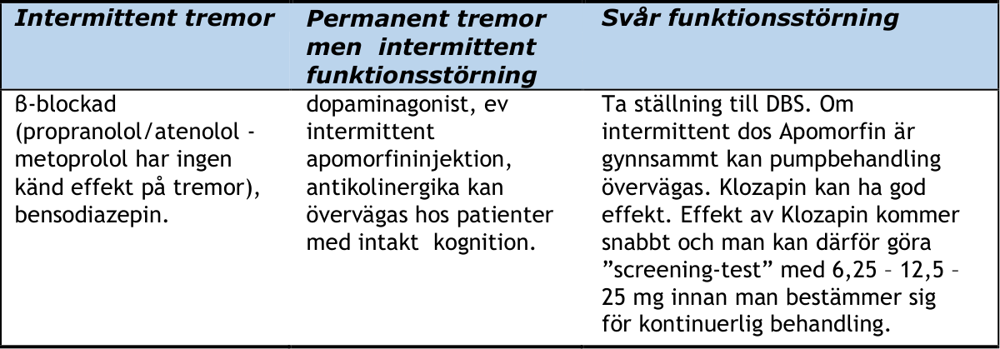

###### **Hypokinesi/rigiditet**

Behandlingen bör inrikta sig på faktiska funktionshinder för arbete, ADL - funktioner eller sömn. Man bör
diskutera med patient och anhöriga vad som utgör problemet. Tillfälliga belastningar och stressframkallande
symtom bör särskiljas. Förutsägbara dosglapp bör identifieras.

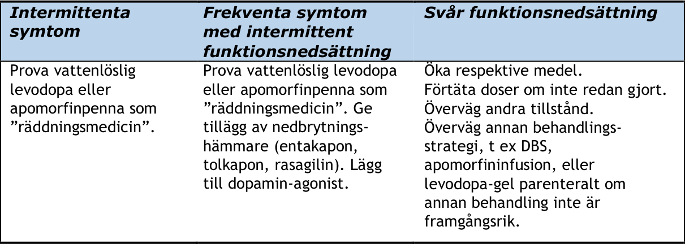
###### **Dystoni**

Med dystoni menas en ihållande kontraktion av en eller flera muskelgrupper. Dystonin är ofta smärtsam och kan
vara ett tidigt symtom vid PS eller förekomma under medicinvilan nattetid. Dystoniproblem är vanligare hos
yngre patienter. Dystoni svarar oftast väl på dopaminverkande behandling. I senare faser av sjukdomen kan
dystoni komma att provoceras av levodopabehandling. Om smärtsamma dystonier förekommer kan 1-4
injektioner per år, av botulinumtoxin fokalt i de dystona musklerna, vara effektivt.

Antikolinerga läkemedel, exv Artane ® (licensmedel) eller Norflex® kan lindra dystonier, men biverkningsrisker
måste beaktas. I svåra fall bör avancerade behandlingar som pump eller DBS övervägas.
###### **Gångsvårigheter, ”freezing of gait” (FOG) och balansosäkerhet**

Fenomenet är vanligt i senare fas av sjukdomen och då oftast som ”off-fenomen” under dosglapp, inte sällan
under en period strax efter det patienten tagit nästa medicindos. Här kan fraktionering eller övergång till mer
snabbverkande, vattenlöslig levodopa eller tillägg av apomorfinpenna övervägas.

FOG kan dock även förekomma som ett icke levodopa-responsivt symtom och är då svårbehandlat. Symtomet är
då ofta kopplat till vissa situationer, t ex passage genom dörröppningar. Det finns rapporter om att MAO-B-I har
en speciellt gynnsam effekt på ”freezing of gait” (FOG). Behandling med memantin och
acetylkolinesterashämmare har också i enskilda fall varit framgångsrikt. Fysioterapeuter kan ofta identifiera
visuella och ibland auditiva ”trick” som kan vara effektiva för att komma ur ”freezing” och som kan reducera
medicinbehovet. Det finns EBM fysioterapeutiska metoder som kan tillämpas. Arbetsterapeuter kan i hemmet
och på arbetet också identifiera situationer som ibland ger upphov till ”freezing” och som kan åtgärdas med
enkla medel, t ex handtag och markering med linjer på golvet.

### VII. Behandling av icke-motoriska symtom
#### Sömnrubbningar

Sömnstörningar är vanligare vid PS än i jämförbara kontrollgrupper. Olika undersökningar talar för en prevalens
mellan 60 och 98 %. Flera faktorer medverkar till detta. Det handlar om direkt parkinsonrelaterade orsaker,
andra åldersrelaterade orsaker, parallella sömnstörningar och depression, men också om biverkningar av
läkemedel. Till de vanligare sömnproblemen hör REM-sleep behavior disorder (RBD, ca 40 %), insomni (40 %),
mardrömmar (30 %), snarkningar (40 %), restless legs-symtom (RLS, 20 %) och somnambulism (5 %). Trötthet
under dagen är vanligare än i kontrollpopulationer och kan förstärkas av antiparkinson-läkemedel. Plötsligt
insomnande (Sudden onset of sleep) förekommer och kan förstärkas av antiparkinson-läkemedel. I vissa fall
handlar det om ett narkolepsiliknande fenomen (SOREM – Sudden Onset of REM sleep) där patienten plötsligt
somnar utan föregående trötthet, men vanligare är att patienten somnar efter en stunds trötthet. Dessa
fenomen bidrar till en ökad risk för att somna vid ratten under bilfärd (21 % hos patienter med PS, jämfört med
10 % i kontrollgrupper). Patienter med uttalad dagtrötthet eller insomningsattacker ska inte köra motorfordon.
###### **Insomni**

Åtgärder: Rådgivning om sömnhygien bör alltid övervägas. Vid insomni hos PS-patienten bör man analysera
möjliga orsaker och rikta terapin därefter. Är orsaken nattliga parkinsonsymtom kan man överväga
långverkande levodopapreparat och/eller dopaminagonister till natten, ev med fördel för långverkande
beredningar. Dopaminverkande medicinering kan motverka insomning och doserna kan därför behöva minskas
före sänggående. Selegilin ger upphov till uppiggande amfetaminliknande metaboliter, men är ett allt mer
sällan använt preparat.

Vid depression kan insomni vara ett symtom, men vanligare är tidigt uppvaknande. Antidepressivum med sedativ
effekt bör övervägas vid insomni kopplad till depression, t.ex. mianserin 10-30 mg eller mirtazapin 7.5-15 mg på
kvällen.

Vid mardrömmar kan det vara indicerat att minska antiparkinson-medicineringen kvällstid i första hand. Ibland
kan mardrömmar vara förenade med somnambulism och nattlig konfusion eller nattliga hallucinationer. I dessa
fall kan behandling med atypiska neuroleptika som kvetiapin eller klozapin vara av värde. Låga doser räcker ofta
(t.ex. 25-50 mg kvetiapin eller 12,5-25 mg klozapin).

Vid insomningsvårigheter utan tydlig åtgärdbar genes kan man vid tillfälliga besvär överväga kortverkande
bensodiazepinlika preparat som zopiklon. För längre tids behandling kan en låg dos mirtazapin (7.5-15 mg) eller
lågdos Mianserin 10 mg ½- 1 tablett till natten övervägas. Ett alternativ som ofta tolereras bra är melatonin.
Melatonin är registrerat utan förmånsberättigande för vuxna under flera preparatnamn med med stor pris
skillnad och som ett depot preparat med varunamn Circadin®.
###### **Symtomatisk Restless Legs Syndrome, RLS**

RLS definieras kliniskt som en obehagskänsla, i extremiteter, som kommer när personen ligger/sitter still,
framför allt under kväll/natt och förbättras vid rörelse. RLS kan vara en primär sjukdom eller uppstå sekundärt
till andra tillstånd. Symtomen är vanligen sekundära vid PS. Det är inte klarlagt om förekomsten av primär RLS
egentligen är högre hos Parkinsonpatienter. Patofysiologin vid klassisk RLS tycks involvera låga järn-nivåre i CNS,
medan PS snarare uppvisar det motsatta mönstret. Det finns inga belägg för att RLS-patienter har ökad risk att
utveckla PS. En sekundär orsak till RLS-symtom är att dopaminverkande läkemedel går ur kroppen och RLS kan
då närmast betraktas som ett abstinens-problem. Det faktum att RLS symtom startar senare i livet för PSpatienter och att förekomsten av RLS-symtom är korrelerad till hur länge man haft parkinsonmedicinering talar
för att problemet ofta är sekundärt till PS och PS-behandling.

Åtgärder: RLS vid PS kan behandlas som RLS i övrigt, men med hänsyn till att RLS kan utgöra ett ”off”- symtom.

Järnbrist eller lågt S-Ferritin ska uteslutas och vid behov ges järn (vid samtidig levodopabehandling kan
parenteral behandling med fysiologiskt järn övervägast.ex. inj. Monofer® 100 mg/mL im eller iv eller inj.
Venofer® 20 mg/mL iv). Om farmakologisk behandling behövs rekommenderas dopaminagonister till kvällen,
eventuellt i kombination med levodopa, med beaktande av att RLS i viss mån kan vara ett ”off”-symtom vid PS.
Perorala järn tabletter är mindre effektiva pga dess mindre fysiologiska egenskaper och har betydande
interaktion med L-dopa preparat.

I besvärliga fall kan gabapentin övervägas liksom pregabalin. Dessa har till skillnad från kombinationen
oxykodon/naloxon (Targiniq®) inte registrerad indikation RLS, men är sannolikt säkrare att använda. En strategi
för att undvika RLS är att uppnå snabb insomning, och för detta ändamål kan zopiklon fungera, eller i svårare

fall mer långverkande alternativ som t.ex. klonazepam (Iktorivil®).
###### **REM-sleep behaviour disorder, RBD**

REM-sleep behaviour disorder representerar ett tillstånd med intensiv motorisk aktivitet i form av rörelser i
extremiteter, tal och rop i sömnen, ofta i samband med hotfulla drömmar nattetid. Aktiviteten kan vara
kraftfull nog att orsaka skador på sängpartners, eller att man faller ur sängen, men i övrigt vid RBD lämnar
patienten inte sängen. Man har funnit att RBD är betydligt vanligare i samband med synucleinopatier, som PS,
MSA och DLB. Prevalensen av RBD vid PS ligger kring 30-50%. RBD-symtomen kan komma flera år före de
motoriska och kognitiva symtomen vid dessa sjukdomar. Flera studier har visat att >50% av personer med
idiopatisk RBD utvecklar neurodegenerativ sjukdom med synukleinopati inom 10-12 år.

Det strikta definitionen av RBD är sömnlaboratoriepåvisad avsaknad av muskulär atoni under REM sömnfasen. Det
finns frågeformulär för RBD, men överenstämmelsen mellan en enkel anamnes på utlevelse av drömmar med
motorisk aktivitet och verifierad RBD med avsaknad atoni, är mycket låg, ca 25%. Det förekommer livliga
drömmar och drömaktivitet under flera olika faser av sömncykeln som kan misstas för RBD.

Åtgärd: Man bör först utesluta att det rör sig om sekundär läkemedelsulöst RBD. Detta kan uppträda efter
nyinsättning av betablockerare, SSRI eller SNRI-preparat. Mirtazapin® eller Mianserin® kan prövas, men kan
liksom andra SSRI/SNRI-preparat också aggravera symtomen, vanligen vid högre doser 30 mg eller mer av
respektive medel.

Det preparat som är bäst dokumenterat för behandling av RBD-symtom vid PS är klonazepam, Iktorivil® (0.25-1
mg till natten). Nackdelen med klonazepam är en hög risk för konfusion och kognitiv påverkan. Ett säkrare, men
mindre effektivt alternativ är melatonin (se ovan). För vissa patienter minskar RBD när man sätter in parkinsonläkemedel som levodopa eller pramipexol, men de kan också öka.

#### Autonom dysfunktion
###### **Ortostatisk hypotension**

Definition: Ett systoliskt blodtrycksfall >20-30 mm Hg och ett diastoliskt blodtrycksfall >10-20 mm Hg i samband
med lägesändring, från liggande till stående och efter 3 minuter i stående, med subjektiva symtom. Postprandial
hypotension av motsvarande grad kan förekomma. Utebliven sympatikoton pulsfrekvensökning i samband med
lägesändring talar för neurogen hypotension eller kardiovaskulär autonom dysfunktion.

OBS! Ortostatiskt blodtryckfall kommer akut eller 2-5 min efter uppresning och kan missas om man bara mäter
tryck direkt efter uppresning. Parkinsonpatienter med ortostatism har ofta variabla blodtryck och det kan krävas
upprepade blodtrycksmätningar eller ett formellt tipp-test (görs av klinisk fysiologi eller klinisk neurofysiologi)
för att diagnostisera dessa fall.

Om signifikant ortostatisk hypotension förekommer tidigt i sjukdomen, kan detta vara tecken på atypisk
parkinsonism. Bidragande orsaker kan vara hypovolemi och läkemedel. Försämring av ortostatism ses ofta vid
infektion, särskilt UVI.

Ickefarmakologisk behandling: Eliminera eller behandla förvärrande och utlösande faktorer såsom
infektionssjukdomar, uttorkning och annat, följt av att se över samtidig medicinering (om
blodtryckssänkande medel används, bör dosreduktion eller utsättande eftersträvas). Fysisk aktivitet är viktig,
men av vikt är att man lär långsam uppstigning. Ökat saltintag. Små och mindre kolhydrathaltiga måltider.
Höjd huvudända på sängen (10-20 grader). Drycker med isotona salter och långsamma kolhydrater. Viktigt
med adekvat vätsketillförsel. Två glas vatten på morgonen kan påtagligt höja det systoliska blodtrycket och
förbättra patientens symtom. Snabbt intag av ett par glas vatten har en ”rescue”-effekt som kommer inom
10 minuter och varar i en timme. Stödstrumpor, eller hellre kompressionsbyxor, har bevisad effekt men kan
vara svåra att använda i praktiken då de måste kläs på i liggande. Även maggördel kan ha gynnsam effekt.
Undvik: Snabba uppresningar (från sittande/liggande). Värme, men också starkt solljus. Kraftig ansträngning.
Stora/kraftiga måltider. Alkohol.

Farmakologisk behandling: Undvik blodtryckssänkande medicin. Sympatikomimetikum (etilefrin, Effortil®),
mineralkortikoider (fludrokortison, Florinef®), alfa-2-agonist (midodrin, 5 mg upp till 45 mg/dag). Bloddoping i
extrema fall (transfusion), erytropoetin, med symtommiskning och EVF >45 % som riktvärde. I utvalda fall kan
licensmedlet Droxidopa (L-DOPS, en noradrenalin prekursor) vara effektivt i doser 100-600 mg x 3.

Pyridostigmin (Mestinon) kan förstärka ganglionär kolinerg transmission och därigenom förstärka den sympatiska
blodtrycksreflexen. Startdos 30 mg x 2, kan ökas till 60 mg x 3. Pyridostigmin höjer inte supint tryck.

Behandlingen har begränsad dokumentation och effekten är måttlig, men synergistisk effekt tillsammans med
sympatikomimetika har beskrivits. Noradrenalinupptagshämmaren atomoxetin har liksom pyridostigmin främst
effekt när patienten inte har uttalad sympatisk perifer denervation (t.ex. vid MSA) och ökar inte heller risken för
höga blodtryck i liggande. Atomoxetin har främst studerats i dosen 18 mg x 2. För läkemedelsbehandling av
nattlig hypertoni i liggande kan kvällsadministrering av klonidin, eplerenon, losartan, nitroglycerin (Imdur®)
eller sildenafil övervägas.

_I de nationella riktlinjerna har etilefrin och midodribehandling av ortostatism prioritet 3 (NR, PD37)_

_Behandling med fludrokortison har prioritet 5_

_och behandling med droxidopa prioritet 8 (kan erbjudas i undandtagsfall)._

###### **Värmereglering/Svettningar**

Bakgrund: Hos patienter med PS förekommer besvär av ”excessive sweating” och då oftast relaterat till den
drabbade kroppssidan eller dominerande i huvud-nackparti. Parkinsonpatienter har sannolikt inlagring av
Lewy-inklusionskroppar och cellförlust i hypothalamus som medverkar till störd värmereglering. Svettningarna
är medierade via efferenta sympatiska kolinerga fibrer. Oftast är svettningarna inte så uttalade men det
förekommer ”utbrott” av svettning som kräver flera klädbyten per dag hos drabbade patienter.

Behandling: Då besvären ofta är relaterade till ”off”-fas innebär en justering av levodopados eller DA- agonist,
med minskade fluktuationer, även en lindring av besvären med svettningar. Antikolinergika kan reducera
besvären eftersom den autonoma innervationen av svettkörtlarna sker via kolinerga postganglionära
sympatiska fibrer. Erfarenhetsmässigt är dock effekten relativt liten. Svettattackerna mildras med propranolol
(beta-adrenerga blockare) särskilt vid besvär i ”peak-dose”-fas. SNRI- preparatet mirtazapin med dess
antihistamineffekt har visat sig kunna lindra besvär med svettningar vid PS. Vissa läkemedel, såsom venlafaxin,
har hyperhidros som vanlig biverkan. Det är väl värt att undersöka om patienten står på något läkemedel som
har svettningar som vanlig biverkan.
###### **Oral hälsa**

Bakgrund: Parkinsons sjukdom innebär en funktionsnedsättning som kan påverka munhälsa. Omfattas både av
motoriska och icke motoriska symtom såsom käksmärta, salivering, muntorrhet, nattligt sötsug, digestion,
försvagad tuggförmåga, viktnedgång, svårighet att rengöra/borsta tänder pga nedsatt finmotorik el dyskinesier,
illasittande protes mm.

Behandling och åtgärd: Tidig kontakt med tandläkare och/eller tandhygienist och dietist för förebyggande
tandvård och regelbunden kontroll för att behålla den orala hälsan, förebygga karies, öka välbefinnandet,
bevara tuggmöjlighet, få kostråd och förhindra viktnedgång. Få råd om hjälpmedel vid tandborstning och råd om
tandvårdsstöd.
###### **Dregling, salivering**

Bakgrund: Svalgmuskulaturen är som alla andra muskler dopaminberoende för optimal koordination och
funktion. Upprepade sväljningsrörelser kan leda till uttröttning och mera symtom. Vid långvarig sjukdom hos
patienter med PS kan degeneration i hjärnstamskärnor intill substantia nigra bidra till sväljningssvårigheter och
påverkan av den autonoma innervationen av spottkörtlar leder till salivansamling, som inte sväljs undan ger en
ökad mängd saliv i munhålan och ofrivilligt rinnande saliv ur mungipan.

Behandling: Analys av när besvären kommer, oftast i ”off”. Optimerad antiparkinsonmedicinering är den
vanligen mest effektiva behandlingen. Remiss till logoped rekommenderas för bedömning

Och rådgivning/behandling. Kolsyrad dryck stimulerar gommens sväljningreflex, och råd att inte tala under
födointag underlättar motoriken. Genom att tugga tuggummi ökar sväljningsprocessen och det kan minska
obehaget ibland. När det inte går att justera medicineringen optimalt kan man pröva antikolinergika ev
lokalt i munhålan för att minska salivproduktionen, i form av ögondroppar Atropin 1% 1 – 3 droppar under

tungan inför måltider. Amantadin i doserna 100-200 mg dagligen, kan utöver minskade motoriska
fluktuationer reducera salivering genom antikolinerg verkan, men är förknippat med risk för konfusion.

_Behandling med botulinumtoxin mot salivering har i nationella riktlinjer fått hög prioritet (4, NR, PD32)._

Botulinumtoxininjektion i parotis- och submandibulariskörtlarna reducerar salivproduktionen och kan ha god
effekt på dreglingsproblematik. Injektionen ges med hjälp av ultraljudsguidning och upprepas inte oftare än var
16e vecka. Xeomin [® ] har till skillnad från övriga botulinumtoxinpreparat på svenska marknaden indikationen
kronisk hypersalivering till följd av neurologiska sjukdomar. Den dos som föreslås framgår ur FASS. Effekten mot
salivering blir effektivare när både parotis och submandibulariskörtlar behandlas. Man måste beakta risken för
dysfagi.
###### **Dysfagi**

Bakgrund **:** Sväljningssvårigheter är en normal utveckling av PS, med ökade besvär ju längre sjukdomen varar.
Svalgmuskulaturen är som alla andra muskler dopaminberoende för optimal koordination och funktion.
Patienter med PS uppvisar först en oförmåga att föra födan genom munnen till svalget och vidare till
matstrupen. Sedan tillkommer bristande koordination, av svalgets muskulatur, som initialt leder till lätt
tendens till att vätska kan komma fel – tyst/overt aspiration – senare kan total svalgpares utvecklas. Upprepade
rörelser kan leda till uttröttning och mera symtom. Vid långvarig sjukdom kan degeneration i hjärnstamskärnor
intill substantia nigra bidra till sväljningssvårigheter.

Behandling: Analys av om och när besvär kommer. Optimering av antiparkinsonmedicinering. I vissa fall kan
apomorfininjektioner hjälpa tillfälligt. Kontakt med dysfagiteam; röntgen av sväljningsakt, logoped- och
dietistbedömning, samt eventuell fiberendoskopisk undersökning kan ge vägledning om eventuell lokal
behandling. Kolsyrad dryck, kostomläggning och passerad kost, eventuellt mjukgörande och geltillsats, för
bättre konsistens kan underlätta. Ställningstagande till PEG-sond.
###### **Fyllnadskänsla i mag-tarmkanalen**

Bakgrund: Hos många patienter med PS uppträder snart subjektivt obehag med känsla av överfylld magsäck till
följd av nedsatt peristaltik i mag-tarmkanalen. Ventrikeltömningen påverkas av storleken på måltiden och
kostinnehållet, framför allt fettinnehållet. Hög levodopados påverkar också tömningsförmågan. Vid avanceradPS
förkommer också gastropares.

Behandling: Kostråd: minska fettinnehållet, skilj tablett- och måltidsintag; ta medicinen minst 30 minuter före
måltid. Sätt ut antikolinergika. Minska enskilda levodopadoser. Lägg till COMT-hämmare. Överväg att ge
domperidon (Domperidon®), 10 mg inför måltid, som reducerar perifera dopaminverkande effekter. Minska
hyperaciditet med protonpumpshämmare eller histaminantagonist. Vid gastropares bör ovan bidragande faktorer
justeras. Erytromycin kan övervägas. Fördröjd ventrikeltömning bidrar till symtomfluktuationer vid
levodopabehandling och kan därför utgöra indikation för avancerad terapi med kontinuerlig infusionsbehandling.
###### **Obstipation**

Bakgrund: Obstipation är vanligt förekommande bland äldre personer, men ses i ökad frekvens hos
parkinsonpatienter. Den är sannolikt uttryck för en kombination av faktorer som nedsatt allmän rörlighet och
reducerat vätskeintag, som leder till uttorkning av tarminnehållet. Grundsjukdomen påverkar det
gastroenteriska nervsystemet lokalt och medför nedsatt tarmmotilitet och längre intervall mellan avföringar.
Antikolinergika och vissa andra läkemedel kan vara bidragande.

Behandling: Fysisk aktivitet. Rikligt med dryck. Fiberrik kost. Tillägg av makrogol (Movicol® med flera)
alternativt osmotiskt verkande eller bulklaxantia. Om patienten trots mjuk konsistens besväras av ofullständig
tarmtömning kan intermittent behandling med tarmirriterande medel som pikosulfat (exv Cilaxoral®) vara
användbart. Hukande position på toaletten med fötterna på pall (squatting) underlättar tömning. Lavemang
kan behövas. Eliminera/minska antikolinergika.

Differentialdiagnostik: Fekalom, subileus, ileus, volvolus.
###### **Täta trängningar, ofullständig blåstömning, nokturi**

Bakgrund: Det är vanligt med miktionsstörning hos parkinsonpatienter, såväl män som kvinnor. Vid uttalade

besvär kan inkontinens bli resultat, ibland pga svårigheter att hinna fram i tid till toalett. Risk för
urinvägsinfektioner finns vid residualurin. Till följd av grundsjukdomen ses en detrusorhyperreflexi och
nedsatt bäckenbottenrelaxation i anslutning till miktion. Mer än två vattenkastningar/natt är avvikande.
Ofullständigt tömd urinblåsa är alltid patologiskt. Imperativa trängningar under dygnet kan vara normalt, men
om långsam tömning eller ofullständig tömning förekommer är det patologiskt. Män kan dessutom ha
prostatahyperplasi vilket förvärrar symtomen.

Behandling: Uteslut prostataproblem hos män. Minska vätskeintaget efter kl. 18. Höjning av sängens huvudända
10 grader (hela sängen skall luta så att hjärtat är i ett plan högre än njurarna) kan minska urinproduktionen upp
till 500 mL/natt. Läkemedel: Välinställd dopaminverkande stimulering med levodopa/dopaminagonister kan
reducera nattliga symtom av täta trängningar, eftersom urinblåsan är delvis dopaminergt innerverad. Ett flertal
antikolinergika, som anses likvärdiga, finns bl.a. Detrusitol®, Emselex®, Vesicare®, och Betmiga® som minskar
detrusorhyperaktiviteten alternativt kan lågdos tricykliskt antidepressivum prövas, men vid kognitiv svikt kan
konfusion och förvärrad kognition uppträda. I undantagsfall kan lågdos ADH-preparat som desmopression
(Minirin®) övervägas för att minska urinproduktionen under natten, men elektorlytrubbningar kan ofta bli
följden. Det är viktigt med vätskerestriktion vid Minirinbehandling och att noggrannt följa elektrolytstatus.

_I de nationella riktlinjerna framhålls att perifera antikolinergika kan erbjudas (prioritet 6, NR PD36)._

_Vid farmakologiskt refraktära urinträningar kan även injektion av botulinumtoxin i blåsvägg erbnjudas (görs_
_oftast av urolog, prioritet 7, NR PD36)._

#### Beteendestörningar
###### **Dopaminerga dysregleringssyndromet**

Dopamin har en i vid mening viktig roll för rörelsekontrollen, men också för inlärnings- och belöningsfunktioner,
och farmakologisk behandling med dopaminverkande medel är inte nödvändigtvis diskriminativ i effekter, även
om nervbanor med en pågående degeneration kan antas vara känsligare för medicineringseffekter jämfört med
intakta bansystem. Ett begrepp ”det dopaminerga dysregleringssyndromet” har myntats. Det karakteriseras av
eskalerande intag av dopaminverkande medel, främst kortverkande medel, men den totala anti-parkinson
medicineringen bidrar. Det är främst yngre, med ett plastiskt nervsystem, som drabbas men alla patienter kan i
princip utveckla syndromet.

Dysregleringen av intaget kan leda till flera olika beteendestörningar, som i sig kan vara oberoende av
receptordysreglering. Ett exempel är ”punding” som betecknar meningslösa stereotypa beteenden med
upprepade rörelser och handlingar.

Någon specifik behandling finns inte, men man bör misstänka att tillståndet kan ha uppkommit om patienten har
tilltagande förbrukning av kortverkande medel. Vid misstanke om doseskalering bör skärpt behandlingskontroll,
rådgivning och remiss till motorikteam på specialistklinik ske.
###### **Impulskontrollförlust: Hypomana tillstånd, överdrivna köp- och** **spelberoende, samt hypersexualitet**

Impulskontrollförlust (Impulse Control Disorder) är kopplat till, men inte obligat förenat med, det dopaminerga
dysregleringssyndromet. Det förekommer vid all anti-parkinson medicinering men har betydligt högre frekvens
för dopaminagonister än levodopa och MAO-B-I och tar sig uttryck i socialtmycket avvikande och kompulsiva
beteenden, såsom excessivt ätande,köp- och spelberoende, samt hypersexualitet. Vid pramipexol- och
ropinirol-terapi anges prevalensen till cirka 17%, vid rotigotinterapi möjligen något lägre. Det är oklart huruvida
risken är dos-beroende.

Symtomen kan komma snabbt, oväntat och närsomhelst i sjukdomsförloppet, varför patienter och anhöriga
redan vid initiering av behandling med dopaminverkande medel bör informeras om att det kan uppkomma.
Risken för

impulskontrollförlust ökar med långvarig behandling och upp till 50% drabbas någon gång under behandlingen.
Informationen bör därför upprepas med viss regelbundenhet. Risken är särskilt hög hos yngre patienter och

framför allt yngre män.

Förebyggande vaksamhet och information om tillståndet, för såväl patient, familj och vårdgivare är av vikt.
Förekomst av impulskontrollstörningar bör alltid efterfrågas, särskilt hos patienter med dopaminagonistterapi.
Patienter berättar ofta inte spontant om problemen och kan ibland även dölja dess förekomst, varför även
medföljande anhöriga/vänner kan ge värdefull information. Särskilt i riskgrupper kan skalor för
impulskontrollstörningar vara av värde - den hittills enda validerade skalan är QUIP-RS.

Behandlingen innefattar reduktion och helst utsättande av den misstänkt orsakande
antiparkinsonmedicineringen, särskilt dopaminagonister. Samtidig depression bör uppmärksammas och
behandlas. Beteendeterapi vid exv spelmissbruk kan vara framgångsrik. Vid reduktion av agonister löper ca en
femtedel av patienterna risk för ett utsättningssyndrom (dopamine agonist withdrawal syndrome, DAWS) som
kan vara handikappande och i enstaka fall långdraget eller kroniskt (se avsnitt om dopaminagonister). Risken för
DAWS är särskilt hög vid samtidiga impulskontrollstörningar.

Impulskontrollstörningar förbättras ofta när man övergår till pump eller DBS behandling, särskilt om peroral
dopaminagonistbehandling kan sättas ut.

Vid kvarstående problem trots att genomförbar medicinreduktion gjorts är behandlingsalternativen få och
inte väl studerade. _Kognitiv beteendeterapi har enligt Nationella riktlnjer prioritet 8, d.v.s kan erbjudas i_
_undantagsfall och behandling med naltrexon har studerats i en RCT-studie med cross-over design. Prioritet_
_för naltrexonbehandling är för närvarande låg prioritet 9 (NR, PD38)._

###### **Hypersexualitet**

Sexualdrift, libido, styrs från flera CNS-centra, men även limbiska centra spelar stor roll och en ökad
dopaminverkande stimulering, t.ex. hos parkinsonpatienter, i dessa områden ger en ökad libido, framför allt vid
en samtidig degeneration i motsvarande områden. Symtomet kan bli mycket besvärande och ställa till
situationer som komplicerar det vidare sociala umgänget. I sin extrema form skall det betraktas som ett
psykoslikande tillstånd. Symtomet har förekommit i samband med all dopaminverkande medicinering
inkluderande dopaminagonister, levodopa och MAO-B-I.

Gradering: Lätta fall: ökad, normal libido, ibland som återgång till normal libido efter en period av
minskad libido. Svåra fall: ökad, onormal libido med negativa sociala konsekvenser. Extrema fall: att
jämställa med vanföreställningar och psykos.

Behandling: Information. Lätta former: Sänkt dos av antiparkinsonmedicinering eller byte av preparat.
Utsättning av läkemedel, i första hand utsättning eller dosminsknng av dopaminagonist, men man kan
också överväga justera ner MAO-B-I, COMT-I, antikolinerga medel. Noggrann monitorering krävs.
#### Kognitiv svikt

Nedsättning av kognitiva funktioner vid PS är inte ovanligt. Efter 10 års sjukdom har kognitionen visats
försämrad hos två tredjedelar av patienterna, mestadels av relativt lindrig grad, medan cirka en tredjedel av
dem kan ha utvecklat demens. I studier av personer med ”Mild Cognitiv Impairment” (MCI), mild kognitiv svikt,
ses att en viss andel utvecklar demens inom några år och sannolikt kan nedsatta kognitiva funktioner ses som ett
observandum för senare demensutveckling även vid PS. Å andra sidan skall man tänka på att nedsatt kognition
kan vara en konsekvens av uttalad sömnrubbning, samtidig depression eller otillräcklig behandling med
dopaminverkande läkemedel. Den preliminära definitionen av MCI vid PD innebär att det skall finnas en varaktig
sänkning (d.v.s. inte varierande med medicineffekter) av en högre kortikal domän av 5 möjliga; visuospatial
funktion, språk, minne, uppmärksamhet och omdöme, och som påverkar ADL/livsföring. En patient med MCI
löper större risk för ogynnsamma reaktioner på läkemedel varför medicinering bör ske varsamt. Det har också
visats att PS patienter redan vid diagnostillfället kan ha subtil kognitiv påverkan som dock inte alltid märks för
patienten eller dess närstående.
###### **Konfusion**

Vid PS, och med stigande ålder, föreligger reduktion av ett flertal neurotransmittorer, inklusive acetylkolin.
Kolinerg dysfunktion har sannolikt stor betydelse för uppkomsten av konfusion. Risken för konfusion är mycket
stor vid behandling med antikolinerga läkemedel givna till patienter med försämrad kognition, särskilt om
demens utvecklats. Risk för konfusion föreligger med alla antiparkinsonmedel och både läkemedelsdos och grad

av kognitionsnedsättning är av betydelse. Andra läkemedel kan ockå utlösa konfusion och det kan också uppstå
på grund av nytillkommen annan sjukdom, t ex infektion, hjärtsvikt, elektrolytrubbning, dåligt reglerad
diabetes, urinretention.

Antikolinergika skall inte ges till äldre med PS, bland annat pga att de har flera riskfaktorer för konfusion och
då antikolinergika har mindre antiparkinsoneffekt än andra medel.

Konfusion debuterar plötsligt under timmar till dagar och kan minska och upphöra under loppet av en längre tid.
Avvakta därför ca 6 mån innan bedömning av om patienten har demens.

Konfusion är i princip ett reversibelt tillstånd om behandlingen riktas mot den orsakande faktorn. En lugn miljö,
adekvat bemötande och god omvårdnad är viktiga faktorer vid konfusionsbehandling, se _Bilaga II: Praktiska_
_handlingsplaner vid akuta tillstånd_, avsnitt _Handlingsplan om konfusion vid PS eller andra sjukdomar i basala_
_ganglier._
###### **Illusioner**

Omtolkningar av synintryck som ändrar karaktär, ofta i speciella situationer eller tillfällen. Illusioner vid
sömn/vakenhetsändringar är benigna och kan minskas med medicinjusteringar, t.ex. dosminskning av
dopaminverkande preparat och läkemedel som är sederande eller sänker reaktionsförmågan.

Acetylkolinesterashämmare kan reducera förekomsten av illusioner när det finns en underliggande kognitiv svikt.
Synfenomen i perifera synfältet är ofta off-symtom.

Neuroleptikabehandling är olämplig.
###### **Hallucinationer**

Hallucinationer är sinnesintryck som uppkommer utan något sensoriskt stimulus. Risken för hallucinationer ökar
med kognitiv svikt – längre sjukdomsduration, och ålder/samsjuklighet.

Syn- och hörselhallucinationer kan förekomma som biverkan vid behandling med samtliga antiparkinsonfarmaka.
Hörselhallucinationer förekommer framför allt vid depression eller psykos. Det är ovanligt med känsel eller lukt
sensationer.

Förekomsten av hallucinationer kan vara relaterad till läkemedelsanvändning och är då ofta dosberoende och i
princip reversibla. Vid behandlingsrefraktära eller spontana synhallucinationer hos en patient med parkinsonism
skall DLB misstänkas (se nedan). Symtomen kan initieras av tillstötande medicinska orsaker, t.ex. infektioner.

Behandlingen vid hallucinationer består i första hand i att åtgärda ev. förekommande medicinsk orsak och
åtgärda en utlösande farmakologisk orsak, t.ex. reducera dosen eller avbryta behandlingen med det misstänkta
läkemedlet. Om ökningen av de motoriska symtomen då blir besvärande kan återgång till det aktuella antiparkinsonmedlet övervägas men med tillägg av ett atypiskt neuroleptikum, dock med viss risk att
parkinsonsymtomen då åter accentueras.

OBS – Undvik i det längsta att ge klassiska neuroleptika till patienter med parkinsonism, i synnerhet vid samtidig
demens (exv DLB, Parkinsondemens) eftersom dessa har en särskild risk för livshotande hypokinesirelaterade
symtom, se _Bilaga II: Praktiska handlingsplaner vid akuta tillstånd, Handlingsplan för hyperpyrexisyndrom vid_
_Parkinsons sjukdom._
###### **Demens**

Kombinationen parkinsonism och demens leder till differentialdiagnostiska problem, såsom PS med demens,
Alzheimers sjukdom, progressiv supranukleär pares (PSP) och demens med Lewy-inklusionskroppar (DLB), se
avsnitt om Atypisk parkinsonism (tidigare benämning Parkinson plus)samt diagnoskriterier i Bilaga I:
Diagnoskriterier. Vidare finns risk för förväxling av konfusion med demens och behandling med antikolinergika
kan ge psykiska biverkningar med symtom som liknar demens. Den generella demensdefinitionen med
varaktighet över 6 månader och en nedsättning av den kognitiva funktionen som leder till störning i den dagliga
livsföringen är viktig att ha i åtanke i differentialdiagnostiskt hänseende.

Prevalensen demens vid PS varierar mycket i olika studier, bland annat beroende på ålder och sjukdomsfas hos
patientpopulationen. Efter långvarig PS och vid hög ålder har 30-40 % befunnits vara dementa. En kumulativ
prevalens på upp till 80 % har också rapporterats, variationen beror på bl a vilka definitioner som använts för
demens, och grad av utredning.

Orsaken till demens vid PS diskuteras. Liknande neurokemiska förändringar som vid AD har rapporterats, med
amyloida plack och neurofibrillära nystan, vilket systematiska patologiska studier påvisat. Lewyinklusionskroppar förekommer i riklig mängd vid PS, särskilt kortikalt, och frågan är om lokalisation och

kvantitet av Lewy-inklusionskroppar är avgörande för om demens utvecklas eller om PS och DLB är olika
tillstånd. Med begreppet Lewy body demens avses antingen DLB eller Parkinson demens. Vid demens är
reduktion av den kolinerga funktionen framträdande och också dopaminverkande dysfunktion skulle kunna vara
en komponent i demens vid PS.

Vid demenssymtom är justering av läkemedelsbehandlingen viktig så att konfusion undviks, men med
bibehållande av åtminstone någon effekt på parkinsonsymtomen. Förbättring av kognitiva funktioner och
hallucinationer har rapporterats med tillägg av kolinesterashämmare. Rivastigmin(Exelon®) har indikationen
demens vid PS. Hos en del patienter kan parkinsonsymtomen öka och en avvägning mellan de olika effekterna
får göras. En studie visar gynnsamma effekter vid PS med demens och DLB med memantin, Ebixa®, som är
registrerat för måttlig till svår demens vid Alzheimers sjukdom.

_Behandling med kolinesterashämmare vid Parkinsondemens har i de nationella riktlinjerna prioritet 4 (NR,_
_PD31a) baserat på stor svårighetsgrad av symtom, måttlig vetenskaplig evidens och rimlig behandlingskostnad._

_Memantin har betydligt lägre prioriet (9, NR, PD31b) då studier visat motsägelsefulla resultat och_
_behandlingen föreslås erbjudas i undantagsfall._

#### Psykos

Psykos hos en patient med PS är mycket vanligt – i riktade undersökningar har förekomst hos upp till 50% av
patienterna registrerats. De psykotiska symtomen kan bestå av livliga drömmar, hallucinationer (visuella
vanligast, men alla typer av hallucinationer förekommer) samt vanföreställningar. Ofta börjar det med mildare
former, såsom livliga drömmar på natten och illusioner, men risken är stor att de progredierar om inga åtgärder
företas. Risken för psykotiska symtom är förhöjd vid samtidig demensutveckling. Symtomen är nästan alltid
läkemedelsförvärrade, varför den rationella behandlingen i första hand utgörs av utsättande av det misstänkta
läkemedlet (se Handlingsplan vid psykos). Preparat sätts normalt sett ut i följande ordning: antikolinergika –
amantadin – dopaminagonister – MAO-B-hämmare – COMT-hämmare. Man går således i riktning monoterapi med
lägsta tolererbara dos L-dopa. Skulle detta inte vara tillräckligt får ytterligare åtgärder övervägas.
Demensläkemedel, såsom rivastigmin, kan ha en viss antipsykotisk effekt. Om neuroleptika bedöms nödvändigt
skall i första hand klozapin (Clozapine®) eller kvetiapin (Seroquel®) väljas. Bäst effekt har klozapin, men
behandlingen kräver att man följer blodbilden enligt instruktion i FASS, och läkemedlen kan vara mycket
sederande samt förvärra ortostatism. Vid livshotande depression med suicidbenägenhet eller katatoni är ECT
indicerad, vilket också har den fördelen att gynnsam effekt på parkinsonsymtomen kan ses (se avsnitt om
behandling depression, ECT).

_Även psykosbehandling har prioriterats i de nationella riktlinjerna (NR, PD30) och klozapin har prioritet 3 (bör_
_erbjudas),_

_kvetiapin prioritet 7 (kan erbjudas)_

_medan atypiska neuroleptika, inklusive olanzapin, är ”icke-göra”_

#### Apati

Apati definieras som en avsaknad av motivation som leder till minskat målorienterat beteende och minskade
emotionella uttryck. Apati leder ofta till ökad belastning för anhöriga/vårdgivare och har ofta negativ effekt på

behandling och långtidsprognos i samband med neurologisk sjukdom. Prevalensen för apati vid PS är hög och
ligger kring 40%. Apati är associerat med högre ålder, sämre kognition, depression och svårare motoriskt
handikapp. Förekomsten av apati hos PS patienter utan depression och kognitiva svårigheter ligger vid 20%. Apati
kan uppträda efter insatt djupelektrodstimulering i Nucleus Subthalamicus (STN-DBS). Att diagnosticera apati vid
PS är ofta inte lätt, inte minst på grund av att andra tillstånd som depression och kognitiva problem ofta
förekommer samtidigt. ”Apathy Evaluation Scale” och ”Apathy Scale” har visat sig ha hög sensitivitet och
specificitet för apati vid PS. Apati är ett av de symtom som har tycks ha starkast negativ effekt på patientens
livskvalitet och som starkast ökar belastningen för anhöriga/vårdgivare. Avseende behandling av apati vid PS
finns mycket ringa evidens. I vissa fall kan apatin förbättras med ökad dopaminerg stimulation (höjda doser Ldopa och/eller dopaminagonist). Bäst evidens för effekt föreligger för rivastigmin som i en mindre kontrollerad
studie visade sig effektiv (hos patienter som inte hade depression eller kognitiva svårigheter). Piribedil
(licenspreparat, dopaminagonist) har bedömts möjligen vara effektivt vid apati efter STN-DBS. Antidepressiva
(ex v Venlafaxin, Nortriptylin) och icke-farmakologisk terapi med fysisk och kognitiv träning har föreslagits ha
effekt.

#### Depression

**Bakgrund**

Depressiv symtomatologi förekommer under sjukdomsförloppet för många patienter med PS och kräver ofta
någon form av specifik behandlingsåtgärd.

Depressiva besvär kan uppträda flera år innan de motoriska störningarna vid PS noteras och missförstås sedan
ofta av såväl patient som läkare med underbehandling som följd.

Riskfaktorer är yngre ålder, akinetisk-rigid symtombild, tidiga fluktuationer och familjär förekomst av
depression. Endast ca 10% har en klinisk bild förenlig med djup depression, enligt DSM V, utan mycket av den
depressiva symtomatologi som uppträder vid PS är associerad med grundsjukdomen och kan förenklat indelas i
några huvudgrupper:

**Reaktiva symtom på diagnos och konsekvens av sjukdomen**

Åtgärd: Insikts- och stödsamtal med patient och anhöriga.

**Led i Parkinsons sjukdom och dess behandling**

Depressiva symtom kan också vara uttryck för icke-motoriska fluktuationer. Dessa kan, menbehöver inte,
samvariera med motoriska fluktuationer. Dessa viker ofta när patienten kommer i motorisk ”on”-fas.

Åtgärd: Registrering av fluktuationer samt optimering av dopaminverkande läkemedel, överväg direktverkande
dopaminagonist med D3-receptor selektivitet (pramipexol, Sifrol®) som kan ha en god antidepressiv effekt.

**Depression som är förenlig med kriterierna för DSM – V**

Det finns inget klart samband mellan parkinsonsjukdomens svårighetsgrad och depressionens vanlighet eller
djup.

Åtgärd: Känna igen symtomen – ta hjälp av depressionsskala (MADRS, MADRS-S, S=självskattning eller Geriatric
Depression Scale, GDS).
###### **Behandling**

Hälso- och sjukvården bör erbjuda behandling till personer med depression vid PS. _Läkemedelsbehandling har_
_prioritet 2 i de reviderade nationella riktlinjerna_

Interaktioner mellan läkemedel för behandling av PS (MAO-B hämmare) och depression kan föreligga och
komplicerar valet. Likaså har den äldre patienten ofta en etablerad polyfarmaci som man måste ta hänsyn
till. Här är det den enskilde läkarens kunskap och erfarenhet av depressionsbehandling, samt inte minst vilka
möjligheter det finns att följa upp patienten, som är avgörande.

Oavsett val av preparat är det viktigt att starta med låga doser och öka gradvis. Individer med
depressionsinsjuknande i hög ålder har en ökad risk för återinsjuknande, Behandlingen bör vara minst 6
månader. Vid komorbida sömnstörningar och avsaknad av RBD kan mirtazapin (Mirtazapin®,), 30-45 mg, ha en
god effekt. Se avsnittet om sömn. Vid svår depression och där långvarig läkemedelsbehandling är ett tveksamt

alternativ eller ger otillräcklig effekt, kan ECT-behandling övervägas.

**SSRI**, selektiva serotonin-återupptagshämmare är bättre tolererade av patienter med PS men
behandlingseffekten kommer senare, oftast först efter 4-6 veckor med övergående försämring initialt. Ibland
kan ogynnsamma bieffekter med ökad tremor ses. I dubbelblinda studier har varierande behandlingseffekt
erhållits. Exempel: paroxetine med start 10 mg upp till 40 mg dagligen.

**SNRI**, selektiva såväl serotonin- som noradrenalin-återupptagshämmare har kliniskt visat sig vara mer verksamma
hos parkinsonsjuka patienter. Vid komorbid smärta kan duloxetine (60-120 mg dagligen) användas. De har färre
biverkningar än TCA. Exempel: venlafaxin med långsam upptitrering till 75 mg x 2.

**TCA,** tricykliskt antidepressiva farmaka har visat sig effektiva men förenat med begränsande, främst
antikolinerga, effekter och biverkningar. Exempel: nortryptilin (Sensaval®) med start 25 mg upp till 75-100 mg,
eller klomipramin (Anafranil®, Klomipramin®) 10-150 mg. Vid komorbid smärta, sömnstörning eller dregling i
kognitivt intakta patienter kan amitriptylin (Saroten®) användas med start 10 mg upp till 75-100 mg.

**KBT**, Kognitiv beteendeterapi, har visat god antidepressiv effekt hos PS patienter i en större kontrollerad studie
samt i flera mindre studier. Till skillnad ifrån läkemedelsbehandlingarna så finns det inga biverkningar med KBT.
Behandling med KBT har prioritet 2 _i_ de reviderade nationella riktlinjerna _._

###### **ECT**

ECT har visats ha inte bara en antidepressiv utan också en möjlig antiparkinsonistisk effekt vid PS, men EBM
studier saknas. I de fall som prövats har ECT givits unipolärt och med en frekvens liknande den som ges vid
depression, till kognitivt intakta patienter med PS med typisk men avancerad sjukdom.

Patienterna har alltid behållit sin tidigare farmakologiska behandling. Praktiskt taget alla har fått minskade
parkinsonsymtom efter ECT. I vissa fall har antiparkinsoneffekten varit mycket kortvarig, upp till några dagar. I
andra fall har antiparkinsoneffekten bestått under mycket lång tid, upp till ett år. I de fall ECT-perioderna
upprepats har förnyat god effekt setts i vissa fall.

Risken vid ECT är konfusion i anslutning till ECT, varför utsträckt övervakning post-ECT är viktig. I några fall har
ökning av hyperkinesier setts, men de har minskat om levodopadosen reducerats, men då med bibehållen god
effekt på parkinsonsymtomen.

Orsaken till den långa antiparkinsoneffekten är oklar. Ökad dopaminsyntes och/eller ökad receptorsensibilitet
skulle kunna vara åtminstone delförklaringar.

ECT har givits vid DBS-behandling men IPG måste stängas av i samband med behandlingarna och åter sättas på
efter varje enskild ECT-behandling. ECT vid samtidig DBS-behandling rekommenderas inte av de företag som
marknadsför DBS-utrustning.

#### Ångest och panikattacker

**Bakgrund**

Ångestsymtom är vanliga vid PS. Uppträder hos minst 25-40 % av patienterna d v s i högre frekvens än vid andra
kroniska sjukdomar som diabetes eller reumatoid artrit. Ångest kan vara alltifrån ängslan och oro till fruktan och
panik. Vanligen ses tecken på autonom överaktivitet (t ex andnöd, hjärtklappning, svettning, yrsel och
illamående) samt också muskulär anspänning (t ex tremor, rastlöshet, värk och trötthet).

Mycket talar för att ångesten hos patienter med PS inte enbart är en psykologisk reaktion på
sjukdomstillståndet utan mera en följd av den underliggande sjukdomen. Många gånger ses framträdande
ångestsymtom, ofta i förening med depression, långt innan den motoriska störningen kan konstateras.

**Led i Parkinsons sjukdom och dess behandling**

Ångestsymtom kan vara en följd av svängningar i motoriska och limbiska nätverk som förstärks via
läkemedelseffekter och uppträder såväl under ”peak-dose”-fas som under ”off”-period. Man kan se en uttalad

rastlöshet under ”peak-dose”-toppen som tar sig uttryck i mental överaktivitet, t.o.m. mani.

Detta är sannolikt ett rent dopaminerg fenomen då man sett att dopaminagonister kunnat ge mani även i
frånvaro av PS. Under ”off”-fas uppträder ofta en ångestbild, liknande den vid panikattacker, ofta förenad med
depressiv symtomatologi. Det biologiska underlaget är förutom förlust av dopaminerga bansystem även en
pågående degeneration av noradrenerga kärnor med, som följd, en brist på noradrenalin. Dessutom ses en
farmakologisk effekt av att levodopa blockerar noradrenalinfrisättning.

Åtgärd: Registrering av fluktuationer samt optimering av dopaminverkande läkemedelsbehandlingen. Insikts- och
stödsamtal med patient och anhöriga.

**Del i kognitiv nedsättning**

Ångest kan också vara en följd av tilltagande kognitiva svårigheter som gör att man får svårare att klara tidigare
inlärda situationer. Detta förstärks av en minskad psykomotorisk flexibilitet. Allt medverkar till nedsatt kontroll
av känslouttryck med, som följd, oro, ångest eller apati.

Åtgärd: Screeningtest av typ MMSE, MoCA eller Cognistat. Vid tveksamhet remitteras patienten till specifik
”kognitiv mottagning / minnesmottagning” för utvidgad bedömning.

**Diagnostik/Gradering**

Det är viktigt med en utförlig anamnes, gärna kompletterad med uppgifter från anhöriga, personal m fl. Det är
värdefullt att komplettera med så kallade ”ångestskalor” för diagnostik, svårighetsgrad eller behandlingseffekt,
t ex HAM-A (Hamilton-Anxiety scale). Det finns också kombinationsskalor för ångest och depression (t ex Hospital
Anxiety and Depression Scale, HADS).

**Behandling**

Det finns inga stora placebokontrollerade studier av terapi mot ångest vid PS.

KBT har generellt sett en god effekt vid olika ångesttillstånd och bör prövas även i avsaknad av EBM. SNRI,
eventuellt SSRI, sedativa tricykliska antidepressiva medel, låga doser av bensodiazepiner.

Pregabalin, 150-600 mg/dag, har indikation generell ångest men litteraturen på detta medel vid ångest i
samband med PS, är begränsad. Interaktionerna är dock få och ur farmokologisk synpunkt kan medlet
kombineras med de flesta medel vid PS.

#### Smärta

Smärta förekommer hos 70-80% av patienterna. Det är vanligare hos kvinnor och vid samtidig depression.
Förekomsten ökar med ökad sjukdomsduration, men det är viktigt att tänka på att det är ett av de ickemotoriska symtomen som uppfattas som mest besvärande även av patienter i tidig sjukdom.

Neurofysiologiska studier på personer med PS med och utan smärta visar att hos dem som har smärta är
smärttröskeln sänkt och smärttoleransen lägre. Orsaken till det är inte klarlagd, men det kan bero på en
påverkan på smärtmodulering och den direkta smärtprocessen genom de dopaminerga, serotonerga och
kolinerga förändringarna som sjukdomen medför.

**Smärta vid Parkinsons sjukdom kan klassificeras enligt nedan**

Muskuloskeletal smärta: Vanligaste orsaken till smärta och finns hos upp till 70% av patienterna. Ensidig
axelsmärta är ett vanligt debutsymtom. Kan vara direkt sjukdomsrelaterad, orsakad av rigiditet, bradykinesi,
dyskinesier, camptocormi och skolios och/eller sekundär till komorbiditeter såsom artros, degenerativ
ryggsjukdom eller osteoporos med kotkompressioner.

Dyston smärta: Förekommer hos ca 40% av patienterna. Kan förekomma både som on-dystoni samt off-dystoni.
Vanligast hos yngre patienter.

Radikulär-perifer neuropatisk smärta: Polyneuropati är mer vanligt förekommande hos personer med PS och är
troligen en effekt av l-dopamedicineringen. Det är viktigt att kontrollera homocystein regelbundet. Radikulär
smärta förekommer hos ca 13% av patienterna och är ofta underbehandlad.

Central smärta: Förekommer hos ca 15% av patienterna.Ter sig diffus och kan ge upphov till konstant molande
smärta eller obehagskänsla.

Akatisi: Känslan av inre rastlöshet och ett behov av att röra sig.

Sensoriska off-fenomen: ’Burning mouth’ och genital smärta kan vara sensoriska off-fenomen.

”Coat hanger neck pain” Smärta i nacke och skuldror som förvärras i stående. Förekommer vid ortostatisk
hypotension och orsakas av nedsatt blodflöde till muskulaturen i nacken och övre delen av ryggen.

**Behandling**

Innan man behandlar smärta är det viktigt att noggrant kartlägga vilken typ av smärta det rör sig om samt när
den uppkommer. The King's Parkinson's Pain Scale är en smärtskala som är validerad vid PS. Med hjälp av den
kan man utvärdera smärttyp och smärtans svårighetsgrad och man kan med fördel använda den för att få stöd i
sin smärtanamnes.

Variationer i förekomst av smärta eller smärtintensitet under dygnet kan vara fluktuationsorsakade. 60-100% av
patienterna med motoriska fluktuationer har även icke-motoriska fluktuationer och smärta är ett vanligt OFFsymtom. Tänk på att de icke-motoriska fluktuationerna inte alltid tidsmässigt överensstämmer med de motoriska
och att smärta hos vissa patienter kan vara det dominerande OFF-symtomet.

Den första åtgärden ska alltid vara att överväga fluktuationer som orsak till symtomen och optimera den
dopaminerga medicineringen. Det finns i dagsläget inte vetenskapligt stöd för att rekommendera enskilda
preparat, medicinförändringarna görs utifrån den enskilda patientens situation och förutsättningar.

Det är också viktigt att patienten uppmuntras till fysisk aktivitet och får bedömning och fortsatt stöd av
fysioterapeut, gärna med erfarenhet av neurologiska sjukdomar. Multimodalt omhändertagande är viktigt för de
svårast drabbade patienterna.

**Nociceptiv smärta** - Behandling med COX-hämmare i kombination med Paracetamol under kortare perioder. Vid
svår opioidkrävande smärta rekommenderas i första hand oxycodon-naloxon.

**Neuropatisk smärta** - Antiepileptika och/eller antidepressivt läkemedel.I första hand Gabapentin och/eller
Duloxetin.

**Smärtsamma dystonier** : Optimera den dopaminerga medicineringen. Hos vissa patienter kan man se en
förbättring av att reducera dopaminagonistdosen. Om ihållande dystoni överväg botoxbehandling. Vid svårare
dystona besvär överväg DBS.

**Smärtsamma dyskinesier:** Överväg insättning av Amantadin (Dinetrel).

**”Burning mouth”** och genital smärta lindras genom optimerad dopaminerg medicinering.

#### Avancerad behandling

Begreppet avancerad, eller kontinuerlig, behandling brukar förbehållas djupelektrodstimulering (behandlas i
avsnittet Neurokirurgisk behandling) och behandling med bärbara pumpar (apomorfin, levodopa- karbidopa
intestinal gel, (LCIG, Duodopa [®] ), levodopa- entakapon-karbidopa intestinal gel (LECIG, Lecigon [®] ) och
foslevodopa-foskarbidopa (Produodopa [®] )). Ibland har även behandling med injektionspenna (apomorfin) räknats
in i denna kategori. I det följande beskrivs penn- och pumpbehandlingarna.
###### **Apomorfin**

Apomorfin är det enda preparat som har potentiellt lika god effekt som L-dopa mot Parkinsonsymtom.
Apomorfin ges som injektion eller infusion i underhuden, för det mesta i bukens underhud. Därigenom når man
ett mycket snabbt upptag till blodet och en snabb effekt. Halveringstiden i distributionsfas efter en injektion är
cirka 5 minuter och halveringstiden i eliminationsfas cirka 33 minuter. Den genomsnittliga tiden till effekt efter
en injektion är 10 minuter (5-15 minuter) och effekten är kortvarig, mestadels cirka 45 minuter (30-90 minuter).
Det gör att apomorfin är lämpligt som vid behovsterapi (med injektionspennor), men också som infusionterapi
(med bärbara pumpar).

Apomorfins effekt är individuell och man bör testa vilken dos den enskilda patienten behöver separat för varje
patient, exempelvis i form av ett apomorfintest. Men när man en gång fastställt lägsta effektiva dos, kan
patienten mestadels fortsätta att använda denna dos under många år. Apomorfinet har en ”antingen-eller”
effekt och det lönar sig inte att öka dosen över den lägsta effektiva dos som man fastställt.

Apomorfintest: 3 dagar före teststart startas peroralt domperidon 10 mg tre gånger dagligen. Parkinsonterapin
avbryts kvällen före Apomorfin-testet. 1 mg apomorfin injiceras s.c., medan effekt och biverkningar
monitoreras. Detta upprepas med tidsintervall på 1-1 ½ timme. Apomorfindosen stegras stegvis med 1 eller 1,5
mg, till en god klinisk effekt eller oacceptabla biverkningar uppträder. Normalt är det inte relevant att ge mer
än 7-8 mg apomorfin per injektion. (Det här beskrivna apomorfintestet är en av många alternativa
procedurer).

Patientens övriga orala medicinering hålls vanligtvis oförändrad. Den initiala terapeutiska
apomorfininjektionsdosen rekommenderas vara hälften av tröskeldosen som konstaterades under
Apomorfintestet. Om inget apomorfintest har utförts kan det vara lämpligt att börja med en injektion av 1 mg
apomorfin. Följande apomorfininjektionsdoser ökas sedan, typiskt med 1 mg/dag, tills en optimal dos uppnås.
Den optimala dosen (vanligen 2-5 mg) skall vara den lägsta apomorfindos, som ger en "full" antiparkinson effekt.
Injektionerna administreras i patientens bukhud eller lårets utsida vid de första tecknen på en off episod.
Domperidon (10 mg TID) ges 1-3 dagar före och under de första behandlingsdagarna, varefter det hos de flesta
patienter kan trappas ut. Patienterna instrueras att känna igen tidiga tecken eller symtom av off -perioder och
att injicera så snart sådana symtom uppträder. Om mer än 5 injektioner per dag behövs bör omställning av den
perorala terapin alternativt initiering av pump-terapi eller DBS övervägas.

_Effekt av intermittent apomorfinbehandling_

Effekten av injektionsterapi med apomorfin har studerats i ett stort antal studier, även placebo-kontrollerade
sådana. Man har sett att patienten kan reducera sin off-tid med över 50% om man lägger till apomorfin som vid
behovsbehandling. En stor fördel är också att patienten, genom den pålitliga effekten av injektionerna, får
bättre kontroll över sina parkinsonsymtom.

_Indikation/Penna_

De patienter som har mest glädje av apomorfin, är de som just har börjat märka fluktuationer i medicineffekt
och där omställning av tablettbehandlingen är otillräcklig för att uppnå en god effekt. Av särskilt stort värde är
Apomorfinpenna för personer med dosglapp som förekommer enstaka gånger per dag.

Patienten måste förstå terapiprincipen, framför allt när och hur han/hon ska ta sina injektioner. Har patienten
komplicerade eller ofta förekommande fluktuationer, eventuellt också med perioder av dyskinesier, så är
pumpterapi eller djupelektrodstimulering mestadels ett bättre alternativ.

_Biverkningar/Penna_

Den vanligaste biverkningen är en lokal reaktion på injektionsstället. Detta är dock sällan av klinisk betydelse
vid injektionsbehandling. Illamående förekommer hos ca 15% av patienterna, men kan i de flesta fall behandlas
effektivt med domperidon, och försvinner vanligtvis om behandlingen fortsätter. Patienter som injicerar sig i låg
frekvens kan uppleva fortsatta problem med illamående och ortostatisk hypotoni. En kort period av sedation
efter en apomorfininjektion är relativt vanlig. I sällsynta fall kan hallucinationer induceras och risken för detta
verkar vara relaterad till det totala antalet givna injektioner per dag. I de flesta fall är en sådan psykos snabbt
övergående. En viktig biverkan är förlängd QT-tid med ökad risk för hjärtarytmi särskilt i kombination med
domperidon (+ kvetiapin). EKG skall kontrolleras före behandlingsstart och efter en tids behandling. Andra
biverkningar inkluderar sömnstörningar, förvirring, eosinofili, rinorré, diarré och yrsel. Sömnattacker har
rapporterats i några fall. Effekter på libido och erektil funktion har hittills inte varit noggrant studerat. I
händelse av tidigare dopaminergt dysregleringssyndrom, är initiering av intermittent apomorfin kontraindicerat.
Ökat antal injektioner eller ökande doser per injektion är anledning till observans. De biverkningar som oftast
leder till att behandlingen avslutas är illamående, kräkningar, yrsel och somnolens.

_Apomorfin pumpbehandling_

Apomorfinbehandling med pump kan användas för patienter som har besvärande fluktuationer i
medicineffekten. Patienten får en bärbar pump som ansluts till en tunn kateter som mynnar i en liten plastkanyl
som sticks in i underhuden, mestadels på buken, ibland på lår, överarmar eller rygg. Kateter och kanyl byts 1-2
gånger om dagen.

Patienten bör förbehandlas med domperidon 10 mg tre gånger dagligen i 1-3 dagar före infusionsterapin. Det
finns ett flertal olika metoder för att starta apomorfininfusion, vanligen görs det enligt följande: Efter reduktion
av anti-Parkinson-behandlingen med cirka 50% initieras infusionen av apomorfin med en hastighet av 1 mg / h.
Denna dos höjs sedan i steg om 0,5-1 mg / h tills en optimal effekt uppnås. Infusionsdosen ska inte höjas med
mer än 1 mg / h / dag. Därefter görs titreringen av bolusdosen på samma sätt som vid injektionsbehandlingen.
För att starta behandlingen och utbilda patienterna och vårdgivarna behövs vanligtvis 1-2 veckors behandling på
sjukhus. Vissa centra startarbehandlingen ambulant och ett alternativ är då att göra långsam upptrappning
ungefär som när man sätter in perorala agonister första gången. Efter några veckor eller månader av behandling
kan en ytterligare minskning av den perorala anti-Parkinson-behandlingen försökas. De flesta patienter
behandlas endast dagtid, men Apomorfin kan ges även under natten om de nattliga Parkinson-symtomen inte
kan behandlas tillfredsställande på annat sätt.

_Effekt av apomorfinpump_

Apomorfinpumpens effekter har kartlagts i ett stort antal mindre studier. Den första större kontrollerade
studien, Toledo, publicerades 2018. Man har kunnat se att en typisk effekt av apomorfinpump är att patienten

blir av med ungefär 60 % av sin off-tid. Man ser ofta också en förbättring avseende dyskinesier hos de patienter
som har sådana. Även icke-motoriska symtom kan förbättras – exempelvis kan psykiska symtom, som depression,
ångest och apati, men även sömn – bli bättre med apomorfinpump.

_Biverkningar pump_

Den vanligaste biverkningen av infusionsbehandling är uppkomsten av lokala noduli och hudirritation, som
förekommer hos nästan alla användare. Ultraljud eller lokal massage verkar vara effektivt som behandling av
noduli. Observera att ultraljudsbehandling är kontraindicerad hos patienter som behandlas med DBS och
hjärtpacemaker. För att minska bildandet av noduli, bör högre koncentration än 5 mg / ml apomorfin undvikas
och infusionsstället ska bytas minst två gånger per dag. Det finns rapporter om att infusion i övre delen av
ryggen orsakar mindre hudreaktion. En viss sederande effekt är vanlig. Hallucinationer och andra psykotiska
biverkningar kan inträffa, men risken är inte högre än för andra agonistbehandlingar. Dopaminergt
dysregleringssyndrom förekommer och man bör monitorera för detta. Hemolytisk anemi uppträder hos upp till 1

% av användarna och Hb bör därför kontrolleras på vida indikationer. Coombs test (Direkt Antiglobulin Test, DAT)
kan användas för att bekräfta hemolytisk mekanism.

_Indikation pump_

Lämplig för apomorfinpump är en patient som trots optimerad behandling med tabletter och/eller plåster har
signifikanta problem med fluktuationer i verkan av medicineringen och/eller överrörlighet. Man bör först ha
prövat alla ordinarie behandlingar (L-dopa (minst 5 dagliga doser), dopaminagonister, COMT-hämmare och MAOB hämmare).
###### **Duodopa [®]**

_Metod_

Duodopa [®] levereras till första delen av tunntarmen, där det snabbt kan tas upp till blodet. Öppningen till
magsäcken, en perkutan endoskopisk gastrostomi (PEG) med innersond till duodenum/jejunum (PEG-J) görs
mestadels av gastroenterologer och ingreppet kan göras i lokalbedövning eller lätt sedering. PEG-anläggning bör
göras av någon med god kompetens, för att undvika biverkningar och komplikationer. En allvarlig komplikation
är peritonit. Hos centra med hög kompetens ligger risken för peritonit under 1 %.

Ofta prövar man först effekten av Duodopa [®] med en nasoduodenal sond, innan den definitiva lösningen med
PEG-J etableras, men det är inte obligatoriskt.

Tillförseln av Duodopa [®] består av 3 doser: 1. Den kontinuerliga infusionshastigheten: Denna ställs först in på bas
av de doser som patienten haft som tablettbehandling och finjusteras sedan för att få optimal effekt.

Mestadels ligger dosen mellan 20 och 200 mg L-dopa per timme och pumpflödet är då 1-10 ml/h
(levodopainnehållet är 20 mg/ml). 2. En morgondos, vanligen 5-10 ml (100-200 mg), som syftar till att snabbt nå
adekvata blodkoncentrationer L-dopa och därmed effekt. 3.Bolusdos, i regel 0,5-2 ml (10-40 mg), som titreras in
efter effekt och som patienten kan ta genom att trycka på en knapp när effekten av den kontinuerliga
infusionen är otillräcklig. Effekten av en sådan bolusdos kommer i regel snabbt, efter 10-20 minuter.

Duodopa [®] kan ges som monoterapi, dvs. all annan Parkinsonbehandling kan sättas ut, men det går också bra att
kombinera med andra Parkinsonläkemedel.. Behandlingen ges antingen enbart dagtid, cirka 16 timmar/dag,
eller även på natten (som 24 timmars infusion). På natten räcker det i regel med lägre doser – typiskt är att man
reducerar infusionshastigheten med cirka 30 % relativt dag-dosen. Vid 16 timmars terapi ges ofta långverkande
L-dopatabletter och/eller dopaminagonister sen kväll för att täcka behovet nattetid. Tillägg av COMT-hämmare
möjliggör dosreduktion av Duodopa [®] med 20-40% och trots detta jämförbar effekt.

Amantadin kan läggas till för att minska överrörlighet hos patienter som har problem med detta under
pumpbehandling.

_Effekt_

Den mest väldokumenterade effekten av Duodopa [®] är att tiden i off reduceras. Detta har visats i både små och
stora studier, även randomiserade placebo-kontrollerade studier. En typisk effekt när man går från
tablettbehandling till pumpbehandling med Duodopa [®] är att tiden i ”off” reduceras med cirka 65 % eller 4-5
timmar. I motsvarande utsträckning ökar tiden som patienten är i on utan dyskinesier. Det finns flera studier
som visar att även överrörlighet förbättras Duodopa [®] jämfört med tablettbehandling.

Även många icke-motoriska symtom tycks förbättras när en patient byter från tablettbehandling till pump. För
Duodopa [®] gäller detta inte minst sömn, men även problem med exempelvis urin och mage- tarm. Också vad
gäller hallucinationer, koncentrationssvårigheter och depression kan man ofta registrera förbättringar.

_Biverkningar och komplikationer_

De vanligaste problemen med Duodopa [®] är relaterade till de tekniska aspekterna av behandlingen, såsom
dislokation av tunntarmskatetern, som förekommer hos 3-4 % av patienterna. Förskjutning av kateterspetsen till
magsäcken leder till att fluktuationerna återkommer. I sådana fall kan kateterpositionen behöva korrigeras
under radiografisk kontroll, men ofta kan sondspetsen vandra åter till tunntarm spontant.

Katetern kan också bli blockerad eller knickas. Blockering kan vanligtvis elimineras genom att spola katetern
med kranvatten eller introducera styrtråd. Knickbildningar kan emellertid behöva elimineras genom att katetern
repositioneras. I sällsynta fall kan PEG eller innersond lossna. Om den inre katetern lossnar kommer den i
normala fall ut med avföring utan problem. En trasig PEG medför risk för komplikationer, såsom perforering i
mage eller tarm, vilket kan kräva operation. I så fall måste en gastroenterolog konsulteras. Vid långvarig
buksmärta, ska en gastroskopi utföras. Om tecken på gastrointestinal infektion finns bör antibiotika ges enligt
kliniskt tillstånd och lokala riktlinjer.

Stomat läker vanligtvis utan komplikationer. Det kan emellertid förekomma buksmärta, infektion och läckage av
magsaft strax efter operationen. I sällsynta fall uppstår bakteriell peritonit i samband med PEG-applikationen
(hos <1 % av patienterna). De vanligaste kroniska lokala komplikationerna är utsöndring och bildandet av
hypertrofisk granulationsvävnad (”svallkött”). Lokal infektion runt stomat behandlas med rengöring, eventuellt
desinfektionsmedel, medan antibiotikabehandling sällan är nödvändig. Hypertrofisk granulationsvävnad kan
behandlas med klass 1-3-steroidsalva.

Viktnedgång förekommer hos en del patienter och vikten bör monitoreras. Inte så få patienter tycks utveckla
polyneuropati. Det är fortfarande oklart i vilken utsträckning som polyneuropatierna beror på Duodopa [®]
specifikt, eller om den sammanhänger med L-dopabehandling i allmänhet och kanske även Parkinsonsjukdomen i
sig. Mekanismen bakom är okänd men i många fall har det noterats att homocystein i blod har stigit hos de
patienter som fått dessa biverkningar. Supplementering med B- vitaminer (B12 och folsyra i första hand)
rekommenderas med fortsatt monitorering av homocystein som bör normaliseras. Remission av symtomen kan
ske men bestående men har förekommit. Vid insättning av Duodopa [®] rekommenderas kontroll av homocystein
före behandlingsstart samt rutinmässig insättning av B12 och folsyra. Homocystein bör kontrolleras efter 1
månad, 3 månader, 6 månader och därefter minst årligen. Vid stigande homocystein överväg komplettering med
vitamin B6 / injektionsbehandling med vitamin B12, utvärdera ev. uppkomst av neuropati och överväg
reduktion/utsättning av Duodopa [®] .

_Indikationer_

Lämplig för Duodopa [®] - är en patient som trots optimerad behandling med tabletter och/eller plåster har
signifikanta problem med fluktuationer i verkan av medicineringen och/eller överrörlighet. Man bör först ha
prövat alla ordinarie behandlingar (L-dopa (minst 5 dagliga doser), dopaminagonister, COMT-hämmare och MAOB hämmare).
###### **Lecigon [®]**

_Metod_

Lecigon [®] tillförs via bärbar pump och PEG-J-sond på samma sätt som Duodopa [®] (se avsnittet ovan). Då Lecigon [®]
utöver L-dopa och karbidopa även innehåller entakapon kan L-dopadosen sänkas med ca 30-50 %. Tillförseln av
Lecigon [®] består, likt Duodopa [®], av 3 delar: 1. Den kontinuerliga infusionshastigheten: Denna ställs först in på
basen av de doser som patienten haft som tablettbehandling och finjusteras sedan för att få optimal effekt.
Mestadels ligger dosen mellan 15 och 100 mg L-dopa per timme och pumpflödet är då 0,75-5 ml/h
(levodopainnehållet är 20 mg/ml). Lecigon [®] -pumpen kan ställas in på tre olika flöden, om patienten har behov
av olika flöden under dygnet. 2. En morgondos, vanligen 5-10 ml (100-200 mg, bör inte överstiga 300 mg), som
syftar till att snabbt nå adekvata blodkoncentrationer L-dopa och effekt. Observera att de förfyllda sprutorna
innehåller 47 ml och att pumpen som är anpassad för 50 ml infusion därför inte levererar något läkemedel under
de första 3 ml efter byte av spruta. För morgondos behöver man därför räkna med att 6 ml behöver ges innan
patientens i praktiken morgondos startar. 3. Bolusdoser, i regel 0,5-2 ml (10-40 mg), som titreras efter effekt
och som patienten kan ta när effekten av den kontinuerliga infusionen är otillräcklig. Effekten av en bolusdos
kommer efter 10-20 minuter. Maximal rekommenderad dygnsdos är 100 ml dvs. 2000 mg L-dopa. Lecigon [®] kan
ges som monoterapi, dvs. all annan Parkinsonbehandling kan sättas ut. Behandlingen ges antingen enbart dagtid,
cirka 16 timmar/dag, eller även nattetid (24 timmars infusion). På natten räcker det oftast med lägre doser –
cirka 50-70 % jämfört med dag-dosen. Vid 16 timmars-behandling ges ofta långverkande L- dopa tabletter
och/eller dopaminagonister på kvällen för att täcka behovet nattetid. Lecigon [®] kan också kombineras med andra
Parkinsonmediciner. En del patienter mår bra av kombination med dopaminagonister. Amantadin kan läggas till
för att minska överrörlighet.

_Effekt_

Den kliniska erfarenheten är att effekten av Lecigon [®] är att den har jämförbar effekt med Duodopa [®] .. Vid byte
mellan Duodopa [® ] och Lecigon [®] skall man ta hänsyn till LEDD.

På samma sätt som vid Duodopa [®-] behandling medför en trasig PEG risk för komplikationer och behandlas enligt
beskrivningen ovan. Det är fortfarande ännu okänt om polyneuropatier även associeras med Lecigon [®] . Eftersom
mekanismen bakom polyneuropatier vid PS är okänd rekommenderas monitorering av homocystein som bör
normaliseras och supplementering med B-vitaminer (B12 och folsyra i första hand). Vid insättning av Lecigon [®]
rekommenderas kontroll av homocystein före behandlingsstart samt rutinmässig insättning av B12 och folsyra.
Homocystein bör kontrolleras efter 1 månad, 3 månader, 6 månader och därefter minst årligen. Vid stigande
homocystein överväg komplettering med vitamin B6 / injektionsbehandling med vitamin B12, utvärdera ev.
uppkomst av neuropati och överväg reduktion/utsättning av Lecigon [®] .

_Indikationer_

Lecigon [®] är lämplig att testa för patienter med otillfredsställande effekt med signifikanta fluktuationer eller
biverkningar trots optimerad behandling med tabletter och/eller plåster eller annan pumpbehandling. Man bör
först ha prövat alla ordinarie behandlingar (L-dopa (minst 5 dagliga doser), dopaminagonister, COMT-hämmare
och MAO-B hämmare). Det är särskilt viktigt att testa oral behandling med entakapon före start av Lecigonpump
då upp till 20 % av patienter kan få besvärande diarré av denna substans.
###### **Produodopa [®]**

_Metod_

Produodopa® består av en prodrug till levodopa, foslevodopa och en prodrug till karbidopa, foskarbidopa i en
högkoncentrerad lösning som kan ges subkutant. Produodopa [®] defosforyleras i kroppen via alkaliskt fosfatas och
har något högre biotillgänglighet än oralt givet levodopa/karbidopa. Lösningen innehåller 240 mg/ml
foslevodopa vilket motsvarar 180 mg oralt givet levodopa med dekarboxylashämmare.

Produodopa [®] är främst studerat med 24h infusion och det är inte klarlagt om samma dosering skall användas
dygnet runt. Det finns möjlighet att programmera pumpen för ett basflöde, ett lägre flöde som kan användas
nattetid och ett högre flöde för perioder när behovet är högre. Liksom med Duodopa [®] och Lecigon [®] kan man
också ge extradoser som kan varieras mellan 0,05 och 0,30 ml (motsvarande ca 10 till 55 mg levodopa).
Upptaget av subkutana extradoser förefaller vara långsammare än enterala extradoser. Om pumpen står still 3h
eller mer behöver man ge en bolusdos subkutant eller peroralt för att snabbt nå stabil terapeutisk
koncentration. Det subkutana infusions-setet är godkänt att användas tre dygn utan byte. Det är av stor
betydelse att patienten är tränad i god renlighet för att minska risken för hudinfektioner och abscesser. När
behandlingen introduceras bör nålbyten ske dagligen för att påskynda inlärningskurvan och undvika onödiga
hudinfektioner. Om infusionssetet tolereras väl kan byte ske varannan dag och man har då ett dygn på sig om
byte glöms bort. Det är vanligt med ett visst läkemedelsläckage från stickkanalen när infusionssetet avlägnsas.
Detta problem kan reduceras genom att låta det gamla setet sitta kvar några timmar efter byte till nytt. Det
vanligaste infusionsstället är på buken, men även överarmar, axlar, flank och lår kan användas. Man bör av
infektionsskäl inte sätta infusionssetet närmare naveln än 5 cm och inte återvända till samma infusionsställe
förrän efter två veckor.

Produodopa [®] ersätter ofta annan levodopabehandling. Andra dopaminerga läkemedel kan ersättas med
Produodopa [® ] när det bedöms gynnsamt. Undvik snabb utsättning av höga agonist-doser pga risk för DAWS
(Dopamine agonist withdrawal syndrome). Amantadin kan användas för att minska överrörlighet hos patienter
som har problem med detta under pumpbehandling.

Utprovning av Produodopa [®] kan ske polikliniskt om patienten har god kognitiv och finmotorisk förmåga i ”on”,
men inneliggande utprovning är att föredra om man förutser behov av stöd från hemsjukvården. Vid poliklinisk
utprovning skall patienten kunna observeras över minst 4h efter pumpstart och bedömas igen inom ett dygn,
efter 1-2 veckor och därefter vid behov. Medianantalet dosjusteringar innan man hade en stabil dos i två veckor
eller mer var 3,5 st i registreringsstudien, men för 1/3 av patienterna behövdes ingen dosjustering alls.
Patienten behöver vara medveten om att majoriteten behöver flera dosjusteringar innan god effekt uppnås.

_Effekt_

Produodopa [®] bedöms ha ungefär samma effekt på off-tid under dagen som de andra infusionsbehandlingarna och
DBS, dvs ungefär en 4h reduktion av off-tid för patienter som i genomsnitt har 6h off dagligen. Det finns inte
stor erfarenhet av behandling av svåra dyskinesier, men i registreringsstudierna reducerades också lätta till
måttliga dyskinesier. En effekt av Produodopa [®] som är bättre dokumenterad än med de andra behandlingarna är
den goda effekten på nattliga off-symtom och off-symtom vid uppvaknande.

_Biverkningar och komplikationer_

Tröskeln för att starta Produodopa [®] är lägre än för intestinala infusioner eftersom inget kirurgiskt ingrepp krävs,
men liksom med den andra subkutana behandlingen apomorfin är det också vanligare att behandlingen avbryts.
Orsakerna kan vara att det är svårt att finna rätt dos, att de besvärligaste symtomen inte är
behandlingsresponsiva, för höga förväntningar, eller biverkningar.

De flesta patienter som använder kontinuerlig subkutan infusion får någon form av hudbiverkan, nästan oavsett
vilket läkemedel som ges. Produodopa [®] ger oftast lindriga hudbesvär, som infusionsrelaterat obehag/smärta
eller svullnad vid infusionsstället och dessa tenderar att minska med tiden. En hudbiverkan som är vanligare än
med apomorfininfusion är hudinfektion av typ abscess eller cellulit och det har rapporterats hos mellan 10% och
23% av patienter under första behandlingsåret. Om man misstänker infektion skall infusionssetet avlägsnas
snarast och ersättas med nytt i opåverkad hud. Om patienten är opåverkad och det är en begränsad reaktion kan
man expektera något dygn utan antibiotika och avstå om det förbättras spontant. I annat fall krävs peroral eller
intravenös antibiotika med täckning för hudbakterier och vid abscess kirurgisk tömning. Problemen med
hudinfektioner tycks kunna reduceras väsentligt genom god hygien och frekventa nålbyten, möjligen även av att
undvika höga doser. En annan biverkan som tycks vara vanligare än i studierna av 16h intestinal levodopainfusion
och subkutan apomorfininfusion är hallucinationer/ psykos. Orsaken till detta är oklar, men för hög nattlig
behandling hos känsliga personer är en hypotes och man har funnit en ökad risk hos de som behåller
dopaminagonistbehandling. Det finns på grund av detta goda skäl att avsluta agonistbehandling om den inte
behövs och att titrera nattlig behandling till lägsta möjliga som ändå ger god nattsömn och möjliggör att man
vaknar on eller snabbt blir on på morgonen.

Viktnedgång liksom polyneuropati förekommer under Produodopa [®] behandling liksom vid LCIG/LECIG. Vikten och
B-vitaminstatus bör därför monitoreras och i förekommande fall substitueras enligt samma principer som vid
dessa behandlingar, dvs kontroll av homocystein före behandlingsstart samt rutinmässig insättning av B-12 och
folsyra. Homocystein bör kontrolleras efter 1 månad, 3 månader, 6 månader och därefter minst årligen. Vid
problematisk viktnedgång eller stigande homocystein överväg att utreda avseende malabsorption, komplettera
med vitamin B6-behandling, ev injektions-behandling med vitamin B-12, utvärdera ev. uppkomst av neuropati
och överväg reduktion/utsättning av Produodopa [®] .

_Indikationer_

Lämplig för Prouodopa [®] är en patient som trots optimerad behandling med tabletter och/eller plåster har
signifikanta problem med fluktuationer i verkan av medicineringen och/eller överrörlighet trots att ordinarie
behandlingar (L-dopa (minst 5 dagliga doser), dopaminagonister, COMT-hämmare och MAO-B hämmare) prövats
eller bedömts vara kontraindicerade.
###### **Neurokirurgisk behandling**

**Metoder, biverkningar**

Neurokirurgisk stereotaktisk behandling av rörelserubbningar har lång tradition i Sverige. Pallidotomi och
thalamotomi föregick effektiv farmakologisk behandling vid sjukdomar med rörelserubbning. Den lesionella
neurokirurgin var till en början empirisk och innebar att centrala kärnor lederades genom upphettning av
spetsen av en i hjärnan införd elektrod. Lesionell neurokirurgi har i stor utsträckning ersatts av högfrekvent
elektrostimulering i hjärnan (Deep Brain Stimulation, DBS). DBS har fördelar genom att endast orsaka obetydlig
hjärnparenkymskada och genom att vara justerbar i relation till individuell symtomatologi och
symtomutveckling. DBS är en neurokirurgisk rutinmetod för behandling av PS, och dystoni-symtom.

DBS-tekniken innebär att elektroder implanteras i basalganglieområdet och ansluts till impulsgivare
(pacemaker). Impulsgivaren är programmerbar för variation av det elektriska fältets konfiguration.
Elektrostimuleringens styrka, impulsfrekvens och impulsvidd kan varieras efter behov genom extern
programmerare. Mekanismen för effekten är inte helt klarlagd.

|Målpunkter för DBS|Col2|Col3|Col4|Col5|
|---|---|---|---|---|
||**Indikationer** |**Kontra-** **indikationer** |**Förväntade** **Effekter** |**Stimulerings-** **biverkningar4 ** |
|**Ventrolaterala** **thalamus** **Nucleus** **Ventralis** **intermedius,** **(VIM), zona** **incerta**|Medicinresistent tremor vid PS |Relativa: Hjärtpacemaker Ålder >70 år   Talrubbning (måttlig- uttalad)   Kognitiv svikt |70-90 % tremorreduktion |Domningar/ Parestesier   Talpåverkan |
|**Nucleus** **subthalamicus** **(STN)** |Levodopa responsiv PS i komplikationsfas med fluktuationer (”on-off”- svängningar)   Medicinresistent tremor   |Absoluta: Demens Uttalad hjärnatrofi Relativa:  Hjärtpacemaker   Uttalade autonoma symtom   Psykossymtom   Kognitiv svikt   Talrubbning (måttlig- uttalad).   Ålder >70 år |Jämnare rörlighet med minskade fluktuationer   Tremorreduktion   Minskat medicinbehov med ca 50-60 %   Symtom- förbättring i ”off” med ca 50 %   Minskade dyskinesier |Dyskinesier   Tal- och sväljsvårigheter   Ögonmotorik symtom   Försämring av kognitiva och emotionella symtom   Gång- och balansrubbning |
|**Globus** **pallidus** **internus** **(GPi)**|Levodopa responsiv PS i komplikationsfas med fluktuationer (”on-off”- svängningar)   Uttalade dyskinesier/ dystonier,speciellt bifasiska symtom| Som vid DBS i STN.|Minskade dyskinesier och dystonier   Tremorreduktion   Symtomförbättri ng i ”off” med ca 30 %   Ingen medicin- reduktion|Synfälts- påverkan   Liten risk för kognitiv försämring|

_Kirurgisk komplikationsrisk_ vid DBS-kirurgi är låg: symtomgivande blödning <1 %; infektion <3 %. Batteriet varar,
som regel, i 3-5 år beroende på använda stimulatorinställningar och laddningsbara enheter är tillgängliga. DBSbiverkningar är till stora delar beroende på hur patienter selekteras och hur väl placerad elektroden är,
optimering av inprogrammeringen samt den postoperativa medicineringens injustering. I stora serier från erfarna
centra är biverkningsfrekvensen låg.

_Biverkningar:_ En direkt stimuleringsbiverkan karaktäriseras av att den försvinner om DBS stängs av och
återkommer vid aktivering av DBS. Man behöver också beakta att sänkt Parkinsonmedicinering i sig kan ge
upphov till biverkningar, ex apati och dystymi. Det är vanligt med viktuppgång efter STN-DBS. Generellt är
biverkningsrisken störst vid DBS i den subthalamiska kärnan och hos äldre patienter och som regel är dessa
biverkningar accentuering av preoperativt förekommande symtom.

4 Biverkningar av själva stimuleringen är reversibla och försvinner om stimuleringen avbryts. Eventuella
stimuleringsbiverkningar kan minskas genom omprogrammering av polaritet och övriga stimulator-inställningar.

**Indikationer – kontraindikationer**

Generellt är neurokirurgisk behandling vid PS indicerad när medicinsk behandling inte längre ger
tillfredsställande funktionellt resultat i det individuella fallet. Allmänna riktlinjer för användande av DBS finns
[utfärdade av ScandModis, www.swemodis.se.](http://www.swemodis.se/)

_Absoluta kontraindikationer_ för operation är få, men kroniska infektioner som osteit och andra infektioner, som
kan leda till infektion av elektrod och impulsgivare utgör ett absolut hinder, liksom vissa typer av förmaksstyrda
hjärtpacemakerar.

_Relativa kontraindikationer_ är pågående behandling med antikoagulantia och pågående behandling med ickeförmaksstyrd pacemakerbehandling. Speciella överväganden och åtgärder behövs och i vissa fall utgör det hinder
för operation.

I övrigt utgör kognitiv svikt den vanligaste kontraindikationen och, med anledning av associerade sjukdomar och
risk för kognitiv påverkan, hög ålder. För vissa målpunkter utgörs de av talrubbning (måttlig-uttalad), uttalade
autonoma symtom och psykossymtom.

**Postoperativ medicinering och elektrostimulering**

Innebär en kombinationsbehandling där medicinering måste balanseras med stimulatorinställning. Båda
behandlingarna påverkar varandra och för optimalt resultat, både avseende biverkningar och symtomreduktion,
krävs specialisterfarenhet med samverkan mellan neurokirurgi och neurologi. Av stor vikt är att känna till att
paradoxala reaktioner med ökad stelhet och parkinsonsymtom kan uppträda som en följd av för kraftig
kombinationseffekt mellan stimulering och medicinering. Sådana symtom kan identifieras genom att IPG
tillfälligt stängs av och symtomen värderas. Stor förtrogenhet med DBS och symtomanalys behövs och därför
ligger ett huvudansvar för behandlingskontroller och adekvat uppföljning hos de neurokirurgiska/neurologiska
teamen vid universitetsklinikerna, som inlett behandlingen. Individuella arrangemang måste därefter upprättas
med andra kliniker.

**Speciellt handhavande**

Vid EKG stängs impulsgivarna av och startas efteråt.

_Kontraindikationer och varningar (DBS)._ Ett DBS-system innehåller elektroniska komponenter, som kan påverkas
av och även påverka annan elektronik. Alla patienter får information om detta.

1. **Hjärtpacemaker** kan vara kontraindicerat, framför allt förmaksstyrd pacemaker som teoretiskt, genom
interferens skulle kunna bli påverkad av DBS-inställd frekvens. Vissa inställningar av DBS kan dock
användas tillsammans med pacemaker.
**2.** **MR-undersökningar** kan endast ske under speciella förutsättningar, se **IX**
**3.** **Kirurgisk diatermi** kan ske med vissa begränsningar, se **IX**
4. **Terapeutiskt ultraljud** (ultraljud med värmande eller mekanisk effekt) är kontraindicerat för DBSanvändare. Gäller även ultraljudsbehandling av apomorfin-noduli.
###### **MRguidat Fokuserat Ultraljud (MRgFUS)**

Högfrekvent magnetkamera guidat fokuserat ultraljud finns nu tillgänglig i i Sverige med en utrustning i Umeå.
Indikationen är främst medicinresistent tremorsymtom vid Essentiell tremor och då endast på den mest
drabbade sidan (Mortezaei et al. 2024). Det är för närvarande endast ett fåtal patienter med svårbehandlad
tremor vid PS som har genomgått behandling och studier pågår över långtidseffekter hos patienter med en
progressiv sjukdom som PS (Monterio et al. 2024).

Tekniken med fokuserat ultraljud är under snabb utveckling och den har bla tillämpats för funktionell
neurokirurgi vid PS och Essentiell tremor. Behandlingsprinciperna är desamma som för annan lesionskirurgi med
en lokal påverkan för att inhibera ett överaktivt kretslopp, och för ”gamma-knivs / strålkanons” behandling,
med multipla strålningskällor som riktas mot en liten volym som tar upp given energi som termiskt lederas. Det
är 1024 ultraljudsgeneratorer men en hög frekvens om 620-740kHz som ger hög energi i målpunkten som hettas
upp.

Förutsättningarna för MR-g FUS är en mycket nära kontakt med huden med generatorerna och komplett
hårrakning måste ske. Behandlingen sker utan penetration av skallbenet och sker i en kombinerad MR / FUS
kamera, med en specialiserad stereotaktisk ram.

Med MRgFUS är det möjligt att behandla sköra patienter som bedöms ha svårt att klara av exv DBS operation
eller som bedöms ha svårt att hantera DBS tekniken. Det möjliggör operation av äldre Parkinson eller Essentiell
tremorpatienter med uttalad tremor som kraftigt påverkar ADL funktion och som kräver höga medicindoser.

Uppföljningarna är också färre och mindre omfattande. Utrecklingen av behandlingen av andra målpunkter för
symtom lindring vid PS pågår men är ännu inte en etablerad behandling utandför studier.

Nackdelen är, som för andra lesionsmetoder, dels tidsbegränsade effekter pga plastisk kompensation i de
neuronala kretsloppen som genererar symtom, och risk för bestående biverkningar som balansrubbningar,
parestesier och talpåverkan. Det krävs att patienten kan medverka under det långa ingreppet och inte kräver
sedering i MR kameran. 10-20% av patienterna kan inte genomgå ingreppet pga för hög täthet av skallbenet.
###### **DBS, Duodopa® och Apomorfin i Nationella Riktlinjerna**

I Socialstyrelsens nationella riktlinjer för PS, som kom ut i december 2016, har alla 3 avancerade terapier fått
hög prioritet (Rad PD23-PD25);

_DBS har högsta prioritet för behandling vid otillfredsställande effekt av oral, transdermal eller intermittent_
_subkutan läkemedelsbehandling, 1 (av 10),_

_DBS har prioritet 3 vid mycket svår tremor, resistent mot farmakologisk behandling._

_Duodopa_ _[®]_ _har prioritet 3 vid otillfredsställande effekt av oral, transdermal eller intermittent subkutan_
_läkemedelsbehandling._

_och Apomorfinpump prioritet 4 på samma indikation._

Prioritet 1-4 betyder att behandlingen bör erbjudas till alla patienter i landet som skulle kunna ha glädje av
behandlingen. Socialstyrelsen anser att det finns en underanvändning av terapierna, åtminstone i delar av
landet. I en hälsoekonomisk analys har man fastställt att de avancerade terapierna visserligen är relativt dyra,
men totalt sett ändå är kostnadsneutrala och ekonomiskt inte innebär en belastning för landet (detta på grund
av det faktum att när patienten förbättras blir han/hon mindre beroende av stöd och hjälp och kan ofta stanna
längre i yrkeslivet).
###### **När skall man överväga avancerad terapi?**

I en konsensusdiskussion med över 100 Parkinsonspecialister (”Navigate PD” studien) enades man om att när
patienten trots minst 5 dagliga doser av L-dopa och trots att han/hon prövat de övriga gängse
tablettbehandlingarna vid Parkinson (COMT-hämmare, MAO-B-hämmare och dopaminagonister), tillbringar mer
än 1-2 timmar i ”off” eller med överrörlighet per dag, så ska man överväga avancerad Parkinsonbehandling. En
viktig förutsättning är att patienten fortfarande har en effekt av L-dopa. Vilken av de tre avancerade
behandlingarna som en enskild patient bör erbjudas beror på en rad faktorer; för DBS finns det en del
kontraindikationer (biologisk ålder över 70-75 år, demens och mer uttalad depression) – för dessa patienter är
pumpbehandling fortfarande möjlig. För pumpbehandlingarna är den viktigaste kontraindikationen oförmåga att
handha en pump-terapi, d.v.s det är viktigt att patient, anhöriga eller den som vårdar patienter klarar att sköta
en pumpbehandling.
###### **Behandlingskonferens**

Patienter bör bli föremål för så kallad behandlingskonferens inför avancerad Parkinsonbehandling när det

föreligger otillräcklig effekt av peroral, transdermal eller intermittent subkutan läkemedelsbehandling. _En_
_bedömning vid en behandlingskonferens med hälso- och sjukvårdspersonal som har specialistkunskap om_
_rörelsestörningssjukdomar och erfarenhet av alla aktuella åtgärder (DBS, pumptillförsel av levodopa-karbidopa-_
_gel och apomorfinpump) inför beslut om avancerad behandling har hög prioritet i Socialstyrelsens Nationella_
_riktlinjer för vård vid MS och Parkinsons sjukdom (NR PD27, Prioritet 2)._

I enlighet med Socialstyrelsens riktlinjer bör således inte pumpbehandling startas på patient förrän patienten i
fråga fått en bedömning via behandlingskonferens. Vanligen finns den nödvändiga kompetensen på
regionsjukhusnivå. Blir bedömningen vid behandlingskonferensen att någon av pumpbehandlingarna är det bästa
behandlingsalternativet så kan själva uppstarten av pumpbehandling ske på lokalsjukhuset om
kunskap/intresse/resurser finns för detta.

Någon exakt definition finns inte för ”otillräcklig effekt …”, men som en tumregel bör man överväga remiss för
behandlingskonferens innan man doserar L-DOPA fler än fem doser dagligen, hos patienter som har mer än två
timmar besvärande off per dag, besvärande fluktuationer eller terapiresistent tremor.

### VIII. Behandlingssvikt och palliativ vård

Vid avancerad sjukdom kan en del patienter förefalla att inte längre ha någon effekt av antiparkinsonbehandlingen, utan är gravt hypokinetiska, med en viss fluktuation i symtomatologin och med psykiska symtom
som oro och konfusion. För denna grupp patienter kan det trots allt finnas ett visst utrymme för levodopa att
reducera symtomen om man utsätter eller minskar dosen av andra antiparkinsonläkemedel och andra
läkemedel, som kan bidra till de psykiska symtomen. Levodopa bör inte helt utsättas då risken för successiv
utveckling av komplett akinesi är stor. Här är det viktigt att notera att det kan ta åtskilliga dagar innan
försämring av tillståndet manifesterar sig. En viss effekt av dopaminerg medikation kvarstår hos de flesta
patienter livet ut. Även om effekt på motorik inte ses kan det finnas effekt på icke-motoriska symtom. Alla
patienter i sena sjukdomsstadier bör därför ha en tillräcklig dopaminerg terapi intill livets slut.En strategi som
används ibland är att koncentrera medicineringen under ett antal timmar under dagen/dygnet med
tillfredställande symtomlindring under denna period och avstå från att försöka ge behandling under ett helt dygn
vilket ofta leder till besvärande bieffekter. Lågdos apomorfininjektion eller Produdopa [®] injektioner inför måltid
och förflyttning förespråkas också av en del och kan ibland ges utan kognitiva bieffekter. Detta förutsätter att
patienten finns i någon vårdinstans som kan bedöma behandlingseffekt och när injektion kan ges. På
motsvarande sätt kan upplöst L-dopa (MQM) användas.

För denna grupp patienter är det särskilt viktigt att beakta att tillstötande annan sjukdom, inte sällan en
infektion, temporärt kan accentuera parkinsonsymtomen. En gravt sjuk parkinsonpatient har begränsad
möjlighet att själv påverka sitt tillstånd och är därför i det närmaste helt beroende av den vård och anpassad
stimulans som omgivningen ger.

I sena sjukdomsstadier ändras fokus i behandlingen ofta till de icke-motoriska symtomen – ex v depression,
psykos, demens, sömn, dagtrötthet och smärta – detta för att uppnå bästa möjliga livskvalitet. Att behandla
sjukdomen optimalt i dessa stadier kräver hög grad av erfarenhet och expertis och patienten bör om möjligt ha
fortsatt kontakt med Parkinson-kunniga läkare, sköterskor och terapeuter. Man bör i god tid och återkommande
ta upp till diskussion vilka vårdinsatser patient och anhöriga önskar när livets slutskede närmar sig. Ett nära
samarbete mellan specialistvård, palliativmedicinsk expertis, primärvård och kommun är av värde.

I detta avsnitt ges praktiska råd och handläggningsförslag vid situationer som kan bli aktuella när
Parkinsonpatienter vårdas på grund av andra sjukdomar.

#### Medicinering i samband med elektiv kirurgi

Några helt generella råd kan inte ges och hänsyn behöver tas till såväl operationsindikation som typ av narkos
och förväntat tillstånd efter operation.

Diskussion med narkosläkare, operatör, respektive behandlande läkare kan vara av värde. Nedan följer råd som
oftast är tillämpliga i syfte att undvika per- och postoperativa komplikationer, däribland uttalad stelhet inför
operation, som dels kan försvåra sövning och intubering, dels medföra ökad risk för aspiration. Postoperativa
risker som stelhet med pneumoni på grund av atelektasbildning, hallucinos och svår överrörlighet som skulle
kunna äventyra sårläkning och ev. protesers hållfasthet.

De flesta inhalationsnarkosmedel potentierar antiparkinsonmedel med risk för kraftigare effekter postoperativt.
Neuroleptanalgesi kan framkalla akinesi samt konfusion eller hallucinos i samverkan med dopaminverkande
medel.

För interaktioner, bl a MAO-B-I och Petidin® samt vissa antibiotika, se Vanliga interaktioner.

Vid speciella operationer (total gastrektomi eller omfattande tarmoperationer) kan subkutan Produodopa®
infusion eller intermittenta subkutana injektioner av Produodopa® användas (se bilaga **X** ).

Vid främst elektivt gastrointestinalt ingrepp med förväntad längre påverkan av tarmmotoriken, kan ett tillfälligt
byte av behandling inför operationen vara gynnsam. Produodopa® är även då ett alternativ som kan övervägas.
Vid relativt låga levodopaekvivalenta doser (<500 mg) och om det inte är en skör patient kan man också
tillfälligt ersätta peroral behandling med transkutan behandling med rotigotinplåster. Perkutant upptag påverkas
inte av ingrepp, och byte till rotigotin ett par dygn före ingreppet kan göras. Dosen rotigotin avpassas till den
dos L-dopa som ska ersättas och behandlingstiden anpassas till dess att normalt upptag i tarm kan förväntas.
Agonister kan ersättas mg för mg med stöd av omvandlingstabell för levodopaekvivalenta doser, i praktiken
motsvarar 4 mg rotigotin ca 4 mg ropinorol. Det är en fördel att man inte överdoser under operation, för att
undvika de av narkosmedel för hallucinos potentierande effekterna. Ofta kan 4- 12 mg rotigotin vara en effektiv
dygnsdos i och kring operationsdagarna och ordinarie behandling återstartas efterhand.

Vid funktionella neurokirurgiska ingrepp för behandling av PS gäller andra förhållanden då effekten av
behandling nödvändiggör stora medicinreduktioner. Detta sker i samråd mellan neurokirurg och neurolog i
motorikteam i samband med operationerna, se avsnitt Neurokirurgisk behandling.

**Operationsdagen, preoperativt**

Om det tar tid innan operationen kommer till stånd, kan man ge T. Madopark Quick Mite® 50 mg, 1-2 st upplöst i
liten mängd vätska och ge under tungan i 5 mL spruta. Om man förväntar sig att ventrikel/tarmar påverkas kan
man med fördel sätta en V-sond peroperativt och ge medicineringen postoperativt i liten mängd vätska.

**Operationsdagen, postoperativt**

Ge endast levodopa-medicineringen och ge första dosen efter uppvaknandet i form av Madopark Quick®, 50-100
mg eventuellt i sond eller under tungan om sväljning inte är möjlig. Kan ges så snart patienten kan ta emot
medlet. Om det dröjer mer än 4h tills patienten kan svälja kan Produodopa® ges som enstaka subkutana doser
(0,6 ml motsvarar ca 100 mg LED). Följ i övrigt ordinarie levodopadosering som från motsvarande
doseringstillfälle före operationsdagen. Gör uppehåll med alla övriga medel.

**Första post-operativa dygnet**

Ge ordinarie levodopa från morgonen men inte övriga typer antiparkinsonmedicinering.

**Andra post-operativa dygnet**

Ge ordinarie doser från morgonen av alla typer antiparkinsonmedicinering.

**Vid hallucinos eller oro**

Undvik att ge mer levodopa. Cave alla former av neuroleptika! Vid behov av sedering, ge bensodiazepiner eller
Heminevrin® 300-600 mg.

**Medicinering som kan ges i sond** - För aktuell information se rubriken ”Delbarhet” för respektive

läkemedel på FASS.se

#### DBS - praktiskt handhavande vid diagnostiska undersökningar och kirurgi
###### **Diagnostiska undersökningar**

**1.** Vid **EKG** stängs impulsgivarna av och startas efteråt. Ofta har patienten en egen programmerare som
kan användas för detta.
**2.** **Helkropps-MR** kan göras med vissa godkända impulsgivare och elektroder. I praktiken gäller detta
endast patienter som fått ett helt nytt system inopererat efter ca 2010. En del äldre pulsgeneratorer är
godkända för MR med head-coil endast. Kontrollera kompatibilitet med tillverkare av DBS- utrustning.
Risken med **MR** är dels att inducerade strömmar skadar pulsgeneratorn, men framför allt att
magnetinducerad ström i elektroderna värmer upp elektroden i hjärnan och ger upphov till irreversibla
skador i hjärnan. För att MR skall kunna genomföras måste systemet vara intakt (inga kabelbrott).
**3.** **Diagnostiskt ultraljud** ska inte utföras direkt över utrustningen, men är ofarligt använda på avstånd
från utrustningen.
**4.** **Röntgenutrustning** kan i sällsynta fall påverka stimuleringen. Kontrollera att systemet är påslaget
efter undersökning.

###### **Terapeutiska åtgärder**

**1.** **Terapeutiskt ultraljud (värmebehandling och behandling av apomorfinorsakade noduli)** skall
inte användas någonstans på kroppen om patienten har ett DBS-system.
**2.** **Operationer** av patienter med DBS. Ur narkossynpunkt finns inga kontraindikationer.
**3.** **Kirurgisk diatermi** skall användas med eftertanke. Det finns ingen kontraindikation mot bipolär
diatermi, men vid ingrepp i ansikte och på hals skall energinivån hållas så låg som möjligt. Relativ
kontraindikation finns mot monopolär diatermi. Måste monopolär diatermi användas skall neutralplattan
placeras på sådant sätt att det elektriska fältet inte direkt kommer att omfatta DBS- dosan eller området
för kabel mellan dosa och hjärnelektrod. Risken är dels skador på utrustningen, och om systemet inte är
intakt kan läckströmmar ge temperaturökning I hjärnan.

#### Akuta tillstånd vid Parkinsons sjukdom och andra basalgangliesjukdomar

Vid plötsliga försämringar i Parkinsonsymtom eller nytillkommen förvirring bör akut somatisk sjukdom eller
bristande följsamhet till medicinering uteslutas. För detaljerade handlingsplaner vid konfusion, psykos eller
hyperpyrexisyndrom, se handlingsplaner i avsnitt 0.

### IX. Diagnostik och behandling av parkinsonliknande tillstånd
#### Sekundär parkinsonism
###### **Läkemedelsutlöst parkinsonism**

_Symtom:_ Misstänk diagnos vid symmetrisk debut, relativt snabbt påkommet tillstånd och inkomplett symtombild
samt atypiskt förlopp. Misstänk diagnos sekundär parkinsonism vid känd psykiatriskt respektive psykoorganiskt
demenstillstånd, som innebär ökad risk. Misstänk läkemedelsutlöst påverkan vid abrupt påkomna symtom eller
försämring av annars välfungerande och välbehandlad patient med kändPS. Läkemedelsframkallad parkinsonism
är vanligen reversibel vid utsättning av det misstänkta medlet, men i ca 10% av parkinsonism framkallad av
anti-dopaminerga medel är symtomen bestående. Utredning: Noggrann läkemedelsanamnes, minst 6 månader
tillbaka. Samtliga läkemedel är av intresse, men speciellt kan nämnas anti-emetika, neuroleptika, litium,
valproat, kolinesterashämmare, kalciumflödeshämmare. DaTSCAN kan vara av värde för att bedöma ev.
degeneration av dopaminsystemet.

Behandling: Vid neuroleptikaframkallad parkinsonism: 1. Utsättning eller sänkt dos av misstänkt medel om
möjligt. 2. Byt till ”atypiskt” neuroleptikum. 3. Eventuellt akut behandling med antikolinergika. 4. I samråd med
psykiatriker kan lågdos levodopa eller agonist övervägas.

Vid kolinesterashämmareframkallad parkinsonism: 1. Utsättning eller sänkt dos av misstänkt medel om möjligt.
2. Byt medel inom gruppen. 3. Lågdos levodopa. 4. Memantin, vilket kan ge bättre rörelseförmåga.

Vid övriga medel bör utsättning eller byte till annan klass av läkemedel vara möjlig.
###### **Läkemedelsutlöst tremor**

_Symtom:_ Misstänk diagnos vid symmetrisk debut av tremor och samtidig behandling med farmaka (t.ex.
antidepressiva, valproat, kolinesterashämmare, tyroideamedel och astma/KOL-behandling). Misstänk diagnos vid
långvarig behandling med litium. Tremorkarakteristika är vanligen förstärkt fysiologisk tremor med finvågig,
högfrekvent kinetisk och positionell tremor, men vilotremor kan förekomma. Utredning: Noggrann
läkemedelsanamnes, minst 6 månader tillbaka. Mät eventuell litiumhalt.

_Behandling:_ 1. Utsättning eller sänkt dos av misstänkt medel om möjligt. 2. Betablockerare om inte astma/KOL
hindrar detta. 3. Antikolinergika vid neuroleptikaframkallad tremor. 4. Lågdos levodopa eller agonist.
###### **Läkemedelsutlösta demenssymtom**

_Symtom:_ Misstänk vid kognitiva symtom (nedsatt minne, vakenhet, kortikala defekter) vid PS och samtidig
behandling med t.ex. opioidanalgetika, antikolinerga läkemedel mot urinträngningar, vissa antidepressiva,

valproat och andra antiepileptika.

_Utredning:_ Noggrann läkemedelsanamnes.

_Behandling:_ Dosminskning eller utsättning av misstänkt medel om möjligt.
###### **Vaskulär parkinsonism**

_Symtom:_ Stegvis insjuknande eller relativt abrupt försämring, men långsam progress kan förekomma.
Gångsvårigheter, bredspårig gång och med initieringsproblem, beskrivet som ”magnetiska fötter”, ”de små
stegens march” (”marche à petit pas”), eller parkinsonism som drabbar nedre kroppshalvan. Oftast mindre
symtom av rigiditet respektive tremor i armar. Vid progressiv vaskulär leukoencefalopati kan långsam
progression ske till demens. Utredning: Fastställande av associerade sjukdomar, inkluderande nedsatt
glukostolerans och intermittent hypertoni. MR hjärna med påvisande av periventrikulära lesioner i vit substans.
Utredning om progressiv vaskulär leukoencefalopati föreligger. Observera att PS kan föreligga även hos patienter
med cerebrovaskulär komorbiditet.

_Behandling:_ Optimera kontroll av grundsjukdomar. Om inga kontraindikationer finns, bör olika medicinering
under minst 4 veckor vardera prövas och utvärderas. Levodopa upp till 400 mg dagligen kan prövas, alternativt
en dopaminagonist i relativt låg dos, exv Requip Depot® ca 4 mg eller Sifrol Depot ® motsv. 0.26-0.52 eller mg
0.18 mg 1 x 3. I vissa fall är amantadin effektivt i doser upp till 200 mg/ dygn.

Den förväntade effekten är långsamt insättande förbättring, som eventuellt inte blir kliniskt tydlig förrän efter
utsättande. Effekten är inte dramatisk, men kan innebära skillnad mellan behov av gånghjälpmedel och
självständigt gående. Risk för konfusion finns. Till ett behandlingsförsök hör atteffekten skall kunna utvärderas
och följas upp vilket förutsätter observationsmöjlighet. En gynnsam effekt kan vara notabel först efter
insättning och utsättning, exv vad gäller gångförmåga.

#### Essentiell tremor

_Symtom_ : Tremor, rytmisk oscillation av en kroppsdel, orsakad av alternerande eller synkrona sammandragningar
av reciprokt innerverade antagonistiska muskelgrupper. Bilateral positionell tremor med eller utan kinetisk
tremor, främst i armar. Huvudtremor kan förekomma. OBS! Påtaglig risk för förväxling med dyston tremor, var
särskilt observant på tecken till dystoni. Vid utebliven/dålig effekt på behandlingsförsök bör remiss avgå till
motorikream vid regionsjukhus.

_Utredning och behandling:_ Se Swemodis Tremorriktlinjer.

#### Dystoni

_Symtom:_ Samtidig kontraktion av muskler (agonist/antagonist) kring en led leder till förlängda kontraktioner,
vridningar, repetetiva rörelser eller tremor och kan vara smärtsamt. Dystoni kan förekomma vid PS eller vara
sekundär till annan sjukdom. Utredning: Kliniskt status, MR hjärna för påvisande av ev fokal lesion i basala
ganglierna. SPECT för påvisande av dopaminbrist. Eventuellt gentest för lågpenetrerande dystonigener (DYT 1,
5, eventuellt 7, 11, 12). Vid debut i vuxen ålder och utan familjanamnes är det ovanligt med positiva genetiska
fynd.

_Behandling:_ Fokala dystonier behandlas med botulinumtoxin. Generella dystonier behandlas med
antikolinergika. Levodopa eller dopaminagonister bör prövas, särskilt hos yngre. Vid svåra symtom kan
elektrostimulering i globus pallidus övervägas.

#### Atypisk parkinsonism (se även Bilaga I: Diagnoskriterier)
###### **Multipel systematrofi (MSA)**

_Symtom:_ En progressiv, sporadisk neurodegeneration som karakteriseras av autonom dysfunktion, parkinsonism,
ataxi och pyramidbanesymtom i vilken kombination som helst. Symtom kan innefatta ortostatisk hypotension,
urininkontinens, inkomplett blåstömning och erektil dysfunktion, bradykinesi, rigiditet, dysartri,
blickriktningsnystagmus, Babinskis tecken, postural instabilitet samt ataktisk gång. _Utredning:_ MR med avseende
på putamen, pons, hjärnstam och cerebellära pedunklar (mellersta). Likvoranalys (neurofilament), urodynamisk
undersökning och ortostatiska test. FDG-PET kan användas.

_Behandling:_ Information. Levodopa (upp till 1000 mg/dag) och dopaminagonist i adekvata doser som kan ha
god effekt som dock är avtagande i sjukdomsförloppet och kan förvärra blodtrycksproblematiken. Amantadin
bör prövas med 200-300 mg dagligen. Blodtryckshöjande medel kan behövas, se Ortostatisk hypotension **.** KAD
eller suprapubiskateter kan krävas. Vid stridor kan C-PAP eller tracheostomi övervägas. Överväg PEG vid
sväljningssvårigheter/ aspirationsrisk.
###### **Progressiv supranukleär pares (PSP)**

_Symtom:_ Hypokinesi och rigiditet, ofta symmetriskt och axialt. Tidiga balanssvårigheter och fallrisk, ofta bakåt.
Långsamt tilltagande dysartri och sväljningssvårigheter. Förlångsamning av kognitiva, frontala funktioner.
Ögonsymtom med låg blinkfrekvens, blefarit och förlångsammade sackader samt tilltagande vertikal blickpares
vilken långsamt utvecklas till supranukleär blickparalys. Ögonlocksdyspraxi. Nedsatt frontal inhibition.

_Utredning:_ MR med avseende på atrofi av mesencephalon (kolibri-tecken), cerebellum, pons, övre cerebellära
pedunklar. Likvor med förhöjt neurofilament.

_Behandling:_ Information om hög fallrisk, samt hög risk för aspiration. Tidigt insatta gånghjälpmedel och tidigt
insatt logopedbedömning av aspirationsrisken. Levodopa upp till 1000 mg dagligen samt Amantadin 200-300 mg
dagligen kan prövas försiktigt med hänsyn till konfusionsrisken.

Osteoporosbehandling (kalk + D3-vitamin eller bifosfonat) vid fallrisk. Behandling med ögonsalva mot blefarit och
botulinumtoxin vid ögonlocksdyspraxi.
###### **Kortikobasal degeneration (CBD), kortikobasalt syndrom (CBS)**

Den histopatologiska termen kortikobasal degeneration omfattar även andra sjukdomsbilder (fenotyper), med
bl.a. primär progressiv afasi där språkliga kortikala regioner är involverade, men vanligen går formerna inte över
i varandra. Långvariga förlopp för CBD finns beskrivna.

_Symtom_ : Progressiv, mer eller mindre asymmetrisk hypokinesi och rigiditet, med kortikala defekter (motorisk
apraxi, afasi, parafrasi, kortikal sensorisk defekt, m.m.). Myoklonier, ”alien limb”-symtom (främmande
extremitet) och relativt snabbt uppkomna dystonier och kontrakturer. Dåligt levodopasvar.

_Utredning:_ MR undersökning med avseende på unilateral kortikal atrofi. Blodflödesmätning av kortex med
avseende på selektiva defekter. Likvoranalys av parenkymskademarkörer.

_Behandling:_ Låg dos levodopa och låg dos dopaminagonist bör prövas. Amantadin kan ha gynnsam effekt och bör
prövas.
###### **Demens med Lewy-inklusionskroppar (DLB)**

_Symtom:_ Progressiv kognitiv degeneration, som interfererar med dagligt liv, som inte nödvändigtvis omfattar
minnesproblem. Uppmärksamhets- och fronto-subkortikal samt visuospatial dysfunktion med fluktuerande
symtom. Återkommande visuella hallucinationer, som karakteristiskt är detaljerade och väl beskrivbara.
Motoriska parkinsonsymtom inom ett år från kognitiv svikt. Dysautonomi med ortostatism föreligger ofta tidigt.

_Utredning:_ Klinisk bild. Neuro psykologiska tester. Likvoranalys med lågt beta- amyloid. MR, DaTSCAN (om
parkinsonism ännu ej föreligger).

_Behandling:_ Information och stöd. DLB-patienter har ofta en allmänt hög känslighet för läkemedel.
Kolinesterashämmare kan ha god effekt. Levodopa kan övervägas i låg dos vid funktionshämmande parkinsonism.
Neuroleptika är kontraindicerade då de kan ge livshotande biverkningar.
###### **Normaltryckshydrocefalus (NPH)**

_Symtom:_ Typiska symtom är långsamt progressiv gångrubbning med bredbasig och bakåtlutad gång,
psykomotorisk förlångsamning och minnesstörning samt tillkomst av inkontinens. En DT eller MR- undersökning
visar vidgade ventriklar utan uppenbar atrofi och ibland bild som vid ödem periventrikulärt.

_Utredning:_ DT eller MR, likvortapptest och lumbalt infusionstest.

_Behandling:_ Shuntning av liquor.
###### **Övriga tillstånd – t.ex. Alzheimers sjukdom**

_Symtom:_ Överväg Alzheimers sjukdom vid psykoorganiskt demenstillstånd och kortikala bortfallsymtom, samtidig
parkinsonism och frontala dysexekutiva symtom eller konfusion och parkinsonism.

_Utredning_ : Om inte känd demenstyp, utredning med avseende på etiologi.

### X. Organisatoriska aspekter
#### Nationella riktlinjer för Parkinsonvården 2016

Swemodis har i tidigare versioner av sina riktlinjer för utredning och behandling av PS förespråkat en
övergripande behandlingsstrategi, vårdkedja och olika vårdnivåer som nu än tydligare konkretiseras i de
framlagda Nationella riktlinjer (NR) för Parkinsonvården publicerade av Socialstyrelsen 1 dec 2016.

Arbetet var en del av regeringens satsning på vården för personer med kroniska sjukdomar. Socialstyrelsen fick i
uppdrag att ta fram de första nationella riktlinjerna för vård vid MS och PS.

I de nya NR slås fast en vårdkedjemodell karakteriserad av kvalitet, tillgänglighet och kontinuitet med tydliga
ansvarsnivåer. Allt ifrån bästa möjliga förutsättningar för tidig diagnostik och inledande av lämplig behandling,
som sedan skall följas upp på ett ordnat sätt till en fortsatt vård i stadier när

komplikationer och behandlingssvikt inträder. Då ges möjlighet vid behandlingskonferens till en samlad
bedömning avseende avancerad behandling. Swemodis styrelse har aktivt medverkat i projektorganisationen för
NR i egenskap av ordförande för faktagrupp- resp. prioriteringsgrupp avseende PS samt bidragit med experter i
arbetet med det medicinska underlaget för PS samt deltagare i den samlade prioriteringsgruppen.

#### Översyn av riktlinjerna för Parkinsonvården 2022

En mindre översyn genomfördes 2022 av Parkinsonvården.Där uppdatering beslutades avseende
läkemedelsbehandlingen av depression hos personer med PS (se s. 44) föreslås likaså att Kognitiv Beteendeterapi
(KBT) erbjudas med samma prioritet 2,Underlaget för mulltiprofessionella teams avgörande betydelse har
uppdaterats men ingen förhöjd prioritering. Framhålls samverkan mellan olika vårdnivåer i hälso-och sjukvården
inom regional- och kommunal hälso- och sjukvård,

https://www.socialstyrelsen.se/kunskapsstod-och-regler/regler-och-riktlinjer/nationella-riktlinjer/riktlinjeroch-utvarderingar/ms-och-parkinsons-sjukdom/

En komplett sammanställning av NR som är på ca 350 tryckta sidor finns att hämta på SoS websida där nu som
första NR hela kunskapsunderlaget finns att ta del av. Riktlinjepaketet 2022 består av:

a) Nationella riktlinjer – vård för styrning och ledning – 2022- 90 sidor.
b) Nationella riktlinjer – Indikatorer och underlag för bedömningar – 2016 - utvärdering – 145 sidor
c) Nationella riktlinjer – Sammanfattning med förbättringsområden – 2016 - 93 sidor plus ytterligare mtrl på

nätet
d) Kunskapsunderlaget för Parkinsons sjukdom – 2016 och 2022
e) Hälsoekonomiska underlaget/modellrapport för Parkinsons sjukdom

#### Centrala rekommendationerna

Här redovisas uppföljning och omhändertagande/rehabilitering. Beträffande diagnostik och symtomatisk
behandling hänvisas till respektive avsnitt i Swemodis riktlinjer.
###### **Uppföljning**

Minst 2 årliga besök/undersökningar (NR PD8, prioritet 2)

_”Hälso- och sjukvården bör erbjuda personer med Parkinsons sjukdom återkommande undersökningar,_
_minst 2 ggr per år, hos en läkare med betydande erfarenhet av Parkinsons sjukdom”._

Kommentar – Ett kontinuerligt och individanpassat omhändertagande med återkommande undersökningar är
grunden för en god vård av personer med PS.

Läkarkontakten kan i perioder av stabil sjukdom ersättas av kontakt med Parkinsonsköterska eller annan
profession i Parkinsonteamet. Uppföljningen bör dock omfatta följande delar:

  - anamnes avseende
i. motoriska och icke-motoriska problem
ii. fluktuationer och dyskinesier
iii. aktuella behandlingar

iv. livskvalitet

  - neurologisk undersökning

  - optimering av aktuella behandlingar

  - övervägande av rehabiliteringsbehov

Här kommer även framtida utveckling av patientens egen registrering (PER) visavi kvalitetsregistret PARKreg att
underlätta genomförandet av uppföljande undersökningar.
###### **Omhändertagande**

Parkinsonsjuksköterska

_”Hälso- och sjukvården bör erbjuda personer med Parkinsons sjukdom tillgång till Parkinsonsjuksköterska” (NR_
_PD40, Prioritet 2)_

Motivering – tillståndet har en stor svårighetsgrad. Parkinsonsjuksköterskan har med sin kunskap en central
roll i både den långsiktiga omvårdnaden av patienten och i hanteringen av medicinering eller andra
vårdåtgärder. Skapar förutsättningar för en säker och kontinuerlig vård vilket bidrar till en bättre livskvalitet
för den enskilde patienten och de närstående.

Kommentar – En Parkinsonsjuksköterska är en person med betydande och aktuell erfarenhet av vård av
Parkinsonpatienter och som regelbundet träffar dessa patienter. Parkinsonsjuksköterskan har en central roll i
det multidisciplinära teamet (se nedan) genom att fungera som koordinator för patienten, läkare och andra
vårdgivare. Parkinsonsjuksköterskan ansvarar för logistiken, kontinuiteten och tillgängligheten i vården. Detta
kan göras genom telefonkontakt eller egen mottagning med uppföljningar av patientens läkemedelsbehandling
eller vid behov kontakt med andra vårdgivare inom primärvård eller kommunal verksamhet.
###### **Multidisciplinärt team**

_”Hälso- och sjukvården bör erbjuda personer med Parkinsons sjukdom tillgång till ett multidisciplinärt_
_team”. (NR G1b, Prioritet 3)._

Motivering - tillståndet har en stor svårighetsgrad. Teamet möjliggör att rätt åtgärder identifieras och
genomförs i rätt tid genom samverkan mellan olika professioner. Patientens behov avgör hur teamet
organiserar sitt arbete

Kommentar – Ett multidisciplinärt team innebär att flera professioner samverkar tillsammans med patienten och
dennes närstående. Åtgärden ger patienten möjlighet att förbättra sin funktionsförmåga och få en ökad
självskattad hälsa.

Ett fullständigt Parkinsonteam består av läkare, sjuksköterska, fysioterapeut, arbetsterapeut, kurator, (neuro)
psykolog, logoped och dietist. Det är viktigt att de som ingår i teamet har betydande erfarenhet av sjukdomen.
En kvalitetsfaktor för produktivt arbete är att teamet träffas för återkommande fysiska möten minst 1-2 ggr
månaden för patientsamverkan.

Det finns stora skillnader i landet när det gäller förekomsten av multidisciplinära team och även om teamets
sammansättning och arbetsfördelning utgår från den enskilda patientens behov och därför kan variera över tid så
måste grundprincipen vara att ovan professioner måste kunna erbjudas inom ramen för regional samverkan.

Tidigt i sjukdomsförloppet bör det göras en planering för patienten och närstående som kan önska en så kallad
SIP, samordnad individuell planering. Denna kan initieras av patientens distriktsläkare el handläggare inom
kommunen eller föreslås av specialist på sjukhuset. Den parkinsondrabbade, närstående och de aktörer som
patienten har behov av samlas i ett fysiskt möte eller över telefon. Patienten är delaktig och uttrycker sina

behov och individanpassade åtgärder kan sättas in. Sammankallande är vanligen patientens distriktsläkare som
också dokumenterar planen som senare kan följas upp och vid behov revideras utifrån symtomutveckling.
###### **Behandlingskonferens**

_”Hälso- och sjukvården bör erbjuda personer med Parkinsons sjukdom som har otillräcklig effekt av peroral,_
_transdermal eller intermittent subcutan läkemedelsbehandling en bedömning vid en behandlingskonferens_
_med hälso- och sjukvårdspersonal som har specialistkunskap om rörelsesjukdomar och erfarenhet av aktuella_
_åtgärder DBS, pumptillförsel av levodopa-karbidopa-gel och apomorfinpump) inför beslut om avancerad_
_behandling.” (NR PD27, Prioritet 2)_

Motivering – Tillståndet har en mycket stor svårighetsgrad. Åtgärden möjliggör det behandlingsval som ger
störst patientnytta.

Kommentar – En behandlingskonferens, där specialister som neurologer, neurokirurger och
Parkinsonsjuksköterskor, som alla har kunskap och erfarenhet av rörelsesjukdomar och förutom avancerad
standard behandling då även av alla tre avancerade metoderna, torde medverka till att öka tillförlitligheten i
behandlingsvalet.

Det övergripande syftet är att i vårdkedjan säkerställa att personer med avancerad sjukdom, särskilt svåra
motoriska fluktuationer, får tillgång till bedömning och den behandling som kan ges. I detta sammanhang skall
också framhållas att det även är värdefullt att få ventilera hela den kliniska bilden om här finns kognitiva
störningar eller psykiatriska symtom och inte minst möta patientens eller närståendes förväntan. Finns möjlighet
praktiskt så torde det vara en fördel om patientens PAL närvarar.
###### **Sammanhängande rehabilitering**

_”Hälso- och sjukvården bör erbjuda sammanhängande teamrehabilitering till personer med Parkinsons sjukdom_
_med påverkad funktionsförmåga.” Prioritet 4_

Motivering – Tillståndet har en mycket stor svårighetsgrad. Åtgärden förbättrar patientens aktivitet, delaktighet
och livskvalitet

Kommentar – Man avser en sammanhängande teamrehabilitering som pågår under en avgränsad tid

- ett par veckor till några månader och som kan genomföras antingen i öppen eller sluten vård. Två övergripande
syften, dels optimera patientens funktionsförmåga men också för den enskilda patienten hitta strategier att
hantera och leva med sin sjukdom.

En upprättad rehabiliteringsplan utgör grunden för rehabiliteringsinsatserna från det interdisciplinära teamet –
ett team där flera professioner arbetar övergripande med rehabiliteringsprocessen. Teamet kan utgöras av
läkare, sjuksköterskor, arbetsterapeuter, fysioterapeuter, kuratorer men också psykologer, logopeder och
dietister. Insatserna kan vara läkemedelsöversyn, omvårdnad, träning och kompensatoriska övningar samt
psykologisk behandling. Insatserna måste vara individuellt anpassade och därför variera i intensitet och innehåll.

Väsentligt förstås att fortsatta rehabiliteringsplanen efter vårdperioden kommuniceras med remitterande och
återkoppling sker till det lokala multidisciplinära teamet.

Förteckning över godkända neurologiska rehabiliteringsanläggningar finns på de regionala websidorna.
### XI. Körkort

Alla läkare har skyldighet att anmäla den körkortshavare som är medicinskt olämplig att ha körkort. En person
ska anses som medicinskt olämplig att ha körkort när de medicinska kraven för innehav av körkort inte är
[uppfyllda enligt Transportstyrelsens föreskrifter och allmänna råd (TSFS 2010:125) om medicinska krav för](https://www.transportstyrelsen.se/sv/Regler/sok-ts-foreskrifter/?RuleNumber=2010:125&rulePrefix=TSFS)
[innehav av körkort m.m.. Anmälan ska vara skriftlig och innehålla relevanta uppgifter om personens](https://www.transportstyrelsen.se/sv/Regler/sok-ts-foreskrifter/?RuleNumber=2010:125&rulePrefix=TSFS)
hälsotillstånd. Om du som läkare vid undersökning bedömer att en person inte uppfyller de medicinska kraven

ska anmälan göras till Transportstyrelsen. Innan anmälan görs ska körkortsinnehavaren underrättas. Om du som
läkare vid undersökning eller genomgång av journalhandlingar (beakta patientdatalagen) finner det sannolikt att
körkortshavaren av medicinska skäl är olämplig att ha körkort och personen motsätter sig fortsatt undersökning
eller utredning ska du anmäla det till Transportstyrelsen (en så kallad utredningsanmälan).

**Källa:** Transportstyrelsen, 10 kap 5 paragrafen i körkortslagen

Nedan finns i utdrag från Trafikverket/Transportstyrelsens författningssamling de avsnitt som är relevanta för PS
och tillstånd med kognitiv påverkan. Avsnittet här är inte heltäckande utan lyfter fram de mest relevanta
[passagerna vid ingången av 2019. Den fullständiga texten finns tillgänglig på www.trafikverket.se (bla.](http://www.trafikverket.se/)
körkortportalen).

Från 1 februari 2012 gäller en utökad skyldighet för läkare att anmäla patienter som av medicinska skäl kan vara
olämpliga att ha körkort eller taxiförarlegitimation.

Om en läkare vid undersökning bedömer att en körkortshavare är olämplig att ha körkort av medicinska skäl och
körkortshavaren motsätter sig fortsatt undersökning eller utredning ska läkaren anmäla förhållandet till
Transportstyrelsen. Tidigare stod det att läkaren fick anmäla sådana förhållanden. En annan skärpning är att det
räcker med att läkaren har gått igenom journalhandlingar för att han eller hon ska kunna anmäla en patient.
Tidigare krävdes en undersökning.

Det räcker att en förare, av medicinska skäl, är ”olämplig” för att läkaren ska vara skyldig att anmäla. Tidigare
var formuleringen ”uppenbart olämplig”. Förändringen gäller fortsättningsvis både för körkortshavare och för
innehavare av taxiförarlegitimation, tidigare hade inte förändringen genomförts för taxiförarlegitimation.

**Transportstyrelsens föreskrifter och allmänna råd om medicinska krav för innehav**
**av körkort m.m.**

**1 kap. Inledande bestämmelser Allmänt**

**1 §** Dessa föreskrifter innehåller bestämmelser om

1. medicinska krav för innehav av körkortstillstånd, körkort, traktorkort och taxiförarlegitimation,
2. läkares anmälningsskyldighet enligt 10 kap. 2 § körkortslagen (1998:488) och 3 kap. 5 § yrkestrafiklagen

(1998:490)

**4** **§** Varje sjukdom, skada eller annat medicinskt förhållande som kan antas påverka förmågan att köra fordon
som avses i 1 kap. 1 § körkortslagen (1998:488) ska prövas från trafiksäkerhetssynpunkt. Förhållanden som
bedöms innebära en trafiksäkerhetsrisk utgör hinder för innehav. Detta gäller dock inte om risken är
obetydlig, varvid större tolerans medges för innehav av behörigheterna AM, A1, A, B, BE och traktorkort än
för innehav av behörigheterna C, CE, D, DE och taxiförarlegitimation.

**5** **§** Bedömningen av trafiksäkerhetsrisken och behovet av villkor om läkarintyg och prövning av frågan om
fortsatt innehav ska göras med utgångspunkt från det medicinska förhållandets allmänna karaktär och
symtombild samt från omständigheterna i det enskilda fallet.
Om förhållandet har nära anknytning till vad som sägs i 2–15 kap. ska ledning hämtas från de krav som anges
där. I fråga om andra medicinska förhållanden ska 4 § tillämpas.

Vid en sammantagen bedömning av olika medicinska förhållanden kan hinder för innehav föreligga även om
förhållandena var för sig inte utgör hinder enligt 2–15 kap.

**Läkarundersökning m.m.**

**6** **§** Läkarundersökning och annan undersökning som ska ligga till grund för intyg enligt 3 kap. 1 eller 6 §
körkortsförordningen (1998:980) eller enligt Vägverkets föreskrifter (VVFS 1998:88) om taxiförarlegitimation,
ska göras med beaktande av vad som anges i 1–16 kap. Undersökningen ska göras med utgångspunkt från de
uppgifter som sökanden lämnar och från vad som i övrigt är känt för undersökande läkare. Av intyget ska
framgå om den sökande bedöms ha en sjukdom eller medicinskt tillstånd som innebär en trafiksäkerhetsrisk

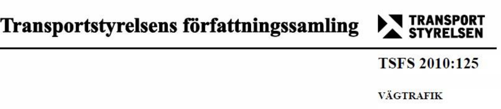
eller inte.

_**Allmänna råd**_

_Bestämmelserna om läkarundersökning eller annan undersökning i 1–16 kap. bör i tillämpliga_
_delar vara vägledande även vid prövning av frågan om fortsatt innehav med krav på läkarintyg_
_eller annat medicinskt underlag. Inför en sådan undersökning bör läkaren också ta del av_
_körkortsmyndighetens eller prövningsmyndighetens handlingar i ärendet._

**7 kap. Neurologiska sjukdomar**

**För innehav av behörigheterna AM, A1, A, B, BE, C, CE, D, DE, traktorkort eller**
**taxiförarlegitimation 1 §** Sjukdomar i nervsystemet som innebär trafiksäkerhetsrisker utgör
hinder för innehav.
**2** **§** Vid riskbedömningen ska hänsyn tas till tillståndets kliniska form och utveckling samt behandlingsresultat.
Motoriska eller sensoriska symtom som påverkar balans, koordination eller psykomotorisk hastighet,
synfältsdefekter samt defekter av kognitiv natur ska särskilt beaktas.

_**Allmänna råd**_

_Vid Parkinsons sjukdom bör förekomst av s.k. on-off-symtom särskilt beaktas._

**3** **§** Vid Parkinsons sjukdom och särskilt vid behandling med dopamin-agonister, ska risken för insomning vid
körning av motordrivet fordon särskilt beaktas och bedömas enligt 12 kap. 16 §.

**Villkor om läkarintyg**

**5 §** Vid progressiv sjukdom, t. ex. Parkinsons sjukdom, multipel skleros eller annan neurodegenerativ sjukdom
ska villkor om läkarintyg föreskrivas och prövning av frågan om fortsatt innehav göras med intervall som
bedöms lämpligt i varje enskilt fall.

**10 kap. Demens och andra kognitiva störningar**

**För innehav av behörigheterna AM, A1, A, B, BE, C, CE, D, DE, traktorkort eller taxiförarlegitimation**

**1 §** Allvarlig kognitiv störning utgör hinder för innehav. Vid bedömning av om störningen ska anses som allvarlig
ska särskild hänsyn tas till nedsättning av uppmärksamhet, omdöme och förmågan att ta in och bearbeta
synintryck samt nedsättning av mental flexibilitet, minne, exekutiva funktioner och psykomotoriskt tempo.
Dessutom ska känslomässig labilitet och ökad uttröttbarhet beaktas. Apraxi och neglekt ska särskilt
uppmärksammas.

**Innehav vid demens**

**3 §** Demens utgör hinder för innehav. Vid lindrig demens kan dock innehav av behörigheterna AM, A1, A,
B, BE eller traktorkort medges.

_**Allmänna råd**_

_Demens bör anses som lindrig om patienten, trots påtagligt försämrad förmåga till aktivt_
_yrkesarbete och sociala aktiviteter, ändå har förmågan att föra ett självständigt liv med ett_
_förhållandevis intakt omdöme._

**Villkor om läkarintyg**

**6** **§** Vid lindrig demens ska villkor om läkarintyg föreskrivas och prövning av frågan om fortsatt innehav göras
med intervall som bedöms lämpligt i varje enskilt fall.
Vid övriga förhållanden som regleras i detta kapitel får villkor om läkarintyg föreskrivas och prövning av
frågan om fortsatt innehav göras med intervall som bedöms lämpligt i varje enskilt fall.

_**Allmänna råd**_

_Vid tillstånd med minnesstörning, där demensutveckling kan misstänkas, bör villkor om läkarintyg_
_föreskrivas och prövning av frågan om fortsatt innehav göras minst en gång om året._

**7** **§** Undersökningen ska omfatta en bedömning av sökandens kognitiva funktioner. Läkarens bedömning kan
grundas på neuro psykologisk undersökning utförd av neuro psykolog, annan legitimerad psykolog eller
legitimerad arbetsterapeut med god kunskap inom området.

_**Allmänna råd**_

     - _Vid hjärnskada och vid misstanke om kognitiva störningar bör ett enkelt test, t.ex. Folsteins_
_Mini-Mental-Test, utföras._

     - _Vid misstanke eller kännedom om minnesstörning bör kompletterande uppgifter om möjligt_
_inhämtas från anhöriga._

     - _Vid misstanke om störningar i uppmärksamhet bör sökandens förmåga till delad_
_uppmärksamhet och till uppmärksamhet över tid samt effekter av tidspress prövas._

     - _Vid omdömesdefekter bör läkaren försöka bedöma i vad mån dessa har betydelse för_
_trafiksäkerheten._

**SFS 2010:799 Lag om ändring i körkortslagen (1998:488); 10 kap.**

**2 §** 5 Om en läkare vid undersökning av en körkortshavare finner att körkortshavaren av medicinska skäl är
olämplig att ha körkort, ska läkaren anmäla det till Transportstyrelsen. Innan anmälan görs ska läkaren
underrätta körkortshavaren. Anmälan behöver inte göras om det finns anledning att anta att körkortshavaren
kommer att följa läkarens tillsägelse att avstå från att köra körkortspliktigt fordon. Om en läkare vid
undersökning finner det sannolikt att körkortshavaren av medicinska skäl är olämplig att ha körkort och
körkortshavaren motsätter sig fortsatt undersökning eller utredning, får läkaren anmäla förhållandet till
Transportstyrelsen. Bestämmelserna i första och andra styckena gäller även den som har körkortstillstånd eller
traktorkort

### XII. Socialstyrelsens försäkringsmedicinska beslutsstöd

Utdrag av de mest relevanta texterna från de rekommendationer som finns i sin helhet i på Socialstyrelsens
[hemsida, med detaljerad länk: https://roi.socialstyrelsen.se/fmb/parkinsons-sjukdom/133](https://roi.socialstyrelsen.se/fmb/parkinsons-sjukdom/133)

SweModis har på uppdrag av Svensk Neurologisk Förening varit med om att ta fram underlag till dessa
rekommendationer som, efter bearbetning i såväl Socialstyrelsen och Försäkringskassan, nu är upprättade som
beslutsstöd.

Rekommendationerna ska vara vägledande för bedömningarna som ska vara individuella och utgå ifrån enskilda
individers unika tillstånd. De bygger på kunskaper om sjukdomars naturalförlopp och funktionspåverkan samt
kategoriseringar av arbetets typ av belastning och krav. Rekommendationerna är därmed tänkta att beskriva en
tankekedja möjlig att applicera på den individuella situationen.

**Samsjuklighet**

De specifika rekommendationerna är skrivna utifrån en tänkt situation där patienten endast har en,
väldefinierad, diagnos. I den verklighet som läkarkåren möter, är samsjuklighet och svårigheter att sortera olika
typer av symtom i tydligt avgränsade diagnoser, vanliga. Individer söker exempelvis ofta vård för symtom som
kan härledas till olika diagnoser. I sådana fall ska sjukskrivningsbedömningar göras på grundval av den diagnos
som bedöms påverka funktionstillståndet mest. Om läkaren bedömer att samsjuklighet förvärrar nedsättningen
ska läkaren anföra detta som argument för avsteg från rekommendationen. Om samsjuklighet leder till ett
tillstånd där det är svårt eller irrelevant att utse någon huvuddiagnos ska detta anges i det medicinska
underlaget (läkarintyget).

**Sammanfattning av det försäkringsmedicinska beslutsstödet vid Parkinsons sjukdom:**

- I den tidiga fasen har patienten ofta behov av återkommande korttidssjukskrivning för att återhämta sig.

Arbeten som kräver hög koncentration, snabb uppfattningsförmåga och god finmotorik (exempelvis
skrivförmåga) kan vara olämpliga och nedsatt arbetstid, förändrade arbetsuppgifter och arbetsprövning kan
bli aktuellt. Rehabiliteringsinsatser är värdefulla.

- I fluktuationsfasen kan patienter med arbeten som inte kräver fysisk ansträngning och kontinuitet över

dagen hålla kvar viss arbetskapacitet. Kunskaper och erfarenhet kan finnas i gott behåll.

- I komplikationsfasen är det ovanligt med arbetsförmåga.

**Försäkringsmedicinsk information**

Det finns en spännvidd för hur en given sjukdom påverkar olika individers arbetsförmåga och förmåga att utföra
olika aktiviteter. Därför måste bedömningen av arbetsförmågan ske individuellt utifrån individens unika
förutsättningar och sysselsättning.

Stora individuella skillnader förekommer vilket skall beaktas. Arbeten som kräver hög koncentration, snabb
uppfattningsförmåga och god finmotorik (exempelvis skrivförmåga) kan vara olämpliga.

Behandla övergående funktionsnedsättningar som är betingade av olämplig medicinering, behandlingssvikt,
depression, ångesttillstånd, sömnbrist eller psykiska reaktioner till följd av behandlingen.

Uppmärksamma sjukskrivning som blir omfattande och varaktig i tid.

Sjukskrivande läkare bör försäkra sig om att patienten har kontakt med Försäkringskassan och arbetsgivaren.

Partiell sjukskrivning för att gradvis öka belastningen vid återgång i arbetet är ofta att föredra.

**Symtom, prognos, behandling**

Parkinsons sjukdom beror på ett gradvis bortfall av nervceller i hjärnan och medför långsamt tilltagande
problem med försämrad rörlighet och kognitiv svikt. Sjukdomsförloppet består av tre faser:

1. Tidig fas, där läkemedelsbehandling ofta har god effekt.

2. Fluktuationsfas, där symtomen återkommer periodvis under dagen trots noggrann behandling.

3. Komplikationsfasen (ofta efter cirka 10 år) där patienten upplever normal rörlighet endast under begränsade

delar av dagen.

Symtomen växer fram under ett antal år. Behandlingen består av läkemedel, under de två första
sjukdomsfaserna senare ofta med tillägg av kontinuerlig läkemedelsinfusion (läkemedelspump) eller
elektrostimulering av hjärnan.

Vid Parkinsons sjukdp, tilltar symtomen långsamt och varierar. Sjukdomen kan ännu inte botas eller förmås läka
ut. Livslängden är dock idag endast obetydligt förkortad. En neuro psykolog bör utvärdera kognitiv svikt och
ibland även trötthet.

**Funktionsnedsättning**

Parkinson kan medföra problem i form av darrning (tremor), nedsatt rörlighet och påverkan på gångmönstret.
Även kognitiva problem (som hjärntrötthet, nedsatt psykisk uthållighet, arbetsminne, tankeförmåga och
planeringsförmåga) och depressiva besvär är vanligt. Perceptuella funktioner (auditiva, visuella, lukt och smak,
visuospatial) kan vara påverkad. Följden blir ofta en ökad uttröttbarhet under dagen och även humöret kan vara
påverkat De kognitiva problemen upptäcks inte alltid i den tidiga sjukdomsfasen. Tillståndet kan leda till
nedsatt tolerans för fysiskt arbete.

**Aktivitetsbegränsning**

Parkinson kan medföra nedsatt handmotorik, svårigheter att lyfta och bära föremål från en plats till en annan,
samt att använda arm och hand. Patienten kan få svårigheter att gå, gå i trappor och att röra sig omkring på
olika sätt (exempelvis att krypa, klättra, springa eller hoppa). Svårigheter att ändra och bibehålla en
kroppsställning (exempelvis att ändra ställning mellan sittande och stående, att förbli stående, sittande eller
huksittande) kan förekomma. Tillståndet kan medföra nedsatt förmåga att lösa problem, fatta beslut och
hantera stress och andra psykologiska krav. Patienten kan även få svårigheter att genomföra daglig rutin, att
företa komplexa uppgifter och att lära sig nya färdigheter. patienten kan få svårigheter att skriva, talet kan
påverkas och därmed förmågan att kunna konversera. Även förmågan att framföra fordon kan påverkas.

**Information om rehabilitering**

Överväg rehabilitering med utformning av hjälpmedel, andra arbetsuppgifter eller omskolning till annat arbete i
tid. Diskutera eventuell anpassning av arbetsuppgifter. Företagshälsovård och arbetsgivare bör tidigt kopplas in
för översyn av arbetsuppgifter. Överväg arbetsfrämjande åtgärder som rehabilitering eller ändrad
arbetsbelastning vid tilltagande funktionsnedsättningar.

### XIII. Referenser

**1.** **Andra Guidelines, översikter, länkar**

  - American Academy for Neurology, guidelines

[länk till till AAN Parkinson guideline](https://www.aan.com/Guidelines/home/GuidelineDetail/1043)

  - Cochrane Reviews on Parkinson’s disease:

Cochrane Reviews (www.cochranelibrary.com)

  - Danska terapiråd

[http://www.danmodis.dk](http://www.danmodis.dk/)

  - Gemensamma riktlinjer EFNS, MDS-ES, och ENS (2013)

[Ferreira JJ, Katzenschlager R, Bloem BR, Bonuccelli U, Burn D, Deuschl G, Dietrichs E, Fabbrini G,](http://www.ncbi.nlm.nih.gov.ludwig.lub.lu.se/pubmed?term=Ferreira%20JJ%5BAuthor%5D&cauthor=true&cauthor_uid=23279439)
[Friedman A, Kanovsky P, Kostic V, Nieuwboer A, Odin P,Poewe W, Rascol O, Sampaio C, Schüpbach](http://www.ncbi.nlm.nih.gov.ludwig.lub.lu.se/pubmed?term=Friedman%20A%5BAuthor%5D&cauthor=true&cauthor_uid=23279439)
[M, Tolosa E, Trenkwalder C, Schapira A, Berardelli A, Oertel WH. Summary of the](http://www.ncbi.nlm.nih.gov.ludwig.lub.lu.se/pubmed?term=Tolosa%20E%5BAuthor%5D&cauthor=true&cauthor_uid=23279439)
[recommendations of the EFNS/MDS-ES review on therapeutic management of Parkinson's disease.](https://doi.org/10.1111/j.1468-1331.2012.03866.x)
[Eur J Neurol. 2013;20:5-15.](http://www.ncbi.nlm.nih.gov.ludwig.lub.lu.se/pubmed/23279439)

Berardelli A, Wenning GK, Antonini A, Berg D, Bloem BR, Bonifati V, Brooks D, Burn DJ, Colosimo
C, Fanciulli A, Ferreira J, Gasser T, Grandas F, Kanovsky P, Kostic V, Kulisevsky J, Oertel W,
[Poewe W, Reese JP, Relja M, Ruzicka E, Schrag A, Seppi K, Taba P, Vidailhet M. EFNS/MDS-](https://doi.org/10.1111/ene.12022)
[ES/ENS [corrected] recommendations for the diagnosis of Parkinson's disease. Eur J Neurol.](https://doi.org/10.1111/ene.12022)
2013;20:16-34.

  - National Institute for Health and and Clinical Excellence:

NICE Guidelines Parkinson's disease in adults (2017), www.nice.org.uk

  - Nilsson M, Franzén E, Winberg C. Svenska riktlinjer för fysioterapi vid Parkinsons sjukdom. 2023.

  - Scottish Intercollegiate Guidelines Networrk:

[Guideline 113 Parkinson's disease (2010)](https://www.sign.ac.uk/sign-113-diagnosis-and-pharmacological-management-of-parkinson-s-disease.html)

  - Socialstyrelsen (2016)

Nationella Riktlinjer för Parkinsons sjukdom:
[http://www.socialstyrelsen.se/nationellariktlinjermsochparkinsonssjukdom](http://www.socialstyrelsen.se/nationellariktlinjermsochparkinsonssjukdom)

  - Tyska guidelines 2024 (Deutsche Gesellschaft fur Neurologie):

[Idiopathisches Parkinson-Syndrom (www.dgn.org)](https://dgn.org/)

**2.** **Utvalda källreferenser**

Ahlskog JE. Parkinson's disease progression is multifaceted: Evidence for the underlying benchmarks.
Parkinsonism RelatDisord. 2024;121:106037.

Ben-Shlomo Y, Darweesh S, Llibre-Guerra J, Marras C, San Luciano M, Tanner C. The epidemiology of Parkinson's
disease. Lancet. 2024;403(10423):283-92.

Bloem BR, Okun MS, Klein C. Parkinson's disease. Lancet. 2021 Jun 12;397(10291):2284-2303.

d'Angremont E, Begemann MJH, van Laar T, Sommer IEC. Cholinesterase Inhibitors for Treatment of psychotic
Symptoms in Alzheimer Disease and Parkinson Disease: A Meta-analysis. JAMA Neurol. 2023 Aug 1;80(8):813-823.

Debove I, Paschen S, Amstutz D, Cardoso F, Corvol JC, Fung VSC, et al. Management of Impulse Control and
Related Disorders in Parkinson's Disease: An Expert Consensus. Mov Disord. 2024;39(2):235-48.

Deuschl G, Antonini A, Costa J, Śmiłowska K, Berg D, Corvol JC, Fabbrini G, Ferreira J, Foltynie T, Mir P, Schrag
A, Seppi K, Taba P, Ruzicka E, Selikhova M, Henschke N, Villanueva G, Moro E. European Academy of
Neurology/Movement Disorder Society-European Section Guideline on the Treatment of Parkinson's Disease: I.

Invasive Therapies. Mov Disord. 2022 Jul;37(7):1360-1374.

Fox SH, Katzenschlager R, Lim SY, Barton B, de Bie RMA, Seppi K, Coelho M, Sampaio C; Movement Disorder
Society Evidence-Based Medicine Committee. International Parkinson and movement disorder society
evidence-based medicine review: Update on treatments for the motor symptoms of Parkinson's disease. Mov
Disord. 2018 Aug;33(8):1248-1266.

Gorcenco S, Ilinca A, Almasoudi W, Kafantari E, Lindgren AG, Puschmann A. New generation genetic
testing entering the clinic. Parkinsonism Relat Disord. 2020 Apr;73:72-84.

Höglinger GU, Respondek G, Stamelou M, Kurz C, Josephs KA, Lang AE, Mollenhauer B, Müller U, Nilsson C,
Whitwell JL, Arzberger T, Englund E, Gelpi E, Giese A, Irwin DJ, Meissner WG, Pantelyat A, Rajput A, van
Swieten JC, Troakes C, Antonini A, Bhatia KP, Bordelon Y, Compta Y, Corvol JC, Colosimo C, Dickson DW, Dodel
R, Ferguson L, Grossman M, Kassubek J, Krismer F, Levin J, Lorenzl S, Morris HR, Nestor P, Oertel WH, Poewe W,
Rabinovici G, Rowe JB, Schellenberg GD, Seppi K, van Eimeren T, Wenning GK, Boxer AL, Golbe LI, Litvan I;
Movement Disorder Society-endorsed PSP Study Group. Clinical diagnosis of progressive supranuclear palsy: The
movement disorder society criteria. Mov Disord. 2017 Jun;32(6):853-864. doi: 10.1002/mds.26987. Epub 2017
May 3. PMID: 28467028; PMCID: PMC5516529.

Höllerhage M, Becktepe J, Classen J, Deuschl G, Ebersbach G, Hopfner F, Lingor P, Löhle M, Maaß S, PötterNerger M, Odin P, Woitalla D; German Parkinson’s Guidelines Group; Trenkwalder C, Höglinger GU.
Pharmacotherapy of motor symptoms in early and mid-stage Parkinson's disease: guideline "Parkinson's disease"
of the German Society of Neurology. J Neurol. 2024 Aug 29.

Jost ST, Kaldenbach MA, Antonini A, Martinez-Martin P, Timmermann L, Odin P, Katzenschlager R, Borgohain R,
Fasano A, Stocchi F, Hattori N, Kukkle PL, Rodríguez-Violante M, Falup-Pecurariu C, Schade S, Petry-Schmelzer
JN, Metta V, Weintraub D, Deuschl G, Espay AJ, Tan EK, Bhidayasiri R, Fung VSC, Cardoso F, Trenkwalder C,
Jenner P, Ray Chaudhuri K, Dafsari HS; International Parkinson and Movement Disorders Society Non-Motor
Parkinson Disease Study Group. Levodopa Dose Equivalency in Parkinson's Disease: Updated Systematic Review
and Proposals. Mov Disord. 2023 Jul;38(7):1236-1252.

Kwok JYY, Smith R, Chan LML, Lam LCC, Fong DYT, Choi EPH, Lok KYW, Lee JJ, Auyeung M, Bloem BR. Managing
freezing of gait in Parkinson's disease: a systematic review and network meta-analysis. J Neurol. 2022
Jun;269(6):3310-3324. Erratum in: J Neurol. 2022 Jun;269(6):3325-3327.

Mele B, Jayna Holroyd-Leduc SV, Ismail Z, Pringsheim T, Goodarzi Z. (2020) Diagnosis, treatment and
management of apathy in Parkinson´s disease: a scoping review. BMJ Open 10:e037632.

Morris HR, Spillantini MG, Sue CM, Williams-Gray CH. The pathogenesis of Parkinson's disease.
Lancet.2024;403(10423):293-304.

Mortezaei A, Essibayi MA, Mirahmadi Eraghi M, Alizadeh M, Taghlabi KM, Eskandar EN, Faraji AH. Magnetic
resonance-guided focused ultrasound in the treatment of refractory essential tremor: a systematic review and
meta-analysis. Neurosurg Focus. 2024 Sep 1;57(3):E2.

[Odin P, Ray Chaudhuri K, Slevin JT, Volkmann J, Dietrichs E, Martinez-Martin P, Krauss JK, Henriksen T,](https://www.ncbi.nlm.nih.gov/pubmed/?term=Odin%20P%5BAuthor%5D&cauthor=true&cauthor_uid=26233582)
[Katzenschlager R, Antonini A, Rascol O, Poewe W; National Steering Committees. Collective physician](https://www.ncbi.nlm.nih.gov/pubmed/?term=Katzenschlager%20R%5BAuthor%5D&cauthor=true&cauthor_uid=26233582)
perspectives on non-oral medication approaches for the management of clinically relevant unresolved issues
[in Parkinson's disease: Consensus from an international survey and discussion program. Parkinsonism Relat](https://www.ncbi.nlm.nih.gov/pubmed/?term=navigate%2Band%2Bodin%2Bp)
[Disord. 2015 Oct;21(10):1133-44.](https://www.ncbi.nlm.nih.gov/pubmed/?term=navigate%2Band%2Bodin%2Bp)

Pagonabarraga J, Bejr-Kasem H, Martinez-Horta S, Kulisevsky J. Parkinson disease psychosis: from
phenomenology to neurobiological mechanisms. Nat Rev Neurol. 2024;20(3):135-50.

Postuma RB, Berg D, Stern M, Poewe W, Olanow CW, Oertel W, et al. MDS clinical diagnostic criteria for
Parkinson's disease. Mov Disord. 2015;30(12):1591-601.

Pringsheim T, Day G S, Smith D B, Rae-Grant A, Licking N, Armstrong, M J et al. Dopaminergic Therapy for Motor
Symptoms in Early Parkinson Disease Practice Guideline Summary: A Report of the AAN Guideline Subcommittee.
Neurology. 2021;(20):942-957.

Puschmann A, Jiménez-Ferrer I, Lundblad-Andersson E, Mårtensson E, Hansson O, Odin P, Widner H, Brolin K,
Mzezewa R, Kristensen J, Soller M, Rödström EY, Ross OA, Toft M, Breedveld GJ, Bonifati V, Brodin L,
Zettergren A, Sydow O, Linder J, Wirdefeldt K, Svenningsson P, Nissbrandt H, Belin AC, Forsgren L, Swanberg
M. Low prevalence of known pathogenic mutations in dominant PD genes: A Swedish multicenter study.
Parkinsonism Relat Disord. 2019 Sep;66:158-165.

Seppi K, Ray Chaudhuri K, Coelho M, Fox SH, Katzenschlager R, Perez Lloret S, Weintraub D, Sampaio C; the

collaborators of the Parkinson's Disease Update on Non-Motor Symptoms Study Group on behalf of the Movement
Disorders Society Evidence-Based Medicine Committee. Update on treatments for nonmotor symptoms of
Parkinson's disease-an evidence-based medicine review. Mov Disord. 2019 Feb;34(2):180-198. Erratum in: Mov
Disord. 2019 May;34(5):765.

Sharma JC, Ross IN, Rascol O, Brooks D. Relationship between weight, levodopa and dyskinesia: the significance
of levodopa dose per kilogram body weight. Eur J Neurol. 2008 May;15(5):493-6. doi: 10.1111/j.14681331.2008.02106.x. Epub 2008 Mar 18. PMID: 18355302.

Sheu JJ, Tsai MT, Erickson SR, Wu CH. Association between Anticholinergic Medication Use and Risk of Dementia
among Patients with Parkinson's Disease. Pharmacotherapy. 2019 Aug;39(8):798-808.

Slouha E, Ibrahim F, Esposito S, Mursuli O, Rezazadah A, Clunes LA, Kollias TF. Botulinum Toxin for the
Management of Parkinson's Disease: A Systematic Review. Cureus. 2024 Jan 31;16(1):e53309.

Wood J, Henderson W, Foster ER. Occupational Therapy Practice Guidelines for People With Parkinson's Disease.
Am J Occup Ther. 2022 May 1;76(3):7603397010.

Yu XX, Fernandez HH. Dopamine agonist withdrawal syndrome: A comprehensive review. J Neurol Sci.
2017;374:53-5.

### Bilaga I: Diagnoskriterier

_(ej validerade översättningar från engelska)_

Diagnostiska kriterier för PS uppdateras över tiden. I tidigare versioner av dessa riktlinjer har vi presenterat
NINDS Diagnostic Criteria for Parkinson Disease ( _Gelb DJ, Oliver E, Gilman S. Diagnostic criteria for Parkinson_
_Disease. Arch Neurol 1999: 56 (1):33-39_ ) och UK Parkinson’s Disease Society Brain Bank diagnostiska kriterier
( _Gibb WR, Lees AJ. The relevance of the Lewy body to the pathogenesis of idiopathic Parkinson's disease. J_
_Neurol Neurosurg psychiatry 1988; 51: 745-52)._ MDS har relativt nyligen kommit ut med nya diagnostiska
kriterier som allmännt accepterats och vi har därför valt att endast redogöra för dem.
#### MDS Kliniska diagnostiska kriterier för Parkinsons sjukdom

_Postuma RB, Berg D, Stern M et al. Movement Disorders, Vol. 30, No. 12, 2015_

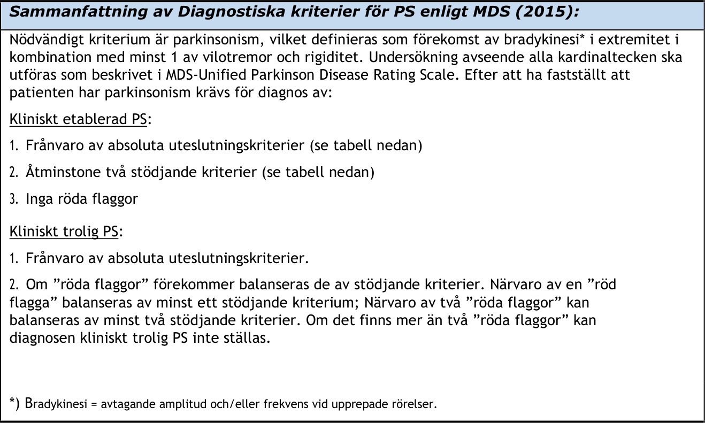

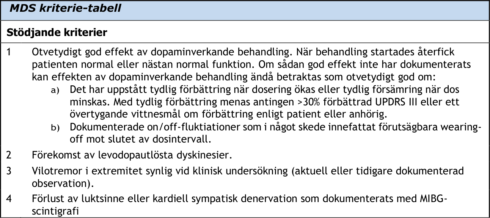

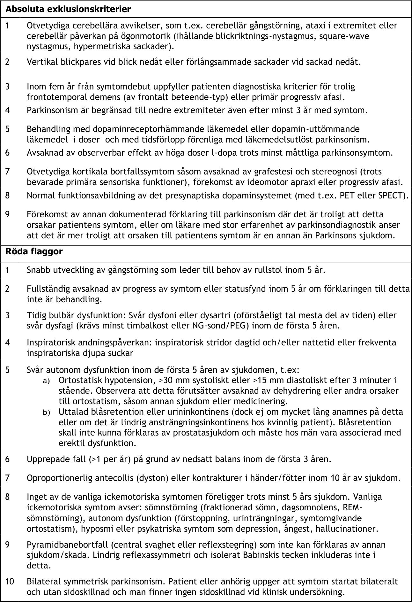

#### Kliniska diagnostiska kriterier för mild kognitiv svikt, MCI, vid Parkinsons sjukdom

_Litvan I, Goldman JG, Tröster AI, et al. Diagnostic criteria for mild cognitive impairment in Parkinson’s_
_disease: Movement Disorder Society Task Force Guidelines. Mov Disord 2012;27:349-56_

Movement Disorder Society preliminära diagnostiska kriterier för PD-MCI. Avser

test med validerade och specificerade instrument.

Nivå I – PD-MCI (låg grad av stöd i tester för diagnos) Montreal

Cognitive assessment (MoCa),

Parkinson’s Disease Cognitive Rating Scale (PD-CRS), Scales for Outcomes in Parkinson’s Disease- Cognition

  - PD-MCI diagnostiseras om minst två neuro psykologiska test visar nedsatt funktion vid användande
av ett testbatteri med bara ett test per kognitiv domän eller ett testbatteri som täcker mindre än
fem kognitiva domäner.

Nivå II PD-MCI

  - Den säkrare diagnosen grad kräver ett testbatteri som innehåller minst två tester för var och en av
följande fem kognitiva domäner: uppmärksamhet och arbetsminne, exekutiv funktion, språk, minne,
samt visuospatial funktion.

  - Nedsatt funktion i minst två tester krävs för PD-MCI diagnos. Om nedsatt funktion påvisas i en eller
flera olika domäner kan undergruppering ske i PD-MCI en domän eller PD-MCI multipla domäner.

**DIAGNOSTISKA KRITERIER FÖR PD-MCI**

_Inklusionskriterier_

      - Diagnosen PS enligt UK PD Brain Bank kriterier

      - Gradvis kognitiv försämring enligt patient eller annan person eller behandlande läkare

      - Kognitiv svikt enligt neuro psykologiska tester eller ett globalt kognitivt test

  - Den kognitiva svikten ger ingen påtaglig effekt på den funktionella självständigheten

_Exklusionskriterier_

1. Parkinson demens (se nedan)
2. Annan förklaring till kognitiv störning (delirium, depression, läkemedelsbiverkning mm)
3. Andra parkinsonsymtom som kan ge kognitiv svikt (svår ångest, depression, psykos, ökad

dagtrötthet mm)

#### Kliniska diagnostiska kriterier för demens vid Parkinsons sjukdom

_Emre M, Aasland D, Brown R et al. Clinical Diagnostic Criteria for Dementia Associated with Parkinson’s_
_Disease. Movem. Dis. 2007; 12: 1689-1707._

**Kliniska huvudkarakteristiska:**

_1._ PSs diagnos enligt UKQS Brain Bank kriterier

_2._ Långsamt progredierande och smygande insättande demens-syndrom inom ramen för en klarlagd PS,

diagnostiserat genom anamnes och kliniska och neuro psykologiska undersökningar, definierat genom:

  - Nedsatt kognitiv funktion i mer än en domän.

  - Nedsättning jämfört med en pre-morbid nivå.

  - Nedsättning av en nivå som påverkar dagliga funktioner/livsföring (socialt, yrkesmässigt eller
personlig ADL) oberoende av motoriska eller dysautonoma symtom.

**Associerade kliniska tecken**

_3._ _Kliniska tecken på kognitiva störningar_

  - Uppmärksamhet: Nedsatt. Nedsättning av spontan och fokuserad uppmärksamhet, låg prestation i
uppmärksamhetstest; variation av uppmärksamhetsfunktioner under dagen och mellan dagar.

  - Exekutiva funktioner: Nedsatt. Nedsättning i funktioner som kräver initiering, planering,
konceptbildning, mentala regelbildningar, mentala ramar och rambyten, mental flexibilitet eller
mental stabilitet, nedsatt mental hastighet (bradyfreni)

  - Visuo-spatiala funktioner: Nedsatt. Nedsatt funktion där visuo-spatial orienteringsförmåga,
perception eller konstruktion krävs.

  - Minnesfunktioner: Nedsatt. Nedsättning av fri händelsehågkomst, eller nyinlärning av material.
Minnet förbättras av påminnelser, igenkänning bättre än spontan fri hågkomst.

  - Språkfunktioner: Språkfunktionerna är vanligen intakta. Nedsättning av ordåtkomst och
förståelse av komplexa meningar kan förekomma.

_4._ _Kliniska tecken på beteenderubbningar_

  - Apati: nedsatt spontanitet; motivations- och intresseförlust för aktivteter som kräver
engagemang.

  - Personlighetsförändring och stämningsläge, inkluderande depression och ångest.

  - Hallucinationer: vanligen visuella och komplexa med människor, djur eller föremål.

  - Vanföreställningar: vanligen paranoida, som underlägsenhet, intrångsidéer (främmande
inneboende person), omtolkningar.

  - Betydande dagtrötthet.

**Kliniska tecken som inte utesluter PDD, men som inger diagnostisk tveksamhet**

  - Samtidig närvaro av ett onormalt tillstånd som i sig kan ge upphov till kognitiv svikt, men som inte
bedöms vara orsak till demensen, t ex förekomst av hjärnavbildningstecken på vaskulär(a) lesion(er).

  - Okänt tidsintervallet mellan uppkomst rörelsesymtom och kognitiva symtom.

**Kliniska tecken som indikerar annan orsak eller sjukdom som ger upphov till kognitiv påverkan**
**som, om närvarande omöjliggör en tillförlitlig PDD diagnos**

  - Kognitiva svikt- och beteende-störningar som endast kan relateras till situationer och tillstånd som
karakteriseras av:

         - Akut konfusion som beror på:

`o` Systemiska sjukdomar

`o` Läkemedelsreaktion

`o` Djup depression enligt DSM IV

  - Kliniska tecken på ”möjlig vaskulär demens” enligt NINDS-AIREN kriterier.
(demens som kan relateras till cerebrovaskulär sjukdom genom påvisande av fokala neurologiska
tecken vid neurologisk status-undersökning, t ex hemipares, sensoriska defekter och påvisande av
relevanta tecken till cerebrovaskulär sjukdom vid hjärnavbildning, **OCH** ett samband mellan dessa två
tillstånd genom att en av följande gäller: debut av demens inom 3 månader efter ett strokeinsjuknande, plötslig försämring av kognitiva funktioner eller fluktuerande, stegvis progredierande
försämring av kognitiva funktioner.

**Kliniska diagnoskriterier PDD**

OBS! notera ordningsföljd – starkare diagnoskriterier först:

**Sannolik demens vid Parkinsons sjukdom**

_A: Kliniska huvudkarakteristika_

Bägge skall vara uppfyllda

_B: Associerade kliniska tecken:_

`o` Typisk profil av kognitiv profil, defekter med nedsättning av minst 2 av de 4
kärndomänerna (nedsatt uppmärksamhet, som kan fluktuera, nedsatta exekutiva
funktioner, nedsatta visuo-spatiala funktioner och nedsatt fri hågkomst, som vanligen
förbättras av påminnelse).

`o` Närvaro av minst ett beteende-symtom (apati, depressions- eller ångesttillstånd,
hallucinationer, vanföreställningar, betydande dagtrötthet) stärker diagnosen ”sannolik
demens vid Parkinsons sjukdom”, men frånvaro av beteende-symtom utesluter inte
diagnosen.

_C: Ingen av grupp III-symtom uppfylls. D:_

_Ingen av grupp IV-symtom uppfylls._

**Möjlig demens vid Parkinsons sjukdom**

_A: Kliniska huvudkarakteristika_

Bägge skall vara uppfyllda

_B: Associerade kliniska tecken:_

`o` Atypisk profil av kognitiv påverkan inom en eller flera kognitiva domäner, t.ex betydande eller
impressiv (s k flytande) afasi, eller renodlad impräglingsrelaterad minnespåverkan (med
avsaknad av gynnsam effekt av påminnelse eller i tester med igenkänningsuppgifter) med
bevarad vakenhet.

`o` Beteende-störningar kan, men behöver inte förekomma.
ELLER

_C: Ett eller flera av grupp III-symtom uppfylls._

_D: Ingen av grupp IV-symtom uppfylls._

#### MDS Kliniska diagnostiska kriterier för Multipel systematrofi (MSA)

_Wenning GK, Stankovic I, Vignatelli L, Fanciulli A et al. The Movement Disorder Society Criteria for the Diagnosis_
_of Multiple System Atrophy. Mov Disord. 2022 Jun;37(6):1131-1148._

|Uppdelning i kliniskt etablerad MSA-P eller MSA-C enligt ett övervägande motoriskt syndrom|Col2|Col3|Col4|Col5|
|---|---|---|---|---|
|**Essentiellt** **kärnsymtom**|En sporadisk, progressiv sjukdom hos vuxna (>30 år).|En sporadisk, progressiv sjukdom hos vuxna (>30 år).|En sporadisk, progressiv sjukdom hos vuxna (>30 år).|En sporadisk, progressiv sjukdom hos vuxna (>30 år).|
||**Kliniskt etablerad MSA**|**Kliniskt etablerad MSA**|**Kliniskt sannolik MSA**  |**Kliniskt sannolik MSA**  |
|**Kritiska kliniska** **tecken/symtom**|1. Autonom dysfunktion definierad som (minst en krävs):   Oförklarliga urintömningssvårigheter med urinrestvolym ≥100 mL     Oförklarlig urinträngningsinkontinens     Neurogen OH (≥20/10 mmHg blodtrycksfall) inom 3 minuter efter stående eller tilt-test   och minst en av   2. Dåligt L-dopa-känslig parkinsonism 3. Cerebellärt syndrom (minst två av gångataxi, extremitetsataxi, cerebellär dysartri eller okulomotoriska symtom) |1. Autonom dysfunktion definierad som (minst en krävs):   Oförklarliga urintömningssvårigheter med urinrestvolym ≥100 mL     Oförklarlig urinträngningsinkontinens     Neurogen OH (≥20/10 mmHg blodtrycksfall) inom 3 minuter efter stående eller tilt-test   och minst en av   2. Dåligt L-dopa-känslig parkinsonism 3. Cerebellärt syndrom (minst två av gångataxi, extremitetsataxi, cerebellär dysartri eller okulomotoriska symtom) |Minst två av: 1. Autonom dysfunktion definierad som (minst en krävs):     Oförklarliga tömningssvårigheter med urinrestvolym     Oförklarlig urinträngningsinkontinens     Neurogen OH (≥20/10 mmHg blodtrycksfall) inom 10 minuter efter stående eller tilt-test   2. Parkinsonism   3. Cerebellärt syndrom (minst en av gångataxi, extremitetsataxi, cerebellär dysartri eller okulomotoriska symtom) |Minst två av: 1. Autonom dysfunktion definierad som (minst en krävs):     Oförklarliga tömningssvårigheter med urinrestvolym     Oförklarlig urinträngningsinkontinens     Neurogen OH (≥20/10 mmHg blodtrycksfall) inom 10 minuter efter stående eller tilt-test   2. Parkinsonism   3. Cerebellärt syndrom (minst en av gångataxi, extremitetsataxi, cerebellär dysartri eller okulomotoriska symtom) |
|**Stödjande** **kliniska (motor** **eller icke-** **motoriska)** **tecken/symtom**|Åtminstone två |Åtminstone två |Åtminstone ett |Åtminstone ett |
|**MRI** **förändringar**|Åtminstone ett |Åtminstone ett |Krävs ej |Krävs ej |
|**Exklusion** **kriteria**|Saknas|Saknas|Saknas |Saknas |
|**Stödjande kliniska tecken/symtom**     |**Stödjande kliniska tecken/symtom**     |**Stödjande kliniska tecken/symtom**     |**Stödjande kliniska tecken/symtom**     |**Stödjande kliniska tecken/symtom**     |
|**Stödjande motor** **tecken/symtom**|Snabb progression inom 3 år  efter motorisk debut |**Stödjande icke-** **motoriska** **tecken/symtom**|**Stödjande icke-** **motoriska** **tecken/symtom**|Stridor |
|**Stödjande motor** **tecken/symtom**|Måttlig till svår postural instabilitet inom 3 år efter motorisk debut |Måttlig till svår postural instabilitet inom 3 år efter motorisk debut |Måttlig till svår postural instabilitet inom 3 år efter motorisk debut |Suckandning |
|**Stödjande motor** **tecken/symtom**|Kraniocervikal dystoni inducerad eller förvärrad av|Kraniocervikal dystoni inducerad eller förvärrad av|Kraniocervikal dystoni inducerad eller förvärrad av|Kalla missfärgade händer och|

|Col1|L-dopa i frånvaro av extremitetsdyskinesi|Col3|Col4|fötter|
|---|---|---|---|---|
||Allvarlig talstörning inom 3  år efter motorisk debut |Allvarlig talstörning inom 3  år efter motorisk debut |Allvarlig talstörning inom 3  år efter motorisk debut |Erektil dysfunktion (under 60 årsåldern för kliniskt trolig MSA) |
||Svår dysfagi inom 3 år efter motorisk debut |Svår dysfagi inom 3 år efter motorisk debut |Svår dysfagi inom 3 år efter motorisk debut |Patologiskt skratt eller gråt|
||Oförklarligt Babinski tecken |Oförklarligt Babinski tecken |Oförklarligt Babinski tecken ||
||Myoklonisk postural eller kinetisk tremor |Myoklonisk postural eller kinetisk tremor |Myoklonisk postural eller kinetisk tremor ||
||Posturala deformiteter|Posturala deformiteter|Posturala deformiteter||
|**MRI förändringar vid kliniskt etablerad MSA**  |**MRI förändringar vid kliniskt etablerad MSA**  |**MRI förändringar vid kliniskt etablerad MSA**  |**MRI förändringar vid kliniskt etablerad MSA**  |**MRI förändringar vid kliniskt etablerad MSA**  |
|Varje påverkad hjärnregion, vilket framgår av antingen atrofi eller ökad diffusivitet, räknas som en MRI-markör.   |Varje påverkad hjärnregion, vilket framgår av antingen atrofi eller ökad diffusivitet, räknas som en MRI-markör.   |Varje påverkad hjärnregion, vilket framgår av antingen atrofi eller ökad diffusivitet, räknas som en MRI-markör.   |Varje påverkad hjärnregion, vilket framgår av antingen atrofi eller ökad diffusivitet, räknas som en MRI-markör.   |Varje påverkad hjärnregion, vilket framgår av antingen atrofi eller ökad diffusivitet, räknas som en MRI-markör.   |
|För MSA-P • Atrofi av: o Putamen (och signalminskning på järnkänsliga sekvenser) o Mellersta lillhjärnepedunkeln o pons o Cerebellum   • "Hot cross bun sign".   • Ökad diffusivitet av: o Putamen o Mellersta lillhjärnepedunkeln|För MSA-P • Atrofi av: o Putamen (och signalminskning på järnkänsliga sekvenser) o Mellersta lillhjärnepedunkeln o pons o Cerebellum   • "Hot cross bun sign".   • Ökad diffusivitet av: o Putamen o Mellersta lillhjärnepedunkeln|För MSA-P • Atrofi av: o Putamen (och signalminskning på järnkänsliga sekvenser) o Mellersta lillhjärnepedunkeln o pons o Cerebellum   • "Hot cross bun sign".   • Ökad diffusivitet av: o Putamen o Mellersta lillhjärnepedunkeln|För MSA-C • Atrofi av: o Putamen (och signalminskning på järnkänsliga sekvenser) o Infratentoriella strukturer (pons och lillhjärnepedunkeln)   • "Hot cross bun sign".   • Ökad diffusivitet av:o Putamen|För MSA-C • Atrofi av: o Putamen (och signalminskning på järnkänsliga sekvenser) o Infratentoriella strukturer (pons och lillhjärnepedunkeln)   • "Hot cross bun sign".   • Ökad diffusivitet av:o Putamen|
|**Exklusionskriterier** |**Exklusionskriterier** |**Exklusionskriterier** |**Exklusionskriterier** |**Exklusionskriterier** |
|Betydande och ihållande terapeutiskt svar på dopaminerga mediciner |Betydande och ihållande terapeutiskt svar på dopaminerga mediciner |Betydande och ihållande terapeutiskt svar på dopaminerga mediciner |Betydande och ihållande terapeutiskt svar på dopaminerga mediciner |Betydande och ihållande terapeutiskt svar på dopaminerga mediciner |
|Oförklarlig anosmi vid lukttestning |Oförklarlig anosmi vid lukttestning |Oförklarlig anosmi vid lukttestning |Oförklarlig anosmi vid lukttestning |Oförklarlig anosmi vid lukttestning |
|Fluktuerande kognition med uttalad variation i uppmärksamhet och vakenhet och tidig nedgång i visuoperceptuella förmågor |Fluktuerande kognition med uttalad variation i uppmärksamhet och vakenhet och tidig nedgång i visuoperceptuella förmågor |Fluktuerande kognition med uttalad variation i uppmärksamhet och vakenhet och tidig nedgång i visuoperceptuella förmågor |Fluktuerande kognition med uttalad variation i uppmärksamhet och vakenhet och tidig nedgång i visuoperceptuella förmågor |Fluktuerande kognition med uttalad variation i uppmärksamhet och vakenhet och tidig nedgång i visuoperceptuella förmågor |
|Återkommande synhallucinationer som inte induceras av läkemedel inom 3 år efter sjukdomsdebut |Återkommande synhallucinationer som inte induceras av läkemedel inom 3 år efter sjukdomsdebut |Återkommande synhallucinationer som inte induceras av läkemedel inom 3 år efter sjukdomsdebut |Återkommande synhallucinationer som inte induceras av läkemedel inom 3 år efter sjukdomsdebut |Återkommande synhallucinationer som inte induceras av läkemedel inom 3 år efter sjukdomsdebut |
|Demens enligt DSM-V inom 3 år efter sjukdomsdebut |Demens enligt DSM-V inom 3 år efter sjukdomsdebut |Demens enligt DSM-V inom 3 år efter sjukdomsdebut |Demens enligt DSM-V inom 3 år efter sjukdomsdebut |Demens enligt DSM-V inom 3 år efter sjukdomsdebut |
|Nedåtriktad supranukleär pares eller förlängsamning av vertikala saccader |Nedåtriktad supranukleär pares eller förlängsamning av vertikala saccader |Nedåtriktad supranukleär pares eller förlängsamning av vertikala saccader |Nedåtriktad supranukleär pares eller förlängsamning av vertikala saccader |Nedåtriktad supranukleär pares eller förlängsamning av vertikala saccader |
|MR-fynd som tyder på en alternativ diagnos (t.ex.PSP, multipel skleros, vaskulär parkinsonism, symptomatisk cerebellär sjukdom, etc.) |MR-fynd som tyder på en alternativ diagnos (t.ex.PSP, multipel skleros, vaskulär parkinsonism, symptomatisk cerebellär sjukdom, etc.) |MR-fynd som tyder på en alternativ diagnos (t.ex.PSP, multipel skleros, vaskulär parkinsonism, symptomatisk cerebellär sjukdom, etc.) |MR-fynd som tyder på en alternativ diagnos (t.ex.PSP, multipel skleros, vaskulär parkinsonism, symptomatisk cerebellär sjukdom, etc.) |MR-fynd som tyder på en alternativ diagnos (t.ex.PSP, multipel skleros, vaskulär parkinsonism, symptomatisk cerebellär sjukdom, etc.) |
|Dokumentation av ett alternativt tillstånd (MSA-liknande, inklusive genetisk eller symtomatisk ataxi och parkinsonism) som är känt för att orsaka autonomt dysunktion, ataxi eller parkinsonism och troligtvis kopplat till patientens symtom |Dokumentation av ett alternativt tillstånd (MSA-liknande, inklusive genetisk eller symtomatisk ataxi och parkinsonism) som är känt för att orsaka autonomt dysunktion, ataxi eller parkinsonism och troligtvis kopplat till patientens symtom |Dokumentation av ett alternativt tillstånd (MSA-liknande, inklusive genetisk eller symtomatisk ataxi och parkinsonism) som är känt för att orsaka autonomt dysunktion, ataxi eller parkinsonism och troligtvis kopplat till patientens symtom |Dokumentation av ett alternativt tillstånd (MSA-liknande, inklusive genetisk eller symtomatisk ataxi och parkinsonism) som är känt för att orsaka autonomt dysunktion, ataxi eller parkinsonism och troligtvis kopplat till patientens symtom |Dokumentation av ett alternativt tillstånd (MSA-liknande, inklusive genetisk eller symtomatisk ataxi och parkinsonism) som är känt för att orsaka autonomt dysunktion, ataxi eller parkinsonism och troligtvis kopplat till patientens symtom |

#### Progressiv Supranukleär Pares (PSP)

_Höglinger GU, Respondek G, Stamelou M et al. Movement Disorder Society-endorsed PSP Study Group. Clinical_
_diagnosis of progressive supranuclear palsy: The movement disorder society criteria. Mov Disord. 2017_
_Jun;32(6):853-864._

**Grundläggande karakteristika**

Grundläggande egenskaper måste föreligga hos en patient för att en diagnos av PSP skall kunna övervägas,
oberoende av vilken fenotyp och i vilket stadium patienten uppvisar (tabell 1). Obligatoriska inklusionskriterier
(tabell 1, B1): förekomst av en sporadisk, i vuxen ålder (> 40 år) debuterande, gradvis progressiv
neurodegenerativ sjukdom.

Obligatoriska uteslutningskriterier (tabell 1, B2): dessa utesluter PSP och gäller för alla patienter.
Kontextberoende uteslutningskriterier (tabell 1, B3): dessa utesluter också PSP, men bör endast tillämpas på
patienter med antydda, ovanliga kliniska egenskaper som motiverar ytterligare utredning.

**Kärnfunktioner**

Fyra centrala funktions domäner med karakteristiska kliniska manifestationer av PSP (okulär motorisk
dysfunktion [O], postural instabilitet [P], akinesi [A] och kognitiv dysfunktion [C]; Tabell 2). Inom varje domän,
föreligger ytterligare tre karakteristiska centrala kliniska egenskaper, stratifierade efter nivåer av säkerhet (1

[hög], 2 [medel] och 3 [låg]) bidrar till diagnosen PSP (tabell 2).

**Stödjande kliniska fynd**

Stödjande kliniska fynd (tabell 3) är prediktiva sjukdomsyttringar, men är otillräckliga för att vara diagnostiska
kännetecken. De kan ge användbara kompletterande underlag med ökad diagnostisk säkerhet. Dessa klassificeras
som kliniska fynd (CC1–CC4) och avbildningsfynd (IF1, IF2).

**Operationaliserade definitioner**

De centrala kliniska egenskaperna, stödjande kliniska ledtrådar och stödjande avbildningsfynd
operationaliserades i ett försök att standardisera tillämpningen av MDS-PSP-kriterierna (tabell 4).

**Grad av diagnostisk säkerhet**

Fyra nivåer av diagnostisk säkerhet:

Definitiv PSP utgörs av neuropatologiska sjukdomsentitet, oavsett dess kliniska presentation.

Sannolik (trolig) PSP diagnostiseras i närvaro av en kombination av kliniska egenskaper med hög specificitet.

Möjlig PSP diagnostiseras i närvaro av kliniska egenskaper som anses avsevärt öka känsligheten för PSP.

Misstänkt PSP, utgörs av kliniska syndrom som tyder på PSP, och som uppvisar fynd som ensamma eller i
kombination kan utgöra tidiga, subtila bevis för PSP men med litet, men likväl positivt prediktivt värde för
diagnosisstanke.

Förekommer ytterligare av avbildningsfynd (IF1 eller IF2) förenligt med PSP medför detta ett tillägg av ”diagnos
misstanke med avbildnings stöd”.

**Kliniska typer**

Kliniska dominanstyper bestäms baserat på kombinationen av kliniska egenskaper (tabell 5):

PSP-RS (Richardson Syndrom),

PSP-OM (oculomotor),

PSP-PI (posturla instbilitet),

PSP-P (Parkinonism),

PSP-F (frontallobssymtom),

PSP-PGF (progressiv freezing of gait),

PSP-CBS (corticobasal syndrom) och

PSP-SL (tal och språk).

Patienter med möjlig PSP SL eller PSP-CBS kvalificerar också för diagnosen ”trolig 4R-tauopati”.

#### Demens med Lewy-inklusionskroppar (DLB)

_McKeith IG, Boeve BF, Dickson DW et al. Diagnosis and management of dementia with Lewy bodies: Fourth_
_consensus report of the DLB Consortium. Neurology. 2017 Jul 4;89(1):88-100._

Reviderade kriterier för den kliniska diagnosen sannolik och möjlig demens med Lewy kroppar (DLB)

En diagnos av DLB karkateriseras av demens, definierad som en progressiv kognitiv försämring av tillräckligt
[omfattning för att störa normala sociala eller yrkesmässiga funktioner, eller vanliga dagliga aktiviteter.Melior](http://dokumentportal.i.skane.se/Dokumentmappar/RS/SkaUniSjukhus/Prog_digi_utv/EnhVardOeHalsa/Melior%20Blanketter.docx?web=1)
[Blanketter funktioner).](http://dokumentportal.i.skane.se/Dokumentmappar/RS/SkaUniSjukhus/Prog_digi_utv/EnhVardOeHalsa/Melior%20Blanketter.docx?web=1)

Framträdande eller ihållande minnesstörning behöver inte föreligga i tidiga faser, men blir vanligtvis uppenbara
med progression.

Nedsatt uppmärksamhet, nedsatta exekutiv funktion, och nedsatt visuoperceptuell förmåga kan vara särskilt
framträdande och uppträda tidigt.

**Centrala kliniska egenskaper:**

(De första 3 inträffar vanligtvis tidigt och kan kvarstå under hela sjukdomsfasen)

Fluktuerande kognition med uttalade variationer i uppmärksamhet och vakenhet.

Återkommande visuella hallucinationer som vanligtvis är välformade och detaljerade.

REM-sömnbeteendestörning, som kan föregå kognitiv försämring.

Ett eller flera spontana kardinaldrag av parkinsonism:

bradykinesi (definierad som långsamma rörelser och minskning av amplitud eller hastighet),

vilotremor

rigiditet / stelhet.

**Stödjande kliniska egenskaper**

Uttalad känslighet för anti psykotiska medel (som medför allvarlig försämring av rörlighet eller kognition)

postural instabilitet;

upprepade fall;

synkope

övergående episoder av bristande respons;

allvarlig autonom dysfunktion, t.ex. förstoppning, ortostatisk hypotoni, urininkontinens; hypersomni; hyposmi;

hallucinationer utöver visuella, som omfattar andra sensoriska modaliteter;

systematiserade vanföreställningar;

apati, ångest och depression.

**Indikativa biomarkörer**

Minskat upptag av dopamintransportörer i basala ganglier demonstreras av SPECT eller PET.

Onormal (lågt upptag) 123jod-MIBG myokardscintigrafi.

Polysomnografisk bekräftelse av REM-sömn utan atoni.

**Stödjande biomarkörer**

Relativt bevarande av mediala temporallobsstrukturer på CT/MRI-skanning.

Generaliserat lågt upptag på SPECT/PET perfusion/metabolism scan med reducerad occipital aktivitet och
nedsatt aktivitet i insula/ gyrus cingulus på FDG-PET-avbildning.

Framträdande bakre långsamvågsaktivitet på EEG med periodiska fluktuationer i pre-alfa/

theta intervall.

**Trolig DLB** kan diagnostiseras om:

a. Två eller flera centrala kliniska egenskaper hos DLB föreligger, med eller utan närvaro av indikativa
biomarkörer, eller

b. Endast en central klinisk egenskap föreligger, men tillsammans med en eller flera indikativa biomarkörer.

Trolig DLB bör inte diagnostiseras enbart på basis av biomarkörer.

**Möjlig DLB** kan diagnostiseras om:

a. Endast en central klinisk egenskap hos DLB föreligger, utan indikativa biomarkörbevis, eller

b. En eller flera indikativa biomarkörer föreligger men centrala kliniska egenskaper saknas.

**DLB är mindre sannolikt:**

a. I närvaro av någon annan fysisk sjukdom eller hjärnsjukdom inklusive cerebrovaskulär sjukdom, med en
omfattning som kan förklara delvis eller delvis den kliniska bilden.

Även om dessa överiga lesioner inte gör utesluter en DLB-diagnos, kan de indikera bland form eller flera multipla
patologier som bidrar till den kliniska presentationen, eller

b. Om parkinsoniska drag är det enda centrala kliniska kännetecknet och uppträder för första gången i ett
stadium av svår demens.

**DLB ska diagnostiseras när demens inträffar före eller samtidigt med parkinsonism.**

Termen PSs demens (PDD) bör användas för att beskriva demens som uppstår i kontext av väletablerad PS.

I en klinisk verksamhet är en generisk term ”Lewy Body Disease”, ”Lewy bodysjukdom” tillämpbar, men i en
forskningssituation där det är av intresse att skilja mellan DLB och PDD gäller fortsatt 1 år regeln mellan
uppkomst av demens symtom och parkinonism.

#### Kortikobasal degeneration (CBD), kortikobasalt syndrom (CBS)

Histopatologiskt verifierad kortikobasal degeneration (CBD) uppvisar heterogen klinik och det har varit svårt att
etablera kliniska diagnostiska kriterier. Det mest uppdaterade systemet (Armstrong et al. 2013) [5 ] är baserat på en
genomgång av 267 histopatologiskt verifierade fall av CBD och identifierar fem kliniska syndrom vid CBD: (1)
kortikobasalt syndrom (CBS); (2) spatiellt/frontalt syndrom; (3) agrammatisk variant av primär progressiv afasi;
(4) progressiv supranukleär pares-syndrom; samt (5) ett Alzheimerlikt demenssyndrom. Risken för
överdiagnosticering av CBD vid Alzheimerlik demens bedöms dock stor och endast de fyra första syndromen bör
därför ligga till grund till CBD diagnos. Två uppsättningar diagnostiska kriterier kan användas – den första har
forskningsinriktning och identifierar CBD med större specificitet men sämre sensitivitet medan den andra
identifierar kliniskt möjlig CBD, som kan orsakas av CBD men även av andra tauopatier.

|Diagnostiska kriterier för kortikobasal degeneration (CBD) enligt Armstrong et al. 2013a|Col2|Col3|Col4|
|---|---|---|---|
||**Kliniska forskningskriterier för** **sannolik CBD **|**Kliniska forskningskriterier för** **sannolik CBD **|**Kliniska kriterier för möjlig** **CBDb **|
|**Förlopp **|Smygande debut och med successiv försämring|Smygande debut och med successiv försämring|Smygande debut och med successiv försämring|
|**Duration **|Minst ett år|Minst ett år|Minst ett år|
|**Debutålder (år) **|≥ 50|Ingen begränsning|Ingen begränsning|
|**Hereditet** **(2** **eller** **fler** **släktingar) **|Ej tillåtet|Tillåtet|Tillåtet|
|**Fenotyper **|1) Troligt CBS eller 2) SFS/APPA plus minst ett CBS-symtom (a-f)| 1) Möjligt CBS eller 2) SFS/APPA eller 3)PSP + minst ett CBS-symtom (b-f)| 1) Möjligt CBS eller 2) SFS/APPA eller 3)PSP + minst ett CBS-symtom (b-f)|
|**Tau-mutation **|Ej tillåtet|Tillåtet|Tillåtet|

5 Armstrong, M.J., et al. Criteria for the diagnosis of corticobasal degeneration. Neurology, 2013. 80(5): p. 496-503

|Kliniska syndrom som kan förekomma vid CBD-patologi|Col2|
|---|---|
|**Syndrom **|**Karaktäristiska symtom ** |
|**Troligt** **kortikobasalt** **syndrom (CBS) **|Asymmetrisk debut av**två av**: a) rigiditet eller akinesi i extremitet, b) dystonia i extremitet, c) myoklonus i extremitet; **samt två av**: d) orobuckal apraxi eller apraxi i extremitet, e) kortikalt sensoriskt bortfall, f) alien limb fenomen (inte bara involuntärt lyft)  |
|**Möjligt kortikobasalt** **syndrom (CBS) **|Asymmetrisk/symmetrisk debut av**någon av**: a) rigiditet eller akinesi i extremitet, b) dystonia i extremitet, c) myoklonus i extremitet;**samt någon av**: d) orobuckal apraxi eller apraxi i extremitet, e) kortikalt sensoriskt bortfall, f) alien limb fenomen (inte bara involuntärt lyft)|
|**Spatiellt/Frontalt** **syndrom (SFS) **|Två av: a) exekutiv nedsättning, b) beteende eller personlighetsförändring, c) visuospatiell nedsättning  |
|**Agrammatisk** **primär progressiv** **afasi (APPA) **|Mödosamt agrammatiskt tal plus minst en av: a) nedsatt förståelse av meningsbyggnad/grammatisk konstruktion med relativt bevarad förståelse för enstaka ord, eller b) trevande, förvrängt tal (tal-apraxi)|
|**Progressiv** **supranukleär pares** **(PSP)**|Tre av: a) axial eller symmetrisk rigiditet i arm/ben eller akinesi, b) postural instabilitet eller fall, c) inkontinens, d) beteendeförändring,  e) supranukleär vertikal blickpares eller sänkt vertikal sackadhastighet|

**a)** **Exklusionskriterier för både trolig CBD (kliniska forskningskriterier) och för möjlig CBD (kliniska**

**kriterier):**

Tecken till Lewy-kroppssjukdom: klassisk 4 Hz Parkinsontremor, utmärkt och bestående levodoparespons eller
hallucinationer

Tecken till multisystematrofi: dysautonomi eller framträdande cerebellära bortfall.

Tecken till amyotrofisk lateral skleros: förekomst av symtom på både övre och nedre motorneuronskada.

Semantisk eller logopen variant av primär progressive afasi.

Strukturell lesion talande för fokal genes.

-Granulin-mutation eller låga nivåer av plasma-progranulin (frontotemporal demens); TDP-43 mutationer (ALS);
FUS- mutationer (ALS).

Tecken på Alzheimerdemens (exkluderar vissa fall med CBD med samtidig amyloidinlagring): (1) CSF- fynd som
talar starkt för Alzheimer såsom låg CSF betaamyloid/tau kvot; (2) positiv 11C–Pittsburgh compound B PET; eller
(3) genetisk mutation talande för AD.

**b)** **Möjlig CBD innebär ett kliniskt syndrom som är förenligt med CBD men som också kan överlappa**

**med andra tau-patier.**

#### Essentiell Tremor (ET)

För diagnoskriterier se SWEMODIS terapiriktlinjer/praktiska råd för Tremor.

### Bilaga II: Praktiska handlingsplaner vid akuta tillstånd
#### Handlingsplan om konfusion vid PS eller andra sjukdomar i basala ganglier
###### **Konfusion (Delirium-Akut konfusion–Akut psykoorganiskt syndrom) F05.9**

**Karakteristika/symtom** : Störd uppmärksamhet och koncentrationsförmåga. Omtolkning av
sinnesintryck. Motorisk hypo- eller hyperaktivitet. Nutid och förfluten tid, minnen och framtid blandas
samman. Patienten kan uppleva sig vara på flera olika platser samtidigt.

**Utredning:** Uteslut urinretention. Mycket vanliga utlösande faktorer är farmaka, intoxikation, metabola
rubbningar (diabetes, elektrolytrubbningar), skalltrauma, infektioner (UVI, ÖLI, pneumoni, sepsis, meningit
och encefalit), CNS-lesion och störd cirkulation. En ovanlig men mycket allvarlig orsak till konfusion är också
det maligna syndromet (hyperpyrexi, se nedan).

**Behandling:** Kontrollera saturation och cirkulation. Sänk alltid eventuell feber. God omvårdnad i lugn miljö
och försök undvika ljud i angränsade utrymmen: Ljus i rummet men ej skarpt ljus. Ta bort överflödiga föremål
eller föremål som kan ge upphov till feltolkningar, lagom mycket stimuli. Lämna inte patienten ensam längre
perioder. Undvik onödiga förflyttningar. Begränsa antalet personer som har med patienten att göra. Sök
ögonkontakt vid samtal och presentation vid varje ny kontakt, med information om var patienten befinner sig
och varför. ”Jag-stödjande” förhållningssätt. Informera i varje steg om vad som skall ske vid eventuella
ingrepp och förflyttningar. Tala tydligt, konkret och en sak i taget.

  - Uteslut alla läkemedel som är möjliga att undvara: Nyinsatta farmaka som ofta är utlösande är
antikolinergika, analgetika (särskilt tramadol och opioider), antiparkinsonmedel (särskilt amantadin,
dopaminagonister, MAOBhämmare), antiepileptika, antihistaminer, benzodiazepiner, betablockerare,
digitalis, diuretika, kortison, NSAID, neuroleptika, antidepressiva. Nyinsatta Parkinsonläkemedel bör
sättas ut. Undvik dock snabb och fullständig utsättning av dopaminverkande läkemedel. Levodopa
tolereras ofta bäst, men kan behöva reduceras (se rekommendation under ”Handlingsplan vid psykos”
nedan).

  - Behandla orostillstånd/sömnrubbning/lätt agitation: Bekräfta patienten – ”följ” patienten i förvirringen.
Argumentera eller diskutera inte. Unvik konfrontation och aggressioner.

  - Behandla psykotiska symtom: Se nedan. Anhöriga informeras om att tillståndet kan hävas och att
innehållet i konfusionen är ointressant.

**Uppföljning:** Patienterna kan ha fragmentariska minnen av konfusionen vilket är fortsatt förvirrande och
skrämmande. Patienter kan uppleva oro för vad som hänt med skamkänslor, ofta skuldkänslor, och fortsatt
rädsla för framtiden.
#### Handlingsplan vid psykos
###### **Organisk hallucinos (F06.0 + Y 46.7 utlöst av antiparkinsonmedel)**

**Karakteristika/symtom:** Typiskt med förstadier: Livliga drömmar, mardrömmar, illusioner, systematiska
vanföreställningar och hallucinos. Konfusion kan föregå psykos, ibland ses övergångsfaser.

Synhallucinoser är vanligen ljudlösa, mycket tydliga och välformade (bilder och filmer som spelas upp).
Hörselhallucinos är mest typiskt för depression och inte antiparkinson-farmakaframkallat. Underliggande
riskfaktorer är hos yngre sömnrytmrubbning och parasomnier som REM-sömnsbeteenderubbning (RBD), hög
antiparkinson-medicinering, depression och polyfarmaci. Hos äldre är det lång sjukdomsduration och
svårighetsgrad, samt förekomst av kognitiv svikt och demensriskfaktorer.

**Utredning** : Följ samma principer som vid konfusion. Underliggande orsaker eftersöks, identifieras och
behandlas: Uteslut infektion, elektrolytrubbning, annan somatisk åkomma. Kontrollera saturation och
cirkulation. Mycket vanliga faktorer är farmaka, intoxikation, metabola rubbningar (diabetes,

elektrolytrubbningar), skalltrauma, infektioner (UVI, ÖLI, pneumoni, sepsis, meningit, encefalit), CNS- lesion
och störd cirkulation.

**Behandling** : Eliminera förvärrande faktorer och minska antiparkinson-medicinering men avsluta den inte helt
(se nedan). Sänk alltid eventuell feber. Uteslut urinretention.

  - God omvårdnad i lugn miljö: Som vid konfusion.

  - Uteslut alla läkemedel som är möjliga att undvara: Vanliga utlösande farmaka, om nyinsatta, är
antiparkinsonmedel, analgetika, antikolinergika, antiepileptika, antihistaminer, benzodiazepiner,
betablockerare, digitalis, diuretika, kortison, NSAID, neuroleptika och tricykliska antidepressiva.

  - Minska antiparkinsonmedicinering: Minska dosen eller sätt ut i följande ordning (var uppmärksam på
utveckling av malignt syndrom): 1. antikolinergika, 2. amantadin, 3. MAO-B-hämmare, 4.
dopaminagonister, 5. COMT-hämmare. Om otillräcklig effekt inom något dygn: 6. halvera
levodopadosen.

  - Behandla kvarvarade hallucinos och psykos: Om mycket orolig ge inj. eller T. Stesolid 5 mg. OBS!
Undvik injicerbara neuroleptika som potentiellt kan ge hyperpyrexisyndrom.

  - Om svårhanterad hallucinos: Kvetiapin (Seroquel, Quetiapin) 25 mg till natten (1:a hand), T.
Leponex (klozapin) 25 mg (2:a hand). Injektionsform av Leponex finns som licensmedel.

Alternativ 1: Kvetiapin

Börja med 25 mg, vanlig slutdos är 50-150 mg. Sedativ och anti psykotisk effekt. Ibland ses försämring av
motorisk funktion vid doser >100 mg och hos dementa. Cirka en tredjedel av patienterna har ingen eller
otillräcklig effekt, då lönar det sig att pröva klozapin. Biverkningar: sedering, hypotension.

Alternativ 2: Klozapin

Börja med 6.25-12.5 mg till natten, vanlig slutdos är 25-50 mg. Kan ges i endosförfarande på denna
indikation (annan dosering än i FASS). Effektivt, förvärrar ej motoriska symtom. Undvik kombination
med andra potentiellt benmärgstoxiska preparat. Biverkningar: Risk för leukopeni, agranulocytos 0.42 %. **Regelbundna blodprovskontroller är nödvändiga – se FASS.** I övrigt sedering, hypotension,
hypersalivation, konfusion och myokardit. Eosinofil myocardit har rapporterats och regelbundna EKGundersökningar rekommenderas i FASS. Man bör inleda behandling på sjukhus p.g.a risk för mycket
uttalad sedering som kan förekomma vid engångsdoser redan på 6.25–12.5 mg.

Andra farmaka:

Kolinesterashämmare (Aricept [®], Exelon [®] ) kan vara effektiva på hallucinos vid samtidig demens,
studier pågår.

**OBS:** Zyprexa (olanzapin) och Risperdal (risperidon) ger försämrad motorisk funktion och användning
av dessa vid psykos är **”icke-göra”** enligt nationella riktlinjer.

**Uppföljning** _:_ Anhöriga informeras om att tillståndet kan hävas och att innehållet i psykosen är irrelevant.
Patienterna kan ha fragmentariska minnen av psykosen vilket är fortsatt förvirrande och skrämmande. Patienter
kan uppleva oro för vad som hänt med skamkänslor, ofta skuldkänslor, och fortsatt rädsla för framtiden.

#### Handlingsplan för hyperpyrexisyndrom vid Parkinsons sjukdom

Tillståndet är ekvivalent med malignt neuroleptika-syndrom och i det mest uttalade fallen karaktäriseras det
av hög feber, medvetandepåverkan, stelhet och muskelsönderfall med höga värden av CK, och myoglobulin i
blod och ev urin. Hos Parkinsonpatienter kan hyperpyrexisyndrom (malignt syndrom) uppkomma också vid
utsättning av dopaminverkande läkemedel eller t.o.m. avstängning av DBS. Risken för malignt syndrom ökar
också vid samtidig infektion och vid uttorkning. Om konfusion uppträder hos Parkinsonpatient bör således inte
all dopaminverkande behandling utsättas.

**Typiska symtom (alla behöver inte föreligga)**

  - Feber

  - Uttalad rigiditet

  - Mental påverkan - konfusion, medvetandesänkning / agitation

  - Autonom påverkand (tachykardi, tachypné, salivering, svettning)

  - Myoklonier (särskilt vid serotonergt syndrom), dystoni

  - Ataxi, nystagmus, okulogyra reaktioner

  - Positiv Babinski

I de mindre uttalade fall kan konfusion, feber, muskelstelhet i exv benen men inte armarna förekomma och man
ser då lägre värden av CK/myoglobulin i blod och ev urin.

**Laboratiefynd:** Förhöjd halt CK, kreatinin, myoglobulin (serum/urin), vita blodkroppar, leverenzymer
(ASAT/ALAT), urea, proteinuri. Sänkta nivåer av kalcium, magnesium.

**Behandling:** Om neuroleptikum givits, skall detta sättas ut. OBS! Det är ofta långa kliniska halveringtider och
lång biologisk effekt på receptorer trots kortare halveringstid i blod.

Ett utvecklat syndrom är en medicinsk akut situation och oftast är intensivvård nödvändig. Eventuella
infektioner behandlas, men feber behandlas med paracetamol, och nedkylning, samt elektrolytrubbningar med
adekvat vätskeersättning IV.

Muskelrelaxation kan uppnås med med bensodiazepiner po eller IV, alternativt med det perifert verkande
medlet dantrolen 10 mg/kg IV x 2 – 3 (som vid malign hypertermi).

Bäst dokumentation föreligger för dopaminersättning med bromokriptin - som ges i doserna 2.5 - 5 mg x 3 till
dess effekt uppnås (maximalt 60 mg/ dygn). Amantadin kan ges i doser100 mg x 2- 3.

Vid framgångsrik behandling reverseras feber och uttalad rigiditet inom ca ett dygn. CK bör minska inom ett par
dygn och autonom påvekan inom några dygn.

### Bilaga III: Accelerometri/aktigrafi för utvärdering av motoriska symtom vid Parkinsons sjukdom – Parkinson Kinetigraph, PKG

Objektiv rörelsemätning med bärbara sensorer (wearables) för utvärdering av rörelsestörningar har möjliggjorts
genom senare års miniatyrisering av elektronik och förbättrad datahantering och analys. Det finns för
närvarande fyra system som har regulatoriska godkännanden och som har bedömts av National Institute for
Health and Care Excellence, NICE, dels Kinesia360 ™ /Kinesia U (Great Lakes NeuroTechnologies, godkänt av
FDA),dels Parkinson Kinetigraph, PKG (Global Kinetics Corporation), dels PDMonitor (PD Neurotechnology) och
dels STAT-ON (Sense4care), varav de tre sista också har CE-märkning. I Sverige används främst PKG och STATON.

**Bakgrund:**

PKG är en handledsburen aktigraf som mäter spontant rörelsemönster under upp till 6 dygn. Mätdata uttolkas
baserat på tre parkinsonrelaterade rörelsemått, Bradykinesi-index (BK), Dyskinesi-index (DK) och tremorepisoder. Med hjälp av BK beäknas också inaktivitet och sömnlik immobilitet som kan ge en uppfattning om
sömnmönster. Variation i BK och DK sammanfattas i ett motoriskt variabilitetsmått, fluktuationsdyskinesiscore
(FDS) som samvarierar med graden av motoriska fluktuationer. Det finns referensvärden för BK, DK och FDS
baserade på en normalpopulation och föreslagna målnivåer för god behandlingskontroll.

STAT-ON är en dosa som bärs vid midja/höft och som dels ger ett objektivt mått på gångstörning (stride fluidity)
och dels utifrån patientjusterade algoritmer anger perioder i ON, OFF och förekomst av dyskinesi. STAT-ON
detekterar också freezing of gait och fall. Utrustningen förutsätter att patienten är gångare eftersom det främst
är gångrelaterade signaler som analyseras. Med STAT-ON erhålls ingen information om tremor eller sömn.

Vid genomförande av ambulatorisk rörelsemätning kan åtgärdskod AN100 Långtidsregistrering av
aktivitet/rörelse användas.

**Indikationer för ambulatorisk rörelsemätning:**

Rörelsemätning med bärbara enheterär ett komplement till sedvanlig anamnes och är av störst värde när
patientens anamnestiska uppgifter är svåra att tolka, om patienten har svårt återge eller komma ihåg sina
symtom och/eller när det är svårt att få tillförlitliga uppgifter från anhöriga/omvårdnadspersonal. Indikation kan
finnas när patient eller läkare misstänker läkemedelsrelaterade symtomfluktuationer. Ett annat tänkbart
användningsområde är utvärdering inför och efter start av avancerad behandling och under dostitreringar.
Screening med PKG för att upptäcka motoriska fluktuationer och annan suboptimal behandlingseffekt har
diskuterats men evidens för screening saknas ännu. Det finns begränsad evidens för att styrning av
Parkinsonbehandling mot PKG-mål ger bättre kontroll av rörelsesymtom. Det är dock inte visat i studier att
användning av PKG leder till förbättrade resultat i form av livskvalitet. Ett rimligt antagande är att denna typ av
mätningar får störst effekt för patienter vars behandlande läkare träffar relativt få Parkinsonpatienter.

**Mätning och uttolkning:**

PKG-mätningar görs vid de flesta Universitetssjukhus i Sverige och kan oftast genomföras utan att patienten
kommer till kliniken eftersom apparaturen kan sändas fram och åter med post. Vid mätning bör man notera
vilken arm som PKG-dosan bärs på.

Mätningar kan ske med eller utan läkemedelspåminnelser. Patienter med nedsatt kognitiv förmåga kan bli
stressade av läkemedelspåminnelser och ha svårt att kvittera dem.

Mätning med STAT-ON kan också utföras utan besök, men initieras bättre vid ett klinikbesök då utrustningen kan
startas och programmeras med patientens benlängd och H&Y. Utrustningen används bara dagtid. STAT-ON har
fördelar framför PKG när patienten främst har gångrelaterade fluktuationer, FOG eller axial dyskinesi, fenomen
som är svårt eller omöjligt att detektera med PKG.

**Allmänna rekommendationer om uttolkning av rörelsmätningar:**

SWEMODIS rekommenderar att uttolkning sker av person med betydande erfarenhet av att tolka PKG-rapporter.
Efter mätning bör resultaten diskuteras med patient/anhörig för att undvika att aktivitetsrelaterade artefakter
tolkas som motoriska fluktuationer.

Exempelvis kan regelbundna vanor med fysisk aktivitet/träning/promenad annars misstolkas som dyskinesiepisoder och regelbunden läsning av morgontidning eller regelbunden middagslur kan misstolkas som off
85

fluktuation.

Återkoppling till patienten är också viktig av pedagogiska skäl

Uttolkning av STAT-ON rapporter är enklare och den utrustningen kan därför vara att föredra om man gör få
mätningar eller om patientens symtom är övervägande axiala.

**Användning av PKG-mått som målvärden för behandling**

I allmänhet är bradykinesi det viktigaste symtomet som skall behandlas. Följande målnivåer har föreslagits (Odin
et al. 2018) [6], men är ännu inte tillräckligt utvärderade kliniskt:

|Bradykinesi|Col2|
|---|---|
|Optimal kontroll|Median-BK < 23|
|Acceptabel kontroll|Median-BK ≥ 23 och ≤ 25|
|Okontrollerad|Median-BK > 25|
|**Dyskinesi**|**Dyskinesi**|
|Optimal kontroll|Median-DK <7 och FDS <10.8|
|Acceptabel kontroll|Median-DK 7-9 och FDS <13 utan tydliga dosrelaterade fluktuationer|
|Okontrollerad|Median-DK >9|
|**Tremor**|**Tremor**|
|Optimal kontroll|Ingen påvisbar tremor = <1% av dagen med tremorepisoder|
|Acceptabel kontroll|Ej fastställt|
|Okontrollerad |Påvisbar tremor (≥ 1%) som stör patienten|

Det är viktigt att framhålla att PKG-mått alltid måste tolkas mot bakgrund av kliniska omständigheter. Exv. kan
en person som sitter i rullstol inte förväntas nå normala BK-värden oavsett hur välbehandlad hen är. Likaledes
kan BK vara högt p.g.a suboptimalt levodopa-svar eller på grund av inaktivitet relaterat till depression. Vid
okontrollerat högt BK kan dosökning förstås också vara kontraindicerad

p.g.a ortostatism eller hallucinationer och de faktiska behandlingsmålen är som alltid individuella.

[6 Odin et al., NPJ Parkinsons Dis. 2018; 4: 14., https://dx.doi.org/10.1038%2Fs41531-018-0051-7](https://dx.doi.org/10.1038%2Fs41531-018-0051-7)

### Bilaga IV: Klinisk genetisk utredning och genetisk vägledning

**Allmänna aspekter**

I tidigare språkbruk betecknades en genetisk variant som **“mutation”** när man höll den ansvarig för en sjukdom
och som ”polymorfism” när man menade att den inte var kopplad till en sjukdom. Man föredrar numera det
neutrala uttrycket **”variant”** (”genvariant”, ”genetisk variant”) som betonar att det finns ett kontinuerligt
spektrum av varianter från mycket hög till låg eller ingen effekt på sjukdomsrisken. Genetiska varianter delas
enligt vedertagna kriterier in i 5 klasser: patogena – sannolikt patogena – av oklar signifikans (Engelska: VUS,
variant of unknown significance) – sannolikt godartade – godartade.

**Penetrans** är kvoten av antalet anlagsbärare med sjukdom delad med antalet av alla anlagsbärare. PS
manifesteras inte vid födseln utan senare under livet, och penetransen av genetiska varianter för PS är därför
alltid åldersberoende. Vid flera av de kända monogenetiska Parkinsonformerna är penetransen ofullständig,
vilket innebär att inte alla anlagsbärare kommer att insjukna, även om de lever länge. Detta är särskilt uttalad
vid den totalt sett vanligast förekommande monogenetiska Parkinsonformen orsakad av en heterozygot variant
p.Gly2019Ser i LRRK2 genen, och måste tas i beaktande när information ges till patienten eller anhöriga.

**Beteckningen av genetiska varianter** har förändrats genom tiden och äldre och nyare litteratur kan innehålla
olika beteckningar för samma variant. Idag används som regel följande delar för att på ett entydigt sätt beskriva
en variant: Genens namn (exv. LRRK2), varianten på nukleotidnivå (c.6055G>A) och på proteinnivå
(p.(Gly2019Ser) – där parentesen markerar att detta är beräknad och inte observerad i DNA analysen), samt
minst en av följande: absolut position på kromosomet och vilket referensgenom man refererar till (exv.
chr12:40340400 (GRCh38.p12) or 12-40734202-G-A (GRCh37) eller entydig beteckning av gentranskript (exv.
NM_198578.4 eller ENST00000298910.7). Dessa uppgifter bör journalföras – de brukar finnas med på
originalutlåtandet från genetisk undersökning och behöver kunna återfinnas senare eftersom nomenklaturen
tyvärr ändras genom åren.

**Patienter med symtomdebut innan 30 – 35 års ålder**

Gentestning avseende **recessiv PS** anses indicerad för personer med ovanligt tidig symtomdebut, upp till 30-35
års ålder. Gentest bör omfatta både sekvensanalys av **PRKN, PINK1 eller DJ1**, och analys avseende
kopietalsvariationer (deletioner, duplikationer av en eller flera exon) av dessa gener. Detta erbjuds som
standardtest av de flesta genetiska laboratorierna. Vissa laboratorier genomför testning i en logisk ordning
eftersom PRKN variationer är vanligast, följt av PINK1 och sedan DJ1. Numera blir det dock allt vanligare med
nya generationens gensekvensering (NGS) där alla frågeställningar besvaras med samma analys. Recessiv
sjukdom uppstår när patogena varianter finns på båda allel (bi-alleliska varianter: homozygota eller sammansatt
heterozygota).

Personer med dessa tre recessiva Parkinsonformerna brukar ha ett gott svar på levodopa och långvarigt god
effekt av DBS operation. De utvecklar sällan autonoma symtom och verkar inte ha en ökad risk för kognitiv
funktionsnedsättning eller demens. Den patologiska processen förblir - så långt bekant idag - begränsad till övre
hjärnstammen och verkar inte involvera kortex eller andra CNS områden, inte heller perifera eller autonoma
nervsystemet. För patienten och familjen kan det vara en lättnad att få veta att sjukdomen inte brukar föras
vidare till nästa generation (så länge inte partnern råkar bära på en patogen variant i samma gen, vilket kan
uppträda genom slump men är vanligare vid konsanguinitet!).

Lik alla andra former av PS med mycket tidig debut uppvisar dessa former en hög förekomst av dystoni och
dyskinesier. Om den kliniska bilden sedan symtomdebut är den av dystoni-Parkinsonism, så bör även andra
genetiska former av detta syndrom undersökas, i första hand genom tillägg av genanalys för de dopa-responsiva
dystonierna. Se även avsnittet om kombinerade syndrom med Parkinsonism nedan.

**Patienter med minst två första- eller andragradssläktingar med PS, med karakteristisk klinisk bild**
**eller som härstammar från särskilda populationer**

Flera missensevarianter i LRRK2 och SNCA, genduplikation och -triplikation av SNCA, och en enda
missensevariant i VPS35 är etablerade orsaker till **dominant PS** . Varianter i ett flertal övriga gener har de senare
åren föreslagits som ytterligare orsaker till dominant PS, men de flesta anser att dessa rön behöver replikeras
innan dessa övriga gener kan användas för gentestning inom sjukvården. För testning avseende dominanta
Parkinsongener behöver LRRK2, VPS35 och SNCA analyseras avseende missensevarianter, exempelvis genom
riktad genpanel eller helexomsekvensering. Vid negativa fynd behöver kopietalsanalys för SNCA genomföras,
eftersom duplikationer i SNCA är näst vanligast förekommande i Sverige med en större regional anhopning från

minst en stor släkt med rötter i Blekinge där över 40 personer har insjuknat.

Den vanligast förekommande mutation i _**LRRK2**_, p.(Gly2019Ser), uppvisar en mycket hög förekomst i den
ashkenazi- och serafijudiska befolkningen samt bland nordafrikanska araber. I dessa **populationer** har upp till
40% av alla Parkinsonpatienter denna mutation. Den förekommer världen över men är mycket mera sällsynt i de
flesta befolkningarna. En stor screeningstudie av över 2200 svenska patienter fann denna variant enbart hos
0.54% av patienterna. Enbart 20-70% av de som bär denna mutation utvecklar PS vid 80 års ålder; detta innebär
att den biologiska effekten av denna variant är begränsad; trots att denna variant räknas till de ”monogenetiska
orsakerna” till PS intar den snarast en mellanställning mellan genetisk riskfaktor och monogenetisk ”orsak” till
sjukdomen. Andra faktorer bidrar till att sjukdomen utvecklas. Detta förklarar varför den kliniska bilden vid
denna mutation är varierande och snarlik den av vanlig ”idiopatisk” PS. Omhändertagandet av patienter med
dessa varianter inom sjukvården skiljer sig inte från i PS, men vissa familjer kan få en förklaring till varför flera
medlemmar har utvecklat sjukdomen. De andra vedertagna patogena varianter i LRRK2 har högre biologisk
effekt och är förenade med något svårare sjukdom med något tidigare debutålder. Av dessa har särskilt LRRK2
p.(Asn1437His) har påvisats hos svenska och norska patienter.

I genen _**VPS35**_ är än så länge enbart en enda variant, p.(Asp620Asn), bekräftat som orsak dominant PS; även
denna variant har identifierats i Sverige. Den kliniska bilden är lik den av idiopatisk PS men med avsevärt
tidigare debutålder mellan 34 och 68, i medel 51, års ålder. Symtom från autonoma nervsystemet är ofta inte
framträdande vid denna form.

De patogena varianterna i _**SNCA-**_ genen (som koderar för alfa-synukleinproteinet) leder däremot till en relativ
karakteristisk klinisk bild med en kombination av Parkinsonism, tidig kognitiv funktionsnedsättning, markant
dysautonomi ofta med ortostatism, och i senare skede myoklonus och demensutveckling hos de svårast
drabbade. Även här varierar dock den kliniska svårigheten och de flesta men inte alla anlagsbärare utvecklar
sjukdom. I den kliniska bilden kan kognitiva symtom (främst exekutiva) eller även psykiatriska symtom ( psykos,
beteendeförändring) dominera, och patienterna kan uppfylla kriterier för DLB eller även psykiatrisk sjukdom
snarare än för PD. Neuropatologiskt ser man en ökad – ibland massiv – inlagring av alfa-synuklein i diffus
fördelning i centrala samt i perifera, främst autonoma, nervsystemet. Patologin uppvisar även gliala inklusioner
av alfa-synuklein, liknande (men inte lik) de vid MSA. Dessa patienter uppvisar generellt ett minst måttligt
levodopasvar men har ökat benägenhet till hallucinationer och försämring av ortostatiska blodtrycksfall under
dopaminerg stimulering.

Parkinsonismen är sällan det mest framträdande problemet. Många behöver blodtryckshöjande behandling, och
stöd i vardagen på grund av nedsatt exekutiv funktion. Läkemedelsbehandling som vid DLB kan provas.

En specifik variant RAB32 Ser71Arg har beskrivits hos personer med PS med förhållandevis tidig debut, kring 55
år, inkluderande i flera familjer. Penetransen var även här nedsatt. Kunskapsläget om denna variants effekt är
än så länge förhållandvis begränsad.

**MSA i familjär anhopning**

MSA anses generellt vara en sporadisk sjukdom och uppträdandet av MSA hos två eller fler släktingar bör
föranleda omprövning av diagnoserna och testning för SNCA varianter, som beskrivet ovan. Vid misstänkt MSA-C
med hereditet rekommenderas testning för genetiska ataxisjukdomar.

**PSP i familjär anhopning**

Även detta är mycket ovanligt men flera familjer med Richardsons syndrom (eller snarlik fenotyp) i autosomal
dominant nedärvning har haft mutationer i MAPT eller GRN (gener för frontotemporal demenssjukdom, FTD).
Som regel fanns dock även kognitiv påverkan som vid FTD.

**Parkinsonism i kombination med andra neurologiska/neuro psykiatriska symtom**

Ett flertal neurologiska sjukdomar kan leda till Parkinsonism som ett mer eller mindre framstående delsymtom i
en komplex symtombild. Många olika kombinationer finns men vanligare kombinationer inkluderar ataxiparkinsonism syndromet, dystoni-parkinsonism syndromet, Parkinsonism med epilepsi eller utvecklingsstörning,
eller andra komplexa sjukdomar med Parkinsonism och andra symtom som debuterar i barndom, ungdomsår eller
tidiga vuxenlivet. Hos sådana svårare syndrom är sannolikheten stor att man med helgenomsekvensering
identifierar en kausal genetisk variant. En noggrann klinisk kartläggning med sjukdomsanamnes och
familjehistorik är essentiell för att kunna välja rätt genetisk analys och tolka eventuella positiva eller oklara
svar (se nedan). Remiss till specialiserad enhet (oftast inom universitetssjukvården) rekommenderas.

**Att tänka på inför gentest**

Genetisk utredning med genpanel-/helexom-/helgenomundersökning kan relativt ofta leda till fynd som inte är
helt entydiga. Detta kan föranleda ytterligare kliniska eller genetiska utredningar. En noggrann beskrivning av

den kliniska bilden är en essentiell förutsättning för ett korrekt testresultat. De flesta neurologer är inte
specialinriktade på genetik och de flesta läkare i klinisk genetik är inte neurologer; direktkontakt och goda
lokala rutiner för samarbete kan behövas för optimal kommunikation. Genetiska utredningar leder ibland till
psykologiska reaktioner inom familjen och beredskap för detta bör finnas. Krisreaktioner som uppstår kring
genetiska frågeställningar hanteras vanligen genom primärvårdens krisbearbetning, med psykologer och andra
som har erfarenhet av krishantering, men som saknar kunskap om den enskilda sjukdomen ifråga. Faktakunskap
vad gäller frågeställning sjukdomen och genfyndet behöver tillhandahållas från den som beställt genanalysen
och som förmedlar kontakt med krishanteringsenheten.

**När genetiska testresultatet erhållits**

Gentestresultatet måste vägas in i en helhetsbedömning och andra undersökningsfynd. Patienten kan vara
bärare av en genetisk variant men även ha symtom av annan sjukdom. Gentestning av släktingar med eller utan
liknande symtom kan öka sannolikheten att en variant är orsaken till patientens sjukdom, men om enbart ett
fåtal familjemedlemmar kan testas blir beviskraften av sådan ”kosegregation av genotyp och fenotyp” inom ett
släktträd ofta relativt begränsad.

Positiva genetiska fynd meddelas som regel genom personligt samtal med läkare vid ett återbesök. Skriftlig
sammanfattning ska ges till patienten. Originalsvaret från gentestningen bör skannas till patientens journal, och
exakt genvariant även skrivs in i patientens journal för senare referens. Positiva genetiska fynd avser en genetisk
variant har påvisats och som bedöms orsaka patientens sjukdom. De flesta genetiska diagnoser är sällsynta
[sjukdomar där aktuellt och detaljerad information finns i databaserna www.omim.org eller](http://www.omim.org/)
[www.genereviews.org. Översiktlig information om ärftlighetsgången kan ges, men remiss till Klinisk genetik bör](http://www.genereviews.org/)
erbjudas för mer ingående information till patient, släktmedlemmar, anhöriga. Remiss för krishantering kan
behövas även senare i förloppet.

Genetisk undersökning även med modern NGS teknologi kan leda till negativt gentestresultat trots att
sjukdomen är genetiskt orsakat – exempelvis

  - eftersom bakomliggande gen inte är upptäckt ännu,

  - eftersom genen inte var med i aktuell genpanel,

  - eftersom relevant klinisk information inte nått fram till genetiker som valde ut analysmetoden

  - på grund av tekniska faktorer vid analysen, eller

  - eftersom man valde att genomföra enbart en undersökning av proteinkoderande genomdelar (exon –
helexomsekvensering) och inte hela genomet (helgenomsekvensering) och den sjukdomsorsakande
genvarianten ligger utanför exonerna.

Negativa genetiska testsvar kan meddelas per brev eller vid nästa personliga kontakt med patienten. Ett
negativt genetiskt test behöver inte innebära att sjukdomen i fråga inte har någon genetisk orsak eller inte är
ärftlig. Det är sjukdomsmanifestationen i sig och familjeanamnesen som bestämmer om det finns en klar
hereditet eller en sjukdomsmanifestation som vid genetisk sjukdom. Det kan fortfarande vara (mycket)
sannolikt att sjukdomen har en genetisk orsak även om den i nuvarande testning inte kunnat fastställas än.
Vid hög misstanke på genetisk orsak kan förnyade eller fördjupade genetiska analyser med bla bioinformatisk
analys genomföras vid Kliniska genetiska kliniker eller inom klinisk forskning.

**Remiss till klinisk genetik**

Vid positiv gentest: patient (proband) och familjemedlemmar bör erbjudas mer ingående information till
patient, släktmedlemmar, anhöriga och vidare familjeutredning. Om gentestningen har genomförts på externt
labb så är det viktigt att en kopia av originalutlåtandet skickas med.

Vid negativ gentest och fortsatt hög misstanke på genetisk orsak kan förnyade eller fördjupade genetiska
analyser med bla bioinformatisk analys begäras.
