### Förkortningar

DaT-PET Fe-PE2I PET
DaTscan FP-CIT SPECT, jodoflupan
DBS Deep brain stimulation; djup hjärnstimulering
EBM Evidence-based Medicine; evidensbaserad medicin
ET Essentiell tremor
GPi Globus Pallidus interna
IPG Implantable Pulse Generator; Impulsgivare
MR, MRT Magnetresonans, Magnetresonanstomografi
MRgFUS Magnetresonansguidat fokuserat ultraljud
PS Parkinsons sjukdom
PSA Posteriora subtalamiska arean
STN Nucleus subthalamicus
VIM Ventro-intermediala talamuskärnan (Nucleus ventralis intermedius thalami)
ZI Zona incerta

_Svenska riktlinjer för utredning och behandling av tremor, version 3 2026_ _6_

## A. Inledning

### Bakgrund, SWEMODIS

**Syfte med riktlinjer**

_Svenska riktlinjer för utredning och behandling av tremortillstånd_ är rekommendationer som
avser att underlätta handläggning vid utredning, remittering, behandling och uppföljning av
individer med tremor.

Riktlinjerna är framtagna av en expertgrupp inom Swedish Movement Disorder Society,
SWEMODIS, en medicinsk förening med målsättningen att förbättra möjligheterna till
behandling av rörelsesjukdomar liksom utbildning av läkare och vårdpersonal. SWEMODIS är
affilierad med International Parkinson Disease and Movement Disorder Society, den
internationella yrkesorganisationen för basalgangliesjukdomar.

Riktlinjerna utgör komplement till de terapiråd som finns för behandling av Parkinsons
sjukdom och som SWEMODIS ger ut och årligen uppdaterar. Senaste versionen, finns i
[nedladdningsbar form på www.swemodis.se.](http://www.swemodis.se/)

Anvisningarna utgår från aktuell forskning och gällande behandlingsinriktningar och skall
ses som ett samlat dokument för den samstämmighet som råder inom landet kring vården av
patienter med tremor. Expertgruppen har bl.a. haft tillgång till publicerade systematiska
översikter.

**Målgrupp**

Riktlinjerna vänder sig till vårdpersonal, på alla nivåer, som kommer i kontakt med individer
med tremor; från diagnostiska överväganden, under etablerad sjukdom, till omhändertagande
av ytterligare komplicerande tillstånd.

_Primärvården_ ser ofta patienten initialt och sedan sker främst fortsatt kontakt inom
_specialistområdena neurologi, geriatrik och neurokirurgi_ . Tyngdpunkten i denna text är lagd
på specialistvården. Mer högspecialiserad vård beskrivs översiktligt.

**Ansvariga för riktlinjerna**

Riktlinjerna är utarbetade av en arbetsgrupp inom SWEMODIS styrelse, och beslutad av
styrelsen 2026, och revideras och uppdateras fortlöpande.

Filip Bergquist, professor, överläkare, Sahlgrenska Universitetssjukhuset, Göteborg
Nil Dizdar Segrell, bitr professor, överläkare, Universitetssjukhuset i Linköping
Linda Eriksson, överläkare, Norrlands universitetssjukhus, Umeå
Karin Gunnarsson, överläkare, Universitetssjukhuset Örebro.
Anders Johansson, överläkare, Karolinska Universitetssjukhuset Solna
Göran Lind, docent, överläkare, Karolinska Universitetssjukhuset
Johan Lökk, professor, överläkare, Karolinska Universitetssjukhuset Huddinge
Caroline Marktorp, överläkare, Centralsjukhuset Kristianstad
Dag Nyholm, professor, överläkare, Akademiska sjukhuset, Uppsala
Per Odin, professor, överläkare, Skånes universitetssjukhus, Lund
Gesine Paul-Visse, professor, överläkare, Skånes universitetssjukhus, Lund
Sven Pålhagen, docent, överläkare, Karolinska Universitetssjukhuset Huddinge
Per Svenningsson, professor, överläkare, Karolinska Universitetssjukhuset
Håkan Widner, professor, överläkare, Skånes universitetssjukhus, Lund

_Tidigare medarbetare:_
_Patric Blomstedt, professor, överläkare, Norrlands Universitetssjukhus, Umeå_
_Radu Constantinescu, docent, överläkare, Sahlgrenska Universitetssjukhuset,_
_Göteborg_
_Björn Holmberg, överläkare, Sahlgrenska Universitetssjukhuset, Göteborg_
_Ann Marie Janson Lang, docent, Karolinska Institutet, Stockholm_
_Bo Johnels, pensionerad tidigare universitetslektor, överläkare, Göteborg_
_Jan Linder, överläkare, Norrlands Universitetssjukhus, Umeå_

_Svenska riktlinjer för utredning och behandling av tremor, version 3 2026_ _7_

**Restriktioner och begränsningar**

I texten skrivs preparatnamn med substansnamn. Vid eventuell rekommendation av ett visst
preparat där liknande medel finns tillgängliga kommenteras detta separat.

Trots upprepade kontroller och granskningar kan felaktigheter förekomma. Vid alla
tveksamheter gäller de rekommendationer som finns i respektive läkemedels FASS-text,
respektive Produktresumé-text, SPC.

Dosering och rekommendationer görs med reservation till att hänsyn alltid måste tas till den
individuella patienten och att adekvata medicinska bedömningar alltid avgör.

Dessa riktlinjer är rekommendationer och inte juridiskt bindande.

**Behandlingsansvaret ligger hos patientens läkare.**

Deklaration av jävs- och bindningsförhållanden – samtliga deltagare har lämnat jävsunderlag
på samma blankett som för uppdrag till myndigheterna Socialstyrelsen, Läkemedelsverket,
Tandvårds- och läkemedelsförmånsverket och SBU.

Samtliga har haft flera arvoderade uppdrag med någon av de på den svenska marknaden
verksamma läkemedels- och medicinsktekniska företagen. Ingen av dessa uppdrag har bedömts
utgöra ett jäv för att medverka i expertgruppen.

[Dessa och andra riktlinjer finns tillgängliga på hemsidan www.swemodis.se i](http://www.swemodis.se/)
nedladdningsbart format (pdf). Denna version kan användas för personligt bruk, men
kommersiellt användande eller annan spridning förutsätter avtal med SWEMODIS styrelse.

## B. Definitioner, klassificering, diagnostik och utredningsgång vid tremor

### Definitioner

**1.** **Tremor**

Ofrivillig, rytmisk oscillation av en kroppsdel.

**2.** **Vilotremor**

Tremor som framkommer när en extremitet har stöd och inte motverkar gravitationen.
Aktivitet minskar tremorn prompt, men kan återkomma (re-emerging tremor;”återkommen
(vilo-) tremor”) i ett nytt viloläge eller posturalt.

**3.** **Aktionstremor**

_**Kinetisk tremor**_
Tremor som framkommer i rörelse.

Enkel kinetisk tremor
Kinetisk tremor som är likartad under hela rörelsen.

Intentionstremor
Tremor som uppkommer vid inställningen av rörelser mot ett mål, i den sista delen av rörelsen
när en kinetisk komponent samverkar med en positionell komponent ofta med en större
amplitud än respektive tremor i tidigare fas av rörelse.

Aktivitetsspecifik tremor
Tremor som endast uppstår vid en viss och specifik aktivitet.

_**Postural tremor**_
Tremor som framkommer vid en viss hållning av en kroppsdel, med statisk aktivering av
muskelgrupper

Positionsoberoende tremor

Positionsberoende tremor

_Svenska riktlinjer för utredning och behandling av tremor, version 3 2026_ _8_

Tremor som endast uppstår vid en viss och specifik hållning.

_**Isometrisk tremor**_
Tremor vid ökad muskelspänning i muskler exv hållningsmuskler vid ortostatisk tremor och
fysiologisk sträckreflexmedierad tremor över en flekterad led under spänning.

### Klassifikation

Den senaste klassificeringen av tremorsyndrom infördes 2018 (Bhatia et al. 2018), uppbyggd
likt andra sjukdomsklassifikationer som den för dystoni (Albanese et al. 2013).

Essentiell tremor (ET) delas i två grupper; essentiell tremor och essentiell tremor
plus, vilket avser ET-patienter som har ytterligare symtom förutom kinetisk eller
postural tremor.

För diagnostik av tremor karakteriseras de kliniska egenskaperna, axel 1 (figur 1), kända
etiologier enligt axel 2 (figur 2) och huvudtypen av tremor enligt figur 3. Därefter kan vanligen
tremorsyndromet identifieras enligt figur 4. Det poängteras i klassificeringen att det är avsett att
vara ett dynamiskt instrument och att en patient kan klassificeras olika efter hand som olika
fenomen uppstår.

**Figur 1.** Axel 1 för tremorklassificering.

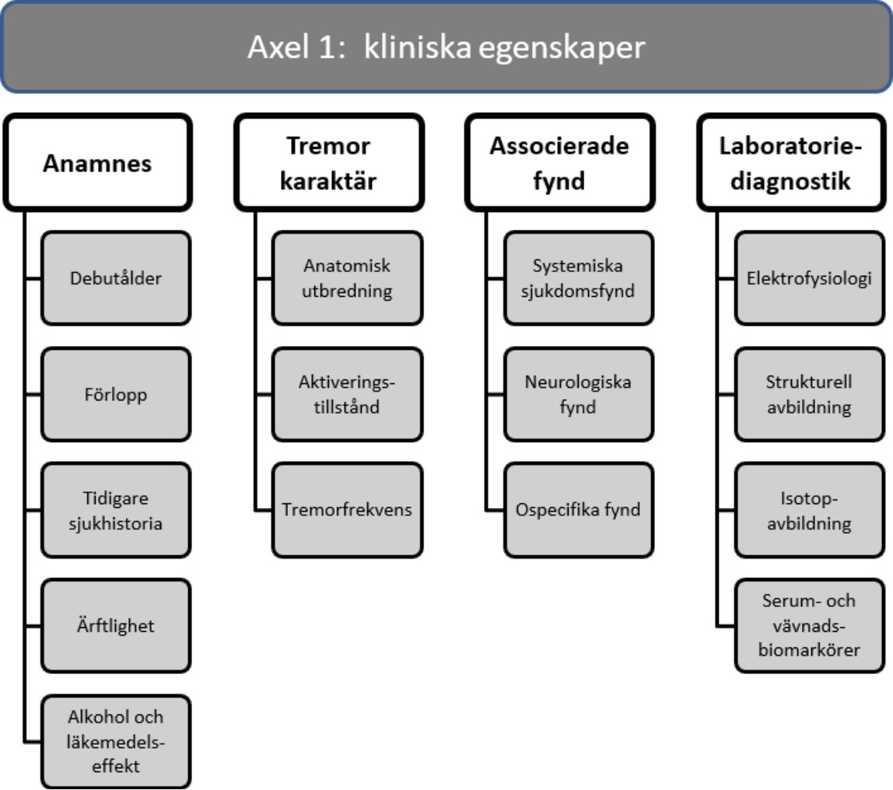
_Svenska riktlinjer för utredning och behandling av tremor, version 3 2026_ _9_

**Figur 2** : Översikt av etiologi till tremor, axel 2.

### Axel 2: etiologi

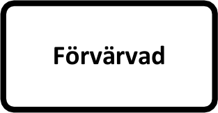

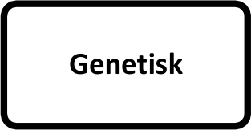

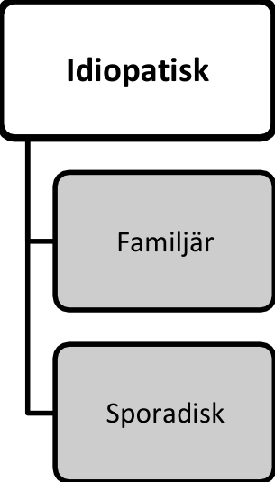

**Figur 3** : Indelning av tremorformer.

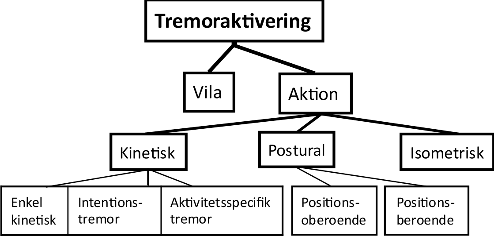
_Svenska riktlinjer för utredning och behandling av tremor, version 3 2026_ _10_

**Figur 4** : Tremorsyndrom och underformer.

### Övergripande diagnostisk strategi

Varje observation av en tremoraktivitet – i väntrum, under samtal eller formell undersökning är
giltig och tillräcklig för att fastställa förekomst av tremor; det är vanligt att vissa symtom
medvetet eller omedvetet kan undertryckas under vissa omständigheter varför anamnestiska
uppgifter kan vara av avgörande betydelse för att bestämma typ av tremor.

Efterfråga specifika funktioner som att föra mat till munnen, dricka eller bära saker i en hand
som en kopp, eller två händer som en bricka mm. Andra vanliga situationer som kan ge
information om påverkad funktion är telefonsamtal, skriva respektive finmotoriska göromål.

Det är av vikt att fastställa **huvudsaklig fenomenologi av tremor**  - främst förekomst av
**vilo** -, **postural**, och/eller **kinetisk** tremor. Kartlägg den anatomiska utbredningen och
eventuella specifika rörelser eller funktioner som påverkar förekomsten av tremor.

Neurologiskt och somatiskt status ger upplysningar om ev andra sjukdomstillstånd som kan
komplicera behandlingen, eller ger vägledning om diagnos.

Fullständig läkemedelshistorik och eventuella effekter på tremor av olika stimulantia,
som alkohol, koffein och nikotin, är av diagnostiskt intresse.

För att styra behandlingen är det ofta av intresse att kontrollera blodtryck och EKG, samt
förekomst av eventuell luftvägsobstruktivitet, eller astmatendens. Allergier påverkar ibland
möjligheter att ge behandling.

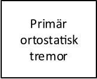

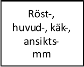

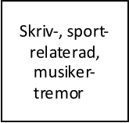

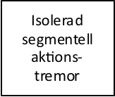

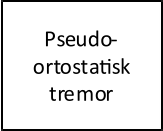

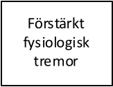

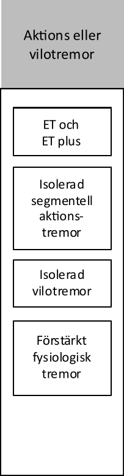

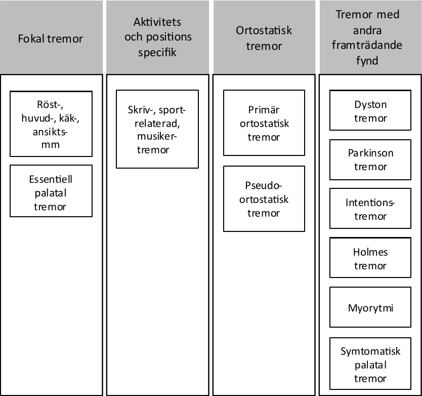

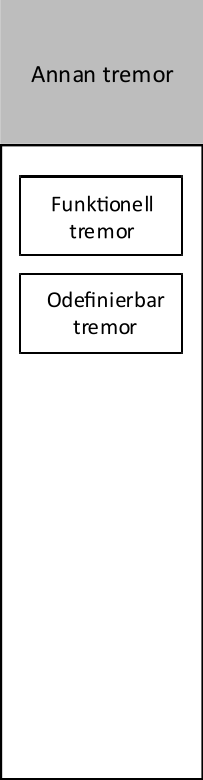
_Svenska riktlinjer för utredning och behandling av tremor, version 3 2026_ _11_

### Undersökningsteknik

**Enkelt standardiserat tremortest:**
1. Vilotremor: Patienten får sitta i stol, och avlastar armarna på karmar eller i knät. Patienten
skall ha händerna fria, och bör avledas för att lättare framhäva tremor.

2. Hållning och positionstest: Armarna hålls utsträckta med handflatan mot golvet (pronerad) i
minst 10 s. Därefter vrids handflatorna från det pronerade läget till att handflatorna är mot
varandra.

3. Hållning och positionstest: Armarna hålls flekterade i armbågsleden och handflatorna mot
varandra med ca 1 – 2 dm mellanrum.

4. Hållning och positionstest och målinriktat test: Armbågarna lyfts till axelhöjd och händerna
hålls i höjd med halsen. Efter det kan pekfingrarna hållas mot varandra, med ca 5 cm avstånd.

5. Rörelsetremor: En stor rörelse med hela armen så att rörelse genereras i axel-, armbågs- och
handlederna. Om rörelsen sker med öppna ögon och mot ett rörligt mål testar man integrationen
mellan synfunktionen och de basala ganglierna och detta förstärker ofta tremor. Ett klassiskt
finger-näs test med slutna ögon testar specifikt cerebellum och är lämpligt för att påvisa ataxi,
men är mindre lämpligt för specifik tremoranalys.

Under testet observeras eventuell tremor och effekterna av olika rörelser och hållningar.

Det kan vara svårt att identifiera vilken som är den dominerande tremorkomponenten.
Exempelvis kan en tremor som finns när patienten har handen mot armstödet på stolen, och ser
ut som en sann vilotremor, ändå vara en positionell tremor utlöst av att det finns kvar en
anspänning i kroppsdelen. Därför är det värdefullt att undersöka vad som händer med tremorn
vid rörelse från ett viloläge

Följande frågor bör besvaras:

Föreligger vilotremor – vilken kroppsdel är drabbad?

Vad händer med tremor vid rörelse från ett viloläge?

Tilltar tremorn, talar det för en dominerande kinetisk tremorkomponent.
Minskar tremorn, talar det för dominerande vilotremor, och basala ganglieorsak.
Föreligger positionell tremor?

Finns det muskelhypertrofi, smärta, eller avtar tremor i samband med att andra muskler kopplas in vid
vridning av handled eller motsvarande (s.k. noll-läge)? Talar för dyston tremor.
Minskar tremorn av ett sensoriskt trick – ”geste antagoniste”? Talar för dyston tremor.
Finns det tecken till dystoni i annan kroppsdel?
Föreligger kinetisk tremor (regelbundenhet, rytmiskt)?
Föreligger ataxi (oregelbundenhet vid rörelse)?

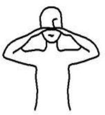

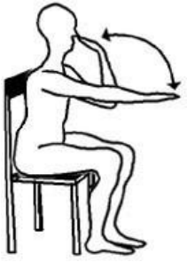

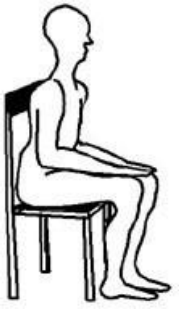

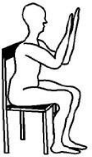

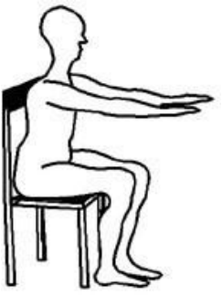
_Svenska riktlinjer för utredning och behandling av tremor, version 3 2026_ _12_

**Rit/skrivtest**

Testet utförs med instruktionen att patienten skall hålla i pennan, men får inte avlasta armen mot
underlaget eller på annat sätt låsa armen / handen. Arkimedes spiral ritas vanligen inifrån ut, och för
de tre linjerna börjar man vanligen med det bredaste mellanrummet. Bägge händerna prövas. Ett
skrivprov med en fullständig valfri mening kompletterar - detta kan genomföras med stöd mot
underlaget för att dokumentera eventuella kompensationer mot tremor som patienten har funnit vara
effektiva.

**Muggtest**

Två muggar/glas (helst hårda) med en del vatten hålls med utsträckta armar och vattnet hälls mellan
kärlen. Försök till att föra kärlet till munnen som för att dricka.

**Videodokumentation**

Om patient och teknik tillåter är en kort videoinspelning av stort värde. Bedömning av tremor
för diagnostik och för att följa behandlingseffekt lämpar sig mycket väl för dokumentation med
video. Ett standardiserat test enligt ovan 1-2 som tar ca 1 – 2 minuter att genomföra ger
vanligen en mycket god bild som speglar funktionell påverkan och ger hållpunkter för
tremortyp.

### Diagnoskoder

När en specifik tremorform kan diagnostiseras används en G-kod;

G 20.9 Parkinsons sjukdom
G 21.1 Annan läkemedelsutlöst sekundär parkinsonism
G 24.8 Andra specificerade dystonier
G 24.9 Dystoni, ospecificerad
G 25.0 Essentiell tremor
G 25.1 Läkemedelsframkallad tremor med tillägg av Y kod och ATC koden för läkemedlet, eller
G 25.2 Andra specificerade former av tremor

Symtomdiagnos

R 25.1 Ospecifik tremor

### Differentialdiagnostik - fenomenologi

**Ataxi**

Tremor kan misstas för ataxi och tvärtom. Definitionsmässigt är ataxi oregelbunden, och inte
oscillerande. Ataxi förekommer i extremiteter, men också bål. Samtidig förekomst av nystagmus är
ett observandum och talar för ataxi eller två samtidiga tillstånd. Ataxi kan vara ett delfenomen i
essentiell tremor plus-tillstånd, och kan utgöra ett svårbehandlat resttillstånd efter framgångsrik
behandling mot en kinetisk och/eller positionell tremorkomponent exv vid DBS-behandling.

**Dystoni**

En svår differentialdiagnos till essentiell tremor är dyston tremor. Tremor vid samtidig
förekomst av dystoni, i samma eller annan del av kroppen, är vanligen dyston tremor.
Isolerad nack-/huvudtremor utan tremor i armar är vanligen dystont orsakad. Essentiell tremor i
nacke är positionell och avtar i liggande, vilket vanligen inte sker för dyston nacktremor.
Dyston nacktremor är också förenad andra dystona symtom, som huvudvridning eller -tippning,

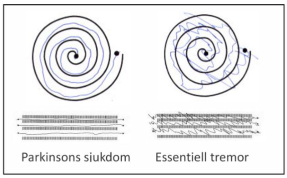
_Svenska riktlinjer för utredning och behandling av tremor, version 3 2026_ _13_

eller förekomst av ett sensoriskt trick.

### Patofysiologi

**1. Översikt – neurobiologiskt underlag**

De patofysiologiska mekanismerna skiljer sig åt för olika tremorformer. Såväl perifera faktorer
som faktorer i det centrala nervsystemet medverkar till att tremor uppstår.

Förenklat kan sägas att tremor som sjukdomsbegrepp uppstår när faktorer samverkar så att
ett elektrofysiologiskt oscillerande tillstånd uppstår, och att sjukdom uppstår när en normal
rörelsekontroll och funktion störs.

Perifera faktorer som bidrar är rent mekaniska trögheter i hud, senapparater och muskler, i
kroppsdelen fortplantade hjärt- och kärlpulsationer, samt reflexer på muskel- och spinalnivå.
De sistnämnda är mest involverade i fysiologisk och förstärkt fysiologisk tremor.

Centrala mekanismer som medverkar är taktgivare eller resonansfenomen i kretslopp mellan
olika regioner i hjärnan som ger upphov till olika typer av tremor och tremorfrekvenser. Det
finns flera hypoteser för att förklara parkinsonistisk vilotremor; att den drivs av talamiska
taktgivare; av pallido-talamisk resonans; av cerebello-talamo-kortikal resonans, eller av
patologisk synkronisering av neuron i globus pallidus. Gemensamt för dessa modeller är att de
tänkta resonansfenomenen påverkas direkt eller indirekt av dopaminreceptor-aktivitet.

Dopaminreceptoraktivitet utgör således ett neurobiologiskt underlag som förklarar
parkinsonistisk vilotremor och neuroleptikaframkallad tremor.

Andra neurobiologiska mekanismer bakom de empiriskt kända farmakologiska klasserna av
läkemedelmedel som kan avhjälpa tremorsymtom är en kolinerg rytmisk mekanism i pons och
hjärnstam samt i striatum, och en gabaerg/betaadrenerg mekanism i talamus samt i cerebellum.

Dessa taktgivare ger upphov till rytmicitet som är åldersberoende och frekvensen kan
moduleras med en rad olika farmaka och olika stimulantia som alkohol, koffein och nikotin.

Om en patient har en benägenhet, förvärvad eller genetiskt betingad, kan dessa motstridiga
sensoriska och motoriska impulser leda till ett självsvängande, oscillerande, elektrofysiologiskt
system i hjärnan med tremor som följd. Behandlingar som bryter dessa fenomen är effektiva
mot tremor.

De centrala tremormekanismerna är elektrofysiologiska system där läkemedel kan
frekvensmodulera taktgivare.

**Översikt – farmakologi**

Anatomiska intracerebrala taktgivare och deras farmakologi:

|NEUROTRANSMITTOR|FARMAKOLOGISKA GRUPPER|TREMOR|
|---|---|---|
|Acetylkolin|Antikolinergika minskar aktivitet i pontin taktgivare |Minskar |
|Acetylkolin|Kolinergika ökar tremor, t.ex. kolinesterashämmare|Ökar|
|Dopamin|Dopaminerga medel ökar impulstrafiken genom basala ganglierna, och minskar tremor|Minskar|
|Dopamin|Anti-dopaminerga medel minskar impulstrafiken och ökar tremor|Ökar|
|GABA|Medel som minskar aktivitet i talamiska kärnor ger mindre tremor. Alkohol, bensodiazepiner och vissa antiepileptika, och övriga sedativa|Minskar|
|Beta-Adrenergika|Betablockerare minskar frekvens i talamiska kärnor och minskar tremor|Minskar|
|Beta-Adrenergika|Betastimulerande medel ökar frekvens och ökar tremor|Ökar|

_Svenska riktlinjer för utredning och behandling av tremor, version 3 2026_ _14_

**Farmakologiska observationer**

Alkohol i små mänger kan ha en unik effekt på essentiell tremor – som kan minska på 1 – 2 cl
starksprit. Större mängder alkohol har en allmänt sederande effekt och kan då ha en tremorreducerande effekt t.ex. på Parkinsontremor. Anamnestiskt är det en (mycket) låg dos av
alkohol med tremorreduktion som är intressant.

Vid obehandlad Parkinsons sjukdom med hypokinesi och rigiditet är det inte ovanligt att
tremor framträder efter start av behandling med dopaminersättning. Denna tremor är att
betrakta som ett avslappningsfenomen från muskelrigiditet/kontraktioner som motverkar
vilotremor. Patienter bör informeras om att tremor inte speglar Parkinsonsjukdomens
svårighetsgrad.

Vid start av behandling med kolinesterashämmare kan tremor uppstå, men avtar vanligen
efter en tid. Detta kan betraktas som en kompensation av en ”tremorfaktor” som kan motverkas,
och individen har således en kompensatorisk kapacitet. Om en patient redan har ett
dopaminersättande läkemedel tex vid Parkinsons sjukdom och behandling med
kolinesterashämmare inleds, är det ovanligt att tremor påverkas eller utvecklas.

Behandling med olika betaadrenerga stimulerande medel ökar ofta tremor.

**Funktionsinskränkning på grund av tremor**

Tremor är också ett visuellt symtom, och det är inte ovanligt att patienter är själva omedvetna
om att de har tremor eller inte uppfattar tremorn som störande, medan anhöriga och andra
omgivande personer är mer störda. Den reella funktionsinskränkningen, inklusive patientens
upplevelse av stigma, bör analyseras, och inte eventuell grad av missprydande symtom. Det är
viktigt att klargöra för vems skull utredning och eventuell behandling görs.

### Icke-farmakologiska behandlingar

**Information**

Information om vad tremor står för och dess orsaker och möjliga behandlingar är
grundläggande för att hjälpa patienter med många former av tremor.

De flesta former av tremor ökar i amplitud och tremorfrekvens av olika former av
stimulantia som koffein och nikotin. Om detta är tydligt är en effektiv behandling att eliminera
så mycket av dessa faktorer som möjligt.

Läkemedel med potentiell tremorframkallande effekt kan elimineras eller dosreduceras.
De flesta former av tremor ökar vid muskulär och mental trötthet. Faktorer som minskar
detta i form av bättre ergonomi, anpassade arbetsuppgifter, eller sömnförbättrande åtgärder kan
ha effekt.

**Stressreduktion**

Många tremorformer ökar vid vissa situationer och patienter kan vittna om att försök till att
aktivt undertrycka tremor motverkar sitt syfte; tremorn ökar ofta istället.

Det finns dock metoder att hantera stressituationer som kan undertrycka tremor effektivt.
Mental och fysisk träning inför situationer när normal anspänning förekommer, kan minimera
tremor och åtgärder mot tremorförstärkande faktorer kan initieras när de identifieras.

Patienter med kinetisk eller positionell tremor kan i görligaste mån minska de mest
påverkande situationerna; tex att hålla rörelserna närmare kroppen istället för med
utsträckta armar; att använda tyngre föremål som inte påverkas lika mycket av tremor som
lätta.

**Hjälpmedel**

En arbetsterapeut kan bedöma om hjälpmedel kan avhjälpa svårigheter pga tremor, med
anpassning av arbetsställningar. Vissa hjälpmedel, som tyngre bestick kan vara effektiva. Det
finns också högteknologiska hjälpmedel som skedar och pennor med inbyggda mekaniska eller
elektroniska tremordämpningsystem som kan reducera tremoreffekter

_Svenska riktlinjer för utredning och behandling av tremor, version 3 2026_ _15_

**Referenser**

Albanese, A et al. Phenomenology and Classification of Dystonia: A Consensus Update. Movement
Disorders, 2013; 28: 7, 863-873.Bhatia, KP, et al for the Tremor Task Force of the International Parkinson
and Movement Disorder Society. Consensus statement on the classification of tremors. Movement
Disorders, 2018; 33: 1, 75-87.
Hallett M. Tremor: Pathophysiology. Parkinsonism Related Disord, 2014; 20: S118-S122.
Louis, ED. Essential tremor: a nuanced approach to the clinical features. Pract Neurol 2019;19:389–398.

## C. Tremortillstånd

### Förstärkt fysiologisk tremor

**Förekomst**

Tillståndet är vanligt och delvis åldersberoende. Prevalensen uppskattas till 10% av personer
över 50 års ålder.

**Etiologi**

Alla friska individer har en knappt synlig fysiologisk tremor och det är ett normaltillstånd.
Fysiologisk tremor kan påvisas över alla leder, och är en del av den normala kontrollen av
rörelser och hållning. En normal biologisk fördelningsdistribution för synlig tremor föreligger,
och är vanligen tydligast i mindre leder, med högfrekvent, lågamplitudig tremor. Större leder
har lägre frekvens.

Förstärkning av den fysiologiska tremorn kan ske genom förstärkta perifert verkande
reflexer, eller en påverkan av de centrala oscillatorerna (taktgivare).

**Primär form**

Utan identifierbar (icke-fysiologisk) faktor:
Kyla Muskulär uttröttning Anspänning Stress Oro

**Sekundär form**

Med identifierbar (yttre eller endogen) faktor:
Enkla stimulantia
Koffein/teofyllin Nikotin

Annan sjukdom eller annat tillstånd
Hypoglykemi Hypertyreos
Hypokalcemi Vitamin B12 brist
Njurinsufficiens
Alkoholabstinens

Övriga stimulantia
Amfetamin

Läkemedelsutlöst se även separat avsnitt
Betaadrenerga medel Adrenalin

**Symtom**

Bilateral extremitetstremor med relativt hög frekvens, finvågig men kan ha hög amplitud.
Övergående. Kan finnas i ansikte och stämband. Vanligen intermittent och utlöst av entydiga
situationer (köld, muskeluttröttning, tillfällig anspänning - rampfeber, tillfällig stress - rädsla,
skräck):

Vid mer frekventa, men situationsbetingade och konstanta symtom bör utredning ske med
avseende på sekundära former, främst läkemedelsutlöst eller betingad av endokrina faktorer.

Vid unilateral tremor, vid entydiga upprepade situationer, bör en patofysiologisk mekanism
eftersökas, som en mindre lesion/skada som antingen bidrar till tremor på ena sidan, eller slår
ut tremor på andra sidan. Lesionen kan vara central eller perifer.

_Svenska riktlinjer för utredning och behandling av tremor, version 3 2026_ _16_

**Differentialdiagnostik**

Utredning av sekundära former bör ske, då kausal behandling kan finnas.

**Diagnostik**

Anamnes Neurologiskt status
Allmänt somatiskt status Provtagning efter riktad anamnes

Individuellt inriktad utredning med undersökningar och provtagning baserat på anamnes och
symtom.

**Provtagning som kan övervägas**

Hypertyreos T4/TSH eller annan rekommenderad lokal utredningstradition
Hypoglykemi Glukos, HbA1c
Hypokalcemi Ca, albumin
Njurinsufficiens eGFR, kreatinin
B12 brist homocystein, kobalamin samt folsyra
Alkohol PEth, CDT

**Behandling**

Kausal behandling är indicerad för de sekundära formerna.

Ospecifik symtomlindrande behandling (t.ex. betablockad, intermittent om möjligt) fram
till kausal behandling är genomförd. Om man inte får tillräcklig effekt av behandlingen av
grundorsaken kan kompletterande icke-farmakologisk och farmakologisk tilläggsbehandling
minska symtom.

**Icke-farmakologisk**

Tydlig information om tillståndet är viktig för att skapa förståelse för tillståndet. Analys av
situationer, funktionsinskränkningar av reell tremor bör tas upp till diskussion.

För stressutlösta symtom kan stresshantering, ev situationsbetingad, och annan målinriktad
behandling vara effektiv.

**Farmakologisk**

Är sällan indicerad, men om inga kontraindikationer föreligger för betablockad är vanligen
propranolol effektivt (doser mellan 10-320 mg) intermittent eller kontinuerligt.

Om mer selektiv betablockad har bättre tolerabilitet kan atenolol också ha effekt.
Det är värt att notera att metoprolol enligt kontrollerade studier inte har tillräcklig effekt.
Om kontraindikation till betablockad föreligger kan gabapentin, intermittent eller
kontinuerligt ha effekt.

**Kirurgisk**

Kirurgisk behandling är aldrig aktuell mot förstärkt fysiologisk tremor. Ifrågasätt diagnos om
tremorn är så uttalad att kirurgi övervägs.

### Läkemedelsframkallad tremor

**Epidemiologi**

Tremor är en vanlig läkemedelsbiverkan.

Generella riskfaktorer för läkemedelsframkallad tremor är:

ålder
nedsatt njurfunktion, med nedsatt läkemedelsclearance
leversjukdom med nedsatt läkemedelsclearance
förekomst av hjärnlesioner
polyfarmaci med interaktioner

**Tremorkarakteristik**

Alla typer av tremor kan förekomma; vilotremor, positionell och kinetisk tremor, ofta med

_Svenska riktlinjer för utredning och behandling av tremor, version 3 2026_ _17_

blandformer. Vanligen symmetrisk.

**Diagnostik**

Läkemedelsanamnesen är viktig för att kartlägga samband mellan tremorförekomst och ändrad
läkemedelsbehandling.
Utsättningsförsök ger ofta ledtrådar.

Glöm inte att i diagnossättande ange Y-kod.

**Vanliga läkemedelsgrupper som kan ge upphov till tremor**

Anti-astmatiska / beta-adrenerga medel
Neuroleptika / antidopaminerga medel

Levotyroxin

Glykosider

Litium
Antidepressiva: SSRI, SNRI
Antiepileptika: valproat, karbamazepin, fenytoin, lamotrigin.
Kolinesterashämmare
Immunofiliner, cyklosporin, tacrolimus, sirolimus
Cytostatika t ex vinkristin, onkovin mfl

**Diagnoskoder**

G25.1 Läkemedelsutlöst tremor
G25.2 Andra specificerade former av
tremor R 25.1 Ospecifik tremor
[Y40-Y59 Ogynnsam effekt av droger, läkemedel och biologiska substanser i terapeutiskt bruk](http://icd.internetmedicin.se/diagnos/V01-Y98-Yttre-orsaker-till-sjukdom-och-dod.html)

### Essentiell tremor och essentiell tremor plus

**Definition**

Essentiell tremor (ET), är i regel ett godartat och oftast mycket långsamt progressivt
neurologiskt tillstånd som främst uttrycks som bilateral aktionstremor i övre extremiteter,
och mer sällan uttrycks i andra kroppsdelar som huvud, ben, bål, eller i rösten/stämbanden.

I stillasittande eller stående är skakningarna ofta inte synliga men de ökar vid aktivering av
de påverkade muskelgrupperna.

I den senaste MDS-klassifikationen är ET definierad utifrån det kliniska syndromet i axel 1.

Axel 1 definitionen är

1) Isolerad bilateral aktionstremor i övre extremiteter med
2) minst 3 års varaktighet och
3) med eller utan tremor i andra delar av kroppen (huvud, röst, nedre extremiteter) samt
4) avsaknad av andra neurologiska fynd som dystoni, ataxi, parkinsonism.

Om det utöver ET-syndromet finns smärre neurologiska fynd som inte i sig är tillräckliga för
att ställa en annan diagnos så betecknas tillståndet ET-plus. Detta begrepp infördes i MDSklassifikationen 2018 och har varit föremål för en del diskussion, men kan betraktas ur
perspektivet att ET är ett heterogent tillstånd med viss dynamik i symtomatologin. Till exempel
utvecklar många patienter inslag av lindrig ataxi med tiden. I vissa material är ET-plus
betydligt vanligare än ren ET och ET-plus kan också vara en övergång mellan ET och någon
annan tremordiagnos.

Exklusionkriterier för både ET och ET-plus är isolerad huvud- eller rösttremor, ortostatisk
tremor (>12Hz), positions- och aktivitetsspecifik tremor samt plötslig debut, eller stegvis
insjuknande. Om durationen är mindre än 3 år klassificeras ET-lik tremor som odefinierbar
tremor tills denna tid förlöpt. I nuläget finns ingen känd etiologi till ET och ET-plus och Axel 2
klassifikation saknas därför. Även om etiologin är okänd är familjära former vanliga och
hereditet skall därför efterfrågas.

Vid ET söker patienten ofta inte förrän sent i förloppet när skakningarna börjat bli ett

_Svenska riktlinjer för utredning och behandling av tremor, version 3 2026_ _18_

påtagligt handikapp i vardagen. En vanlig oro hos patienter och anhöriga är att det är
Parkinsons sjukdom och osäkerhet i diagnostiken kan motivera bedömning av neurolog, även
om ET i sina mildare former ofta kan handläggas inom primärvård.

**Epidemiologi**

ET och ET-plus förekommer i alla folkslag och drabbar bägge könen i ungefär samma
utsträckning. Förekomsten är uppskattad till 0,4% av populationen. Förekomsten av ET och
ET-plus ökar successivt med åldern och hos personer över 65 års ålder har man funnit en
prevalens på 4.6%. De familjära formerna debuterar före 40 års ålder och ET som debuterar
efter 60-65 års ålder kan misstänkas ha annan genes och vara associerad med sämre prognos.

**Diagnos**

Diagnosen ställs baserat på anamnes och neurologisk kroppsundersökning. Vid ET skall
neurologisk undersökning vara normal frånsett tremor i händerna. Tremor uppstår/ökar när
armarna sträcks fram eller belastas, samt under målriktade rörelser som när patienten uppmanas
placera fingertoppen på nästippen (kinetisk tremor). ET är oftast bilateral inom en relativt kort
tid efter debut, men kan vara unilateral under den första tiden. Förekomst av lindriga andra
neurologiska statusfynd av oklar signifikans, som t.ex. nedsatt tandemgång (balans), svag
misstanke om dyston felställning eller lindrig kognitiv påverkan är förenligt med ET plus. När
tremor är svårbedömd och det är svårt att utesluta parkinsonism kan undersökning med
isotopavbildning av DAT ofta särskilja ET från Parkinsons sjukdom eftersom personer med ET
har normal undersökning. Diagnoskriterier i bilaga H.

**Patofysiologi**

Den patofysiologiska mekanismen bakom skakningarna vid ET är okänd. Många
experimentella fynd talar för en abnormt ökad aktivitet i nervbanor mellan talamus,
hjärnstammen och lillhjärnan. Studier med positronemissionstomografi talar för en sänkt
aktivitet i hämmande GABA-transmission i dessa bansystem. Små lesioner i talamus ventrointermedius-kärna, liksom elektrostimulering där (DBS), kan kraftigt reducera amplituden på
skakningarna. Det är också känt att alkohol redan i små mängder kan ha en dämpande
inflytande på skakningarna.

**Etiologi**

ET är en dominant ärftlig sjukdom i ca 60% av fallen vilket medför att risken för patientens
barn att få sjukdomen är 50%. Man har dock ej funnit enskilda gener som förklarar familjär
ET. I en mycket omfattande studie fann man association till vissa polymorfismer, men de
genetiska orsakerna till ET är fortfarande oklara.

**Behandling**

När skakningarna ger upphov till funktionsinskränkning (motoriskt och/eller socialt) kan
behandling övervägas. Bäst evidens finns för propranolol i doser upp till 240-360 mg/d som
leder till klar förbättring hos ca 50-70% av personer med ET. Även andra oselektiva
betablockerare kan ha tremordämpande effekt vid ET men har sämre evidens. Primidon är en
barbiturat-prodrug som kan förskrivas med licens i dosen 50 eller 250 mg, eller extempore i
dosen 25 mg.

Det finns god evidens för att primidon har effekt på ET i doser mellan 150-750 mg/d och
troligen med något bättre effekt än propranolol även om biverkningsbilden är mindre
fördelaktig. Sedation och yrsel är vanligt men kan reduceras genom långsam upptrappning från
låg dos, t.ex. 25-50 mg x 1. Psykiatriska och kognitiva biverkningar bör beaktas.

Både propanolol och primidon kan påverka hjärtöverledning och det är motiverat att
kontrollera EKG både före och efter insättning.

Andra antiepileptiska läkemedel som kan ha tremordämpande effekter är topiramat och
gabapentin. Läkemedel leder dock sällan till mer än 50% reduktion av tremor, vilket är bra att
informera patienten om för att sätta rimliga förväntningar.

Mycket effektiv symtomlindrande behandling är DBS eller lesionell behandling såsom
MRgFUS i talamus.

_Svenska riktlinjer för utredning och behandling av tremor, version 3 2026_ _19_

[En patientorganisation (Riksföreningen för Essentiell Tremor; https://essentielltremor.se/ )](https://essentielltremor.se/)
kan erbjuda information och stöd.

**Referenser**

Louis ED and Ferreira JJ. How common is the most common adult movement disorder? Update on the worldwide
prevalence of essential tremor. Mov. Disord. 2010; 25: 534–541
Bain PG et al. A study of hereditary essential tremor. Brain 1994; 117 (Pt 4): 805–824.
Larsson T, Sjögren T. Essential tremor: a clinical and genetic population study. Acta Psychiatr. Scand. 1960;
Suppl. 36: 1–176.
Deuschl, G, Petersen I, Lorenz D, Christensen K. Tremor in the elderly: Essential and aging-related tremor.
Mov. Disord. 2015; 30: 1327–1334.
Ferreira JJ. et al. MDS evidence-based review of treatments for essential tremor. Mov. Disord. 2019; 34: 950–958
Deuschl G, Raethjen J, Hellriegel H, Elble, R. Treatment of patients with essential tremor. Lancet Neurol. 2011;
10: 148–161.
Louis ED. Tremor. Continuum 2019; 25 (4, Movement Disorders): 959-975.
Louis ED. Diagnosis and management of tremor. Continuum 2016; 22 (4, Movement Disorders): 1143-1158.
Skuladottir et al GWAS meta-analysis reveals key risk loci in essential tremor pathogenesis. Commun Biol.
2024;7(1):504.

### Cerebellär tremor

Denna tremor är oftast oregelbunden, har hög amplitud och ses inte i vila men både posturalt
och under rörelse, särskilt som intentionstremor med frekvens på 3-5 Hz. Huvud, bål och
händer påverkas oftast. De vanligaste orsakerna är stroke i bakre cirkulationen och
degenerativa sjukdomar. Man bör i första hand behandla bakomliggande sjukdom men
propranolol, klonazepam, karbamazepin och topiramat har visats ha effekt.

**Referens**

Lenka A, Louis ED. Revisiting the Clinical Phenomenology of "Cerebellar Tremor": Beyond the Intention
Tremor. Cerebellum. 2019;18(3):565-574.

### Ortostatisk tremor

**Fenomenologi**

Ortostatisk tremor (OT) är en ofta förbisedd diagnos som yttrar sig som en högfrekvent (13-18
Hz) tremor i stående position vilket ger en känsla av ostadighet som kan vara mer påtaglig än
känslan av skakning. Tremorn drabbar framför allt benen och bålen men även armar och
ansiktsmuskulatur kan involveras. Tremorn är alltid bilateral och uppkommer efter några
sekunder till minuter i stående. Om patienten lutar sig mot något eller sätter sig ner minskar
tremorn signifikant i amplitud eller upphör helt. Så länge patienten är i rörelse kan tremorn ofta
avvärjas. Patienterna besväras påtagligt av en ostadighetskänsla och beskriver rädsla för att
ramla. Fallincidensen ökar dock inte i proportion med obehaget, även om det finns en ökad
fallrisk och en försämrad balansförmåga

Man skiljer mellan primär OT (13-18 Hz och avsaknad av andra neurologiska symtom),
långsam OT (under 10 Hz) och OT plus. Vid OT plus kan bland annat vaskulär parkinsonism,
Parkinsons sjukdom eller Willis-Ekboms sjukdom förekomma.

**Utredning**

Tremorn vid OT kan vara svår att se och neurologiskt status kan vara invändningsfritt vilket
gör att diagnosen ofta fördröjs. Även om tremorn kan registreras visuellt, palperas och
auskulteras med stetoskop (”helicopter sign”), bör EMG i stående göras för att säkert kunna
diagnosticera OT. Det typiska EMG-fyndet är en tremorös aktivitet med en frekvens runt 16
Hz. OT kan ofta påvisas på balansplatta.

**Etiologi**

Då tremorn är synkroniserad och alltid uppkommer bilateralt är den sannolikt utlöst på central
nivå. Patofysiologin är oklar. Det diskuteras om det finns ett centrum som fungerar som en
central oscillator på hjärnstams- eller spinal nivå, eller om tremor orsakas av en störning i det
cerebello-thalamo-kortikala nätverk som justerar rörelser för att bibehålla balans.

_Svenska riktlinjer för utredning och behandling av tremor, version 3 2026_ _20_

**Behandling**

OT har visat sig vara svår att behandla med läkemedel. En del patienter svarar dock på
klonazepam eller bensodiazepiner. Även gabapentin har visats ge symtomlindring i två små
placebokontrollerade studier. Alkohol kan ha en lindrande effekt. Enstaka patienter har
svarat på propranolol, antikolinergika, baklofen, primidon, perampanel, zonisamid,
levodopa och dopaminagonister, eller kombinationer av ovanstående preparat.
Kirurgisk behandling som ryggmärgsstimulering och DBS har visat sig ha positiv effekt
hos vissa med OT. Bilateral DBS i VIM talamuskärnan har visats förbättra tremorn hos
patienter med behandlingsrefraktär OT, vilket stärker tesen att det finns en störning i det
cerebello-talamo-kortikala nätverket. Effekten är dock inte lika stor som vid behandling av ET,
vilket tyder på att den primära patologin vid OT inte är belägen i VIM.

**Referens**

Rigby HB, Rigby MH, Caviness JN. Orthostatic tremor: a spectrum of fast and slow frequencies or distinct
entities? Tremor Other Hyperkinet Mov 2015; 5-11.

### Tremor vid idiopatisk Parkinsons sjukdom

**Patofysiologi**

Vilotremor, bradykinesi och rigiditet vid Parkinsons sjukdom orsakas primärt av nigrostriatal
degeneration. Tremor beror på oscillerande neuronal aktivitet i centrala nervsystemet och anses
inte vara kopplad till några perifera faktorer. Talamus har en särskild betydelse i kontakten
mellan basala ganglier och motorcortex och är därför ett lämpligt mål för DBS vid
tremordominant sjukdom.

**Klinisk bild**

Vid idiopatisk Parkinsons sjukdom är vilotremor typisk, men inte patognomon. Skakningarna
uppträder i vila – vid debuten oftast i en arm – och kan vara det symtom som för patienten till
sjukvården. Unilateral symtomdebut är typiskt för idiopatisk Parkinsons sjukdom, men
förekommer vid andra tillstånd.

Den karakteristiska vilotremorn talar starkt för idiopatisk Parkinsons sjukdom – diagnosen
är korrekt i över 90 % av fallen om den baseras just på vilotremor. Frekvensen av skakningen
är omkring 4-6 Hz och kan se ut som "pillertrillartremor" i fingrarna. Ibland kan frekvensen
vara högre tidigt i förloppet. Tremorn upphör eller reduceras påtagligt vid rörelse, men vid
armar-framåt-sträck kan den återkomma kort efter att den nya handpositionen nåtts (reemergent tremor, återkommen tremor).

Vilotremor är oftast inte fysiskt funktionshindrande men kan upplevas socialt besvärande.
Vid tremor kan kugghjulsrigiditet noteras vid undersökning. Stress och oro kan framkalla
tremor, ett faktum som gör att man kan provocera fram tremor om den just vid
undersökningstillfället saknas. Om man vill undersöka tremorförekomst i övre extremiteterna
ska patienten sitta med händerna vilande mot knäna och koncentrera sig på t.ex. huvudräkning.
Gång kan ofta framkalla vilotremor i en hand när den hänger avslappnad under annan aktivitet.

Vilotremor förekommer oftast i arm/hand/fingrar, men kan också ses i nedre extremiteterna,
bålen, hakan och läpparna. Käktremor förekommer mest vid öppen mun, medan vid ET
förekommer tremor i käken främst vid stängd mun.

Postural tremor och aktionstremor kan förekomma, men tidigt i sjukdomsförloppet är det
ovanligt. Tremorn kan då störa aktiviteter, men intentionstremor förekommer inte vid
idiopatisk Parkinsons sjukdom. Vilotremor dominerar.

Tremor vid Parkinsons sjukdom är vanligen’off’-relaterad, dvs uppträder bara i perioder av
suboptimal behandlingseffekt. Tremor kan också förekomma i en ”on-liknande” fas. Efter start
av dopaminersättning kan tremor ibland framträda tydligare som en effekt av att rigiditeten
minskar. Det är viktigt att skilja tremor från dyskinesier som induceras av dopaminerga
läkemedel, eftersom de båda tillstånden vanligen behandlas på diametralt motsatta sätt. Typiskt
är att tremor är mer regelbundna, alternerande rörelser och med lägre amplitud.

Tremordominant Parkinsons sjukdom är vanligare bland yngre personer, medan äldre oftare
har en akinetisk-rigid variant. Den tremordominanta varianten anses ha långsammare progress

_Svenska riktlinjer för utredning och behandling av tremor, version 3 2026_ _21_

och anses vara mer lättbehandlad men också förenad med mer motoriska fluktuationer. Det är
något vanligare med tremor bland kvinnor med Parkinsons sjukdom. I sena stadier av
sjukdomen kan tremor avta och bradykinesi blir dominerande.

**Differentialdiagnostik**

Monosymtomatisk vilotremor;
Parkinsons sjukdomsdiagnos kan inte ställas förrän bradykinesi och rigiditet tillkommer, vilket
kan dröja många år. Isotopavbildning kan påvisa dopaminerg denervation hos dessa patienter
och man kan alltså betrakta det som ett förstadium till Parkinsons sjukdom.

Essentiell tremor – Essentiell tremor plus.
Dyston tremor.

Begreppet SWEDD (scans without evidence of dopamine deficiency) avser patienter med
unilateral tremor och bl.a. hypokinesi, men med normal dopaminavbildning, orsakas ofta av
dyston tremor. Upp till 10% av patienter som bedömts ha tidig Parkinsons sjukdom som har
deltagit i studier med tidigt debuterande sjukdomstillstånd, men dominerande tremor som
symtom, har efter utredning bedömts vara SWEDD.

**Behandling**

Tremor vid idiopatisk Parkinsons sjukdom behandlas i första hand med dopaminerga läkemedel
(L-DOPA, dopaminagonister, MAO-B-hämmare). Effekten kan dröja veckor till månader tidigt
i sjukdomsförloppet men är sedan i regel god, precis som effekten på bradykinesi.

Om parkinson-läkemedlen har otillräcklig effekt trots dosoptimering kan behandling med
antikolinergika övervägas, dock med risk för kognitiva biverkningar.

DBS i talamus VIM-kärna, eller zona incerta är effektiva behandlingar mot parkinsontremor.
Unilateral talamusstimulering kan ges vid ensidig tremordominant sjukdom, men bilateral
stimulering kan också användas vid mer omfattande tremor. Talamusstimulering har i princip
ersatt talamotomi. Bilateral DBS mot subthalamicus-kärnorna (STN) är också effektiv mot
tremor och används när fler symtom än tremor är besvärande. STN-DBS är därför vanligare än
VIM-DBS.

Läkemedel som ges vid essentiell tremor används sällan vid parkinsontremor, såvida inte
patienten har båda sjukdomarna samtidigt, vilket kan förekomma. Det har också beskrivits att
propranolol kan lindra parkinsontremor. Klozapin, ett atypiskt neuroleptikum, kan lindra
parkinsontremor, men kräver monitorering av leukocyter pga risk för agranulocytos.
Zonisamide i låga doser (≤ 50 mg) kan också lindra parkinsontremor i vissa fall.

#### Från SWEMODIS Terapiråd vid Parkinsons sjukdom 2025 version 10

**Tremor**

Behandlingen av tremor bör inrikta sig på faktiska funktionshinder för arbete, störningar i
ADL-funktioner eller sömn. Man bör diskutera med patient och anhöriga vad som utgör
problemet. Tremor som generande symtom utan funktionshinder, bör man vara försiktig med
insatser emot, då detta kan leda till överbehandling i förhållande till andra funktioner med risk
för snabbare utveckling av komplikationer. Tillfälliga belastningar och stressframkallande
episoder med tremor kan eventuellt behandlas med tillfälliga, icke-dopaminverkande medel.

_Svenska riktlinjer för utredning och behandling av tremor, version 3 2026_ _22_

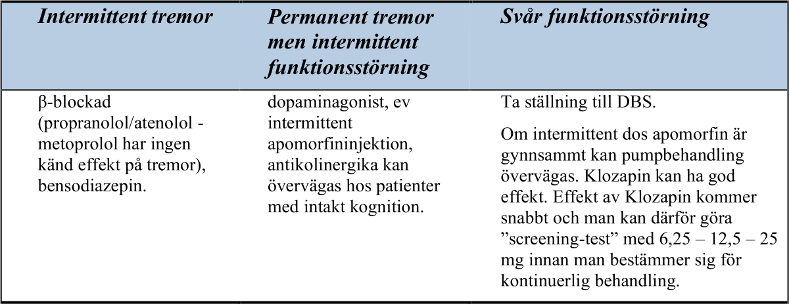

### Dyston tremor och tremor associerad med dystoni

**Fenomenologi**

Dyston tremor är tremor i en kroppsdel som även uppvisar tecken till dystoni. Om dystoni
saknas i den tremordrabbade kroppsdelen men förekommer i annan kroppsdel heter tillståndet
_tremor associerad med dystoni_ .

Dystoni definieras som upprepade, ihållande samtidiga kontraktioner av motverkande muskler
kring en led som leder till onormal hållning eller repetitiva rörelser. Ett vanligt exempel är
dyston huvudtremor hos en patient med cervikal dystoni.

Dyston tremor kan vara unilateral eller bilateral, vara positionell eller relaterad till
muskelaktivitet (aktion) men finns sällan i vila. Nacktremor vid ET avtar i liggande, men kan
bestå vid dyston tremor.

Dyston tremor kan vara oregelbunden, med plötsliga exacerbationer (”flurries”) och kan
försvinna i vissa lägen (”null point”) där musklerna slappnar av.

Dystoni-inslaget kan ibland vara svårt att upptäcka. Det finns flera fenomen associerade med
dystoni som man kan titta efter:

geste antagoniste
mirror dystonia
overflow dystonia
aktionsdystoni vid initiering av rörelser
dystona inslag som bara förekommer i samband med svårare motoriska eller kognitiva uppmaningar

Isolerad kinetisk och positionstremor, som enbart förekommer vid mycket specifika
aktiviteter (t ex skrivtremor, rösttremor) är föremål för diskussion, huruvida den är en dyston
tremor eller en helt unik, isolerad tremor.

Dyston tremor kan förväxlas med essentiell tremor om det dystona inslaget är diskret och
kan missas. Den kan ibland även förväxlas med tremor vid Parkinsons sjukdom.

**Etiologiska och utredningsmässiga aspekter**

Liksom dystoni kan dyston tremor vara idiopatisk, sekundär till andra sjukdomar [t.ex. Wilsons
sjukdom (kontrollera leverstatus, ceruloplasmin, S-koppar, mm)], sporadisk eller ärftlig
(överväg genetiska tester t ex DYT1).

**Behandling**

Behandlingen är i princip densamma som vid dystoni, där följande alternativ kan övervägas
utifrån symtombild:

 - levodopa (om levodopa responsiv dystoni, främst hos unga) 100 mg x 3, eller högre doserantikolinergika
trihexyfenidyl 3-15 mg/dag

 - orfenadrin (100 mg x 2-3, ett antikolinergt och antihistaminergt medel)

 - betablockerare propanolol 120-240 mg/dag

 - benzodiazepiner klonazepam 1,5-6 mg/dag

 - gabaerg baklofen 15-60 mg/dagl.

_Svenska riktlinjer för utredning och behandling av tremor, version 3 2026_ _23_

 - VMAT-hämmare tetrabenazine 25-75 mg/dag

 - botulinumtoxin utvalda muskler

 - djup hjärnstimulering (DBS) – i första hand i globus pallidus (GPi).

**Referenser**

Bhatia KP, Bain P, Bajaj N, Elble RJ, Hallett M, Louis ED, Raethjen J, Stamelou M, Testa CM, Deuschl G;
Tremor Task Force of the International Parkinson and Movement Disorder Society. Consensus Statement on the
classification of tremors. from the task force on tremor of the International Parkinson and Movement Disorder
Society. Mov Disord. 2018 Jan;33(1):75-87.
Louis ED. Tremor. Continuum (Minneap Minn). 2019 Aug;25(4):959-975.

### Neuropatisk tremor

**Fenomenologi**

Postural och kinetisk tremor som liknar förstärkt fysiologisk eller essentiell tremor, med en
frekvens på 6-8 Hz.

**Etiologi**

Kan misstänkas vid gradvis uppkommande tremor hos en patient med säkerställd polyneuropati
som vid

IgM-paraproteinemi
Chronic inflammatory demyelinating polyneuropathy (CIDP)
Guillain-Barré syndrom
Multifokal motorisk neuropati (MMN)
Hereditär polyneuropati
Checkpointhämmare

**Behandling**

Kausal behandling av den underliggande neurologiska sjukdomen

Symptomatisk behandling med sedvanliga tremorpreparat (propanolol, primidon, gabapentin)

Om behandling av smärtsam polyneuropati är indicerat välj preparat som kan ha gynnsam
effekt på tremorkomponenten och undvik tremorförstärkande preparat

VIM-DBS har prövats.

**Referens**

Becktepe JS, Goevert F, Deuschl G. Rare tremor syndromes. Nervenarzt 2018; 89(4): 386-393.

### Palatal tremor (Tremor i mjuka gommen)

**Fenomenologi**

I. Primär palatal tremor (mjuka gomstremor, gomtremor) – (engelska ”essential palatal
tremor”)

Enbart isolerade, 1-3 Hz rytmiska kontraktioner av m. tensor veli palatini, vilket orsakar
klickljud i örat. Inga övriga neurologiska symptom.

II. Sekundär (symtomatisk) gomsegeltremor

1-3 Hz rytmiska kontraktioner av m. levator veli palatini, vilket orsakar ofrivilliga, oftast
symmetriska rörelser i mjuka gommen och i farynx. Klickljud i örat kan förekomma men är
mindre vanligt än vid den primära formen. Även andra rörelsefenomen kan uppträda till
följd av påverkan på hjärnstams- och spinalinnerverade muskler samt på cerebellum:

(1) rörelser i ansiktet
(2) rörelser i ögonmusklerna (okulär myoklonus, pendular nystagmus) –
kombinationen kallas okulopalatal tremor
(3) tremor i bål- och extremitetsmuskulaturen
(4) ataxi

_Svenska riktlinjer för utredning och behandling av tremor, version 3 2026_ _24_

**Etiologi**

Den primära formen är idiopatisk.
De sekundära formerna kan ha olika etiologi:

(1) förvärvade skador: lesioner i tractus dentato-rubro-olivarius (Guillain-Mollarets triangel) till följd av stroke
(oftare hemoragisk än ischemisk), trauma, demyelinisering, tumör
(2) hereditär och sporadisk neurodegeneration som visar sig som gomsegeltremor, progredierande ataxi,
nystagmus och andra neurologiska störningar

Alexanders sjukdom
Polymeras gamma-mutationer
Spinocerebellär ataxi 20, neurodegeneration kan vara associerad med cerebellär atrofi

**Utredning**

Viktigt att utreda bakre skallgropen med tanke på möjlig etiologi.
MR-hjärna; fynd: hypertrofisk degeneration av oliva inferior, dock ej alltid förekommande.
En viktig differentialdiagnos är funktionell palatal tremor som kännetecknas av fenomenet
”entrainment”, vilket innebär att tremorfrekvensen antar samma frekvens som annan
aktivitet, t ex handknytning.

**Behandling**

Bilateral botulinumtoxininjektion i mm. tensor och levator veli palatini. Rapporter finns om
trihexyfenidyl, gabapentin och memantin (de två sista för nystagmuskomponenten).

**Referenser**

Tilikete C, Desestret V. Hypertrophic Olivary Degeneration and Palatal or Oculopalatal Tremor. Front Neurol.
2017; 8: 302.
Khoyratty F, Wilson T. The dentato-rubro-olivary tract: clinical dimension of this anatomical pathway. Case Rep
Otolaryngol. 2013; 934386.

### Holmes tremor och talamisk tremor

**Klinisk bild**

Följande kriterier kännetecknar Holmes-tremor:

Vilo- och intentionstremor. En postural tremor kan förekomma.
Tremorn är ofta inte lika rytmisk som andra former av skakningar.
Låg tremorfrekvens, mestadels under 4,5 Hz, och hög amplitud

Om en hjärnskada kan identifieras (t ex hjärnstamsinfarkt), är det vanligtvis en latens (4 veckor
till 2 år) mellan lesionen och debut av tremor.

Talamisk tremor uppträder efter lesioner i dorsolaterala talamus.

Kliniskt kan man vid båda tillstånden finna en variabel kombination av vilo-, postural, och
intentions-tremor samt dystoni, och endast radiologiska undersökningar möjliggör
differentialdiagnos.

**Behandling**

Farmakoterapi är sällan framgångsrik vid dessa former av tremor.
I enskilda fall fungerar:

Levodopa (<1200 mg/dag), som vid terapisvar kan kombineras med
dopaminagonister
Trihexifenidyl (2-12 mg/dag)
Klonazepam (0,5-4 mg/dag)
Klozapin (<75 mg/dag)
Levetiracetam (upp till 3000 mg/dag)

Det finns fallrapporter kring framgångsrika stereotaktiska behandlingar (VIM-stimulering eller
talamotomi). Om läkemedelsbehandling inte lyckas och patienten uppvisar en allvarlig
funktionsnedsättning kan detta övervägas.

_Svenska riktlinjer för utredning och behandling av tremor, version 3 2026_ _25_

Behandling av talamus-tremor med djup hjärnstimulering är särskilt svår, eftersom VIM ligger i
det skadade området.

**Referens**

Deuschl G, Bain P, Brin M. Consensus statement of the Movement Disorder Society on Tremor. Ad Hoc
Scientific Committee. Mov Disord. 1998;13 Suppl 3:2-23.

### Funktionell tremor

Att ställa denna diagnos kräver god förtrogenhet med rörelsestörningar. Tremor är ett av de vanligaste
funktionella motoriska symtomen, men de flesta motorikstörningar har en funktionell motsvarighet.
Funktionella motoriska symtom är onormala rörelser, eller avsaknad av rörelser, i den viljemässiga
motoriken, som upplevs som ofrivilliga. De karaktäriseras av extern påverkbarhet - de minskar med
distraktion och ökar med uppmärksamhet. Symtomen är inkonsistenta och inte kongruenta med andra
neurologiska orsaker.

**Fenomenologi**

Akut debut är vanligt, ibland vid en speciell händelse såsom panikattack. Funktionell tremor kan
uppkomma varsomhelst i kroppen, till och med som palatal tremor. Det är vanligast att den sitter i
övre extremiteter, ofta med stor amplitud, men den brukar inte sitta i fingrar. Diagnosen baseras på en
sammanvägning av typiska karaktäristika med positiva funktionella statusfynd – det är inte en
uteslutningsdiagnos. Funktionella motoriska symtom, inklusive tremor, kan förekomma samtidigt
med annan sjukdom, så kallad ”funktionell pålagring”. Ofta förekommer olika funktionella symtom
hos samma person, och ibland är de delsymtom i somatiseringssyndrom. Andra funktionella
neurologiska symtom är sensoriska, kognitiva, och icke-epileptiska anfall.
Personer med funktionella symtom har ökad förekomst av depression, ångest och stressorer. Dessa
faktorer behöver inte dock inte finnas för diagnos, och orsakssamband är inte bevisat. Bland annat
därför är termen funktionell bättre än den äldre termen psykogen.
I status observeras variabilitet och påverkbarhet vid funktionell tremor (som vid andra funktionella
motorikstörningar). Variabiliteten ses i tremorns frekvens, riktning, amplitud och vid vilket
aktiveringsstatus samt var i kroppen den uppkommer. Påverkbarheten ses genom att tremor ökar med
uppmärksamhet och upphör eller minskar vid en samtidig annan motorisk eller kognitiv uppgift
(avledbarhet). Den kan också fås att anta samma frekvens som en annan rörelse, som patienten utför i
takt med undersökaren (entrainment). Andra karaktäristiska fynd är tonisk ko-kontraktion vid
tremorstart och att när undersökaren fixerar den skakande kroppsdelen, sprider sig tremorn till en
annan kroppsdel (”whack-a-mole sign”).

**Etiologi / patofysiologi**

Etiologin är ofullständigt kartlagd, men det rör sig om en störning i cerebrala nätverk som inkluderar
motorisk kontroll, prediktiv kodning, uppmärksamhet, emotionella processer, interoception, och
påverkad känsla av ”agency”, det vill säga känslan att man själv är upphovet till handlingar (och att
dessa inte bara händer en). Denna nätverksstörning påverkas av biopsykosociala faktorer: individuell
sårbarhet, utlösande faktorer, samsjuklighet och vidmakthållande faktorer.
Exempel på sårbarhetsfaktorer är andra funktionella tillstånd (exempelvis IBS, smärtsyndrom), andra
neurologiska och medicinska tillstånd, psykologisk påverkan av stressande livshändelser, ångest,
depression, barndomstrauma, genetiska riskfaktorer. Ibland identifieras ingen sårbarhetsfaktor.
Exempel på utlösande faktorer är fysisk skada, psykologiskt trauma, läkemedelsbiverkning,
panikångest, PTSD, dissociation, depression.
Exempel på samsjuklighet är psykologiska /psykiatriska tillstånd med ångest, depression, PTSD,
emotionell instabilitet, annan neurologisk eller medicinsk sjukdom andra funktionella syndrom,
exempelvis IBS, kronisk smärta, eller fatigue.
Exempel på vidmakthållande faktorer är diagnostisk osäkerhet, feldiagnos som annat tillstånd,
bristfällig kommunikation, avsaknad av behandling för funktionellt tillstånd, onödiga utredningar,
behandlingar, eller operationer, sederande läkemedel eller opioider, olika hinder för tillfrisknande,
undvikandebeteende och låg motivation för tillfrisknande.

_Svenska riktlinjer för utredning och behandling av tremor, version 3 2026_ _26_

**Epidemiologi**

Funktionella neurologiska tillstånd är vanliga, men det finns betydande osäkerhet i epidemiologiska
studier, där incidens har beräknats till minst 10-22/100 000, och prevalens minst 80-140/100 000.
Svenska och skotska studier anger incidens av motoriska funktionella symtom till 4-5 /100.000 och
funktionell tremor anges till 40 – 50% av dessa.

**Behandling**

Behandlingens första steg är att patienten och närstående ska förstå och lita på diagnosen. Det görs
genom noggrann undersökning i kombination med att man etablerar en tillitsfull och empatisk
patient-läkarrelation, som inger trygghet och gör patienten delaktig i behandling och planering.
Berätta att diagnosen är funktionell tremor och förklara att funktionella neurologiska symtom är
vanliga. Försäkra att funktionell tremor inte innebär fejkade eller inbillade symtom. Förevisa gärna de
positiva funktionella undersökningsfynden. Förmedla en individuellt anpassad och begriplig
förklaring om uppkomst, inkluderande både mekanismer och biopsykosociala aspekter. Föreslå
behandlingsstrategi. Ibland kommer man långt bara genom att patienten förstår tillståndet, men ofta
används fysioterapeutiska rörelseövningar inklusive biofeedback, där man utnyttjar tremorns
avledbarhet och entrainment, i kombination med avslappningsövningar med mera. Behandla och
beakta eventuell samtidig psykiatrisk / psykologisk samsjuklighet och vidmakthållande faktorer.
Multidisciplinära team-insatser kan vara värdefulla.

**Differentialdiagnoser**

**Alla andra orsaker till tremor.** De positiva funktionella statusfynden skiljer tillståndet från dessa.

**Simulering** (Z76.5, engelskans ”malingering”) är uppvisande av symtom, fysiska eller psykiska, som
sker i syfte att uppnå fördelar med det simulerade symtomet/sjukdom. Fenomenologiskt kan det på
individnivå ännu inte skiljas ifrån funktionell tremor.

**Fysiologisk faciliterad sträckreflex** . Vanligast i knä-/fotleden är inte funktionell tremor, utan ett
vanligt normalt tillstånd med tremor i benet, som uppstår vid belastning mot underlaget och med
tonus över lederna. Kan även uppstå i övre extremitet.

**Diagnos**
ICD-10 kod: F 44.4W Annan specificerad psykogen motorisk störning

**Referenser**

Bartl M, Kewitsch R, Hallett M, Tegenthoff M, Paulus W. Diagnosis and therapy of functional tremor a systematic review
illustrated by a case report. Neurol Res Pract. 2020;2:35.
Finkelstein SA, Diamond C, Carson A, Stone J. Incidence and prevalence of functional neurological disorder: a systematic
review. J Neurol Neurosurg Psychiatry. 2025;96(4):383–95.
Hallett M, Aybek S, Dworetzky BA, McWhirter L, Staab JP, Stone J. Functional neurological disorder: new subtypes and
shared mechanisms. Lancet Neurol. 2022;21(6):537–50.
Perez DL, Nicholson TR, Asadi-Pooya AA, Begue I, Butler M, Carson AJ, et al. Neuroimaging in Functional Neurological
Disorder: State of the Field and Research Agenda. Neuroimage Clin. 2021;30:102623.
Schwingenschuh P, Espay AJ. Functional tremor. J Neurol Sci. 2022;435:120208.
Stamelou M, Saifee TA, Edwards MJ, Bhatia KP. Psychogenic palatal tremor may be underrecognized: reappraisal of a
large series of cases. Mov Disord. 2012;27(9):1164–8.

_Svenska riktlinjer för utredning och behandling av tremor, version 3 2026_ _27_

## D. Neurokirurgisk behandling av tremor

### Metoder, biverkningar

Neurokirurgisk behandling av rörelserubbningar har lång tradition i Sverige. Stereotaktisk
lesionell behandling med bl a pallidotomi och talamotomi föregick effektiv farmakologisk
behandling vid sjukdomar med rörelserubbning. Med hjälp av en i hjärnan införd elektrod
lesionerades centrala kärnor genom upphettning av elektrodspetsen – ofta dock efter att
elektrostimulering nyttjats för att hos vaken patient värdera effekten.

Sedan mitten av 1990-talet har emellertid de tidigare lesionella neurokirurgiska teknikerna
ersatts av högfrekvent elektrostimulering i hjärnan (Deep Brain Stimulation, DBS, djup
hjärnstimulering).

DBS har flera fördelar gentemot lesionella tekniker: orsakar endast obetydlig
hjärnparenkymskada, genom att vara justerbar i relation till individuell symtomatologi och
symtomutveckling, samt genom metodens reversibilitet.

DBS är numera en neurokirurgisk rutinmetod för behandling av tremor och andra
rörelserubbningar. Lesionella tekniker nyttjas fortfarande. På senare tid har dessutom
lesionella tekniker tillkommit som inte kräver att skallbenet öppnas.

### DBS – Deep brain stimulation, djup hjärnstimulering

Operation med DBS görs antingen med patienten vaken eller sövd. Förbättrad pre- och
intraoperativ radiologisk avbildningsteknik har inneburit att man på senare år på många centra
kunnat övergå till operation med sövd patient. Vanligen krävs inte helrakning för DBSoperation.

DBS-tekniken innebär att permanenta elektroder, ≈1.3 mm i diameter, implanteras med hög
precision i basalganglieområdet och ansluts till en impulsgivare (IPG/Implantable Pulse
Generator). Impulsgivaren är programmerbar för variation av det elektriska fältets
konfiguration. Elektroderna har multipla elektrodytor/poler som kan kopplas på eller av
individuellt.

Elektrostimuleringens styrka, impulsfrekvens och impulsvidd kan varieras efter behov
genom extern programmerare. Patienter kan också erhålla egna kontrollenheter, som kan
möjliggöra för användaren att göra modifieringar av inställningar och vid behov koppla på eller
av stimuleringen.

Mekanismen för effekten är inte helt klarlagd, men i huvudsak utnyttjas en blockerande
effekt på sekundär neuronal överaktivitet antingen direkt genom depolarisationsblockad eller
indirekt genom stimulering av inhibitoriska neuron. På så sätt uppnås liknande effekter som vid
lesionskirurgi. I likhet med farmakologisk behandling är den neurokirurgiska behandlingen
symtomatisk och målet är att förbättra patientens funktionstillstånd till en högre grad av
oberoende.

Kirurgisk komplikationsrisk vid DBS-kirurgi är låg: symtomgivande blödning <1 %;
infektion <3 %. Elektroniska fel i utrustningen kan förekomma, men är sällsynta. Behov av
reoperation, exempelvis till följd av brott på elektrod eller förlängningskabel, kan uppstå.
Batteriet varar, som regel, i 4–7 år beroende på använda stimulatorinställningar. Externt
återladdningsbara batterier är nu tillgängliga och har betydligt längre total hållbarhet, uppemot
10–15 år. Å andra sidan kräver de återladdningsbara enheterna att patienten själv eller med stöd
av medhjälpare återkommande genomför återladdningsproceduren.

Biverkningar av DBS är till stora delar beroende på hur patienter selekteras och hur väl
placerad elektroden är samt optimering av stimuleringsinställningarna. En direkt
stimuleringsbiverkan karaktäriseras av att den försvinner om DBS stängs av och återkommer
vid aktivering av DBS.
Biverkningsprofilen varierar något mellan de olika målen, men är tämligen likartad. Generellt
är biverkningsrisken störst vid DBS hos äldre patienter och vid bilaterala operationer. Vanliga
stimuleringsutlösta biverkningar är:

1. Talrubbning (dysartri);
2. Cerebellära symtom som ataxi, dysmetri, gång- och balanspåverkan.
3. Sensoriska fenomen (parestesier).

_Svenska riktlinjer för utredning och behandling av tremor, version 3 2026_ _28_

4. Motorisk rubbning med kontralateral fokal dystoni, alternativt muskelsvaghet.

Motorisk påverkan, inklusive dysartri, kan orsakas av spridning av strömmen till capsula interna.
Motorisk påverkan med dystoni, samt cerebellära symtom, inklusive dysartri uppkommer dock ofta i
själva målområdet. Det är av vikt att skilja på dessa situationer, då det ofta sker en habituering i det
senare fallet, något som kan möjliggöra en gradvis ökning av stimuleringen.

### Indikationer – kontraindikationer

Generellt är neurokirurgisk behandling vid tremor indicerad när läkemedelsbehandling inte ger
tillfredsställande funktionellt resultat i det individuella fallet, med inskränkningar i patientens
vardagliga livsföring och livskvalitet som följd.

Stor vikt bör fästas vid patientens upplevda handikapp. Indikationen för kirurgi varierar
vidare med tremortyp. Således bör en mer frikostig attityd råda gällande ET, PD och dystona
tremorformer, där sannolikheten för ett gott postoperativt resultat är hög, medan en mer
försiktig hållning bör intas gällande övriga tremorformer, där effekten av DBS ofta är
begränsad.

Ur operationsteknisk synpunkt kan anatomiska varianter i det intrakraniella rummet
eventuellt utgöra hinder för okomplicerad kirurgi och förutom neurologisk diagnostisk
utredning fordras därför preoperativ neuroradiologisk utredning med MRT och DT. För att
komma ifråga för kirurgisk behandling skall patienten remitteras till de multidisciplinära DBSteam, som finns vid universitetssjukhusen.

Absoluta kontraindikationer för operation är få, men kroniska infektioner som osteit och
andra infektioner, som kan leda till infektion av elektrod och impulsgivare utgör ett absolut
hinder, liksom anatomiska anomalier som omöjliggör åtkomlighet till aktuella mål. T. ex. kan
förekomst av AVM eller annan kärlanomali innebära att målområden är operativt otillgängliga.

Relativ kontraindikation är pågående behandling med antikoagulantia, något som kan hanteras
om denna kan pausas i anslutning till ingreppet. Pågående behandling med pacemaker (eller
annan inopererad elektrisk anordning) kan också vanligtvis hanteras, men kräver noggrann
genomgång av implantatens kompatibilitet.

I övrigt utgör kognitiv svikt den vanligaste kontraindikationen. Hög ålder är inte en absolut
kontraindikation, men med anledning av ökad risk för associerade sjukdomar och kognitiv
påverkan måste åldern tas i beaktande.

Vidare måste det beaktas att svårare psykiatriska tillstånd, inklusive beroendesyndrom, kan
minska möjligheterna till en framgångsrik behandling. Riskerna med att en eventuell
existerande balans- eller talrubbning kan förvärras måste också vägas mot vinsterna av
ingreppet.

### Målpunkter för DBS

För närvarande används främst följande målpunkter vid behandlingen av ET: nucleus
ventralis intermedius thalami (VIM) och posterior subthalamic area (PSA) som innefattar zona
incerta (ZI) och radiatio prelemniscalis. Användning av nucleus subthalamicus (STN) som
målpunkt för tremorbehandling har också studerats. En analys av de olika områdenas relativa
meriter försvåras av deras närhet till varandra.

VIM är den etablerade målpunkten vid ET, men ofta har elektroden under operationen förts
ned i PSA, som ligger direkt under VIM, och ett flertal studier av vad som uppfattats VIM-DBS
har visat att den bästa effekten vanligen erhållits från djupare belägna kontakter, i PSA. Ett fåtal
studier har utförts där målpunkten valts direkt i PSA, och resultaten har här varit mycket goda.

Utifrån det aktuella kunskapsläget förefaller det bästa alternativet vara att identifiera
målpunkterna i PSA och i VIM, varefter elektrodbanan planeras så att två kontakter placeras
preliminärt i PSA och två i VIM, varvid det exakta djupet avgörs under den peroperativa
utvärderingen. STN utgör ffa ett alternativ när VIM /PSA till följd av exempelvis lesioner ej är
lämpligt.

### Uni- eller bilateral kirurgi

Bilateral kirurgi ger naturligtvis den största symtomreduktionen hos bilateralt påverkade

_Svenska riktlinjer för utredning och behandling av tremor, version 3 2026_ _29_

patienter. Dock medför bilateral kirurgi en större risk för biverkningar, som exempelvis dysartri
och balanspåverkan. Risken förefaller öka med stigande ålder, varför bilateral kirurgi bör
utföras allt mer restriktivt med tilltagande ålder.

### DBS-effekter vid olika tremorformer

Tremor vid Parkinsons sjukdom: DBS vid PS behandlas i ”Svenska riktlinjer för utredning
och behandling vid Parkinsons sjukdom”. I korthet är resultaten väl dokumenterade och
mycket goda avseende tremorkomponenten vid såväl STN/GPi DBS som VIM/PSA DBS.

Essentiell tremor: Effekten är väl dokumenterad och god. VIM/PSA utgör
förstahandsalternativet, men STN är ett möjligt alternativ.

Tremor vid dystoni, dyston tremor samt aktivitetsspecifik tremor: Tremor hos patienter där
det dominerande symtomet är av dyston natur svarar vanligen väl på GPi stimulering.
Dyston tremor samt aktivitetsspecifik tremor torde i praktiken ofta förväxlas med ET.
Resultaten av DBS i VIM/PSA är i dessa fall goda.

Ortostatisk tremor: Enstaka fallbeskrivningar föreligger där bilateral VIM DBS givit en
värdefull effekt.

Cerebellär tremor (inklusive MS-tremor): Begränsat material. Den stora svårigheten ligger i att
urskilja vad som är ataxi och vad som är tremor, då en förbättring endast kan förväntas
gällande den senare komponenten. Avseende VIM DBS kan en tremor-reduktion om ca 30%
förväntas. Dock föreligger stora individuella skillnader. Det har föreslagits att effekten är klart
bättre hos patienter med en tremorfrekvens över 3 Hz.
Holmes tremor (rubral tremor): Begränsat material, men med resultat som förefaller vara
jämförbara med cerebellär tremor.

Neuropatisk tremor: Enstaka fall av sannolik neuropatisk tremor finns beskrivna där
VIM/PSA DBS gav en måttlig effekt. Sannolikt torde ingen större effekt kunna förväntas
avseende eventuell associerad ataxi.

### Postoperativ medicinering och elektrostimulering

För optimalt resultat krävs specialisterfarenhet med samverkan mellan neurokirurg och
neurolog. Stor förtrogenhet med DBS och symtomanalys behövs, särskilt vid misstanke om
stimuleringsinducerade biverkningar, och därför ligger ett huvudansvar för
behandlingskontroller och adekvat uppföljning hos de neurokirurgiska/neurologiska teamen vid
universitetsklinikerna, som inlett behandlingen. Individuella arrangemang måste därefter
upprättas med andra kliniker.

### Speciellt handhavande

Vid EKG-undersökning stängs impulsgivarna av och startas efteråt.

Kontraindikationer och varningar (DBS)
Ett DBS-system innehåller elektroniska komponenter, som kan påverkas av och även påverka
annan elektronik. Alla patienter får information om detta. De tillverkare som levererar
utrustning för DBS har alla representation i Sverige. Med kännedom om vilken tillverkare som
levererat utrustning för den enskilda patienten kan kontakt tas med tillverkarens representanter
för eventuella tekniska frågor.

1. Hjärtpacemaker utgör en relativ kontraindikation, framför allt förmaksstyrd pacemaker,

som teoretiskt, genom interferens skulle kunna bli påverkad av DBS-inställd frekvens.
DBS kan dock programmeras så att detta problem ej uppkommer.
2. Numera används DBS-system som har villkorad MR-kompatibilitet (MRI Conditional).

Om patienten har ett sådant system kan magnetkameraundersökningar genomföras säkert
under beaktande av de villkor som föreligger för det enskilda DBS-systemet. De olika
tillverkarna tillhandahåller information om villkoren för deras egna DBS-system och om
dessa följs kan alltså MR-undersökning genomföras. För DBS-system som saknar

_Svenska riktlinjer för utredning och behandling av tremor, version 3 2026_ _30_

villkorad MR-kompatibilitet är rutinundersökning med MRT kontraindicerad. Den starka
magneten i MR kan påverka DBS-inställningarna och ändra dessa med svåra biverkningar
som följd alternativt förstöra stimulatorns elektronik. Det finns en risk att inopererade
kablar fungerar som radioantenner, med elektromagnetiska fält från MR, som överför
kraftig energi till den inopererade elektroden. Elektrodens poler kan då värmas upp till ett
gradtal som leder till termisk hjärnparenkymskada. Eventuell MRT under sådana
omständigheter utförs endast efter beslut och direkt övervakning av DBS-teamet.
3. Operationer av patienter med DBS. Ur narkossynpunkt finns inga kontraindikationer. Att

tänka på är att DBS-frekvensen kan uppfattas på EKG och ge en störning med den
frekvensen (vanligen 130-185 Hz) stimulatorn är inställd på. Problemet kan lätt lösas
genom att ändra placeringen av EKG-elektroderna eller genom att ha DBS avstängd.
Kirurgisk diatermi skall användas med eftertanke. Det finns ingen kontraindikation mot
bipolär diatermi, men vid ingrepp i ansikte och på hals skall energinivån hållas så låg som
möjligt. Relativ kontraindikation finns mot monopolär diatermi. Måste monopolär diatermi
användas skall DBS vara avstängd och neutralplattan placeras på sådant sätt att det
elektriska fältet inte direkt kommer att omfatta DBS-dosan eller området för kabel mellan
dosa och hjärnelektrod. Konsekvenserna är likartade dem vid MRT.

### Lesionella tekniker

Stereotaktisk termolesion: Genomförs som stereotaktiskt ingrepp – vanligtvis på vaken patient

- genom att kärnområde i hjärnan (vanligtvis Vim-delkärnan av talamus) lederas med graderad
upphettning av spetsen på en lesionselektrod. Lesionell behandling nyttjas vanligtvis endast på
en sida – väsentligen aldrig bilateralt, pga ökad risk för irreversibla bieffekter. Lesionell
behandling är framför allt aktuell om svårigheter finns för patienten att ha implanterat material,
som kan vara fallet om t ex cancerbehandling kan vara aktuell och involvera tänkta områden
för implantation.

Stereotaktisk Gammalesion – stereotaktisk lesion erhålls genom riktad fokal strålning och
kräver inte borrhål eller införande av lesionselektrod i hjärnan. Metodiken är dock inte justerbar
och det finns exempel på sent uppkomna strålningseffekter med större utbredning med
utveckling av komplicerade symtom. Tekniken kan dock vara aktuell i mycket speciella fall.

Stereotaktiskt riktat ultraljud (Focal Ultra Sound – FUS) är en metod som fått stor spridning
under det senaste decenniet och kräver inte heller borrhål eller införande av lesionselektrod.

### MRgFUS-talamotomi som behandling av tremor

MRgFUS, magnetic resonance imaging guided focused ultrasound, även kallad high frequency
focused ultrasound (HIFU), är en relativt ny metod att utföra stereotaktisk lesionskirurgi där
talamotomi mot tremor är den mest välstuderade behandlingen. I Sverige finns FUS tillgänglig vid
NUS i Umeå sedan 2024.

FUS är en CE-märkt och i USA FDA-godkänd behandlingsmetod för essentiell tremor (ET) och
Parkinsontremor. Talamuskärnan Vim är det huvudsakliga och vanligast använda målet vid
behandling med FUS.

Inför ställningstagande till FUS-behandling bör patienten ha genomgått en MR-undersökning av
hjärnan för att utesluta strukturella kontraindikationer samt en riktad DT-undersökning enligt särskilt
protokoll, vg. se bilaga nedan, för analys av skallbensdensitet, SDR (skull density ratio). Beräkningen
av SDR sker på MRgFUS-centra men DT-undersökningen kan göras på hemorten. Uppskattningsvis
30% av befolkningen uppfyller inte kraven på SDR för behandling.

Remittering sker efter bedömning på regional högspecialiserad rörelseenhet för bekräftelse av
diagnos, värdering av andra behandlingars effekter, grad av symtompåverkan och behandlingsmål.

Indikationen för behandling prövas på samma sätt som för DBS-kirurgi, men MRgFUS är incisionsoch implantatfri, görs utan narkos och är i de flesta fall ett engångsingrepp utan vidare justering av
den specifika behandlingen. MRgFUS är mindre belastande, varför äldre, skörare patienter kan
komma i fråga för behandlingen. Risken för infektions- och blödningskomplikationer relaterade till

_Svenska riktlinjer för utredning och behandling av tremor, version 3 2026_ _31_

det operativa ingreppet är liten, och behandlingstiden och återhämtningstiden är vanligen kort.

**Indikationer**
ET med symtom till den grad att skakningarnas inverkan på livskvalitet överväger riskerna med
ingreppet och där läkemedel ej tolererats, kontraindicerade eller ej givit önskvärd effekt.

Avseende PS-tremor kan FUS övervägas hos främst äldre patienter med medicinskt refraktär tremordominant sjukdom, och där DBS bedömts vara ej lämplig.

För de flesta patienter är det enbart aktuellt för unilateral behandling men för utvalda patienter kan det
bli aktuellt för bilateral behandling men då bör det gå minst 9 månader mellan
behandlingssessionerna. Risken för biverkningar är högre efter den andra talamotomin.

**Kontraindikationer för MRgFUS-behandling:**

- Icke MR-kompatibla implantat. Man bör även beakta mindre implantat: stentar och clips som kan
påverka möjligheten till MRgFUS-behandlingen.

- Patienter som inte klarar av att genomgå en MR-undersökning och MRgFUS-behandling utan
lugnande läkemedel.

- Patienter med epilepsi såvida de inte är mycket välkontrollerade och det har passerat många år
sedan senaste anfallet.

- Patienter som genomgått cerebrovaskulär händelse senaste 6 månader.

- Patienter med okontrollerat högt blodtryck.

- Patienter med koagulationsrubbningar, trombocythämmare eller antikoagulantia där man inte kan
göra ett tillfälligt uppehåll inför behandlingen och upp till 2 veckor efter denna.

- SDR <0.35 och väsentligen intakt skallben.

- Patienter som behöver lyft för att flyttas till MR-bordet.

**Hur ingreppet går till:**
1. Patientens helrakas på huvudet; krävs för att optimera kontakt mellan ultraljudstransducers och

skallben.
2. Stereotaktisk ram skruvas fast i lokalbedövning med 4 skruvar på huvudet.
3. Silikonhätta monteras på huvudet och därefter läggs patienten i MR-kamera där huvudet låses fast

i MR-bordet via ramen.
4. Ultraljudshjälmen fästs till silikonhättan vilket möjliggör att avjoniserat vatten cirkulerar runt

skalpen för att skydda mot yttre upphettning.
5. Patienten får genomgå flera testuppvärmningar (med övergående effekt) där symtom och

biverkningar utvärderas med patienten på bordet för att sedan klargöra det optimala målet och
skapa den permanenta lesionen.

Det är således av största vikt att patienten klarar av att ligga still i MR-kameran under behandlingen
samt kan medverka i genomförandet av olika tester. Patienten bör även ha en relativt konstant och
tydligt synlig tremor för lättare kunna utvärdera testuppuppvärmningarnas effekt. Hela ingreppet tar
ca 3-4 timmar i anspråk varav 2 timmar inne i MR-kameran. Varje uppvärmning tar 10-30 sekunder.
Vanligen görs 4-8 uppvärmningar men fler kan behövas.

**Effekt**
Effekt och biverkningar som redovisas i litteraturen får tolkas med hänsyn till att flertalet studier
genomförts när MRgFUS fortfarande var under utveckling. Med utveckling av såväl hårdvara,
mjukvara och MR protokoll samt ökad erfarenhet är det sannolikt att effekten idag är något bättre och
biverkningarna något färre, vilket delvis reflekteras av mindre studier med modernt material.

_**Essentiell tremor**_
Utifrån de studier som redovisat förbättring av tremor med hjälp av klinisk tremor skala
(CTRS/Clinical Tremor Rating Scale) ger unilateral FUS talamotomi en förbättring på kontralateral

_Svenska riktlinjer för utredning och behandling av tremor, version 3 2026_ _32_

armtremor kring 70% och ADL kring 65% efter 6-12 månader. De fåtal långtidsstudier har visat en
förbättring av specifikt postural armtremor kring 70% och ADL 35-45% upp till 5 år efter ingreppet.

**Referenser**

Cosgrove GR, Lipsman N, Lozano AM, et al. Magnetic resonance imaging-guided focused ultrasound
thalamotomy for essential tremor: 5-year follow-up results. J Neurosurg. 2022;138(4):1028-1033.
Ghanouni P, Krishna V, Eisenberg HM, et al. Unilateral magnetic resonance-guided focused ultrasound for
medication-refractory essential tremor: 5-year continued access study. Front Neurol. 2025;16:1659203.

Då FUS-behandling i första hand är ensidig och då metoden innebär att patienten är fastlåst i MRbordet är huvudtremor ingen behandlingsindikation.

_**Parkinsontremor**_
Resultaten varierar beroende på målområde där det finns tre randomiserade sham-kontrollerade
blindade multicenterstudier som alla visade på positiv effekt av FUS av såväl Vim, STN och GPi
jämfört med sham-behandling utifrån de definierade utfallsmått som valts. Vim är för närvarande det
målområde som används i Sverige av flera skäl men kan komma att ändras med ökat kunskapsläge.
Resultat från Vim-studier har visat på en cirka 60-70% förbättring av handtremor enligt CTRS 3
månader efter ingreppet. Längre uppföljningar har något spridda resultat där vissa rapporterat
ihållande lindring med upp emot 80% enligt CTRS 1 år efter ingreppet medan andra grupper
redovisat en recidivfrekvens av Parkinsontremor kring 30% redan efter ett år.

**Biverkningar**
De flesta patienter upplever övergående biverkningar under själva ingreppet:

- Smärta vid injektion av lokalbedövning/av skruvar från ramen

- Huvudvärk/yrsel/illamående under uppvärmningen

- Övergående sluddrigt tal, parestesi/hypestesi i ansikte/extremitet

Behandlingen resulterar i ett perilesionellt ödem som i sig kan ge biverkningar, främst dysartri,
parestesi, gång/balanspåverkan/ataxi eller lätt svaghet. Hos de flesta patienter går dessa i regress inom
några veckor. Då behandlingen innebär permanent lesion finns dock en risk att dessa blir bestående,
det vill säga ihållande >12 månader efter ingreppet. Förekomsten av bestående biverkningar stort men
ligger i genomsnitt kring 30% i ET-studier och merparten klassas som milda. Erfarna internationella
centra menar att den bestående biverkningsfrekvensen är närmare 5-10% med nuvarande teknik.

Denna metod är ett värdefullt tillskott för de äldre och något skörare patienter som inte kan genomgå
DBS-operation men man bör beakta risken för balansproblem. Patientens risk för ökade
balansproblem bör vägas mot patientens besvär med tremor och dess påverkan på livskvalitet. Hos
den yngre befolkningen kan en DBS-operation ha sina fördelar med bilateral operation och bättre
dokumenterad långtidseffekt men patientens önskemål om behandlingsmetod bör vara styrande.

Det finns inga randomiserade studier som direkt jämför effekten mellan DBS och MRgFUSbehandling och det finns en diskrepans i antalet långtidsuppföljningar där kunskapsläget är sämre
gällande FUS än för DBS. Patient-specifika faktorer såsom ålder, samsjuklighet, symtomgrad,
gångförmåga med mera får styra vilken behandlingsmetod som är mest önskvärd/lämplig.

## E. Tremor vid andra tillstånd

### Multipel systematrofi (MSA)

Tremor vid MSA-parkinsonism, kan vara identisk med den som föreligger vid Parkinsons
sjukdom, och skiljer sig inte på ett avgörande sätt så att tremorkarakteristik kan användas
differentialdiagnostiskt.

Således kan första symtom vara unilateral vilotremor av samma typ som vid Parkinsons
sjukdom.

Vanligen längre fram i sjukdomen tillkommer ofta myoklonier ibland tillsammans med
tremor. Tremor vid MSA-P kan svara på dopaminerg medicinering ibland i flera år.

_Svenska riktlinjer för utredning och behandling av tremor, version 3 2026_ _33_

Vid MSA-cerebellär form är tremor mindre vanligt, men ataxi i extremiteter och bål kan
påvisas. Ataxin svarar vanligen inte på dopaminerg medicinering.

Det är vanligt med blandformer av MSA-P/C där det kan förekomma både vilotremor och
ataxi. Påvisande av ataxi är ett viktigt differentialdiagnostiskt fynd gentemot Parkinsons
sjukdom.

### Demens med Lewy-inklusionskroppar (DLB)

Tremor kan vara framträdande vid DLB också som debutsymtom och skiljer sig inte på ett
avgörande sätt från den klassiska vilotremortypen vid Parkinsons sjukdom. Vilotremor svarar
på dopaminerg behandling.

Differentialdiagnostiskt är det andra symtom, främst kognitiva som är avgörande för att
skilja från Parkinsons sjukdom i början av sjukdomen.

Tidig insättning av kolinesterashämmare kan leda till att tremor tilltar eller bli kliniskt
relevant.

Senare i förloppet kan tremor bli ett motoriskt dominerande problem, och då det är
begränsade möjligheter med att ge dopaminerga medel eller andra läkemedel med tanke på en
uttalad läkemedelskänslighet, förekommer det att frågeställning om DBS-behandling väcks.
Effekten av unilateral VIM/ZI/PSA-stimulering kan vara god och i utvalda fall kan detta vara
möjligt.

### Progressiv supranukleär pares (PSP)

Tremor kan förekomma vid främst en av de sju underformerna av PSP-syndromet.
Den relativt ovanliga undergruppen PSP-parkinsonism där PSP sjukdomsprogressen med tau
ansamling neuropatologiskt påverkar substantia nigra tidigt, kan manifesteras med vilotremor,
som under en tid kan svara på L-dopa/dopaminerg stimulering, men även andra tremorformer
kan förekomma.

Vid den klassiska formen PSP-klassisk (Richardson) är tremor mera sällan framträdande
medan rigiditet, balansstörning, tal och kognitiv påverkan dominerar.

Vid de övriga kliniska undergrupperna av PSP sjukdomsprocessen (PSP-kortikobasalt
syndrom, PSP-pure akinesia and freezing of gait, PSP-cerebellär form, PSP-primär lateral
skleros, och PSP-frontotemporaldemens) är tremor ovanligt.

### Kortikobasal degeneration (CBD), kortikobasalt syndrom (CBS)

Tremor är ovanligt vid de olika undergrupperna av CBD. Dystoni och myoklonier förekommer
i hög grad och kan misstas för tremor. Dopaminerg medicinering är sällan effektivt men bör
prövas för andra symtom.

## F. Organisatoriska aspekter

### Övergripande behandlingsstrategi

Individuellt anpassad symtomprofilerad terapi

### Vårdnivå - Vårdkedja

Tremor är ett vanligt symtom:

Korrekt diagnos är en förutsättning för bäst behandlingsresultat. Essentiell tremor handläggs
huvudsakligen i primärvård.Vid osäkerhet kring diagnostik och behandling bör kontakt tas
med **specialistläkare som har kunskap och erfarenhet av att handlägga tremor, t.ex.**
**neurolog** med kompetens för differentialdiagnostik.

### Körkort

Frågan om olämplighet av att inneha körkort är sällan aktuell för de flesta

_Svenska riktlinjer för utredning och behandling av tremor, version 3 2026_ _34_

tremorpatienter men vissa läkemedel kan påverka vakenhet och uppmärksamhet, ffa
antiepileptika: gabapentin, topiramat, primidon.

## G. Diagnoskriterier

### Essentiell Tremor (ET)

Med den nya klassifikation av tremortillstånd från 2018, har diagnoskriterierna för Essentiell
Tremor också modifierats, enligt nedan fria översättning.

Det fanns sedan tidigare 2 kriterier, dels konsensus kriterier från 1998, sk TRIG kriterierna och
de sk Washington Heights kriterierna från 1997.

**Referenser:**

Bhatia KP, Bain P, Bajaj N et al. Consensus Statement on the Classification of Tremors. From the Task Force on
Tremor of the International Parkinson and Movement Disorder Society. Mov Disord . 2018; 33(1): 75–87.
**Tidigare kriterier och definitioner**
Deuschl G, Bain P, Brin M. et al. Consensus statement of the Movement Disorder Society on tremor. Ad hoc
scientific committee. Movement Disord 1998; 13 (suppl 3): 2-23.
Louis ED, Ottman R, Ford B, et al. The Washington Heights-Inwood Genetic Study of Essential Tremor:
Methodologic issues in essential-tremor research. Neuroepidemiology 1997; 16: 124-133.

### Essentiell tremor

1)Isolerad bilateral aktionstremor i övre extremiteter med
2) minst 3 års varaktighet och
3) med eller utan tremor i andra delar av kroppen (huvud, röst, nedre extremiteter t ex) samt
4) avsaknad av andra neurologiska fynd som dystoni, ataxi, parkinsonism.

### Essentiell tremor plus

Tremor som har de för Essentiell Tremor typiska karakteristiska, och har ytterligare neurologiska
statusfynd av oklar signifikans, såsom nedsatt tandemgång, oklara dystona hållningar, nedsatta
minnesfunktioner, eller andra oklara och milda neurologiska statusfynd som inte är av den grad att det
går att klassificera fynden inom ett syndrom eller annan diagnos. Essentiell tremor med fynd av
vilotremor är ett exempel på klassifikation inom Essentiell Tremor plus.

_Svenska riktlinjer för utredning och behandling av tremor, version 3 2026_ _35_

## H. Bilagor

### Behandling av Tremor

**Tremorbehandling**, övergripande effekter (gradering ingen – (+) viss effekt, + effekt, ++ klar
effekt)

Modifierat ur Oertel, Deuschl och Poewe: "Parkinson-Syndrome und andere Bewegungsstörungen **"** 2012 **.**

### Remissmall Tremor

Vid remittering är det värdefullt att strukturera innehållet och söka ta ställning till vilken typ av
tremor som dominerar, samt en kort sammanfattning funktionsinskränkning, samt medel som
testats, gärna med uppgift om dos och duration samt orsak till att medlet satts ut (avsaknad av
effekt eller biverkan).

Beskriv tremor:

Förekommer den vid rörelser (kinetisk tremor)?
Förekommer vid postural aktivering?
Förekommer den i vila och minskar vid rörelser (vilotremor)?

Om båda formerna förekommer, eller är svåra att skilja ange vilken som dominerar i din
mening.

Aktuellt problem:

Tidigare / Andra sjukdomar (ffa astma/obstruktivitet och hjärtarytmi/blodtryck):

Hereditet om känd:

Neurologiskt status:

Behandlingsförsök:

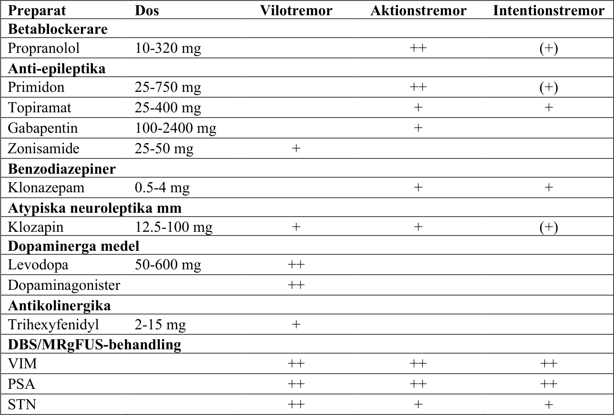
_Svenska riktlinjer för utredning och behandling av tremor, version 3 2026_ _36_

Aktuella mediciner:

### Specifikationer av DT inför FUS

Om patienten planeras för operation med fokuserat ultraljud (MRgFUS) krävs en
skallbensdensitetsmätning (SDR). DT skall utföras utifrån specifikationerna nedan, varefter Umeå
kommer att genomföra de nödvändiga beräkningarna.

**Specifikationer för DT undersökning:**

- Siemens: H60s, H60f, Hr56f, Hr60f, Hr60s

- Phillips: C o UC

- GE: BonePlus

- Toshiba/Canon: FC30RAW

- Använd inga förstärkningsfilter vid DT

- DT öppningen skall ej luta

- Tjocklek: 0.625 till 1.25mm – Lika snitt tjocklek

- Avstånd: 0mm

- Upplöning: 512 x 512

- Kontrast: Ingen

- Omfattning: Komplett – måste täcka hela skallbenet

- Orientering: Rekonstruera axiala DT bilder med AC-PC planet och perpendikulärt med mittlinjen.

Rådata till DT-bilderna sparas i tre månader ifall en rekonstruktion av bilderna behövs senare.
